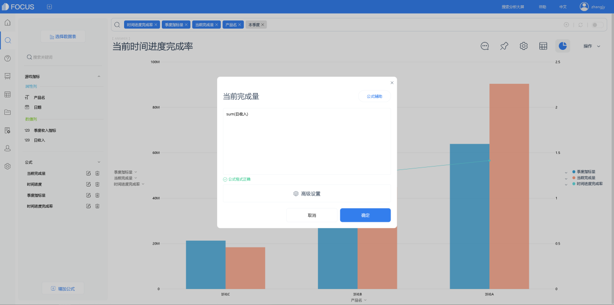

DataFocus的多表关联功能能通过创建表关系视图构建表间关联关系来实现跨越数据表的高效汇总，构建完成后建立BI模型，即可在搜索界面直接进行跨表查询，还能够同时支持多个数据表进行一对一和一对多的关联。

不过要注意一下，在创建表关联关系的时候，表关联不能出现回路和闭环。

关联关系创建完毕，会在表关联关系信息中显示出这样一个关系视图，直观的让用户看到该表是如何与其他数据表关联的。

现在还可以直接查看到数据管理中心所有表的关联关系，在数据表很多或对现有关联关系不清楚的情况下，非常好用。

接下来，给大家解释下设计中出现的三中连接类型，我们通过两个简单的假设数据来进行演示。

一、内连接

内连接只返回源表和维度表关于“客户ID”相互匹配的行，其余部分全部为空。

二、左连接

左连接包含源表所有行，如果源表中某行在维度表没有匹配，则汇总表中对应维度表的部分全部为空。

三、右连接

右连接包含维度表所有行，如果维度表中某行在源表没有匹配，则汇总表中对应源表的部分全部为空。
