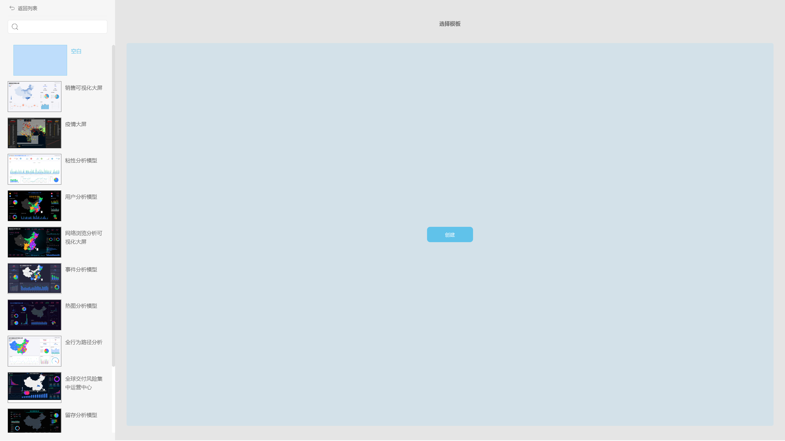

与柱状图结构相似的折线图、散点图、气泡图、条形图、面积图、组合图等都是类似的，那么让我们看下，具体有哪些配置项，它们又有哪些功能。

1\. 在配置侧栏点击通用按钮，弹出通用配置页，在该页可设置主题颜色，字体大小（一般显示默认大小），图例显示的位置（默认显示在右侧），以及设置图表出现时是否需要动画效果。

2.网格线配置页可设置零线的颜色宽度，是否去除图形中平均值、最大值、最小值的刻度线，以及在图形中是否隐藏网格线。

3.数据标签格式页可设置数据标签的文本，也可输入已定义的宏，如下所示，以及可设置数据标签是否使用标尺缩写，即1000是否缩写成1K。

文本中宏的意义：

%\_VALUE：直接输入该宏可显示原本的数值标签，在宏后面添加文本，即可在原本的数值标签基础上添加额外的文本信息。

%\_CATEGORY\_TOTAL：直接输入该宏可显示X轴为某个值时所有Y轴的数值之和的数值标签，在宏后面添加文本，即可在原本的数值标签基础上添加额外的文本信息。

%\_PERCENT\_OF\_TOTAL：直接输入该宏可显示X轴为某个值时Y轴的数值占该Y轴所有数值和的比例的数值标签，在宏后面添加文本，即可在原本的数值标签基础上添加额外的文本信息。

%\_PERCENT\_OF\_CATEGORY：直接输入该宏可显示X轴为某个值时Y轴的数值占X轴为该值时对应的所有Y轴数值和的比例的数值标签，在宏后面添加文本，即可在原本的数值标签基础上添加额外的文本信息。

%\_SERIES\_NAME：直接输入该宏显示的数值标签为对应的图例名称，在宏后面添加文本，即可在原本的数值标签基础上添加额外的文本信息。

%\_SERIES\_NUMBER：直接输入该宏显示的数值标签为对应的图例顺序，在宏后面添加文本，即可在原本的数值标签基础上添加额外的文本信息。

%\_CATEGORY\_NAME：直接输入该宏显示的数值标签为对应的X轴的值，在宏后面添加文本，即可在原本的数值标签基础上添加额外的文本信息。

%\_CATEGORY\_NUMBER：直接输入该宏显示的数值标签为对应的X轴值的顺序，在宏后面添加文本，即可在原本的数值标签基础上添加额外的文本信息。

4.数值标尺页可设置有两个Y轴的情况下选择是否只使用一个Y轴，在只有一个Y轴的前提下，可设置Y轴标尺的最大值最小值。

5.浮文本设置页可设置悬浮文本的内容，也可输入已定义的宏，定义的宏与上述第3点配置中的宏用法一致。

6.标度页可设置标度（只在一个Y轴的时候有效），标度可设置为直线或者范围，可设置标度的颜色，宽度，样式等，也可设置标度的数值。

