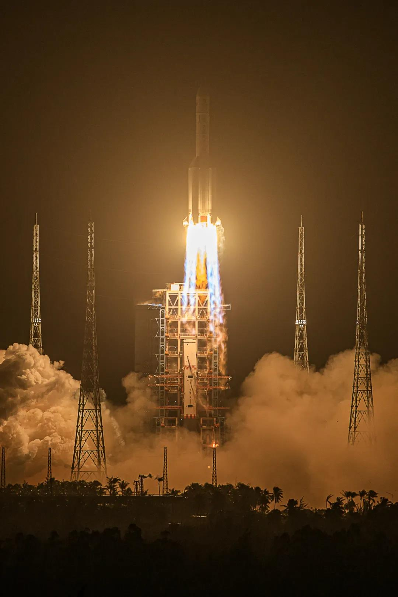
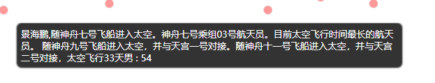

DataFocus带你回顾曾经的航天英雄

11月24日4时30分，长征五号遥五运载火箭在中国文昌航天发射场点火升空，将运送嫦娥五号探测器至地月转移轨道，开启我国首次地外天体采样返回之旅。

### 发射画面令人**叹为观止，**那一刹，那整个天空都被照亮。

### 

网友纷纷表示被壮观的发射画面惊呆了。

数百年来中国都没有放弃探索外太空的梦想，一直在扩展对地球和宇宙的认识。从1970年4月24日发射第一颗[人造地球卫星](https://baike.baidu.com/item/%E4%BA%BA%E9%80%A0%E5%9C%B0%E7%90%83%E5%8D%AB%E6%98%9F" \t "https://baike.baidu.com/item/%E4%B8%AD%E5%9B%BD%E8%88%AA%E5%A4%A9/_blank)[“东方红”1号](https://baike.baidu.com/item/%E2%80%9C%E4%B8%9C%E6%96%B9%E7%BA%A2%E2%80%9D1%E5%8F%B7" \t "https://baike.baidu.com/item/%E4%B8%AD%E5%9B%BD%E8%88%AA%E5%A4%A9/_blank)以来，到现在嫦娥五号探测器的发射，中国航空科技水平已突破巨大进展，只有在科幻电影中才能见到的镜头，将一步步在我们的现实生活中实现。小编内心也是为咱们祖国的繁荣强大而激动不已啊！今天为大家做了一篇中国航天员的可视化作品，也顺便一起回顾那些曾经的航天英雄~

迄今为止，中国共有17名航天员为载人航天事业奉献了自己的一生。

本文航天员的定义是乘坐[航天器](https://baike.baidu.com/item/%E8%88%AA%E5%A4%A9%E5%99%A8/3514266" \t "https://baike.baidu.com/item/_blank)进入太空飞行的人员。

本次可视化是以年龄为Y轴，以姓名、性别、主要事件为X轴，作出的散点图，另外红色批注代表男航天员，蓝色代表女航天员。

曾经的航天英雄就像是化作天上的明星，照亮了中国航天的未来。

其中的一颗就是广为人知的杨利伟了。2003年10月15日北京时间9时，杨利伟乘由长征二号F火箭运载的神舟五号飞船首次进入太空，象征着中国太空事业向前迈进一大步，起到了里程碑的作用。

还有一位是我们熟知的翟志刚，2008年9月25日至27日执行神舟七号飞行任务。

2008年9月27日16点43分24秒，翟志刚开始出舱，16点45分17秒，翟志刚在太空迈出第一步，16点59分，结束[太空行走](https://baike.baidu.com/item/%E5%A4%AA%E7%A9%BA%E8%A1%8C%E8%B5%B0" \t "https://baike.baidu.com/item/%E7%BF%9F%E5%BF%97%E5%88%9A/_blank)，返回轨道舱。

当然还有其他几位非常优秀的航天员，他们的名字值得我们每一个人铭记，排名不分先后。

从散点图结果来看，中国航天员的主力主要还是男性，而且年龄偏大，而女性偏少，年龄偏小。果然还是巾帼不让须眉，女航天员年轻一样也能出色完成航天任务。

愿人类终能解开到宇宙的奥秘。
