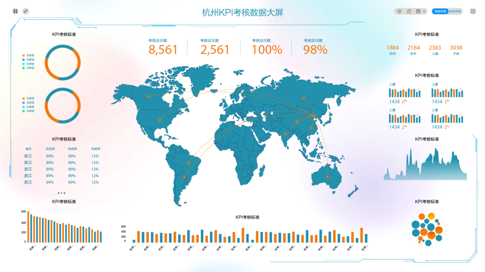

们以前讲到过如何用DataFocus搜索式分析搜索相应“表头”并配以“按月”、“VS”等关键词进行店铺诊断。有不少读者来信希望我们能够从思维和方法端进行分享，尤其是出现了相应数据结果后的实施建议。那么本篇我们就来分享店铺客户行为诊断的相关内容。还是一样，由于对于合作商家的真实数据保密要求，数据部分将只以文字进行描述。

首先我们可以分析客户的客单价并组合回购率进行分析。这样我们可以看到，某个客单价区间有多少人，这些人对应怎样的回购率。比如此店铺在100-200这个客单价区间，有150000人，回购率是20%；在0-100这个客单价区间，有900000人，回购率10%；在800-900这个客单价区间，有20人，回购率100%。所以我们可以看到，店铺客单价低于200的人群回购率较低，回购率高的人群都集中在高消费的人群上面，所以店铺在设置搭配套餐、客件数方面尽量沉淀该区间客户。

然后是客户自定义属性的完善程度。自定义属性就是除平台后台能抓取的数据之外的自定义数据，比如一些商品标签、客户标签等，比如母婴行业，每个妈妈的孕期、产期，宝宝的状态等都是不同的，需要自定义的。我们对此可以提高信息收集维度，以精准化营销，有三个维度可以快速提高信息完整性：H5等问卷、客户短信回复、评价分析。

接下来是客户的购买次数。这个就比较简单粗暴了，比如可以直接从购买1次的一直到购买30次的，查看每一个次数的客户数量、占比、件数以及客单价。数据显示购买1次的客户数量有929821人，占88%总客户，客件数1.17件，客单价为68.78元。购买11次的客户有31人，占0.0015%，客件数1.77件，客单价876.69元。购买24次的客户数量为2人，占比极小，客件数2.34件，客单价2785.65元。每个购买次数对应的数据大体呈稳定趋势，无波动。那么我们可以看到，购买次数较高的客户，消费件数也偏高，这里其实体现的是客户的忠诚度和信任感，所以需要更努力的做好新客转化和销售工作。

还有就是我们讲过的留存率分析，看每一个月“剩下”多少上个月的购买客户，比如1月购买过的客户3月还来购买的只剩4%。还是“按月”看整年的留存率，除大促期间，留存率低表示平时我们应多和客户进行互动。
