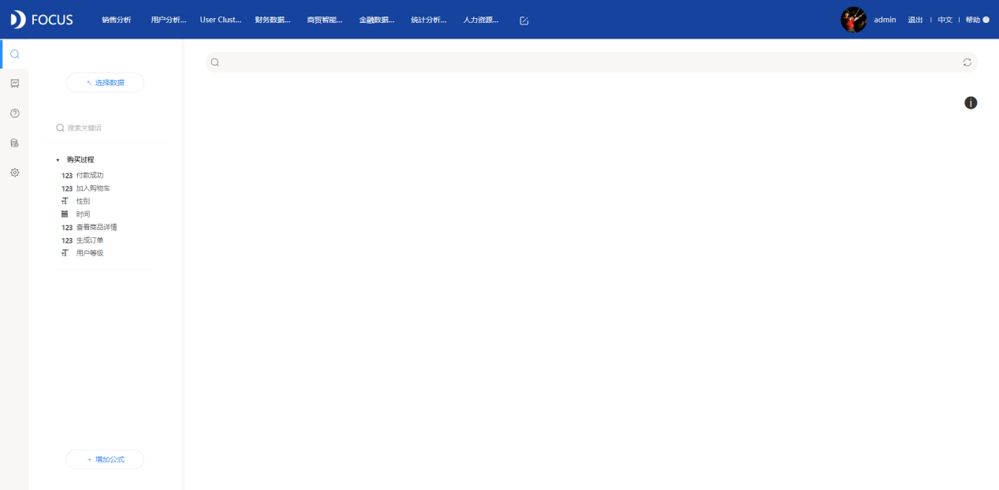
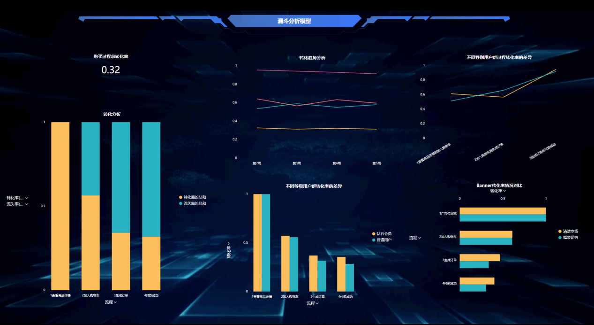

在电子商务日益成熟发展的今天，商品营销管理已经不仅仅取决于销售量和利润的结果，而是更加细分于销售流程中每一步的转化与流失，从用户角度来调整决策。漏斗分析是一套流程式的数据分析，它可以科学反映从起点到终点个阶段用户转化率情况。我们可以通过漏斗分析了解到路径的整体转化率是多少？在哪些环节上失败或放弃的用户最多？用户群间的转化率差异等等。可以让企业找到用户选购全流程中最有效转化路径，找到营销短板进行优化，还可以分不同属性的用户群体，从差异角度找到优化思路。

在DataFocus中如何进行漏斗分析呢？接下来笔者进行简单的思路介绍：

·从导入的数据源中，通过创建中间表，选择抽象产品中的某一流程，建立中间表。例如:从首页到搜索商品或者浏览分类，然后到查看商品详情，再到生成订单、开始支付，最后支付成功。

·数据分析

1. 总转化率：整一条流程的转化率情况，分析其整体设置合理性。

1. 转化分析：分析某个漏斗在分析时间段内的转化流失情况。

1. 转化趋势分析：分析转化漏斗整体或两个相邻步骤间的转化率随时间的变化趋势。

1. 群分析与组对比：对比多个用户群间转化率的差异。

·制作可视化看板，方便实时查看整体变动。

利用DataFocus数据分析工具将漏斗分析模型进行可视化，能更好的洞察指标分析结果。具体操作笔者会专门写一篇文章进行介绍，如果想深入了解的话，欢迎留言交流哦！
