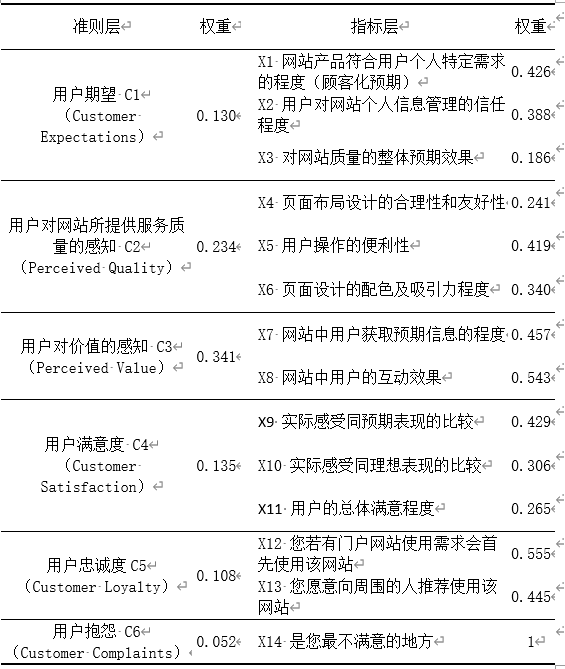
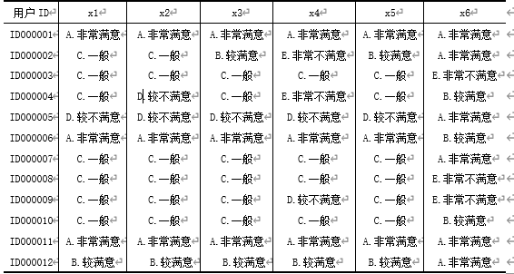
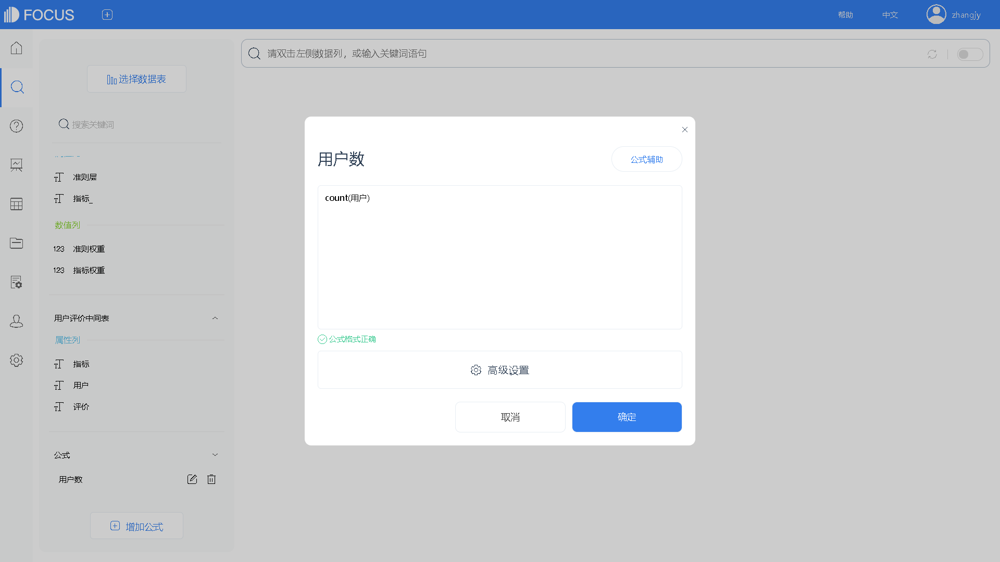
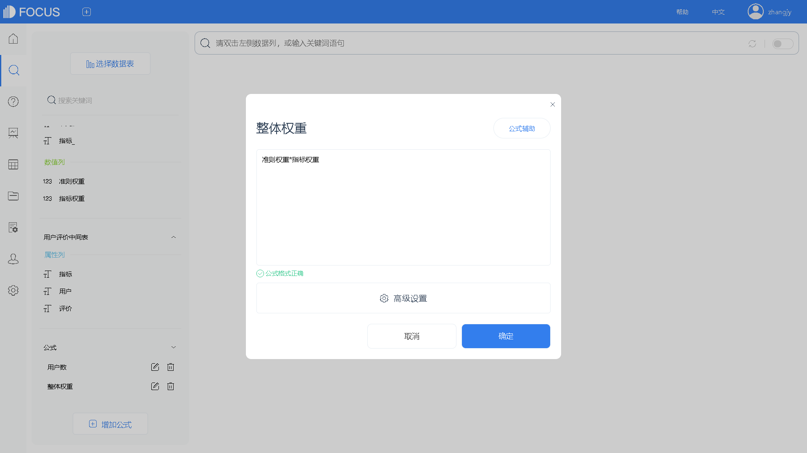
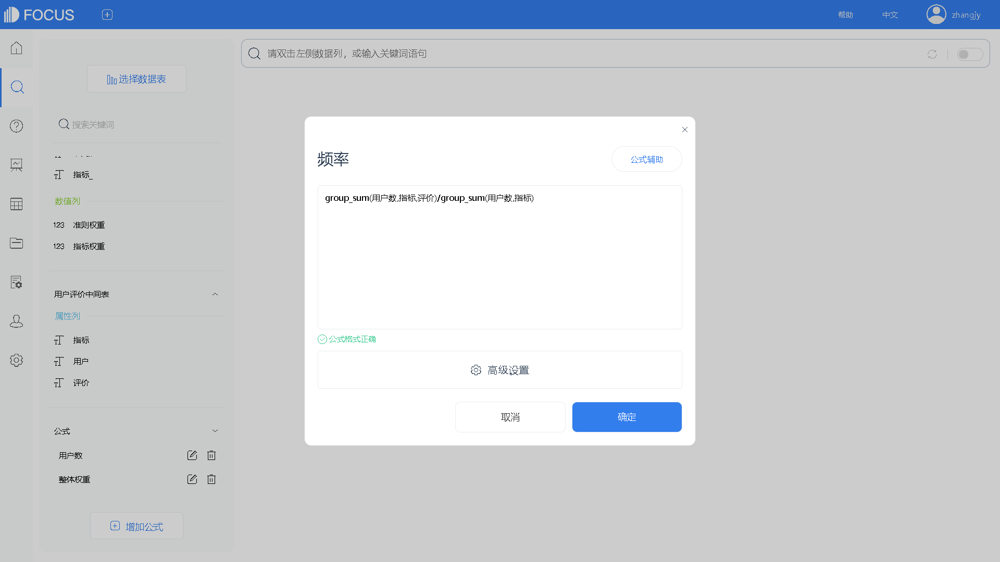
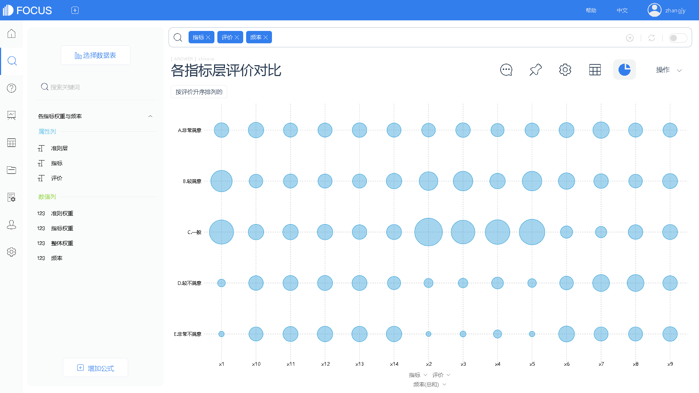

# 一、案例背景

ASCI模型，即美国顾客满意度指数模型，是一种具有代表性的顾客满意度研究模型，应用较为广泛，具有成熟的理论支持和较高的学术权威性。

1997年奥利弗（Oliver Richard L.）提出，用户满意度是用户需求得到满足后的一种心理反应，是用户对产品和服务的特征或产品和服务本身满足自己需求程度的一种判断。用户要判断自己需求的满意程度，就必须将产品和实绩与某一标准进行比较，当然由于比较的标准不同，用户消费后的心理认知也就有所不同。

中国的门户网站众多，比较著名的门户网站有新浪、网易、搜狐、腾讯、百度、新华网、人民网、凤凰网等。中国城市未来的网络发展是趋势，市场空间也是很巨大的，同时各门户网站的竞争也很激烈。因此，即时发现网站内容运行和维护等方面存在的问题，改善网站可使用性，提升用户使用体验，对网站不断优化是非常重要的。

# 二、案例目标

以某门户网站为例，根据ASCI模型构建评价指标体系，使用模糊综合评价法计算门户网站的用户满意度，将用户满意度的理念引入到门户网站的评价当中，以期使该门户网站的信息资源的配置、设计更优化合理。

# 三、数据介绍

## 指标\_权重表.csv

以ACSI模型的6个结构变量为准则层，根据用户使用门户网站过程中影响最终结果的可能因素构建门户网站的用户满意度指标体系，并通过专家，确定指标及指标的权重如下：

## 评价表.csv（部分）

根据指标，对用户进行问卷调研，收集整理用户的评价表。

案例分析

## （一）指标含义

ACSI模型由6个变量构成：用户期望、用户对质量的感知、用户对价值的感知、用户满意度、用户忠诚度和用户抱怨。每个结构变量又包含一个或者多个观测变量，而观测变量则通过实际调查收集数据所得到。

1. 顾客期望（Customer Expectations）：指用户在购买和使用某种产品或服务之前对其质量的估计。决定顾客预期的观察变量有3个：产品顾客化（产品符合个人特定需要）预期、产品可靠性预期和对产品质量的总体预期。
2. 感知质量（Perceived Quality）：是指顾客在使用产品或服务后对其质量的实际感受，包括对产品顾客化即符合个人特定需求程度的感受、产品可靠性的感受和对产品质量总体的感受。
3. 感知价值（Perceived Value）：感知价值体现了顾客在综合产品或服务的质量和价格以后对他们所得利益的主观感受；感知价值的观察变量有2个，即：“给定价格条件下对质量的感受”和“给定质量条件下对价格的感受”。顾客在给定价格下对质量的感受，是指顾客以得到某种质量或服务所支付的价格为基准，通过评价该产品或服务质量的高低来判断其感知价值。
4. 顾客满意度（Customer Satisfaction）：这个结构变量是通过计量经济学变换最终得到的顾客满意度指数。ACSI模型在构造顾客满意度时选择了3个观察变量；实际感受同预期质量的差距、实际感受同理想产品的差距和总体满意程度。顾客满意度主要取决于顾客实际感受同预期质量的比较。同时，顾客的实际感受同顾客心目中理想产品的比较也影响顾客满意度，差距越小顾客满意度水平就越高。
5. 顾客抱怨（Customer Complaints）：决定顾客抱怨这个结构变量的观察变量只有1个，即顾客的正式或非正式抱怨。通过统计顾客正式或非正式抱怨的次数可以得到顾客抱怨这一结构变量的数值。
6. 顾客忠诚（Customer Loyalty）：是模型中最终的因变量。它有2个观察变量：顾客重复购买的可能性和对价格变化的承受力，顾客如果对某产品或服务感到满意，就会产生一定程度的忠诚，表现为对该产品或服务的重复购买或向其他顾客推荐。

## （二）数据分析

首先，将用户评价表通过行列转换功能，转换为一维表，并保存为“用户评价中间表”。

图 1

图 2

接下来，将“用户评价中间表”和“指标\_权重表”，通过“指标”字段进行关联。

图 3

图 4

### 1、各准则&指标权重

#### 1.1、数据来源

选择使用“指标\_权重表”数据表中的“准则层”、“指标”、“准则权重”、“指标权重”字段；“用户评价中间表”中的“用户”、“评价”。

#### 1.2、业务数据处理过程

- 利用公式分别添加“用户数”、“整体权重”、“频率”字段；

****

图 5

****

图 6

****

图 7

- 搜索“准则层”、“指标”、“频率”、“评价”、“指标权重”、“准则权重”、“整体权重”字段，并将“指标权重”、“准则权重”和“整体权重”以平均值的方式聚合，保存为中间表“各指标权重与频率”。

****

图 8

- 选择该中间表作为数据源表，搜索“准则层”“指标”“准则权重”“指标权重”“整体权重”字段，并将“准则权重”、“指标权重”、“整体权重”以平均值的方式聚合，显示3位小数，使用旭日图呈现结果，并设置悬浮文本为“%\_COLUMN\_1:%\_COLUMN\_3 %\_BR %\_COLUMN\_2:%\_COLUMN\_4”，保存为“各指标及权重”历史问答。

图 9

### 2、各指标层评价对比

#### 2.1、数据来源

选择使用“各指标权重与频率”数据表中的“指标”、“评价”、“频率”字段。

#### 2.2、业务数据处理过程

- 搜索“指标”、“评价”、“频率”字段，选择新气泡图进行可视化，重新设置气泡的配置，按评价升序排列，保存为“各指标层评价对比”历史问答。

图 10

### 3、各指标满意度指数

#### 3.1、数据来源

选择使用“各指标权重与频率”数据表中的“指标”、“评价”、“频率”字段。

#### 3.2、业务数据处理过程

- 利用公式添加“得分”、“指标分值”字段；

图 11

图 12

- 搜索“指标”、“指标分值”字段，选择折线图进行可视化，设置显示线阴影、数据标签、标度线、线样式，按指标分值降序显示，保存为“各指标得分”历史问答。

图 13

### 4、准则层用户满意度指数

#### 4.1、数据来源

选择使用“各指标权重与频率”数据表中的“准则层”、“评价”、“指标权重”、“频率”字段，公式列“得分”。

#### 4.2、业务数据处理过程

- 利用公式添加“准则分值”字段；

图 14

- 搜索“准则层”、“准则分值”字段，使用柱状图进行结果呈现，设置分值为3的标度线、保留数据标签，保存为“各指标层分数”历史问答。

图 15

### 5、用户总体满意度

#### 5.1、数据来源

选择使用“各指标权重与频率”数据表中的“整体权重”、“频率”字段，公式列“得分”。

#### 5.2、业务数据处理过程

- 搜索公式和字段“整体权重\*得分\*频率”，得到用户总体满意度，选择KPI指标图进行可视化，隐藏标题，保存为“用户总体满意度”历史问答。

图 16

### 6、综合数据看板

将所有指标都整合在同一个可视化大屏中，综合全面分析相关指标，直接观察各项指标对应满意度情况，如下图所示。

图 17

# 五、分析结论

从用户总体满意度的角度看，该门户网站处于中等略偏上水平，仍有一定的提升空间，需要进一步优化服务的各个环节。

用户对该网站寄予了较高的期望值，得分为3.46。在用户对网站所提供服务质量的感知上，对页面布局设计的合理性和友好性、用户操作的便利性、页面设计的配色及吸引力程度，均较满意，其中“操作的便利性”得分最高，为3.44。在对价值的感知上，网站中用户获取预期信息的程度处于中等水平，但网站中用户的互动效果略低于中等水平。
