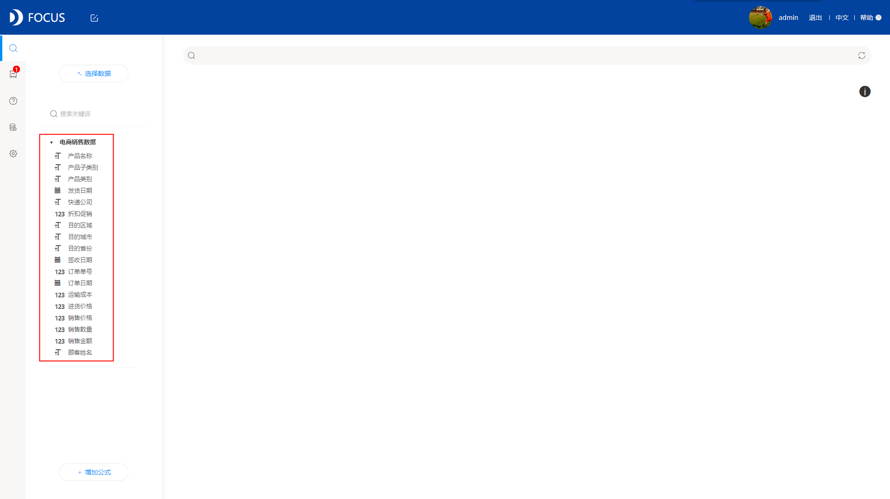
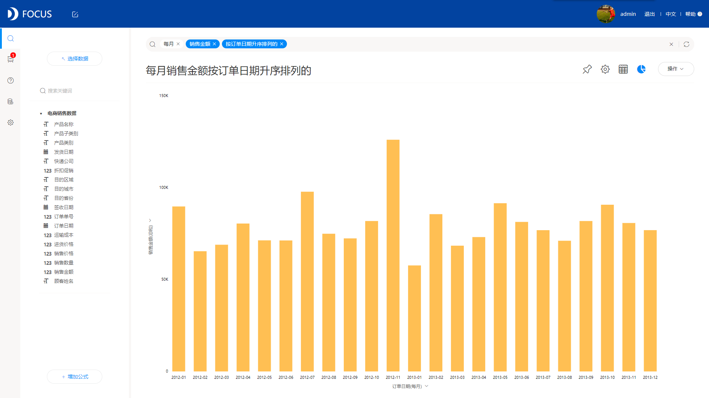
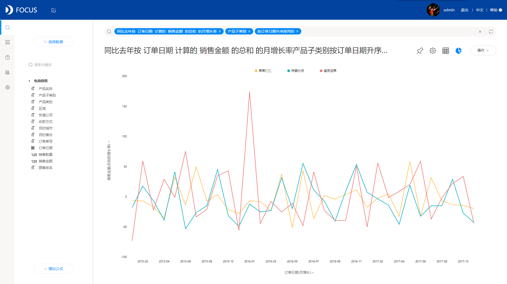

**DataFocus，搜索式分析的开拓者**

数据分析的工具有很多，本文直接就DataFocus数据分析工具做简单的分享。

DataFocus，是一款数据分析工具，也是一个数据可视化工具，还是一个数据仓库，其强大的搜索式分析吸引了众多眼球，也帮助越来越多的人进入数据分析领域，DataFocus大大降低了数据分析的门槛。而本文，就来具体介绍这种搜索式分析。

什么是搜索式分析？即在分析的时候，摒弃传统拖拽字段到相应位置的方法，而改用直接在搜索框内输入字段或者关键句式，搜索式的优势就在于更加智能更加简便，当要分析的字段过多时，拖拽式的交互方式的不足之处就显露出来了。

下面就为大家演示下，DataFocus中如何进行搜索？

首先，当然是要选择一个数据源，如下图，我们选择一个销售相关的数据源（虚拟数据，如有雷同，纯属巧合）：

其次，我们就可以直接在搜索框内输入相关信息，例如我想要知道全国各地销售分布，直接双击“目的省份”以及“销售金额”，选择的内容会自动加入搜索框，系统实时返回搜索分析结果，并自动适配图表显示：

DataFocus还可以直接搜索分析复杂信息，例如想要按照每月或者每周来分析销售情况，可以直接在搜索框内输入关键词：每月 销售金额：

或者想要求销售的同比，可以直接在搜索框内输入：同比去年按 订单日期 计算的 销售金额 的总和 的月增长率 产品子类别 按订单日期升序排列的：

当然，还有很多的关键句式（想要了解具体的可以去查看DataFocus的用户手册，上面有详细介绍），可以直接在搜索框内输入，系统会直接得出结果，无需通过复杂的代码或者过多的操作配置等来实现。

现在，有感受到这种搜索式分析的简便之处吗？
