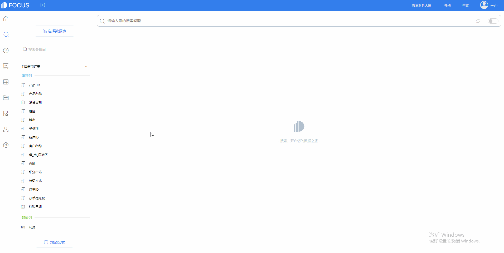
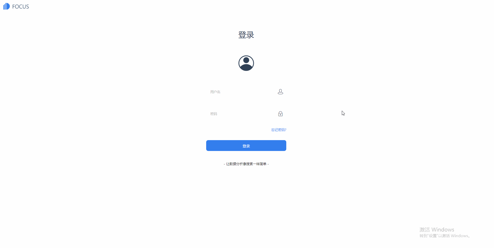

你见过最敏捷的BI有多快？DataFocus，跟得上思绪的数据分析工具

有时候为什么明明一个很简单的数据需求，提交给IT部门后得到的反馈总迟到？

有时候明明当下就要决策了，为什么数据分析还是迟迟没有结果？

为什么数据分析一直跟不上决策节奏？

是不是IT部门不太行，效率太低？

是否应该继续增加IT人员？不行，培养一个IT人员成本太高了，除去工资还需要额外的时间精力金钱用在培训上。

实在受不了效率低下的数据分析了，那忍痛增加IT人员吗？别急，或许会有更好的办法。

到底怎么办？

也许你缺的不是IT人员，你缺的只是一款**跟得上思绪的数据分析工具**。

DataFocus Cloud，一款跟得上思绪的数据分析工具，它到底能有多快？

> 1
> 
> 亿级数据秒级响应

大数据时代，企业数据量呈几何级数飞速增长，要对这些海量数据进行关联分析，往往有效率瓶颈。 传统的OLAP分析方式会借助第三方工具进行CUBE预先计算的方式，以空间换时间。

但是数据分析的工作是连贯的，这种定时跑任务的分析方法，只适用于传统的固化报表作业模式。

信息瞬息万变，决策毫秒之间。

DataFocus Cloud采用**列式数据存储**的方式，**通过自带的内存计算引擎，无须预先建立CUBE，数据分析实时交互**，完全满足管理决策中经常遇到的临时性分析、多变的业务需求和频繁的结果刷新。IT部门将从此告别延时报表分析，亿级数据秒级响应。

我们通过一次单维度测试：1个attribute，1一个measure指标同时增加关键字搜索 （如同比计算的）可以看到。

首次搜索时耗时相对较多，而当**进行多次查询时已感知不到等待时间**。

> 2
> 
> AI搜索式分析

DataFocus Cloud是一个可以实现特定业务场景下人机对话的AI系统，该系统尝试理解人类关于数据的问题，并以丰富的图表和数据回答相关问题，与传统的数据分析方式相比，交互更加智能， 效率提高100倍以上。用户不必花费大量心力去学习和了解难懂的计算机语言，而是用自己最习惯的语言如中文或英文，来使用计算机，就跟谷歌搜索一样简单。

搜索式，零代码，无拖拽，双击列信息直接输入搜索栏。彻底变革传统的数据分析交互方式，结果呈现的速度跟得上您的思绪。

我们可以看到，通过搜索最后获得数据可视化这个过程甚至都不到5秒。

此外，DataFocus Cloud拥有数据搜索引擎和语义解析引擎，这是组成自然语言搜索的关键部分，大大地简化了数据分析系统的操作难度，其中语义解析引擎会主动猜想用户的下一次输入，将用户搜索输入效率提高40%以上，并根据用户使用习惯优化推荐排序，促使系统愈用愈智能。

> 3
> 
> 开箱即用

DataFocus Cloud颠覆了传统作业模式，采用**AAAS（Analysis as a services）分析即服务模式**。

您无需购买任何[硬件](https://baike.baidu.com/item/%E7%A1%AC%E4%BB%B6/479446" \t "https://baike.baidu.com/item/_blank)，只需要简单地在云端注册登录即可。另外不需要软件的升级、维护和管理人员，也不需要为维护和管理人员支付额外费用。

您连接到网络，就可以访问系统。

云端助您更快更高效地进行数据分析。
