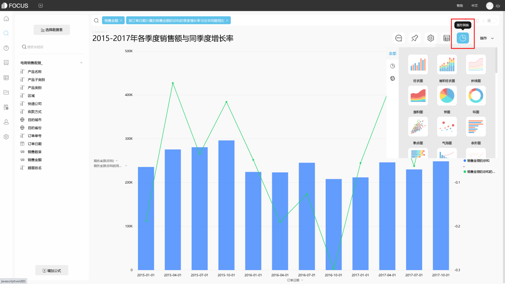
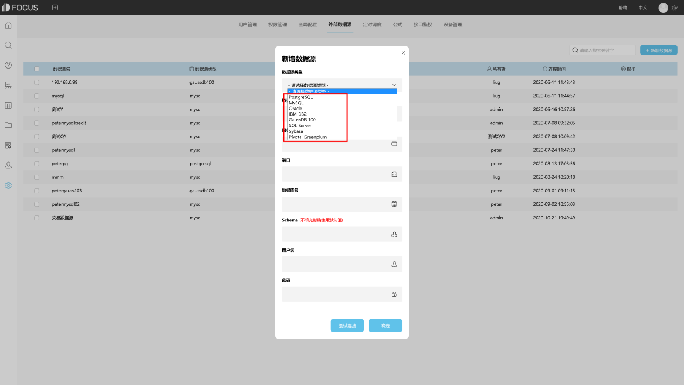

数据操作和决策不仅仅是管理工具，而且应该沉淀到各个级别的业务运营中，以帮助不同级别和级别的人员获得洞察力。这也是自助服务分析在BI领域普及的主要原因之一。过去，数据分析的主要模式是IT人员正在进行数据建模和数据分析，然后推送给管理人员或业务人员，这需要花费大量的时间和精力。不可能让每个员工都能获得他们需要的数据分析结果。在应用敏捷和自助式BI工具之后，任何员工都可以通过自由组合和数据分析获得他们想要的结果。

另一方面，企业对员工数据分析培训也非常必要。企业需要教会员工如何使用数据可视化分析工具，如何使用此工具来指导他们的工作实践，并避免用户的错误操作和集中。应用程序和其他行为对平台产生巨大影响，影响平台的整体可用性。

 

在深入分析了这一系列需求后，杭州汇数智通科技开发了业内领先的基于自然语言技术的大数据分析工具DataFocus，该产品通过独创的智能数据库搜索引擎全面革新了用户的数据分析体验。特有的搜索式分析方法，支持多语言，学习成本低且无需用户进行任何复杂的代码操作，辅助智能数据分析提示功能，让数据分析更高效；而高速内存计算引擎与智能可视化优化更好地完善了系统的分析性能与分析体验。最专业的开发团队，最一流的技术支持，最人性的售后服务，为用户打造更优秀的自助式自然语言数据分析平台。

使用DataFocus数据分析系统，企业只需将自己的数据连接到DataFocus系统，便可以一键完成TB级数据仓库+高性能BI模型的构建。作为业内第一个搜索式中文自然语言处理系统，DataFocus直接将数据分析中的技术问题转化成基本功能，用户无需了解自己的数据结构，也无需具备编程能力即可进行数据分析，我们直接将数据分析的过程从IT人员—数据分析师—业务人员的三级结构转化为业务人员直接进行数据分析获取自己需要的结果的单级结构，不仅节约了中间成本，让身在业务中的人员去分析业务更加能够提高分析的精度去贴合业务需求，从而更高效的驱动业务发展。

 
