商业智能(BI)可以帮助组织做出决策、采取行动和执行业务流程。它有很多好处，包括更快的数据分析、更高效的工作等。作为两个基于云的BI平台，Domo和DataFocus Cloud (DFC) 在提供炫酷的可视化的同时帮助做出以数据驱动的决策。

DFC具有更简单、更清晰、更系统化的界面。通过简单方便的操作，用户可以创建炫酷的可视化图表和大屏。此外，通过全面的角色管理和资源管理，团队间的协作轻松全面。

两个平台在界面、可视化、资源管理等方面有很多不同，本文对比了这两个工具，来帮助商业精英选择更合适的数据分析平台。

# 简介

作为一种低代码数据应用工具，Domo利用 BI 的强大功能来组合和处理数据。它集成了数据、BI 和应用程序，以供所有人使用。

同样，DataFocus Cloud是一个零代码数据分析平台，每个人都能以较低的学习成本开始分析。探索数据就像搜索一样简单，每个人都可以成为数据专家。

# 对比

## 界面

总体而言，DataFocus Cloud具有更整洁、更系统的界面。Domo的界面信息很多，但初学者可能会觉得它不堪重负，首先需要一定的时间来学习如何使用系统。本节只介绍部分页面对比，而不是全部界面。

### 新手指引

这两个工具都利用主页上的视频以指导初学者。Domo使用四分钟的视频来介绍如何连接数据、创建卡片以及如何共享卡片。页面中的其他选项会带领用户前往系统的不同功能，如图 2-1 所示。

Figure 2-1 Novice guide - Domo

如gif图2-2所示，DFC的引导窗口中列出了几个视频，如关键字搜索、图表制作等，用户可以选择关闭引导窗口，稍后再访问。关闭引导窗口后，主页按“最新”和“我的收藏”显示不同类别的资源。

Figure 2-2 Home page - DFC

### 导航栏

Domo和DFC都有2个导航栏，都位于页面的顶部和左侧。顶部的导航栏在两个系统中都是固定的，DFC的左侧导航栏也保持固定，但Domo的左侧导航栏因不同模块而异。

Domo的顶部导航栏列出了 6 个模块（“MORE”模块内有 9 个模块），如图 2-3 所示。DFC 在左侧导航栏中显示 10 个模块，如图 2-4 所示。共有的模块是看板、数据、管理和分析器/搜索。

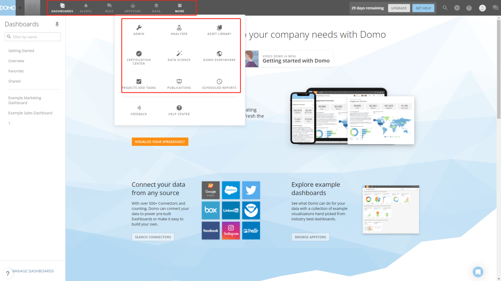

Figure 2-3 Top navigation bar - Domo

Figure 2-4 Left navigation bar - DFC

Domo的左侧导航栏在每个模块都是不同的。例如，在数据模块中，如图2-5所示，导航栏展示了数据仓库、数据集、数据流等。

Figure 2-5 Left navigation bar - Domo

DFC的顶部导航栏主要展示用户置顶的看板，以便用户可以随时访问这些重要的看板，如图 2-6 所示。最重要的看板可以作为系统启动的页面，点亮相关看板的星号即可。

GIF Figure 2-6 Pin dashboard

### 数据界面

这里的数据页是指数据表的详细信息页。用户可以在 Domo 和 DFC 中查看关系/数据流、依赖项以及预览数据。

在数据界面，Domo共有8个部分，如图2-7所示，包括概览、数据、卡片等。注意这些页面主要是展示信息，而不是做修改。

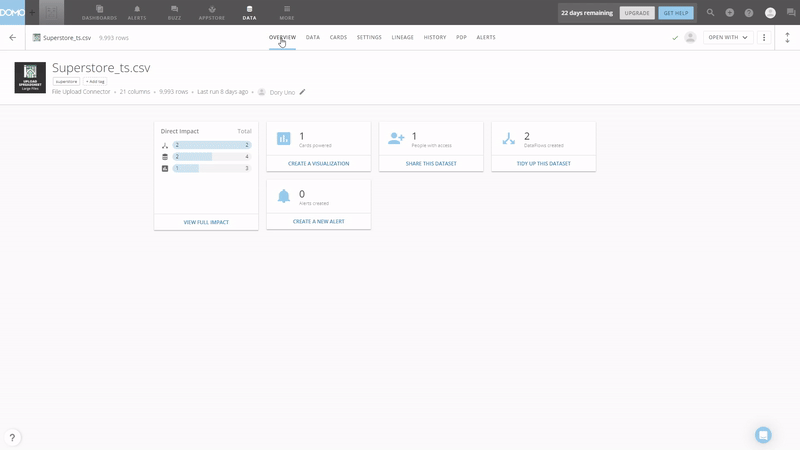

GIF Figure 2-7 Data Page - Domo

如图2-8所示，DFC的数据界面分为4个部分，包括列信息、关联关系、数据预览和依赖关系。修改可以直接在这些页面中进行，例如在“列信息”中更改聚合方法、地理类型和嵌套列（用于树形图），在“关联关系”中添加连接关系等。此外，数据可以在这里被附加或覆盖。

GIF Figure 2-8 Data Page - DFC

### 分析界面

Domo的分析器提供数据集视图和卡片（图表）创建。在数据集视图方面，用户可以添加连接/联合、添加列等。此外，筛选器可以在此处添加，并且可视化会相应做出更改。

在分析界面，一个图表会在画布上自动创建。但是，如图 2-9 所示，可视化的页面有点拥挤。尽管页面提供了许多不同的功能，但新用户可能会觉得不知道从何处下手。画布相对较小，列名的展示空间狭窄，导致在拖动列时需要经常滚动鼠标。但是，用户可以选择取消显示某些功能以使画布更大，并使用筛选来搜索列。

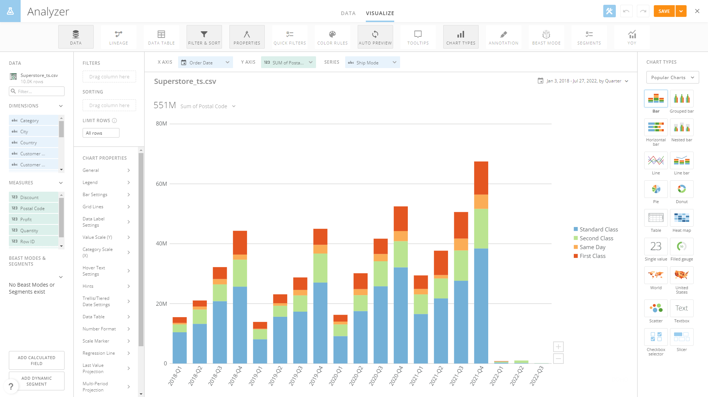

Figure 2-9 Analyzer

在搜索分析页面上，DFC有 3 个部分：列名、搜索栏和可视化区域。与Domo类似，用户可以通过搜索列名来快速定位该字段。此外，用户可以通过“全选”来添加所有列。同时，页面上不同的按钮拥有各种功能，例如数据传输、图表配置等。

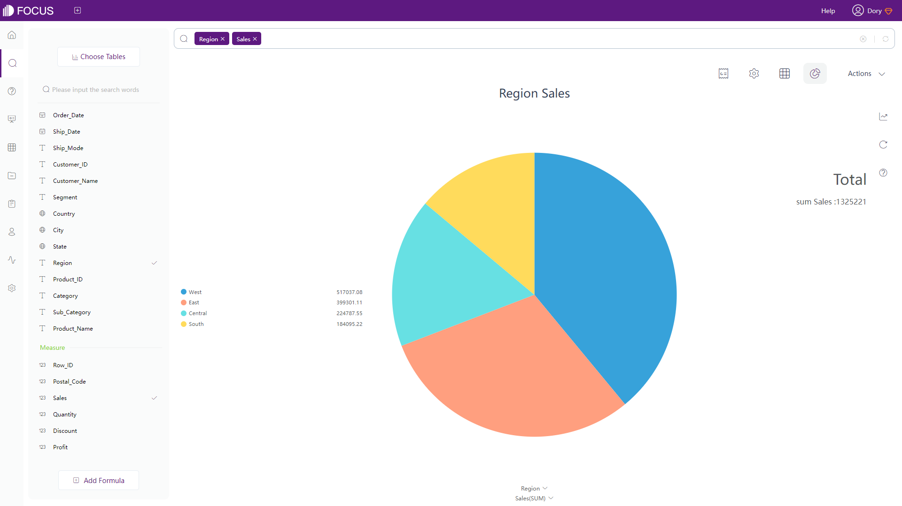

Figure 2-10 Search analysis page

### 资源界面

1. 资源

在看板模块的“概览”下，Domo以四种预设尺寸显示所有的卡片，如图 2-11 所示。此外，用户可以通过数据表的“CARDS”页面找到根据该数据表创建的所有卡片。

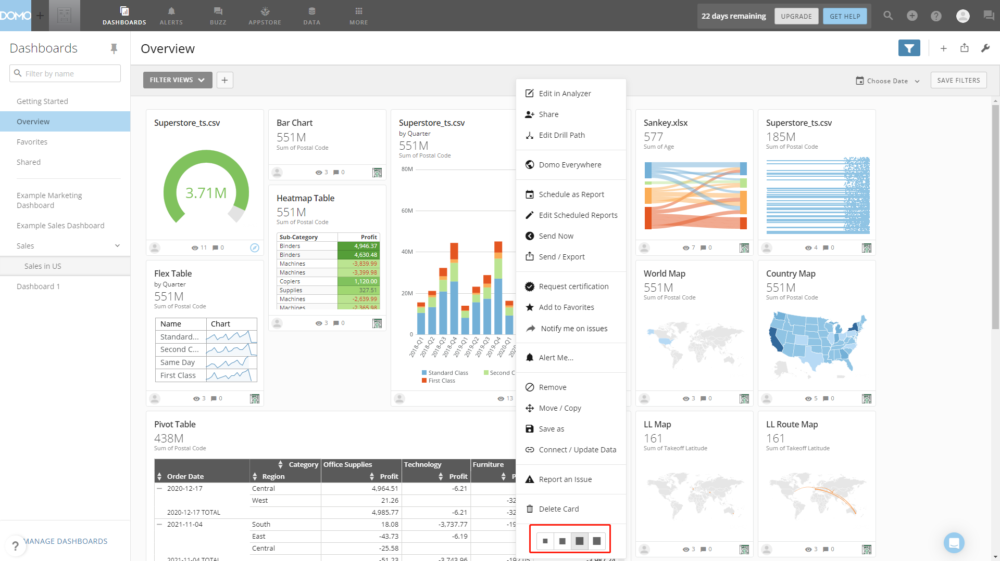

Figure 2-11 Resource page - Domo

DFC有一个资源模块来展示各种资源，如问答、看板等。如图2-12所示，DFC中的资源可以通过两种方式展示：列表和缩略图。同样，依赖关系可以在详细数据页面查看。

GIF Figure 2-12 Display modes

1. 操作

在“概览”页面，卡片可以被分享、发送、保存等，如图2-13所示。此外，时间筛选器可以在此处设置。

Figure 2-13 Operations - Domo

在 DFC 的资源模块上，资源可以被移动、删除、共享等，如图 2-14 所示。

Figure 2-14 Operations - DFC

1. 标签

Domo和DFC都使用标签来帮助管理资源。 Domo应用文本，而DFC 应用文本结合色点，如图2-15和gif图2-16。

Figure 2-15 Tags - Domo

GIF Figure 2-16 Tags - DFC

## 2.2 数据源

在Domo的免费试用中，用户可以上传 1 个平面数据文件（CSV），大小限制为10M，或者用户可以连接到云数据仓库，如Snowflake、Amazon Redshift等。

Domo 提供了一系列数据连接器，包括云、本地、文件上传、API、联合和专有系统连接器。同样，DFC也提供文件上传、数据仓库上传、数据库连接和API连接。在数据库连接方面，DFC作为数据仓库，可以同时连接多个数据库，实现连接分析。

DFC 支持的数据源：

Table Figure 2-17 Data sources

## 2.3 易用性

### 2.3.1 交互方式

Domo使用拖拽作为交互模式，而DFC 使用基于搜索的分析。前者会让用户更关注如何创建可视化图表及大屏，而后者可以让用户更关注需要分析的内容。制作高级图表时，拖拽式可能需要比搜索分析更长的时间。以下是一个显示相对复杂的DFC搜索示例。

GIF Figure 2-18 Search analysis

### 2.3.2 筛选器

Domo在整个系统中提供了许多从卡片级到页面级筛选器。卡片级筛选器可以在创建卡片时或之后应用于图表，页面级筛选器可以应用于看板。快速筛选器是卡片级筛选器，作为筛选器窗格添加到卡片中，而筛选器视图是页面级过滤器，可以自定义以满足每个用户的需求。

DFC提供了不同的方式来添加筛选器。

1. 关键词

关键词实际上是一种筛选器。通过在搜索栏输入关键词来选择数据，如图2-19所示。可以在此处查看关键字的完整列表：[关键词](https://wiki.datafocus.ai/index.php/%E4%BA%A7%E5%93%81%E6%89%8B%E5%86%8C_v5.0.2" \l ".E5.85.B3.E9.94.AE.E8.AF.8D).

GIF Figure 2-19 Keywords

1. 筛选器
2. 表格

如图2-20所示，通过设置按钮，可以为网格表和数据透视表添加筛选器。对于非 时间属性列，用户可以批量添加筛选器。

GIF Figure 2-20 Filter - tables

1. 图像

如图2-21所示，用户可以在坐标轴上添加筛选器（批量）。

GIF Figure 2-21 Filter - graphics

1. 看板

通过选择数据点或数据区域，可以一起筛选同一看板中的所有可视化图表，如图 2-22所示。如果用户想要移除筛选效果，可以点击“回退”按钮。

GIF Figure 2-22 Filter - dashboards

### 2.3.3 公式

Domo使用“Magic ETL”处理数据，公式是其中的一部分。公式编辑器提供列名、函数名、函数说明、提示来帮助编写公式，如gif图2-23所示。用户可以通过单击“验证”按钮来验证公式，但会花费一些时间。此外，除了字符串、数学、时间等常用公式外，Domo还提供一些统计公式和财务公式。

GIF Figure 2-23 Filter editor - Domo

在DFC中，有两种添加公式的方法。一种是直接在搜索栏输入，这种方式在公式比较简单的时候更加方便。另一种是使用公式编辑器，类似于Domo，DFC也提供了描述和提示等协助编写公式。更重要的是，DFC的公式编辑器还提供示例以及语法信息的提示，并且会自动验证公式是否符合要求。除了常见的公式类型，DFC还有变换函数、分析函数和JSON函数，完整的公式列表可以在这里查看：[公式列表](https://wiki.datafocus.ai/index.php/%E4%BA%A7%E5%93%81%E6%89%8B%E5%86%8C_v5.0.2" \l ".E5.85.AC.E5.BC.8F.E5.88.97.E8.A1.A8).

GIF Figure 2-24 Filter editor - DFC

## 2.4 数据处理

Domo在“MAGIC TRANSFORM”下有很多工具来做数据处理，这里主要介绍“Magic ETL”。请注意，“Magic ETL”主要使用拖拽的交互模式。

DFC中的数据处理功能主要分为表格模块和搜索分析模块。

对比如下：

1. 数据关联

Domo和DFC都支持合并来自不同数据集的数据并连接数据表。Domo使用“Select Columns”和“Join Data”关联表，而 DFC 使用中间表和关联编辑器来关联表。下面展示了如何在Domo和DFC中关联表格。

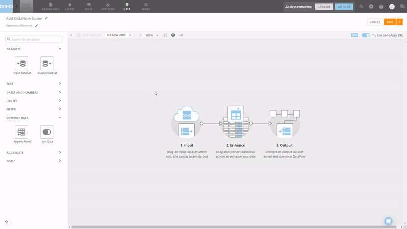

GIF Figure 2-25 Join tables - Domo

GIF Figure 2-26 Join tables - DFC

1. 数据清理

Domo的“Magic ETL”提供删除重复数据、添加筛选器和许多其他选项来清理数据。而DFC主要使用中间表来清洗数据，用户可以在其中筛选、合并、删除数据等。DFC 中有两种不同的中间表，在[这里](https://bbs.datafocus.ai/question/3776)了解更多.

1. 行列转换

Domo通过“Pivot”功能完成行和列之间的转换，而DFC有两种类型的数据转换。但是，Domo对数据结构有更严格的要求。

以列到行的转换为例，Domo将同一列的不同值转换为行，而DFC可以将同一列或不同列的值转换。

Figure 2-27 Domo - pivot

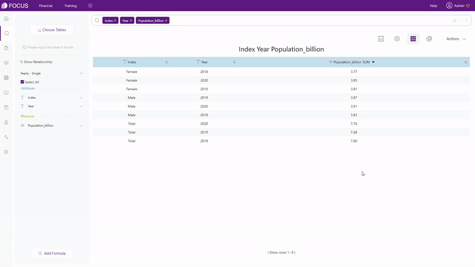

GIF Figure 2-28 DFC - conversion - same column

GIF Figure 2-29 DFC - conversion - different columns

1. 拆分列

同样，Domo使用“TEXT”部分下的“Split Column”，DFC 使用“数据转换”按钮下的“列拆分”。DFC的界面比较简单，用户可以自己选择拆分数来选择拆分成多少列。

Figure 2-30 Split columns - Domo

Figure 2-31 Split columns - DFC

Domo的“Magic ETL”提供了一系列功能来做数据处理。 DFC的中间表虽然可以完成部分功能，但功能较弱。但是，DFC的DataSpring具有更强大的数据处理功能。

## 2.5 可视化

### 2.5.1 表格

● 表格类型

Domo 有 5 种类型的表：HTML 表、热图表、Mega 表、弹性表和数据透视表，而DFC 提供 3 种不同类型的表：网格表、数据透视表和交叉表。

1. 常用表格类型

Domo：HTML表、热图表、mega表结构相同，区别在于热图表以热图彩色模式显示数据，而mega表最多可包含25000行数据。下面是热图表。

Figure 2-32 Heat map table - Domo

DFC提供网格表以二维结构显示数据，并且网格表可以设置热图模式。

Figure 2-33 Grid table - DFC

1. 数据透视表

Domo和DFC都提供数据透视表以树状结构展示数据。此外，用户还可以在 DFC 中给数据透视表设置热图模式。

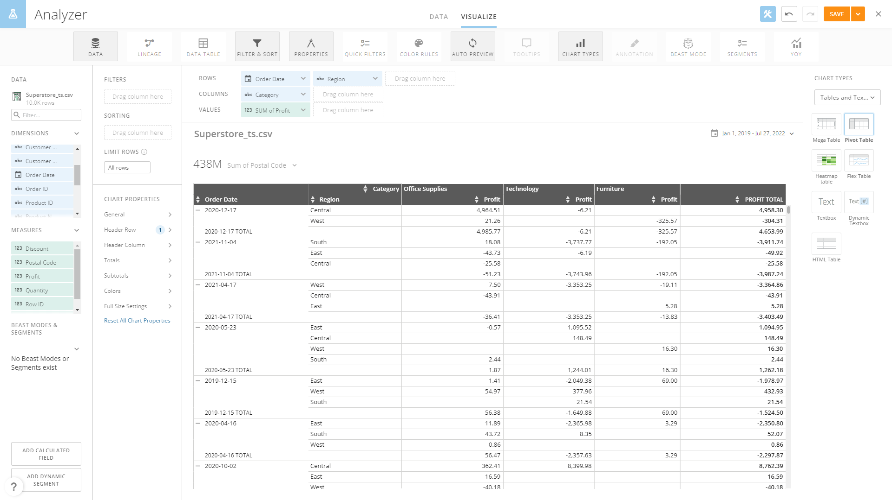

Figure 2-34 Pivot table - Domo

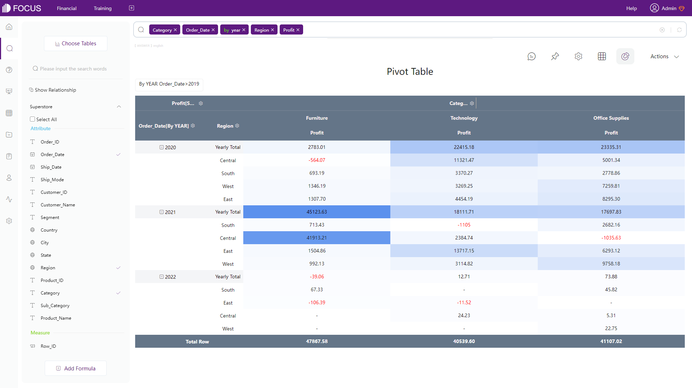

Figure 2-35 Pivot table - DFC

1. 独有表格

Domo：弹性表可以清晰展示整体趋势。

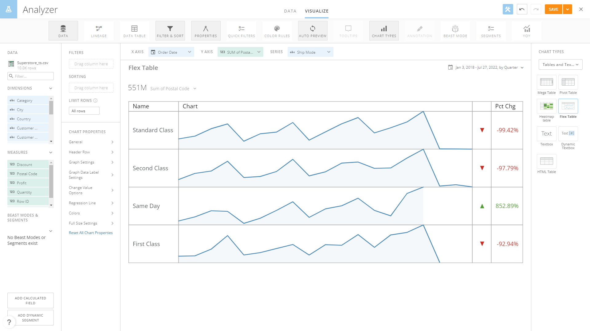

Figure 2-36 Flex table - Domo

DFC：交叉表采用多维结构，满足各种复杂的业务需求。

Figure 2-37 Cross table - DFC

● 图表配置:

DFC 提供了更多的配置可能性。在 DFC的热图模式下，用户可以自定义颜色，可以显示负值为红色。另外，热度显示有渐变和进度两种，如图 2-38 所示。

GIF Figure 2-38 Heatmap mode - DFC

叉表可以固定标题（行列）以获得清晰的视图，如下所示。

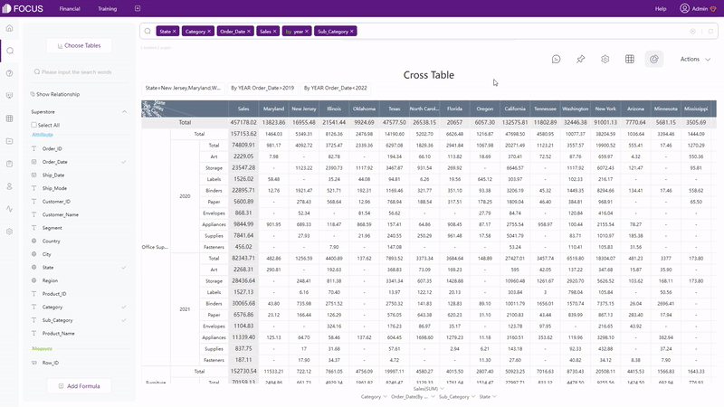

GIF Figure 2-39 Cross table

### 2.5.2 图像

Domo中有超过150种图表类型，其中许多是同种图表的不同形式，例如不同区域的地图、条形和折线组合图表等。Domo有适当的定制化程度，能以多种方式设计可视化卡片。

DFC提供50多种图表，其中大部分是独特的图表类型。通过相对高级的定制化，用户可以自由配置问答，例如自定义字体大小，添加悬停文本等。

为了进一步解释，图表类型分为四个部分：

1. 常用图

以条形图为例，如图2-40和2-41所示。

Figure 2-40 Bar chart - Domo

Figure 2-41 Bar chart - DFC

1. 地图

除了按地理划分的地图，如世界地图、大陆地图、国家地图，Domo 还提供经纬度地图和经纬度路线图。

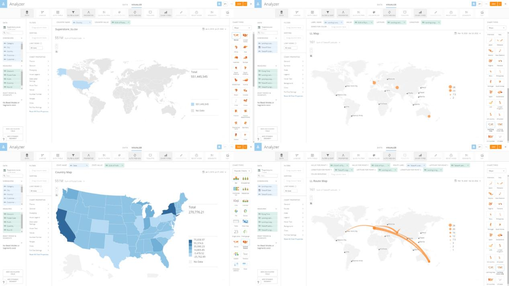

Figure 2-42 Maps - Domo

DFC提供不同类型的地图，而不是不同的区域划分吗，比如GIS位置图、经纬度位置图、轨迹图、3D散点图等，用户可以自由上传地图和地理数据。

Figure 2-43 Maps - DFC

1. 高阶图

Domo提供了一些统计类图表，如预测建模和预测，以及类别散点图、凹凸图等，如图 2-44 所示。

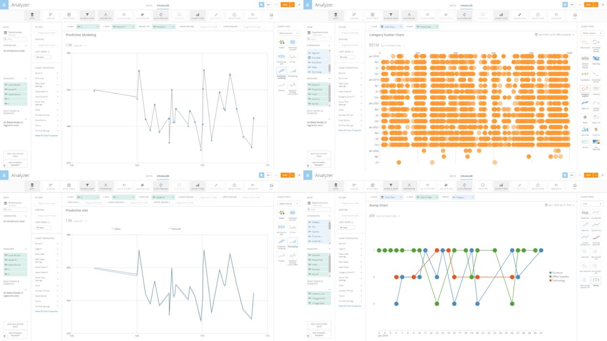

Figure 2-44 Candlestick chart - Domo

DFC提供的一些高级图表有弦图、网络图、打包图、平行坐标图等。

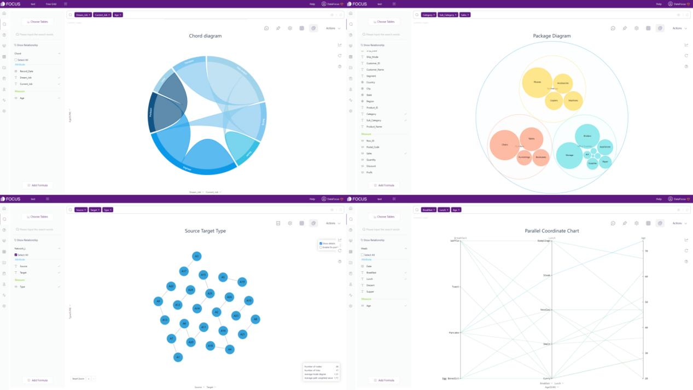

Figure 2-45 Advanced graphics - DFC

1. 动态图

DFC还支持动态图表，例如3D地球飞线（动画可以关闭）和时间序列气泡图。

GIF Figure 2-46 3D globe fly line

GIF Figure 2-47 Time series bubble chart

### 2.5.3 看板

<table><tbody><tr><td>方面</td><td>Domo</td><td>DataFocus Cloud</td></tr><tr><td>看板尺寸</td><td>桌面版&amp;移动端</td><td>自定义</td></tr><tr><td>布局</td><td>预设网格</td><td>自由布局&amp;网格布局</td></tr><tr><td>交互对象</td><td>标题、图像、文本、应用</td><td>文字、图片、视频、媒体……</td></tr><tr><td>看板模板</td><td>/</td><td>各式各样</td></tr></tbody></table>

1. 看板尺寸

Domo 的看板大小是预设的，可以在桌面和移动端之间切换。DFC 的看板尺寸是自定义的，用户可以通过输入高度和宽度或从预设的设备尺寸中选择来自由调整尺寸。

GIF Figure 2-48 Change dashboard size

1. 布局

Domo 中有 27 个预设布局模板，如图 2-49 所示，但用户仍然可以自由添加交互对象。

Figure 2-49 Layout - Domo

DFC有两种布局类型，网格布局和自由布局。网格布局中的网格有助于更好地放置对象和设计整体布局，而用户可以在自由布局下随意设计布局。

GIF Figure 2-50 Different layouts

1. 交互对象

如上所列，除卡片（图表）外，Domo中可以添加到看板的交互对象有四种。

同样，DFC提供文本、图像、视频、媒体对象和其他一些组件。完整列表可以在这里看到：[自定义组件](https://wiki.datafocus.ai/index.php/%E4%BA%A7%E5%93%81%E6%89%8B%E5%86%8C_v5.0.2" \l ".E8.87.AA.E5.AE.9A.E4.B9.89.E7.BB.84.E4.BB.B6).

1. 模板

DFC提供多种看板的模板，帮助用户快速构建看板，如图2-51所示。

Figure 2-51 Dashboard templates

## 2.6 资源管理

Domo和DFC都提供标签来对资源进行分类，如[第2.1.5节](#post-44228-_资源界面)所述.

1. 图表(卡片/问答)

Domo中的卡片都列在“概览”下，卡片大小可以更改为四种预设大小。

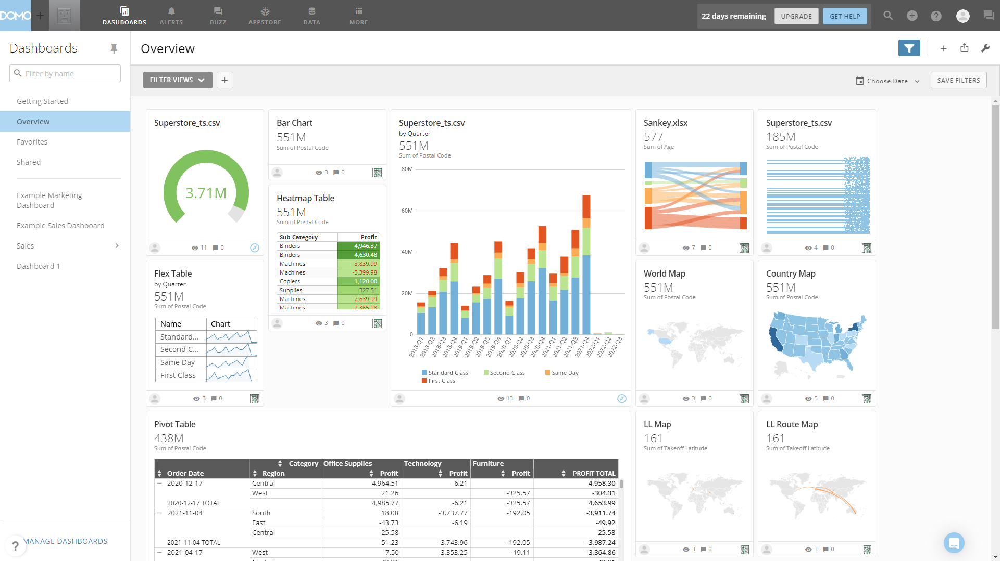

Figure 2-52 Cards management

DFC中的问答存储在问答模块和资源模块下，用户可以在列表和缩略图两种显示模式之间切换。

GIF Figure 2-53 Display mode of answers

1. 看板

Domo的看板在看板模块下左侧导航栏上展示，用户可以通过左侧导航栏底部的“管理看板”按钮来管理看板。

Figure 2-54 Dashboard management - Domo

DFC的看板列在看板模块和资源模块上。模块中有一个小导航，用户可以在不同资源之间切换。此外，用户还可以在搜索框中输入名称以快速寻找资源。

Figure 2-55 Dashboard management - DFC

## 2.7 协作

### 2.7.1 角色与权限

Domo和DataFocus Cloud中既有系统定义的角色，也有自定义角色，不同的角色有不同的操作权限。

Domo 的权限比较细分，主要按照不同的模块来划分。而 DFC的权限专门针对自定义角色，并且是为各个资源设置的。请注意，Domo中的每个用户可以被分配到一个角色，而DFC中用户可以被分配多个角色。在此处查看角色在DFC中的使用方式：[角色](https://wiki.datafocus.ai/index.php/%E4%BA%A7%E5%93%81%E6%89%8B%E5%86%8C_v5.0.2" \l ".E8.A7.92.E8.89.B2).

Figure 2-56 Grants - Domo

Figure 2-57 Permissions - DFC

### 2.7.2 组/部门

Domo有不同的类型的组来管理成员，而DFC中的组织结构更类似于现实的部门结构，以树状结构显示。此外，在DFC中，职位被分配给用户，用户再被分配到不同的部门。因此，通过角色，不同的成员可以查看不同的资源或进行不同程度的操作。

例如，“技术”部门的“前端”“开发人员小李”可以管理与项目A相关的新资源。有关部门结构的完整信息可以在这里查看：[组织架构](https://wiki.datafocus.ai/index.php/%E4%BA%A7%E5%93%81%E6%89%8B%E5%86%8C_v5.0.2" \l ".E7.BB.84.E7.BB.87.E6.9E.B6.E6.9E.84).

Figure 2-56 Groups - Domo

Figure 2-57 Departments - DFC

### 2.7.3 分享

Domo的用户可以与其他用户或组共享卡片和页面，或者通过电子邮件共享，并且可以添加和发送消息。

同样，资源可以在DFC中轻松共享给其他成员。此外，在DFC中还有另一种分享方式，即通过外部查看地址。使用链接或二维码，可以将资源共享给外部用户。但是，外部用户不能编辑以这种方式共享的资源，只能与这些资源交互。

## 2.8 成本

Domo的定价是个性化的，用户需要联系销售团队。

DFC按容量收费，公平，易于在团队内部扩展，且对成员数量不敏感。以下是DFC的详细定价计划。

Table Figure 2-58 Cost - DFC

# 总结

这两个BI平台在帮助用户通过数据分析做出决策方面非常出色。本篇文章通过界面，易用性，可视化等方面来解释这两个平台之间的差异。

Domo 拥有海量数据连接器和广泛的角色授权。尽管界面中的信息比较杂糅，但Domo 仍然提供了漂亮的可视化和一定程度的自定义设置。

DFC 有足够的数据连接方式和图表类型。通过对图表和看板的高度定制，可视化非常生动。更重要的是，由于系统全面，协作简单而系统化。DataFocus Cloud持续改进，将尽最大努力让使用体验更好。欢迎在这里试用： [DFC](https://www.datafocus.ai/).
