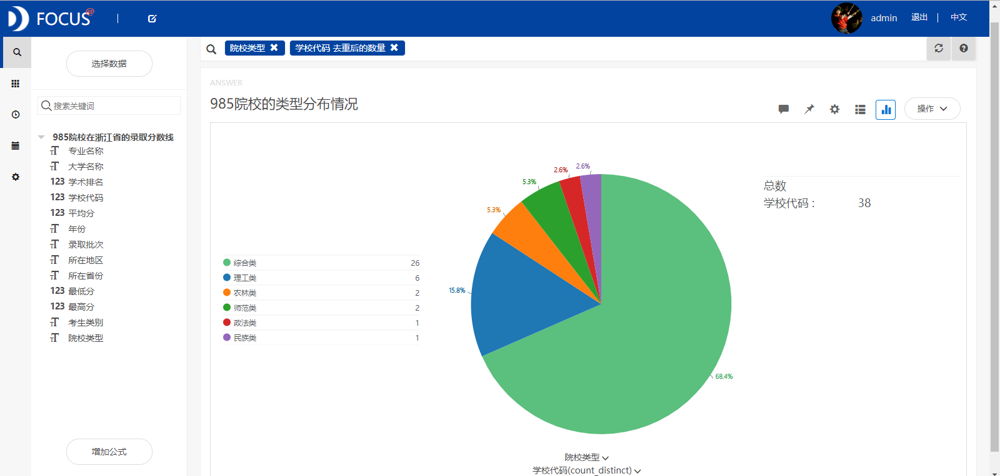
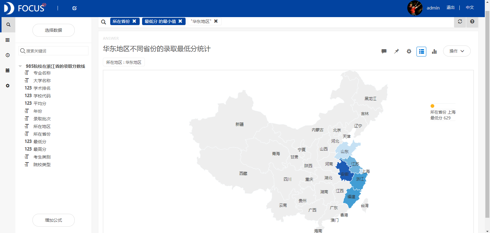
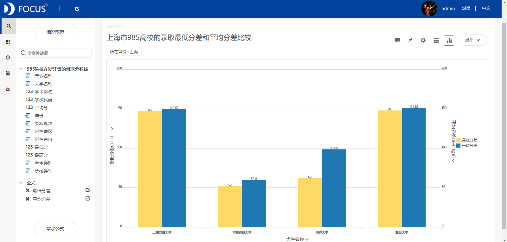

**目的：**预估2018年浙江省本科一批的高考分数线以及针对985院校在浙江省的录取分数线进行深入地分析。

**摘要：**985院校在就业和考研方面有很大的优势，因此能被985院校所录取是很多高考生的梦想。本文通过研究浙江省的一本分数线以及985院校在浙江省的录取分数线得出了以下结论：预估2018年浙江省的分数线应该会上涨，上涨到区间\[580,590\]内。985院校中最多的院校类型是综合类，总共有26所，占985院校总数的60%以上。华东地区的综合类院校数量最多，共有9所。华北地区和中南地区各有4所，而西北地区、西南地区和东北地区各有3所。华东地区985院校的录取最低分为629，是上海华东师范大学的环境科学与工程类专业。

**关键词：**Datafocus；985院校；录取分数线

# **一、案例背景**

2018年高考成绩很快就要出炉了，很多同学都已经在考虑报考哪所高校了。在中国，985院校基本上就是最好的大学，并且985院校的毕业生在就业或考研方面都有很大的优势。985院校毕业生的优势主要有薪资一般高于普通院校毕业生，研究生的推免比例比较大，在考研复试和调剂中优势明显等。因此，即将填报高考志愿的同学们，如果高考成绩超出一本线较多，就应该重点考虑985院校。

# **二、案例问题**

首先基于2008-2017年的浙江省一本分数线的时间序列数据，预估2018年浙江省的一本分数线所在的区间范围。然后利用2017年985院校在浙江省的录取最低分、平均分和最高分等数据来分析985院校在不同地区的分布情况以及针对985院校较多的地区比较不同院校和不同专业的的分数线。

# **三、案例分析**

将分析的“浙江省近年本科一批分数线”和“985院校在浙江省的录取分数线”CSV文件导入到Focus系统中。

## **（一）2018年浙江省高考分数线估计**

基于2008-2017年的浙江省本科一批的分数线数据，研究这些年浙江省分数线的变化趋势以及预估2018年的分数线。从图1中我们可以看出浙江省本科一批的分数线呈现出上升与下降循环交替的现象，并且每次上升或下降的持续时间基本不超过两年，而从2015年到2017年分数线都在下降，据此我们可以估计2018年浙江省的分数线应该会上涨，2018年浙江省高考分数线所在的区间为\[580,590\]。 

图1 浙江省本科一批分数线变化趋势

## **（二）985院校的分数线分析**

**1.985院校的类型分布情况**

从图2中我们看到我国的985院校主要有综合类、理工类、农林类、师范类等几种类型，其中院校最多的类型是综合类，总共有26所，占985高校总数的60%以上。

图2 985院校的类型分布情况

**2.综合类985院校的地区分布情况**

筛选出综合类的985高校，研究我国综合类985高校的地区分布差异。从图3中可以看到华东地区的综合类985高校数量最多，共有9所。华北地区和中南地区各有4所，而西北地区、西南地区和东北地区相对较少，各有3所。 

图3 不同地区综合类985院校的数量统计

**3.华东地区不同省份的录取最低分统计**

筛选出华东地区的985院校录取分数线数据，比较不同省份院校的录取最低分。从图4中可以看到，在华东地区985院校的录取最低分为629，是在上海市的华东师范大学。****

图4 华东地区不同省份的录取最低分统计

**4.上海市985院校的录取分数线比较**

上海共有4所985院校，分别为上海交通大学、华东师范大学、同济大学和复旦大学。最低分差是指各院校录取最低分与省控制线的差值，平均分差是指各院校录取考生的平均分数与省控制线的差值，通过对最低分差和平均分差的比较，我们可以判断某考生被某院校录取的可能性大小。例如，浙江省某考生要想报考华东师范大学，其高考分数基本上要超过一本分数线52分，要是能超过一本线60分，那么他被华东师范大学录取的可能性很大。 

图5 上海市985院校的最低分差和平均分差比较

**5.华东师范大学录取分数线最低的几个专业** 从图6中可以发现华东师范大学录取分数线最低的几个专业为环境科学与工程类、历史学、德语、软件工程等，这说明该校这些专业的报考热度较低。 

图6 华东师范大学录取分数线最低的几个专业

## **（三）数据看板**

最后将这6个结果图导入“985院校在浙江省录取分数线分析”数据看板中，操作结果如下： 

图7 数据看板

# **四、结论**

预估2018年浙江省的分数线应该会上涨，上涨到区间\[580,590\]内。985院校中最多的院校类型是综合类，总共有26所，占985院校总数的60%以上。华东地区的综合类院校数量最多，共有9所。华北地区和中南地区各有4所，而西北地区、西南地区和东北地区各有3所。华东地区985院校的录取最低分为629，是上海华东师范大学的环境科学与工程类专业。

# **五、对策建议**

浙江省隶属于华东地区，而该地区的综合类985院校最多，并且一般考生都会选择离家近的大学就读。因此，华东地区的985院校应是浙江考生的首选学校。华东师范大学的录取分数线最低，因此高考分数超过一本分数线60分左右，并且对环境科学与工程类、历史学、德语和软件工程等专业感兴趣的同学，可以考虑报考该校的这些专业。
