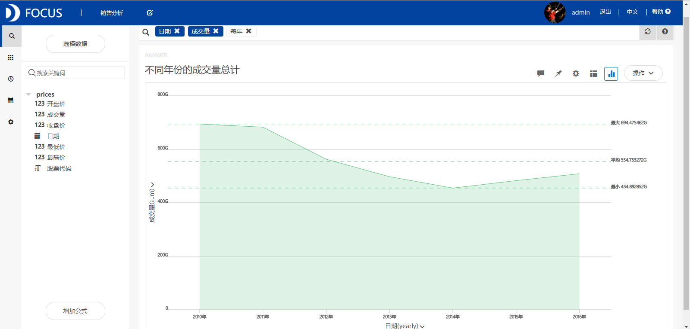
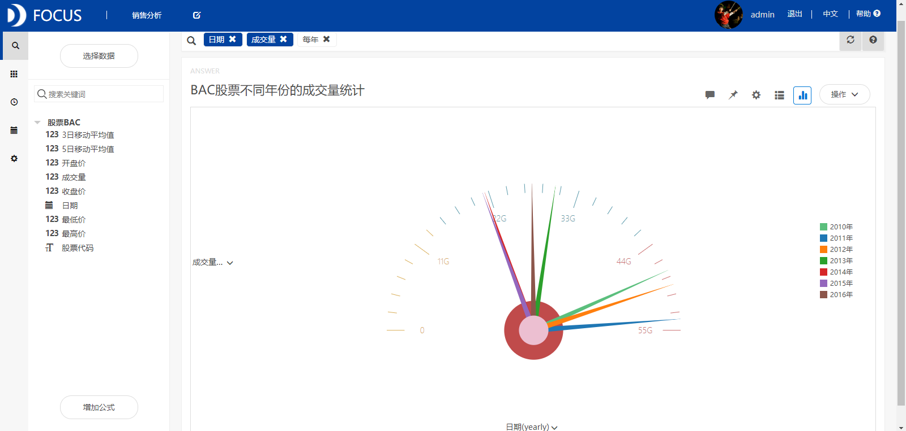
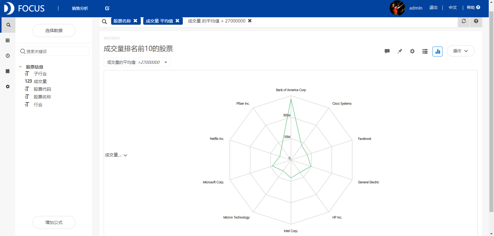
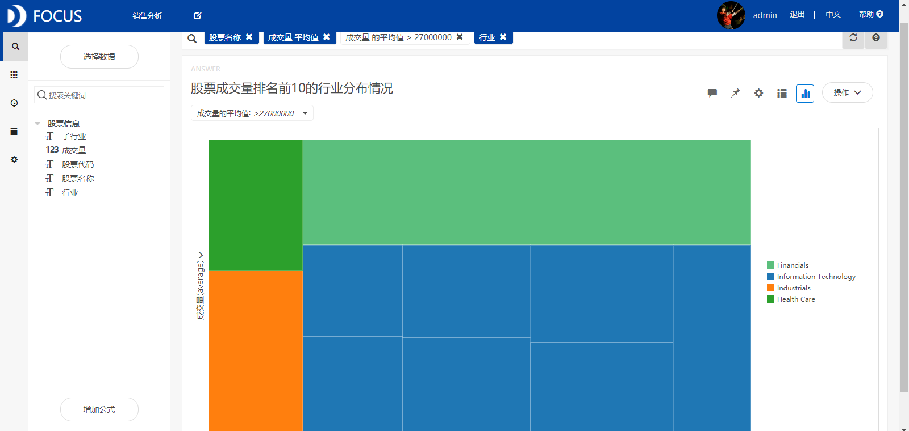
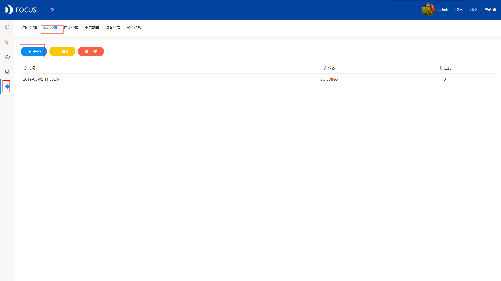
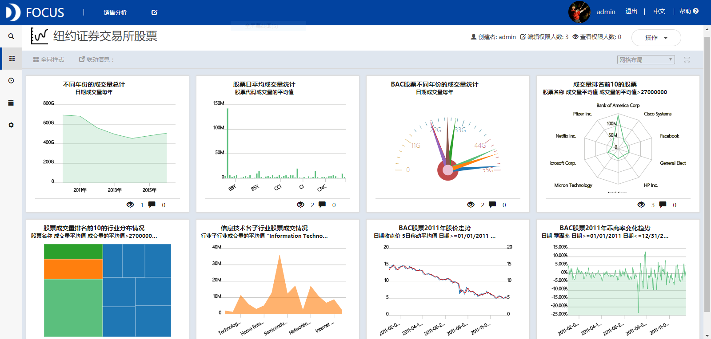

**目的：**分析2010-2016年纽约证券交易所的股票价格、成交量变化趋势，从而为股票持有者提供买进或卖出的建议。

**摘要：**本文通过分析纽约证券交易所的股票数据得出以下结论：纽约证券交易所2010年的股票成交量最大，2014年的成交量最小。BAC（Bank of American Corp）股票的日平均成交量最大，且在2011年成交最多。成交量排名前10的股票中有7只属于信息技术行业，另外3只分别属于工业、卫生保健和金融业。信息技术子行业中Computer Hardware的成交量最大。2011年BAC股票价格整体上呈现连续下跌的趋势。

**关键词：**Datafocus,金融业,成交量,收盘价

**一、案例背景**

现如今，人们投资理财的观念渐渐觉醒，已经有更多的人参加到投资理财的行列中来了。股票投资作为一种重要的投资方式，越来越受到人们的关注和追捧。

**二、案例问题**

在技术分析中，研究量与价的关系占据了极重要的地位。成交量是推动股价上涨的原动力，市场的有效变动必须要有成交量的配合，成交量的大小反映该种股票受投资者关注的程度。本文重点分析2010-2016年纽约证券交易所的股票价格和成交量变化趋势，从而为股票持有者提供买进或卖出的建议。

**三、案例分析**

将分析的“prices”、“securities”和“股票BAC”CSV文件导入到Focus系统中。

**（一）股票成交量统计分析**

**1.不同年份的成交量总计**

统计分析不同年份的成交量，从折线图（见图1）中可以看出纽约证券交易所2010年的股票成交量最大，2014年的成交量最小。 

图1 不同年份的成交量总计

**2.股票日平均成交量统计**

从图2中看出BAC（Bank of American Corp）股票的日平均成交量最大。 

图2 所有股票日平均成交量统计

**3.BAC股票不同年份的成交量统计**

筛选出BAC股票数据，统计其不同年份的成交量，绘制出仪表图如图3所示。从该图中可以看出2011年该股票的成交量最多，其次是2012年和2010年，其他年份的股票成交量相对较少。 

图3 BAC股票不同年份的成交量统计

**4.成交量排名前10的股票**

从图4中可以看出成交量排名前10的股票为Bank of America Corp、Cisco Systems、Facebook、General Electric、HP Inc.、Inter Corp.、Micron Technology、Microsoft Corp.、Netflix Inc.和Pfizer Inc.。

图4 成交量排名前10的股票

**5.股票成交量排名前10的行业分布情况**

从图5中可以看出成交量排名前10的股票中有7只都是属于信息技术行业的，另外3只分别属于工业、卫生保健和金融业。

****

图5 股票成交量排名前10的行业分布情况

**6.信息技术各子行业股票成交情况**

从图6中得到，信息技术子行业中Computer Hardware的成交量最大，其次是System Software、Networking Equipment等。

****

图6 信息技术各子行业股票成交情况

**（二）BAC股价走势分析**

**1.BAC股票2011年股价走势**

从图中我们可以发现2011年BAC股票价格整体上呈现连续下跌的趋势，但是从某一段时间的股价数据来看，当移动平均线向上升，股价向上穿过移动平均线时，股价将会有一段上升的趋势。此时为买入信号。当移动平均线走势由上升逐渐走平转弯下降，而股价从平均线上方向下跌破平均线时，股价会出现一段严重的下跌趋势，此时为重要的卖出信号。 

图7 BAC股票2011年股价走势

**2.BAC股票2011年乖离率变化趋势**

乖离率是通过计算收盘价与某条移动平均线之间的差距百分比，以反映一定时期内价格与其MA偏离程度的指标，从而得出价格在剧烈波动时因偏离移动平均趋势而造成回档或反弹的可能性。乖离率的计算公式为：乖离率(BIAS)=(收盘价-MA(5))/MA(5)\*100%。股价在平均线之上，为正乖离，股价在平均线之下，为负乖离。从折线图（图8）中可以发现乖离率周而复始地往返于零点的上方和下方，当正乖离率升到某一比率时，表示短期买方的获利较大，则获利回吐的可能性也大，是卖出信号。

图8 BAC股票2011年乖离率变化趋势

**（三）数据看板**

最后将这8个结果图导入“纽约证券交易所股票”数据看板中，操作结果如下： 

图9 数据看板

**四、结论**

纽约证券交易所2010年的股票成交量最大，2014年的成交量最小。BAC（Bank of American Corp）股票的日平均成交量最大，且在2011年成交最多。成交量排名前10的股票中有7种属于信息技术行业，另外3种分别属于工业、卫生保健和金融业。信息技术子行业中Computer Hardware的成交量最大。2011年BAC股票价格整体上呈现连续下跌的趋势，但是从某一段时间的股价数据来看，当移动平均线向上升，股价向上穿过移动平均线时，股价将会有一段上升的趋势。

**五、对策建议**

当移动平均线向上升，股价向上穿过移动平均线时，股价将会有一段上升的趋势，此时建议买进股票。当移动平均线走势由上升逐渐走平转弯下降，而股价从平均线上方向下跌破平均线时，股价会出现一段严重的下跌趋势，此时建议卖出股票。当正乖离率升到某一比率时，表示短期买方的获利较大，则获利回吐的可能性也大，此时建议卖出股票。
