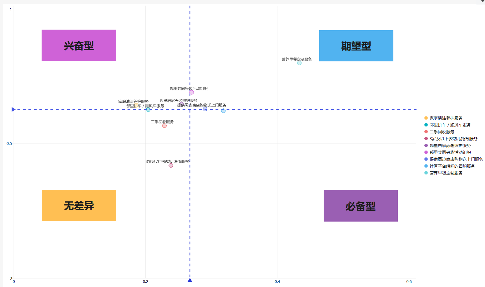
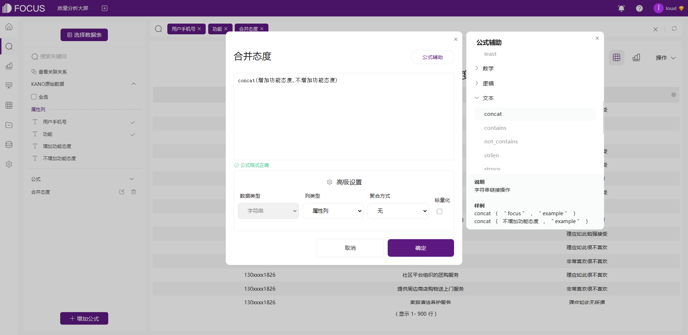

**KANO模型：用数据驱动产品迭代**

作为一个产品经理或者需求分析师，每天都在解决不完的产品需求中纠缠。什么才是用户真正重要的需求呢？如何协调有限的开发资源和无限的需求之间的关系？也许每个产品经理都遇到过这些问题。

而「KANO模型」就是用来解决这个问题的。

## **一、什么是KANO模型**

「KANO模型」是对用户需求分类和优先排序的有用工具，以分析用户需求对用户满意的影响为基础，体现了产品性能和用户满意之间的非线性关系。

 四个象限对应了四种需求类型，它们的优先级排序为：必备型需求>期望型需求>兴奋型需求>无差异需求。

**必备型需求（必须有）：**即常说的痛点。对于用户而言，这些需求是必须满足的，理所当然的。当不提供此需求，用户满意度会大幅降低。这类是核心需求，也是产品必做功能。

**期望型需求（应该有）：**当提供此需求，用户满意度会提升；当不提供此需求，用户满意度会降低。通常作为竞品之间比较的重点。

**兴奋型需求（可以有）：**惊喜型产品功能，超出用户预期，往往能带来较高的忠诚度。不提供也不会降低用户满意度。

**无差异需求（可以没有）：**用户根本不在意的需求，对用户体验毫无影响。尽量规避做此类型功能。

有了四象限的区分之后，该做什么需求，哪个优先级比较高，也就一目了然了。

## **二、KANO模型数据怎么来**

了解了「KANO模型」之后，我们首要解决的问题是「KANO模型」的数据从哪里来？

一般我们采用问卷搜集的方式，对我们的用户或者客户进行调查。在KANO 问卷中，每个功能/需求都要有**正向和反向**两个问题，例如：

收集获取数据后，最终我们可以通过下表定位某功能对于用户来说是什么需求。

<table><tbody><tr><td colspan="2" rowspan="2"><strong>问卷问题</strong></td><td colspan="5"><strong>负向（如果*产品*不提供此功能，您的评价是）</strong></td></tr><tr><td><strong>非常喜欢</strong></td><td><strong>理应如此</strong></td><td><strong>无所谓</strong></td><td><strong>勉强接受</strong></td><td><strong>很不喜欢</strong></td></tr><tr><td rowspan="5"><strong>正向（如果*产品*提供此功能，您的评价是）</strong></td><td><strong>非常喜欢</strong></td><td><strong>Q</strong></td><td><strong>A</strong></td><td><strong>A</strong></td><td><strong>A</strong></td><td><strong>O</strong></td></tr><tr><td><strong>理应如此</strong></td><td><strong>R</strong></td><td><strong>I</strong></td><td><strong>I</strong></td><td><strong>I</strong></td><td><strong>M</strong></td></tr><tr><td><strong>无所谓</strong></td><td><strong>R</strong></td><td><strong>I</strong></td><td><strong>I</strong></td><td><strong>I</strong></td><td><strong>M</strong></td></tr><tr><td><strong>勉强接受</strong></td><td><strong>R</strong></td><td><strong>I</strong></td><td><strong>I</strong></td><td><strong>I</strong></td><td><strong>M</strong></td></tr><tr><td><strong>很不喜欢</strong></td><td><strong>R</strong></td><td><strong>R</strong></td><td><strong>R</strong></td><td><strong>R</strong></td><td><strong>Q</strong></td></tr><tr><td colspan="7"><strong>A：兴奋（魅力）型需求；</strong>

<strong>O：期望（意愿）型需求；</strong>

<strong>M：基本（必备）型需求；</strong>

<strong>I：无差异型需求；</strong>

<strong>R：反向（逆向）型需求；</strong>

<strong>Q：无效（可疑）结果</strong></td></tr></tbody></table>

## 三、**KANO模型实现过程**

下面，我们就用搜索式BI工具DataFocus来完成「KANO模型」的数据处理和分析过程。

### **3.1数据处理**

新增公式「合并态度」，将「增加功能态度」与「不增加功能态度」进行合并，如下图所示：

合并「增加功能态度」与「不增加功能态度」后，最终我们可以通过合并后的态度定位某功能对于用户来说是什么需求。

接下来要做的就是根据「合并态度」的结果，将结果进行分类：

由于公式很长，用户可以直接复制内容到公式编辑器中，使用了 **if-then-else函数**：

_if 合并态度="非常喜欢非常喜欢" then "Q" else if 合并态度="非常喜欢理应如此"then "A" else if 合并态度="非常喜欢无所谓" then "A" else if 合并态度="非常喜欢勉强接受"then "A"else if 合并态度="非常喜欢很不喜欢"then "O" else if 合并态度="理应如此非常喜欢"then "R" else if 合并态度="理应如此理应如此"then "I" else if 合并态度="理应如此无所谓"then "I"else if 合并态度="理应如此勉强接受"then "I"else if 合并态度="理应如此很不喜欢"then "M"else if 合并态度="无所谓非常喜欢"then "R"else if 合并态度="无所谓理应如此"then "I"else if 合并态度="无所谓无所谓" then "I"else if 合并态度="无所谓勉强接受"then "I"else if 合并态度="无所谓很不喜欢"then "M"else if 合并态度="勉强接受非常喜欢"then "R"else if 合并态度="勉强接受理应如此"then "I"else if 合并态度="勉强接受无所谓"then "I"else if 合并态度="勉强接受勉强接受"then "I"else if 合并态度="勉强接受很不喜欢" then "M"else if 合并态度="很不喜欢非常喜欢" then "R"else if 合并态度="很不喜欢理应如此" then "R"else if 合并态度="很不喜欢无所谓"then "R"else if 合并态度="很不喜欢勉强接受"then "R"else "Q"_

因为调研过程中有些用户可能会跳题，所以参与每个功能调研的人数有所不同。新增列「功能调研人数」，如下图所示，求出参与每个功能调研的人数。

人数=count(用户手机号)

功能调研人数=group\_sum(人数，功能）

继续计算占比=人数/功能调研人数。

### **3.2制作中间表**

选择字段「功能」、「需求类型」、「人数」、「功能调研人数」、「类型占比」，保存为中间表「KANO模型中间表」。

### **3.3量化分析（Better-Worse系数）**

继续选择中间表来计算better-worse 系数，计算方式如下所示：

Better（增加某功能后提升的满意系数）：better=（A占比+O占比）/(A占比+O占比+M占比+I占比)，越接近1，则表示用户满意度提升的效果会越强，满意度上升的越快。

Worse（不增加某功能用户的不满意系数）：worse=-1\*（O占比+M占比）/(A占比+O占比+M占比+I占比)，越接近-1，则表示对用户不满意度的影响越大，满意度下降的越快。

better计算公式：（sum\_if（需求类型=“A”，类型占比）+sum\_if（需求类型=“O”，类型占比）)/（sum\_if（需求类型=“A”，类型占比）+sum\_if（需求类型=“O”，类型占比）+sum\_if（需求类型=“M”，类型占比）+sum\_if（需求类型=“I”，类型占比）)

worse计算公式：((sum\_if(需求类型=“O”，类型占比）+sum\_if(需求类型=“M”，类型占比）)/(sum\_if(需求类型=“O”，类型占比）+sum\_if(需求类型=“M”，类型占比）+sum\_if(需求类型=“A”，类型占比）+sum\_if(需求类型=“I”，类型占比）))\*(-1)

worse系数绝对值：abs(worse)

### **3.4制作散点图**

选择字段「功能」、「worse绝对值」、「better」，制作为散点图。

分别添加「X轴标度」和「Y轴标度」，分别为 worse平均值 和 better平均值。如下图所示： 

### **3.5制作数据应用**

最后制作数据应用，并添加文本框标注四象限的需求类型。这样我们就很清楚地知道什么是重要功能/需求，什么才是客户真正想要的啦。

（同款模板搜索DataFocus免费试用获取）

## **四、模型总结**

虽然此模型可以将**定性的功能进行定量化处理**，更能科学的指导产品决策。但是在实际的应用过程中，如果对业务本身理解不够好的话，得出的结果就不会准确。

而最容易出现问题的地方则是问卷调查部分，一种是问卷调查的问题，一种则是问卷调查的对象。对于问题则需要内部自己梳理，而对于用户调查的对象，则需要我们根据产品的功能特性以及服务对象去划分用户群体，只有好的问卷才能得出最优的决策。

此外需求也会因人而异，而我们要做的是**满足目标用户人群中多数人的需求**，需求会因为文化差异而不同，需求会随着时间变换，昨天的期望型需求，甚至魅力型需求，到今天可能以变成必备型需求，所以需要持续调研需求，产品需要持续迭代。
