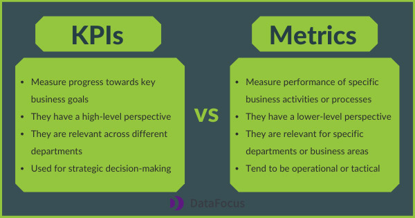
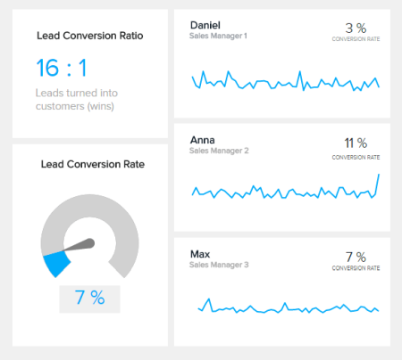
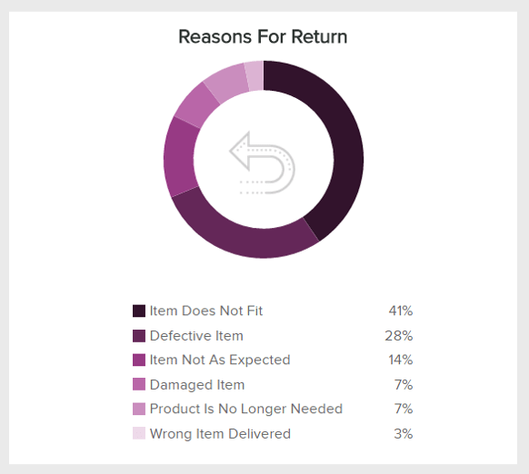

性能跟踪从未如此简单。随着现代[自助式 BI 工具](https://www.datafocus.ai/infos/self-service-bi-tools)的兴起，每个人都可以在几秒钟内监控相关的绩效指标。但这并非没有问题。能够快速有效地分析数据并不总是意味着您做得正确。企业从多个内部和外部来源提取数据，这使得很难但有必要过滤这些数据，只保留与公司相关的数据。这是在KPI和指标的帮助下完成的。

在日常业务环境中，KPI 和指标通常被视为同一事物。但是，虽然它们以类似的方式工作，但它们的用途不同。记住这句话以备以后用：所有 KPI 都是指标，但并非所有指标都是 KPI。也就是说，这篇文章将涵盖指标和 KPI 之间的主要区别，以及一些有效跟踪绩效的示例和技巧。

让我们快速定义指标和 KPI！

## 什么是 KPI？

本质上，关键绩效指标或 KPI 是根据特定的业务目标来衡量绩效或进度。要考虑的一个关键因素是“关键”一词，这意味着他们只跟踪与公司战略决策真正相关的内容。

一个好的 KPI 应该可以帮助您和您的团队了解您是否做出了正确的决定。它们充当业务成果的地图，是推动公司前进的战略指标。KPI 的示例可以是销售增长、客户留存或客户终身价值。[公司通常在交互式KPI 报告](https://www.datafocus.ai/infos/what-are-kpi-reports-examples)的帮助下将这些测量值可视化。

## 什么是指标？

[指标](https://www.datafocus.ai/infos/operational-metrics-and-kpi-examples)是用于在运营和战术层面跟踪特定业务流程绩效的定量测量。它们有助于为关键业务目标的绩效提供背景，但并不像 KPI 那样对其成功至关重要。

虽然其中一些指标可能与目标紧密相关，但指标并不是监控战略行动的最重要指标。但是，它们仍然有助于向企业通报其不同活动的进展情况。一些指标示例包括按营销渠道划分的潜在客户转化率、退货率和获取成本。

现在我们对这两个指标的定义有了基本的了解，让我们更深入地了解 KPI 和指标之间的区别。

## KPI 与指标：有什么区别？

KPI 和指标通常被视为同义词。但是，这不是它的实际工作方式。虽然它们都是定量测量，但它们用于不同的目的。简而言之，KPI 需要专门与目标或目标相关联才能存在，而指标只是衡量特定业务行动或流程的绩效。让我们更详细地了解一些差异。

- **沟通：**如上所述，KPI 是专门用于传达业务目标进度的战略指标。另一方面，指标用于跟踪可能朝着该目标努力的特定领域或流程。例如，假设您想在明年多销售 20%，您的主要 KPI 将是迄今为止销售的产品或订阅数量。现在，为了详细监控该目标的进度，您需要跟踪各种指标，例如网站访问者的数量、表现最佳的销售渠道、销售代理的表现以及任何其他有助于您了解哪些行动有助于实现您的目标以及可以改进的地方。总而言之，KPI 可以被视为对您实现目标的过程产生影响的一组指标。
- **目标：**一个好的 KPI 总是与结果紧密相关，您期望它上升或下降以达到目标。另一方面，指标是衡量不同业务领域的日常绩效的影响，如从销售示例中可以看出，其中只有一些指标可以帮助您跟踪战略行动的成功。这里重要的一点是指标和 KPI 并不是相互排斥的——这就是为什么它们经常被视为同一事物。KPI 需要一组指标来跟踪其成功，您只需要确保使用正确的指标来跟踪它。请记住：虽然所有 KPI 都是指标，但并非所有指标都是 KPI。
- **重点：**指标和 KPI 之间的另一个重要区别是它们的关注程度。KPI 具有高层次的视角。它们代表与各个部门相关的关键业务目标。另一方面，指标被认为是较低级别的指标，它们跟踪特定于部门或业务领域的活动或流程。以销售额增长 20% 为例，每个部门都可能在实现该目标方面发挥作用。例如，营销部门可能需要专注于增加在线销售额，销售团队可能需要专注于制定策略以有效地将潜在客户转化为付费客户，物流团队可以专注于改善运输体验，产品团队可以专注于寻找生产中的优势和劣势。因此，每个部门将需要跟踪不同的指标，以实现一般的业务目标。

[让我们通过使用现代KPI 工具](https://www.datafocus.ai/infos/kpi-reporting)创建的一些 KPI 与指标示例来分析这些差异：

### 1）销售增长指标和KPI

让我们以年底销售额增加 20% 的示例开始更详细地介绍。像销售增长这样的大目标与管理、销售、营销和生产等企业的各个部门相关。这些部门中的每一个都将跟踪自己的指标，以了解他们的活动如何为总体目标做出贡献。在这里，我们将重点介绍一些销售方面的问题。

- **KPI：销售增长**

上图是我们主要 KPI 的可视化表示：销售增长。通过本期与前一期的对比、基于目标的销售额百分比以及销售代表的销售收入等信息，我们可以一目了然地了解目标是否实现。但是，为了调整策略，我们还需要了解不同活动的执行情况，这可以借助各种销售指标来完成。

- **指标：引出转化率**

衡量这一特定目标的一个很好的销售指标是转化率。它衡量实际上最终变成付费客户的感兴趣的人的数量。这最终转化为销售额的增加。该指标很有用，因为它为制定战略决策提供了更深入的见解。如果您的潜在客户转化率低，那么您需要考虑替代方案来激励潜在客户成为实际客户。为了实现这一目标，其他一些衡量指标可能包括潜在客户与机会的比率、净利润率等。

### 2) 客户体验 KPI vs指标

研究表明，客户保留率每增加 5%，利润就会增加 25%。现在想象一下，有了这些信息，您想设定一个目标，即到年底将留存率提高 10%。现在，这个目标也可以与不同的部门相关。例如，营销团队需要专注于制作有吸引力的活动以吸引客户再次购买，而产品团队可能需要专注于开发优质的产品。

- **KPI：客户留存率**

客户留存率直接影响您的收入。当客户对您的服务或产品感到满意时，他或她很可能会再次购买。由于您的目标是将留存率提高 10%，因此上图将是您的主要 KPI。衡量成功的一个好方法是根据市场基准和实际业务数据设置目标百分比。现在让我们看看对这个特定目标有用的一些产品级指标。

- **指标：退货率和退货原因**

退货率是跟踪了解客户留存率的重要指标。如果您的客户退回他们购买的东西，他们很可能不会再回来购买。为了从退货率中提取更深层次的结论，产品团队可以跟踪退货原因指标。如上图所示，该指标列出了客户退货的主要原因。在这里，我们看到 28% 对应于有缺陷的项目。降低这 28% 可以对提高留存率产生直接影响，因此，重点领域将是提高产品质量。生产中其他有价值的客户留存指标可以包括重复购买率或完美订单率。

如果您想查看更多此类[KPI 示例](https://www.datafocus.ai/infos/kpi-examples-and-templates)，请查看我们的资料库，其中包含来自不同行业、功能和平台的示例。

## 衡量正确 KPI 和指标的技巧

我们已经介绍了关键绩效指标和指标的定义，并探讨了业务指标与 KPI 的区别。在这篇文章的这一部分，我们将介绍 5 个技巧，这些技巧将帮助您以有效的方式衡量您的目标和绩效。

### 1\. 将指标与 KPI 分开

衡量一切实际意味着你什么都没有衡量。在将 KPI 与指标分开时，您需要考虑什么对您的业务最重要。任何类型的指标都可以作为一个度量标准，但如果该指标没有提供任何有价值的信息来帮助您改进，那么您应该丢弃它。

跟踪错误的指标可能会导致时间和资源的浪费，而这是很容易避免的。衡量太多会让人感到困惑和误导。为避免这种情况，请确保您只选择真正为您的目标带来价值的 KPI，把那些没用的信息抛在脑后。关于这一点，我们将在下一点中进一步讨论。

### 2\. 选择正确的 KPI

选择正确的 KPI 进行衡量可能是有效跟踪策略的最重要步骤。为了帮助实现此目的，您可以使用一些 KPI 跟踪技术。在这里，我们将解释其中的两个：SMARTER 方法和六 A 方法。

- **更智能：**此[KPI 跟踪](https://www.datafocus.ai/infos/kpi-tracking-software-and-tools)做法代表具体、可衡量、可实现、相关、有时限、评估和重新评估。它就像一个需求列表，你的kpi必须满足这些需求才能被认为是有用的。正如这篇文章所提到的，它们应该针对您的目标，符合您的业务现实，并且可以随着战略的演变而灵活变化。
- **六个 A：**此方法代表 Aligned（一致的）、Attainable（可实现的）、Acute（敏锐的）、Accurate（准确的）、Actionable（可行动的）、Alive（存活的）。就像 SMARTER 标准一样，这种做法也旨在评估 KPI 的相关性，它对于指标过多且需要将其缩小到几个的业务很有用。

通过应用这些方法，您应该能够将其缩小到每个业务目标大约 2-5 个关键 KPI。这有助于您保持分析过程的具体化，并避免可能影响您解释数据方式的误导性信息。

这里要记住的重要一点是，您应该始终重新审视您的 KPI。如果您找到了实现目标的更好方法，那么您应该确保您正在跟踪正确的数据。您可以通过每周或[每月报告](https://www.datafocus.ai/infos/monthly-reports-templates)定期监控您的 KPI 来做到这一点。一旦确定了 KPI，您就拥有了开始制定战略决策和考虑长期行动所需的所有信息。

### 3\. 通过交互式仪表板获得集中视图

KPI 和指标是企业的宝贵工具。虽然关键绩效指标往往更重要，但指标也有助于更全面地了解部门或特定领域的绩效。今天，有几种[在线数据可视化工具](https://www.datafocus.ai/infos/data-visualization-tools)提供了一系列仪表板选项，以集中的方式可视化您的 KPI 和指标。让我们以数字营销为例来看看它。

上面的示例是使用专业的[仪表板生成器](https://www.datafocus.ai/infos/dashboard-creator)创建的，它是跟踪营销活动 ROI 所需的指标和关键绩效指标的完美组合。获得像这样的集中视图有助于营销人员全面了解他们的营销工作，以便做出明智的战略决策。

如果您想查看更多类似这样的[仪表板示例](https://www.datafocus.ai/infos/dashboard-examples-and-templates)，那么我们建议您查看我们的资料库，其中包含来自不同行业、功能和平台的 80 多个模板，以获得灵感！

### 4.远离虚荣指标

虚荣指标是指在纸面上看起来不错但对未来商业战略无用的指标。在某些情况下，虚荣指标用于显示改进，但它们实际上是不可操作的指标，或与您认为真正重要的任何事情无关。虚荣指标的一个很好的例子是社交媒体关注者。想象一下，您实施了一项活动，为您的应用吸引了 1万名新关注者。现在，这似乎看起来是成功的，但如果这 1万 名关注者中只有 50 人购买了您的产品或服务，那么该指标就变得毫无用处。

为避免虚荣指标的问题，您需要使分析尽可能客观。在选择要监控的 KPI 和指标时，一定要确保它们反映了事实。虽然诸如关注或喜欢的数量之类的指标可能看起来令人兴奋，但它们也可能为您指明错误的方向。 [BI 工具](https://www.datafocus.ai/infos/best-bi-tools-software-review-list)提供各种 KPI 和仪表板模板，可以为您指明正确的方向以避免犯此错误。

### 5\. 设定切合实际的目标

以正确方式衡量指标和关键绩效指标的最后一个技巧是设定可实现的目标。为了有效地衡量您的 KPI 和指标，您需要知道您的前进方向，而目标使这成为可能。在这一点上，您需要注意不要设定不切实际的目标，例如在过去几年的平均增长为 5% 的情况下，一年内的销售额增长 50%。在制定目标时，请根据您的业务环境以及一些行业基准来考虑可实现的价值。这样，您将确保您正在朝着可实现的目标努力，并避免因设定不现实的价值观而感到失望。

## KPI 与指标的关键要点

在这篇文章的最后，希望你能更深入地理解关键绩效指标与指标的区别。这篇文章的重要内容是要记住：没有指标就没有 KPI，两者对于确保从不同业务活动中获得健康的投资回报都至关重要。

KPI 和指标是用于绩效跟踪的宝贵工具。每天，越来越多的企业使用[BI 仪表板软件](https://www.datafocus.ai/infos/bi-dashboard-tools)，以交互和直观的方式集中查看其最重要的指标。访问现代仪表板技术可以让团队保持联系，并朝着共同的业务目标一起工作。

为了让您保持头脑清醒，以下是指标和 KPI 之间主要区别的简短摘要：

- KPI 根据关键业务目标衡量绩效，而指标衡量特定业务活动的绩效或进度。
- KPI 是战略性的，而指标通常是操作性的或战术性的。
- 指标是特定于某个部门的较低级别的指标，而 KPI 可以由致力于同一目标的各个部门跟踪。
- 指标为您的业务活动提供背景，KPI 允许制定战略决策。

如果您已准备好开始生成自己的 KPI 和指标，请[免费测试我们的专业 KPI 跟踪软件 30 天](https://www.datafocus.ai/console)！
