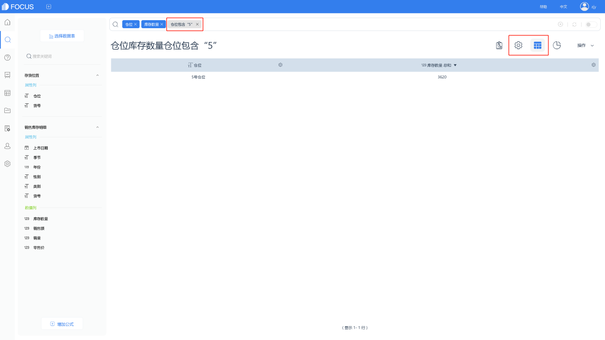
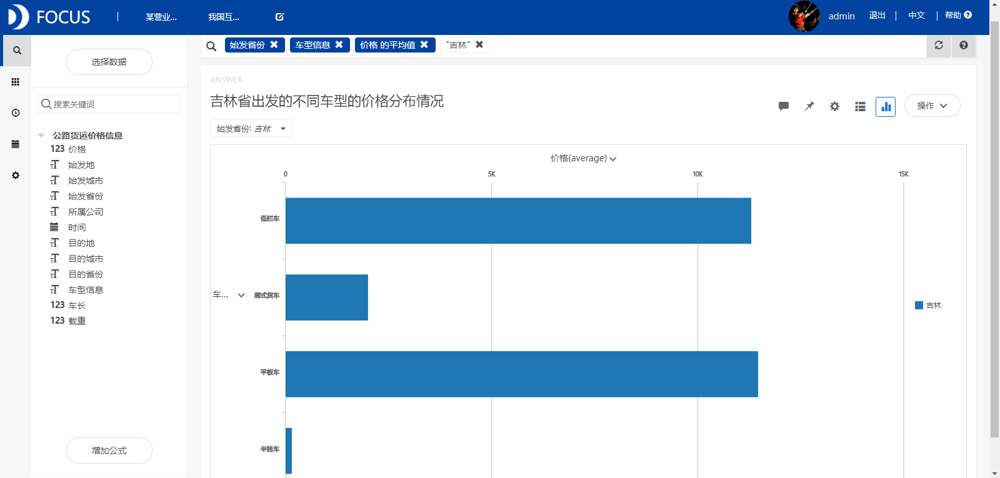
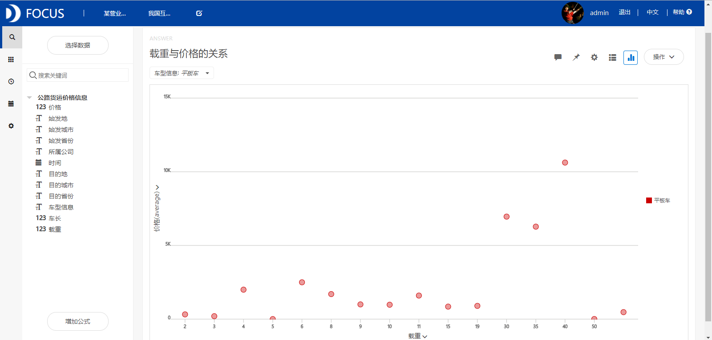

**目的：**基于2017年4-7月全国公路货物运输数据，分析我国公路货运价格与车型、车长、车辆载重等指标之间的关系。

**摘要：**本文通过对我国公路货运价格的统计分析得出了以下结论：7月份我国平均货运价格最高。从吉林出发的平均货运价格最高，而从北京出发的平均货运价格最低。从吉林到广东、江苏和河南的货运价格较高，均在5000元以上，而从吉林到辽宁的货运价格很低。此外，平板车的货运价格最高，其次是低栏车，厢式货车和半挂车的货运价格较低。平板车的车长为16.5米、载重在（30,40）吨之间时的货运价格较高，车长在8米以下时货运价格比较低。

**关键词：**Datafocus,物流业,公路货运价格

**一、案例背景**

伴随着我国经济的高速发展、公路运输事业的长足进步和综合运输体系的逐渐形成、完善，公路货物运输市场正逐渐向全面的市场经济转变。对公路货运价格的研究，探索影响价格背后的因素有利于促进适应市场经济发展的价格机制的形成，完善运输市场理论体系，有利于指导公路运输企业降低成本，更有力地拓展运输市场。

**二、案例问题**

公路货运价格自上世纪80年代中期启动市场化改革以来，从改革开放前政府严格管制到逐渐放松管制，目前已实现完全由市场调节。本文基于2017年4-7月全国公路货物运输数据，分析我国公路货运价格与车型、车长、车辆载重等指标之间的关系。

**三、案例分析**

将分析的“公路货运价格信息”CSV文件导入到Focus系统中。

**（一）货运价格变化情况**

**1．不同月份的平均货运价格统计**

从图1中我们可以看出7月份我国平均货运价格最高。 

图1 不同月份的平均货运价格统计

**2.不同始发省份的平均货运价格汇总**

从图2中我们看到从吉林出发的车辆的平均货运价格最高，而从北京出发的平均货运价格最低。 

图2 不同始发省份的平均货运价格汇总

**3.北京到不同目的省份的货运价格**

从图3中可以看到从北京到江苏的货运价格最高，达4000元以上，其次是从北京到内蒙古的。而从北京到河北、天津等省市的运输价格较低。 

图3 北京出发到不同目的省份的货运价格情况

**4.吉林省到不同目的省份的货运价格**

从图4中我们可以看到吉林到广东的货运价格最高，达10000元以上。此外，从吉林到江苏和河南的货运价格也较高，在5000元以上。而从吉林到辽宁的货运价格最低。****

图4 吉林省出发到不同目的省份的货运价格

**（二）车型、车长、载重与价格的关系分析**

**1.吉林省出发的不同车型的价格分布情况**

筛选出始发省份为吉林省的货运价格信息，研究运货车辆的车型、车长、载重和货运价格之间的关系。从图5中发现，平板车的货运价格最高，其次是低栏车，厢式货车和半挂车的货运价格较低。 

图5 吉林省出发的不同车型的价格分布情况

**2.车长与价格的关系**

从图6中发现，平板车的车长为16.5米时的货运价格最高，车长在8米以下时其货运价格比较低。 

图6 车长与价格的关系

**3.载重与价格的关系**

从图7中发现，平板车的载重主要在（2,50）吨之间，其中载重在（30,40）吨之间的货运价格最高。  图7 载重与价格的关系

**（三）价格大于10000元的货运公司**

从图8中可以看到运输价格大于10000元的货运公司有山东省莘县昌华物流有限公司、绥中县明迪运输车队等八家公司，其中安徽省蒙城县公路货运有限公司的平均货运价格是最高的。 

图8 价格大于10000元的货运公司

**（三）数据看板**

最后将这8个结果图导入“我国公路货运价格分析”数据看板中，操作结果如下： 

图9 数据看板

**四、结论**

7月份我国平均货运价格最高。从吉林出发的车辆的平均货运价格最高，而从北京出发的平均货运价格最低。从吉林到广东、江苏和河南的货运价格较高，在5000元以上，而从吉林到辽宁的货运价格很低。此外，平板车的货运价格最高，其次是低栏车，厢式货车和半挂车的货运价格较低。平板车的车长为16.5米、载重在（30,40）吨之间时的货运价格较高，车长在8米以下时其货运价格比较低。

**五、对策建议**

公路货运公司在对某一辆车的货物运输进行定价时应该主要考虑出发地与目的地、车辆类型、车身长度以及载重等指标。首先根据不同的出发地与目的地组合进行合理地定价，其次不同的车身、载重和车辆类型都要有不同的的定价方案，尤其针对车长为16.5吨、载重在（30,40）吨之间的平板车货运定价一定要高，而对车长在8米以下的平板车定价相对要低。
