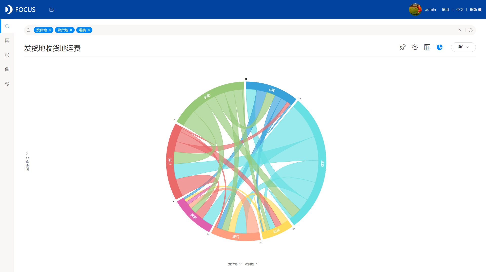
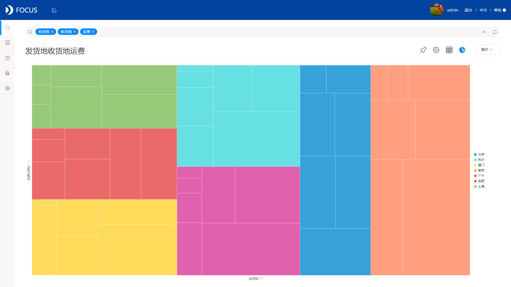

**目的：**分析在数据平台记录中企业的今年来各大机场的物流吞吐数据来分析物流热区分布，辅助物流行业报告的产出。

**摘要 ：** 本报告使用DataFocus系统，数据记录了来自物流产业大数据平台下2007年到2016年全国大型机场的在记录中的企业的货邮吞吐量的相关信息，案例主要从机场、时间和一些物流指标的角度进行分析，比较各机场不同年份的物流流量与热度，宏观地分析物流产业的发展状况。分析结果可帮助我们更好的看到航空物流行业的发展状况，实质性地帮助行业报告的产出。最终分析可得，北京首都机场是2016年航空货邮吞吐量最大的并明显远超过第二的上海浦东达到近95M，第三名为广州白云机场。而在2015年时，上海浦东机场是吞吐量最大的货邮机场，其次是北京首都机场和广州白云机场。与2015年全国货邮吞吐量相对比，可以明显看到2016年的货邮吞吐总量大幅增高，这是因为2016年国家发布的一些减少航空燃油附加费用的政策，使航空货邮的成本逐渐下降，结合航空货邮的优点，使企业商家更多的开始选择航空物流渠道。可以看出2016年相对2015年，大部分机场都有很大的涨幅，其中喀纳斯机场和布尔津机场是变化最为明显的，但总体吞吐量很少；吞吐量较大的几个城市的机场，年增长率变化并不明显。这说明，2016年的机场吞吐量大幅上增是源于以前的物流不发达城市的兴起，物流行业正在向覆盖率更广的方向迅速发展。

**关键词：DataFocus,**航空物流,吞吐年增长率

一、案例背景

货邮吞吐量：以吨为单位。物流关口的货物进出量。

年变化：每年的吞吐量变化率。

二、案例问题

交通方式与工具的不断革新，大大刺激了贸易的交流，也带动了物流行业的发展，其中航空物流以其快捷便利的优点迅速占据了相当的市场份额，数据记录了来自物流产业大数据平台下2007年到2016年全国大型机场的货邮吞吐量的相关信息，案例主要从机场、时间和一些物流指标的角度进行分析，比较各机场不同年份的物流流量与热度，宏观地分析物流产业的发展状况。分析结果可帮助我们更好的看到航空物流行业的发展状况，实质性地帮助行业报告的产出。

三、案例分析

## 进入DataFocus系统，从数据管理页面中导入数据源“2007年到2016年机场货邮吞吐”，并在数据看板页面创建新的数据看板，命名为“全国机场货邮吞吐分析”。

## 1.2016年全国机场货邮吞吐量

由图可得，北京首都机场是2016年航空货邮吞吐量最大的并明显远超过第二的上海浦东达到近95M，第三名为广州白云机场。而在2015年时，上海浦东机场是吞吐量最大的货邮机场。

2.2015年全国机场货邮吞吐量

2015年时，上海浦东机场是全国航空物流吞吐量最大的机场，其次是北京首都机场和广州白云机场。

3.2015年和2016年全国货邮吞吐总量对比

与2015年全国货邮吞吐量相对比，可以明显看到2016年的货邮吞吐总量大幅增高，这是因为2016年国家发布的一些减少航空燃油附加费用的政策，使航空货邮的成本逐渐下降，结合航空货邮的优点，使企业商家更多的开始选择航空物流渠道。

4.2016年各机场吞吐量变化

我们对2016年相对2015年的各大机场吞吐量的年增长率分析。可以看出2016年相对2015年，大部分机场都有很大的涨幅，其中喀纳斯机场和布尔津机场是变化最为明显的，但总体吞吐量很少；吞吐量较大的几个城市的机场，年增长率变化并不明显。

这说明，2016年的机场吞吐量大幅上增是源于以前的物流不发达城市的兴起，物流行业正在向覆盖率更广的方向迅速发展。

5.前三机场货邮吞吐量占比三年的变化对比

上海浦东占据的份额在逐年减少，尤其是在2016年由原本的近一半的份额跌至30%，广州白云机场和北京首都机场相对的份额在上涨，其中广州白云机场增幅较为稳定，北京首都机场在2016年出现了份额暴涨的事态，由28.2%张至42.9%。

将5个结果图导入“**全国机场货邮吞吐分析**”的数据看板。排版如下：

四、结论

北京首都机场是2016年航空货邮吞吐量最大的并明显远超过第二的上海浦东达到近95M，第三名为广州白云机场。而在2015年时，上海浦东机场是吞吐量最大的货邮机场，其次是北京首都机场和广州白云机场。

与2015年全国货邮吞吐量相对比，可以明显看到2016年的货邮吞吐总量大幅增高，这是因为2016年国家发布的一些减少航空燃油附加费用的政策，使航空货邮的成本逐渐下降，结合航空货邮的优点，使企业商家更多的开始选择航空物流渠道。

我们对2016年相对2015年的各大机场吞吐量的年增长率分析。可以看出2016年相对2015年，大部分机场都有很大的涨幅，其中喀纳斯机场和布尔津机场是变化最为明显的，但总体吞吐量很少；吞吐量较大的几个城市的机场，年增长率变化并不明显。

这说明，2016年的机场吞吐量大幅上增是源于以前的物流不发达城市的兴起，物流行业正在向覆盖率更广的方向迅速发展。

上海浦东占据的份额在逐年减少，尤其是在2016年由原本的近一半的份额跌至30%，广州白云机场和北京首都机场相对的份额在上涨，其中广州白云机场增幅较为稳定，北京首都机场在2016年出现了份额暴涨的事态，由28.2%张至42.9%。

五、对策建议

从数据分析结果可以得到，航空物流行业正在蓬勃而一路向好的发展趋势，不仅物流总量在迅速上涨，并在全国范围内拉动发展，物流行业服务正在变得更快更便捷更广泛。
