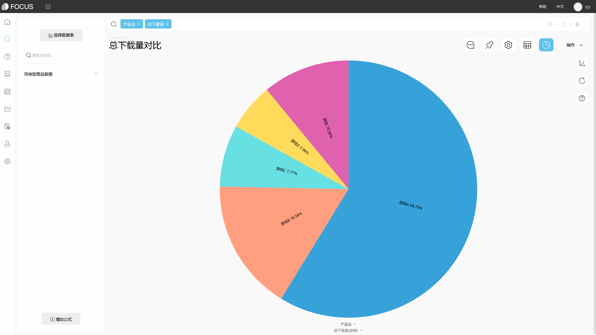
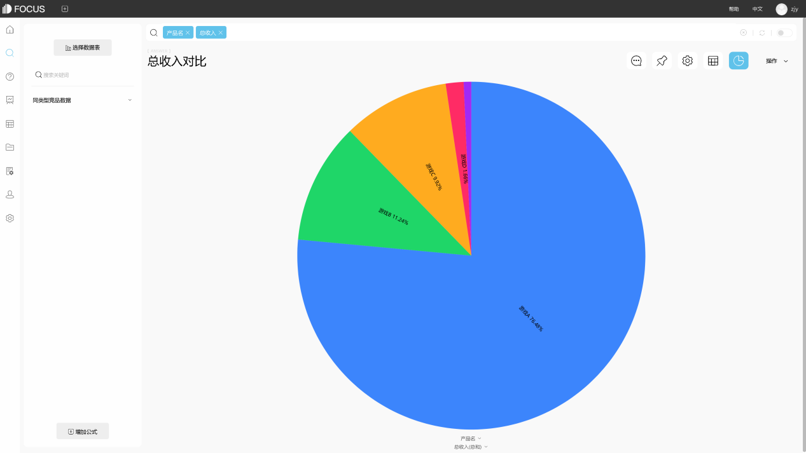
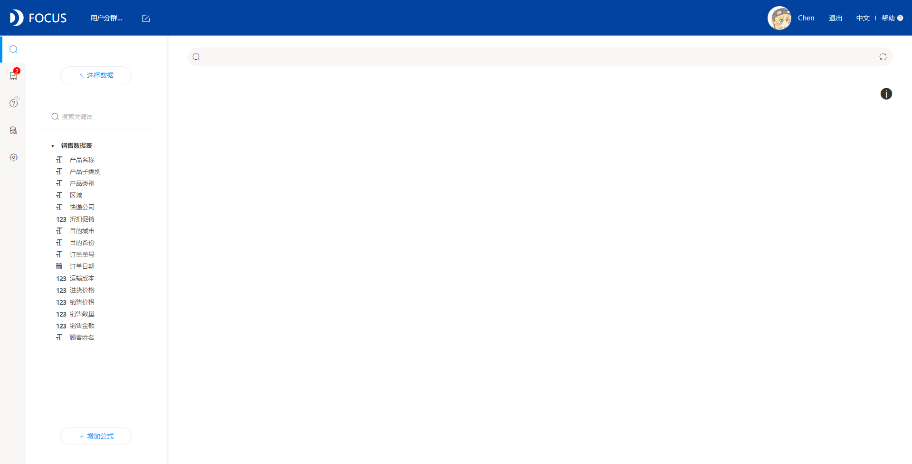
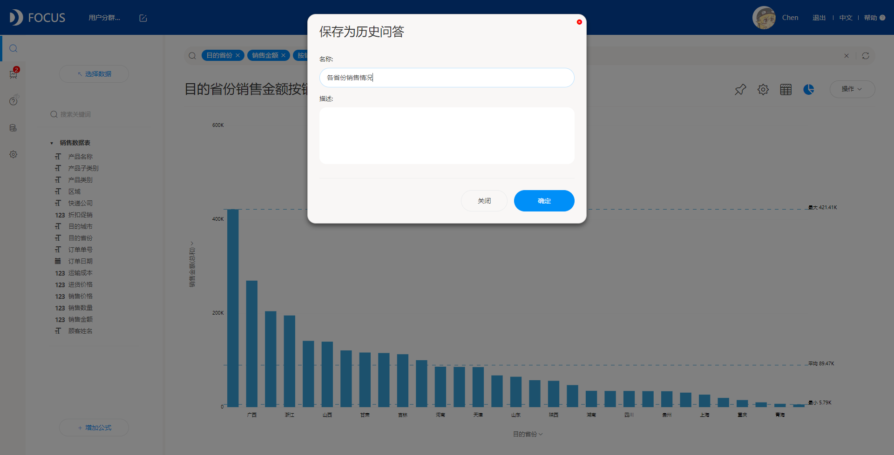

**目的：**通过对股票数据进行可视化，观察股票市场走势，让一般投资者能更简单地去了解此刻股票的情况。

**摘要：**随着我国经济的发展，经济体制改革以及金融体制改革的深入，证券投资已经成为国民经济运作的一个不可缺少的部分，在资本市场中逐渐形成与银行、保险三足鼎立之势。通过此次数据分析，可以发现在选定的三支股票收盘价中，最高的是亚马逊；大约从2015年2月4日起，亚马逊的股票价格打破原本的僵局，开始迅速攀升；亚马逊的股票成交量没有太大程度的波动；唯有的两次波动发生在两次交易价变动最大的时候；股票价格波动对股票的成交量有着非常巨大的影响，两者存在明显的强相关关系；利用移动平均，将股票收盘价进行移动平均后，发现股价的上升幅度明显小于原本的收盘价；指数异同移动平均也可以观察到，亚马逊的股价上升的部分大于下跌。

**关键词：**金融,股票,收盘价,成交量

一、案例背景

股市是市场经济的必然产物，在一个国家的金融领域之中有着举足轻重的地位，并且对人们的经济生活有着越来越深刻的影响。随着证券市场的逐步规范，人们的投资理念在不断提高，在资本市场中逐渐形成与银行、保险三足鼎立之势。而且，它在筹集资金时，速度最快，能力最强，成本最低，最符合市场经济的规律。因此它的发展速度也是最快的。但是，股市的暴跌暴涨会对金融市场产生很大的震荡，将会直接影响到金融市场的稳定和经济的健康发展。

此次案例分析的数据包含了标准普尔500指数中找到的所有公司的历史股票价格，时间跨度为5年，从2013年2月8日至2018年2月7日，包括股票的开盘价、收盘价、最高价、最低价、成交量，此次案例主要分析的是AMZN（亚马逊）公司的股票情况，利用股票技术指标对股票收盘价等数据进行可视化，观察市场走势。

二、案例问题

股票市场作为一种影响因素众多、各种不确定性共同作用的复杂巨系统，其价格波动往往表现出较强的非线性的特征。另外，股市需处理的信息量往往十分庞大，对算法有较高的要求，用EXCEL来进行操作会略显麻烦且不尽如人意，使用Datafocus产品就可以快速处理大量数据，分析的准确性也高。

三、案例分析

（一）综合分析

1.对比股票收盘价

首先从标准普尔500指数中找到的所有公司中任意选取三支股票。在这里，我选择了“AAPL（苹果）”、“AMGN（安进）”和“AMZN（亚马逊）”作为对比。

图1 三支股票收盘价对比情况

从图中可以观察到，亚马逊的股票收盘价最高，其次是安进，最低的是苹果，且可以发现AMZN（亚马逊）的股票收盘价明显高于其他两家公司，但其波动程度也明显大于其他两家公司。

（二）AMZN股票分析

1.收盘价变动

从图1中可以观察到，股价最高且波动最大的是AMZN（亚马逊），因此接下来就针对亚马逊的股票价格进行分析。

首先将亚马逊的股票价格单独拎出来，观察收盘价的走势及波动情况。

图2 AMZN的收盘价变动情况

从上图可以明显的看出，大约从2015年2月4日起，亚马逊的股票价格打破原本的僵局，开始迅速攀升，但中途也出现了明显的下跌情况。

2.股票每日交易

利用股票的收盘价减去股市的开盘价，观察亚马逊股票的每日交易价格变动以及每日的交易量情况。

图3 AMZN的每日股票交易变动

从上图可以观察到，亚马逊的股票成交量没有太大程度的波动。唯二的两次波动发生在两次交易价变动最大的时候，一次是股价下跌最严重的时候，另一次则是在股价上涨最大的时候。

3.股票涨幅

接着对亚马逊股价的涨跌幅进行计算。

图4 AMZN股票的涨跌幅

观察图4，可以发现亚马逊的股价涨跌幅的平均值是0.13%，大致在0上下浮动。

4.股票价格波动

对股票价格的波动进行计算，观察价格对成交量的影响。

图5 每日股票价格波动情况

从上图可以发现，股票价格波动对股票的成交量有着非常巨大的影响，两者存在明显的强相关关系。

5.MA-移动平均

移动平均就是固定窗口然后滑动窗口计算多日收盘价的平均值。通过计算移动平均可以更加准确的观察股票的收盘价格。

图6 AMZN每周收盘价的移动平均

从图中可以直接看到，对比图2可以观察到，将股票收盘价进行移动平均后，股价的上升幅度明显小于原本的收盘价。

6.MACD-指数异同移动平均

MACD 是一种常见的股价技术分析工具，由一组曲线与图形组成，通过收盘价快变及慢变的指数移动平均值之间的差计算出来。

指数异同移动平均是由双移动平均线发展而来，由快的移动平均线减去满的移动平均线，意义与双移动平均线基本相同，但阅读起来更方便。

图7 指数异同移动平均线

观察上图，红色柱体代表MACD大于0的部分，绿色柱体代表小于0的部分。从图中可以看出，亚马逊的股价红色部分占大多数，代表亚马逊的股价上升的部分大于下跌。

（三）数据看板

最后将这7个结果图导入“股票数据可视化”数据看板中，为了使数据看板更为美观，在全局样式中选择第三个预设样本，选择“自由布局”。操作结果如下：

图8 数据看板

四、结论

综上所述，在此次案例的对比中，股票收盘价最高的是亚马逊，其次是安进，最低的是苹果，且AMZN（亚马逊）的股票收盘价明显高于其他两家公司，但其波动程度也明显大于其他两家公司。

大约从2015年2月4日起，亚马逊的股票价格打破原本的僵局，开始迅速攀升，但中途也出现了明显的下跌情况；亚马逊的股票成交量没有太大程度的波动。唯二的两次波动发生在两次交易价变动最大的时候，一次是股价下跌最严重的时候，另一次则是在股价上涨最大的时候；亚马逊的股价涨跌幅的平均值是0.13%，大致在0上下浮动；股票价格波动对股票的成交量有着非常巨大的影响，两者存在明显的强相关关系。

利用移动平均，将股票收盘价进行移动平均后，发现股价的上升幅度明显小于原本的收盘价；指数异同移动平均也可以观察到，亚马逊的股价上升的部分大于下跌。

五、对策建议

1、根据分析的情况进行归纳，观察股票市场走势，让一般投资者能更简单地去了解此刻股票的情况。

2、股市有风险，入市需谨慎。
