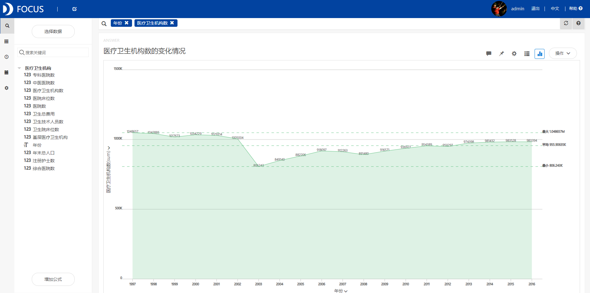

**目的：**通过计算医疗机构常用的统计指标，希望能让更多人对现如今医疗机构现状多一些认识。

**摘要：**2016年是“十三五”的开局之年，也是实现深化医药卫生体制改革阶段性目标的攻坚之年。利用此次数据分析，将现阶段的医疗卫生现状具象化，能使得更多人关注医疗卫生这一行业。自2003年，医疗机构数量开始逐渐上升，到2016年已有98.3394万家，同时上升的还有每千人口的卫生技术人员数和每千人口注册护士；但同样飞速上涨的还有人均医疗卫生费用，从1997到2016年上涨将近13倍；在各类卫生机构中，病床使用率最高的是街道卫生院，其次是其他医疗机构；平均开放病床数最高的是医院，其次是综合医院，二者的病床开放数远远大于剩余的卫生机构，而病床使用率最高的街道卫生院却拥有着最低的病床数；病床工作日的情况与病床使用率类似，但病床工作日最高的却是其他医疗机构。

**关键词：**医疗,卫生机构,病床使用率

一、案例背景

2016年是“十三五”的开局之年，也是实现深化医药卫生体制改革阶段性目标的攻坚之年。各级卫生计生部门贯彻落实党中央、国务院决策部署，实施健康中国建设，深化医药卫生体制改革扎实推进，医疗卫生服务质量进一步提升，公共卫生、疾病防控、生育服务管理、中医药等工作得到加强，综合监督水平不断提升，各项工作取得了新成效。

医疗健康行业是个大而全的行业，产业链长、覆盖面广、关系民生大计，按互联网术语来讲，医疗行业“痛点颇多”：医疗资源分配不均、医疗服务质量低、医患关系紧张、医药及治疗价格高、医生资源稀缺、各种看病治病难等等，反正问题一大堆。

此次案例分析的主要数据是1997-2016年20年间医疗卫生机构数量的变化和人均费用的变化以及不同类型的医疗卫生机构的病床使用情况等，希望能让更多人对现如今医疗机构现状多一些认识。

二、案例问题

本文是着重利用公式计算医疗机构的主要统计指标，但由于数据的类型众多，用EXCEL来进行操作会略显麻烦，使用Datafocus产品就可以快速处理大量数据，分析的准确性也高。

三、案例分析

（一）综合分析

1.医疗卫生机构数

首先利用折线图统计从1997年到2016年医疗卫生机构数的变化情况。利用折线图可以直接对比这20年时间内每年医疗卫生机构数量的增减情况。

图1 医疗卫生机构数的变化情况

从图中可以观察到，医疗卫生机构的数量在2003年出现了一个明显的低谷。2003年之前，医疗卫生机构数都在100万家以上，且略呈下降的趋势；2003年之后，医疗卫生机构数则开始缓慢上升。

2.卫生技术人员数

接下来将通过计算一些医疗机构的主要统计指标来对医疗卫生机构的现状做进一步的认识。首先是观察卫生技术人员数量的变化。

图2 每千人口卫生技术人员变化

从散点图上可以明显地观察到，2005年可以算是一个转折点，在2005年以前，每千人口的卫生技术人员数基本保持在3.4左右上下浮动，但是2005年以后，每千人口的卫生技术人员数开始平稳上升。

3.注册护士数

同样的，利用公式计算每千人口注册护士变化。

图3 每千人口注册护士变化

和图2的上升趋势类似，每千人口注册护士也以2005年为转折点，2005年以前，每千人口注册护士多半在1以下；但在2005年以后，每千人口注册护士数明显上升，到2016年为止，每千人口的注册护士数量已经达到了2.54左右。

4.卫生费用

通过对这20年的人均医疗卫生费用的计算，观察20年间医疗卫生费用的变化现状。

图4 人均卫生费用变化

从图中可以观察到，从1997到2016年，这20年间的人均医疗卫生费用在逐年上涨，且上涨速度飞快。从1997年的0.0258579亿元每万人上涨到2016年的0.335174亿元每万人，上涨将近13倍。

（二）分类型比较医疗机构

1.医院数变化

医疗机构中的医院包括综合医院、中医医院、中西医结合医院、民族医院、各类专科医院和护理院。在这里，选取了其中三类医院，分别是综合医院、中医医院和专科医院的数量进行画图研究。

图5 三种类型医院数的变化情况

从图中可以看到，与其他两类医院相比，综合医院的数量远远高于其他类型的医院，且从2010年开始不断上升；还有一类上升飞快的是专科医院，而中医医院数量则无显著上升。 2.病床使用率

对不同类型的卫生机构的病床使用率进行计算，对比不同卫生机构之间病床使用的频繁程度。

图6 各类卫生机构的病床使用率

通过计算可以发现，各类卫生机构中，病床使用率最高的是街道卫生院，其次是其他医疗机构。在这17类医疗卫生机构中，病床使用率比医院高的共有3类，分别是街道卫生院、其他医疗机构和综合医院。

4.平均开放病床数

计算这17类医疗卫生机构的平均开放病床数。

c

图7 各类卫生机构平均开放病床数

从图中可以看出，17类医疗卫生机构的平均开放病床数最高的是医院，其次是综合医院，其病床开放数远远大于剩余的卫生机构。从图中也可以看出，病床使用率最高的街道卫生院却拥有着最低的病床数。

5.病床工作日

计算这17类医疗卫生机构的病床工作日，病床工作日就是指实际占用总床日数除以平均开放总床数。

图8 各类卫生机构的病床工作日

从图中可以看出，病床工作日的情况与病床使用率类似，同样是街道卫生院、其他医疗机构和综合医院的病床工作日高于医院的病床工作日。但病床工作日最高的却是其他医疗机构。

（三）数据看板

最后将这8个结果图导入“医疗卫生机构现状”数据看板中，为了使数据看板更为美观，在全局样式中选择第三个预设样本，选择“网格布局”。操作结果如下：

图9 数据看板

四、结论

综上所述，医疗卫生机构的数量在2003年出现了一个明显的低谷。自2003年，医疗机构数量开始逐渐上升，到2016年已有98.3394万家，同时上升的还有每千人口的卫生技术人员数和每千人口注册护士；1997到2016年，人均医疗卫生费用上涨将近13倍。

与其他两类医院相比，综合医院的数量远远高于其他类型的医院，且从2010年开始不断上升；还有一类上升飞快的是专科医院，而中医医院数量则无明显上升。

通过计算可以发现，各类卫生机构中，病床使用率最高的是街道卫生院，其次是其他医疗机构；平均开放病床数最高的是医院，其次是综合医院，二者的病床开放数远远大于剩余的卫生机构，而病床使用率最高的街道卫生院却拥有着最低的病床数；病床工作日的情况与病床使用率类似，但病床工作日最高的却是其他医疗机构。

五、对策建议

1、人们应当对医疗卫生的现状具有一定的了解。

2、人均医疗卫生费用上涨明显，希望国家能采取一定的措施尽力阻止“就医难”问题的出现，出现后也应及时解决。

3、希望能提高各医疗卫生机构的病床利用率，适当增减各卫生机构的病床数。
