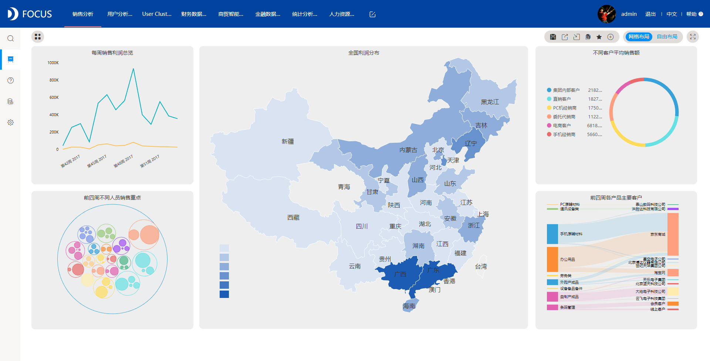
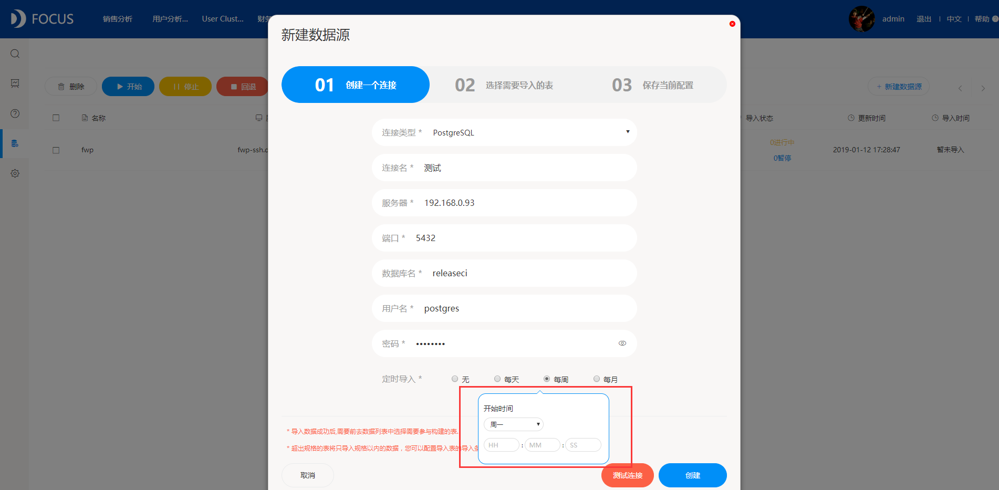
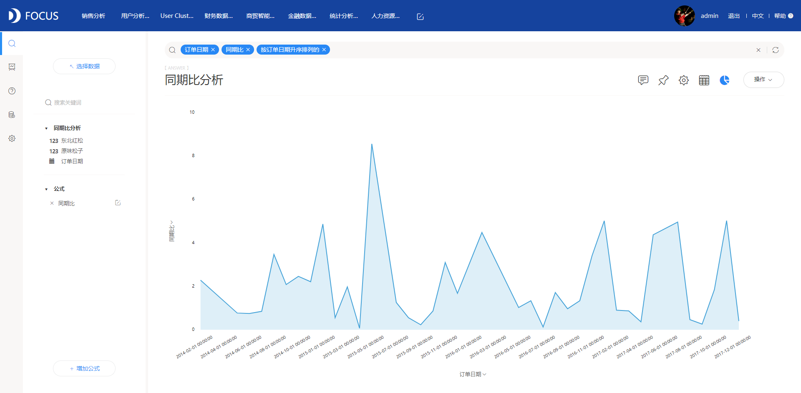
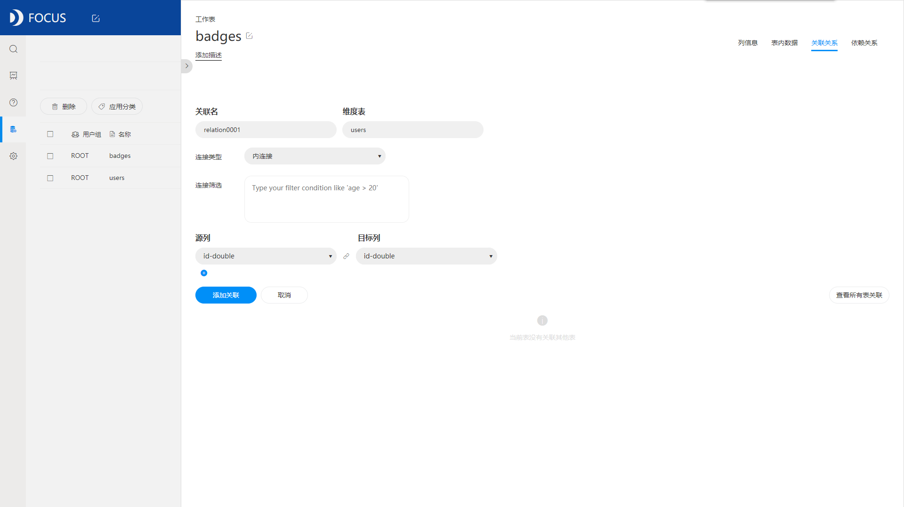
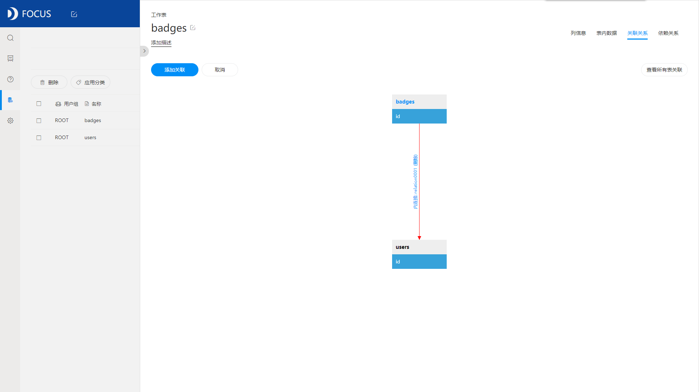

**目的：**通过对银行订购定期存款的客户的类型进行分析，分辨哪一类客户较容易订购银行的定期存款。

**摘要：**近年来，我国各家商业银行在各项银行业务，尤其是在争取存款、抢占优质客户等方面都展开了激烈的竞争。营销是深挖产品的内涵，切合准消费者的需求，从而让消费者深刻了解该产品进而购买的过程。通过此次电话营销案例，可以观察到银行的电话营销成功率并不高仅有11.27%的客户选择订购银行的定期存款。而在选择订购定期存款的客户中，以25-35岁为主；除去未知的客户，在订购了银行定期存款的客户中，是存在住房贷款的客户占据较大比例；但银行客户不存在个人贷款的客户人数明显高于存在个人贷款的客户；客户除去信用未知的情况，所有的客户的信用情况都是没有违约记录的；学历较高的已婚管理工作者有较大的概率订购银行的定期存款。

**关键词：**银行,电话营销,定期存款

一、案例背景

此次案例基于某银行的一次电话营销案例，数据记录了在此次案例中银行联系的每位客户的部分基本情况，信用违约情况，个人贷款和住房贷款的情况，联系的次数和时间长短，希望通过对银行订购定期存款的客户的类型进行分析，分辨哪一类客户较容易订购银行的定期存款。

二、案例问题

近年来，我国各家商业银行在各项银行业务，尤其是在争取存款、抢占优质客户等方面都展开了激烈的竞争。本文将着重分析哪一类客户较容易订购银行的定期存款。但由于银行营销数据的数据量大，信息繁琐，用EXCEL来进行操作会略显麻烦，使用Datafocus产品就可以快速处理大量数据，分析的准确性也高。

三、案例分析

1.定期存款的订购

首先添加公式，统计银行所有客户中选择订购定期存款的比例。

图1 银行定期存款的订购情况

从图中可以观察到，在此次电话营销案例所涉及的所有客户中，仅有11.27%的客户选择订购银行的定期存款，剩余的88.73%则选择不订购定期存款。由此可见，此次银行的电话营销案例的成功率并不高。

2.年龄分布情况

将所有客户按订购和未订购定期存款分成两类，将这两类客户按照年龄进行分层，观察各层的人数分布。

图2 定期存款的订购与年龄分布的关系

从上图可以明显的看出，在选择不订购定期存款的客户中，以30-40岁左右为主，而在选择订购定期存款的客户中，则以25-35岁为主。可见，银行的客户分布最主要的年龄层大约在30-35岁左右。

3.客户住房贷款情况

筛选订购定期存款的客户，观察这一类客户的住房贷款情况。

图3 订购定期存款的客户中住房贷款的情况

从上图可以观察到，除去未知的客户，在订购了银行定期存款的客户中，有大约2500名客户存在住房贷款，2000名左右不存在住房贷款，仍是存在住房贷款的客户占据较大比例。

4.客户个人贷款情况

同样地，筛选订购定期存款的客户，观察这一类客户的个人贷款情况。

图4 订购定期存款的客户中个人贷款的情况

与图3的住房贷款进行比较，可以发现，客户的个人贷款情况与住房贷款存在较大的差异，不存在个人贷款的客户人数明显高于存在个人贷款的客户。

5\. 客户信用违约情况

接着再统计订购定期存款的客户的信用违约情况，观察客户的信用情况。

图5 订购定期存款的客户中信用违约的情况

从仪表盘中可以看到，除去客户信用未知的情况，所有的客户的信用情况都是没有违约记录的。

6.客户工作类型

最后对客户的基本情况进行分类，首先分析客户工作类型。

图6 订购定期存款的客户的工作类型

从图中可以直接看到，工作类型为管理方面的客户有最大的概率订购银行的定期存款。管理者较其他工作者有更多的收入，也会更加愿意把多余的钱存入银行。

7.客户婚姻状况

对管理工作者的婚姻状况进行简单的统计。

图7 订购定期存款的客户的婚姻状况

从图中可以看出，在管理工作者中，单身或是结婚的客户有较大的可能存在剩余的钱，会订购银行定期存款。

8.客户教育状况

最后对已婚的管理工作者的教育状况进行分析。

图8 订购定期存款的客户的教育状况

从图中可以看出，明显学历越高的人越有可能获得较高的工资，也就越有可能选择订购银行的定期存款。

（三）数据看板

最后将这8个结果图导入“银行电话营销”数据看板中，为了使数据看板更为美观，在全局样式中选择第三个预设样本，选择“网格布局”。操作结果如下：

图9 数据看板

四、结论

综上所述，在此次电话营销案例所涉及的所有客户中，仅有11.27%的客户选择订购银行的定期存款，剩余的88.73%则选择不订购定期存款。由此可见，此次银行电话营销案例的成功率并不高。

在选择不订购定期存款的客户中，以30-40岁左右为主，而在选择订购定期存款的客户中，则以25-35岁为主。可见，银行的客户分布最主要的年龄层大约在30-35岁左右。

除去未知的客户，在订购了银行定期存款的客户中，有大约2500名客户存在住房贷款，2000名左右不存在住房贷款，仍是存在住房贷款的客户占据较大比例；与住房贷款进行比较，客户的个人贷款情况与住房贷款存在较大的差异，不存在个人贷款的客户人数明显高于存在个人贷款的客户。

客户除去信用未知的情况，所有的客户的信用情况都是没有违约记录的。

工作类型为管理方面的客户有最大的概率订购银行的定期存款。管理者较其他工作者有更多的收入，也会更加愿意把多余的钱存入银行。而在管理工作者中，单身或是结婚的客户有较大的可能存在剩余的钱，会订购银行定期存款。明显学历更高的人越有可能获得较高的工资，也就越有可能选择订购银行的定期存款。

五、对策建议

1、银行在进行电话营销的时候，可以对客户进行分类总结归纳，以提高电话营销的成功率，减少工作量。

2、银行对越有可能订购产品的客户越要有良好的服务态度和耐心的解答。

3、此次案例的银行可以着重选择大学毕业的从事管理方面工作的，大约30-35岁左右的已婚客户进行电话营销，会有较高的成功率。
