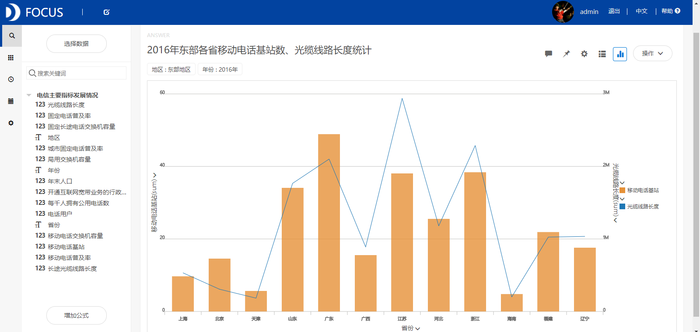
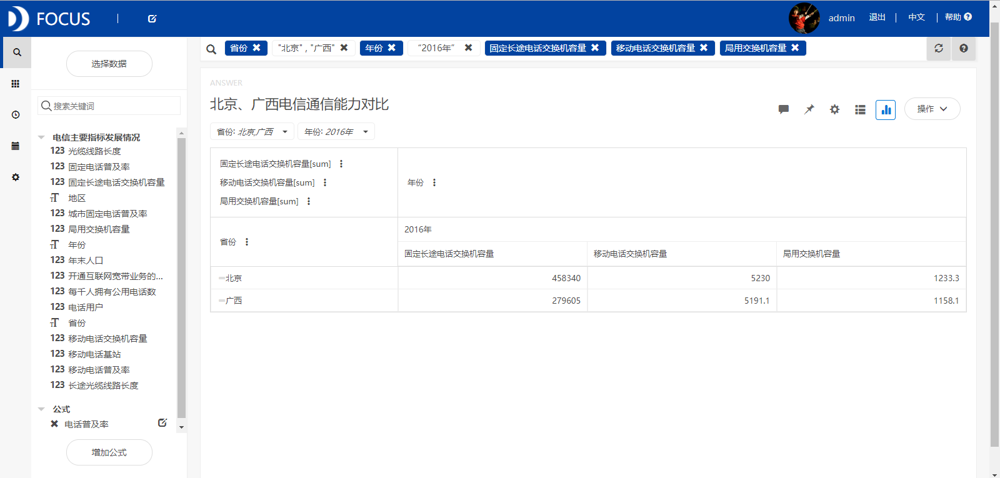
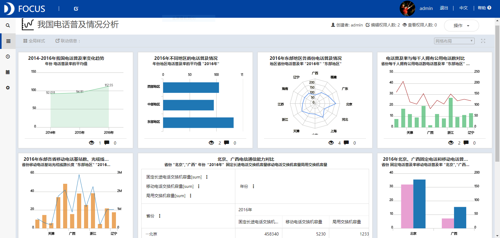

**目的：**分析2014-2016年间我国各地区的电话普及情况，以及研究电话普及率与每千人拥有公用电话数、移动电话基站数、光缆线路长度等指标之间的关系。

**摘要：**电话普及率是每一百个居民拥有的电话机数量。它是衡量一个国家或地区电信通信水平的重要尺度。本文通过分析我国电话普及情况得出了以下结论：我国电话普及率在逐年提升。东部地区的电话普及率最高，而中部地区的电话普及率最低。电话普及率较高的省份，每千人拥有公用电话数量也相应地较高。浙江省每千人拥有公用电话数最多。北京的固定长途电话交换机容量显著地大于广西，移动电话交换机容量和和民用电话交换机容量与广西省差不多。

**关键词：**Datafocus,电信通信,电话普及率

**一、案例背景**

我国的电话通信经过了漫长的发展过程。进入改革开放年代，电信事业有了快速的发展。随着信息技术兴起和传输技术、交换技术和数字技术的发展，现代通信系统已由单一的传递电话通信业务向传递多种非话音业务信号发展，使通信更为方便、可靠、灵活和经济。

**二、案例问题**

电话普及率是每一百个居民拥有的电话机数量。它是衡量一个国家或地区电信通信水平的重要尺度，也是反映这个国家或地区科技文化水准及文明程度的重要标志。发展通信事业，提高电话普及率，是社会发展的需要。本文主要分析2014-2016年间我国各地区的电话普及情况。

**三、案例分析**

将分析的“电信主要指标发展情况”CSV文件导入到Focus系统中。

**（一）电话普及情况**

**1.2014-2016年我国电话普及率变化趋势**

从图1中我们可以看出我国电话普及率在逐年提升，并且2016年电话普及率为112.55，说明平均每100人拥有112.55部电话。

图1 2014-2016年我国电话普及率变化趋势

**2.2016年不同地区的电话普及情况**

从图2中我们看到我国东部地区的电话普及率最高，为132.19，其次是西部地区，而中部地区的电话普及率最低。这表明东部地区的电信通信水平最高，中部地区的电信通信水平最低。 

图2 2016年不同地区的电话普及情况

**（二）东部地区电话普及情况分析**

**1.2016年东部地区各省份电话普及情况**

从图3中可以看到东部地区各省的电话普及率除广西省之外全部大于100，说明这些省的电信通信水平都较高。北京市的电话普及率最高，广西省的电话普及率最低。 

图3 2016年东部地区各省份电话普及情况

**2.电话普及率与每千人拥有公用电话数对比**

从图4中可以看到，电话普及率较高的省份，每千人拥有公用电话数量也相应地较高，表明电话普及率与每千人拥有公用电话数的相关性较强。浙江省每千人拥有公用电话数最多，达到25部以上。****

图4 电话普及率与每千人拥有公用电话数对比

**3.2016年东部各省移动电话基站数、光缆线路长度统计**

移动电话基站数和光缆线路长度最高的四个省分别为广东、浙江、江苏和山东，而最低的四个地区为北京、上海、天津和海南。表明电话普及率与移动电话基站数、光缆线路长度之间没有直接的大小关系。

图5 2016年东部各省移动电话基站数、光缆线路长度统计

**4.北京、广西电信通信能力对比**

电信通信能力是指电信通信部门满足社会对通信需求的能力。由掌握通信技术的劳动者和通信设备的合理配置构成。主要指标有：固定长途电话交换机总容量、移动电话交换机容量、局用交换机容量等。从图6中可以得到，北京的固定长途电话交换机容量显著地大于广西，表明北京电信通信能力要高于广西，并且电话普及率与固定长途电话交换机容量之间有着较强的正向关系。  图6 北京、广西电信通信能力对比

**5.2016年北京、广西固定电话和移动电话普及情况**

从图7中我们可以发现北京的固定电话普及率和移动电话普及率都显著地高于广西省，广西省的固定电话普及率比移动电话普及率低很多。

****

图7 2016年北京、广西固定电话和移动电话普及情况

**（三）数据看板**

最后将这7个结果图导入“我国电话普及情况分析”数据看板中，操作结果如下： 

图8 数据看板

**四、结论**

我国电话普及率在逐年提升。东部地区的电话普及率最高，而中部地区的电话普及率最低。东部地区北京市的电话普及率最高，广西省的电话普及率最低。电话普及率较高的省份，每千人拥有公用电话数量也相应地较高。浙江省每千人拥有公用电话数最多。北京的固定长途电话交换机容量显著地大于广西，移动电话交换机容量和和民用电话交换机容量与广西省差不多，表明电话普及率与固定长途电话交换机容量之间有着较强的正向关系。

**五、对策建议**

电话普及率与每千人拥有公用电话数、固定长途电话交换机容量的相关性较强。广西省应该通过增加每千人拥有公用电话数量和固定长途电话交换机容量来提高该省的电话普及率，又由于其固定电话普及率比移动电话普及率低很多，因此该省要重点提高固定电话普及率。移动电话基站数和光缆线路长度最小的是海南省，因此该省应该着力增加移动电话基站数和光缆线路的长度。
