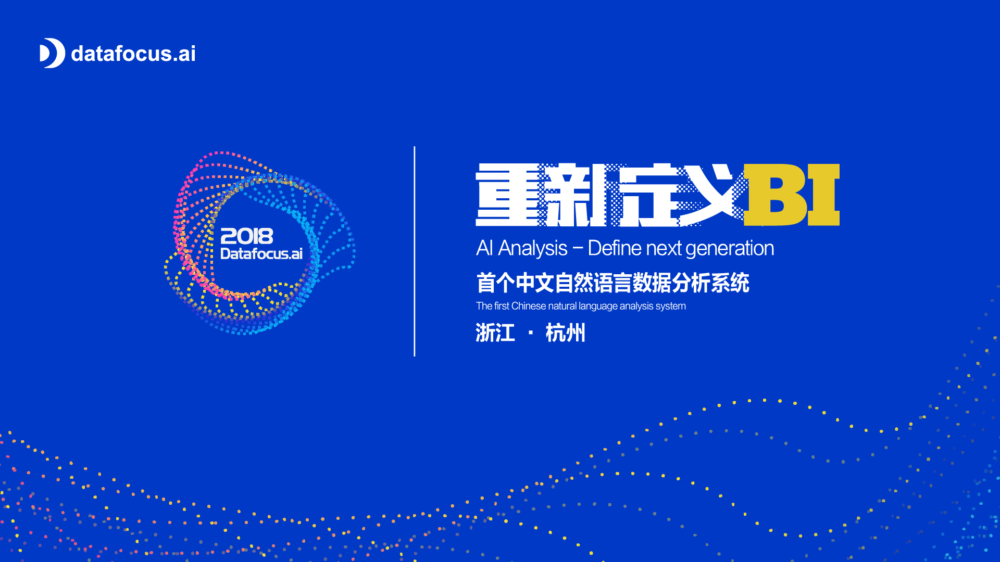
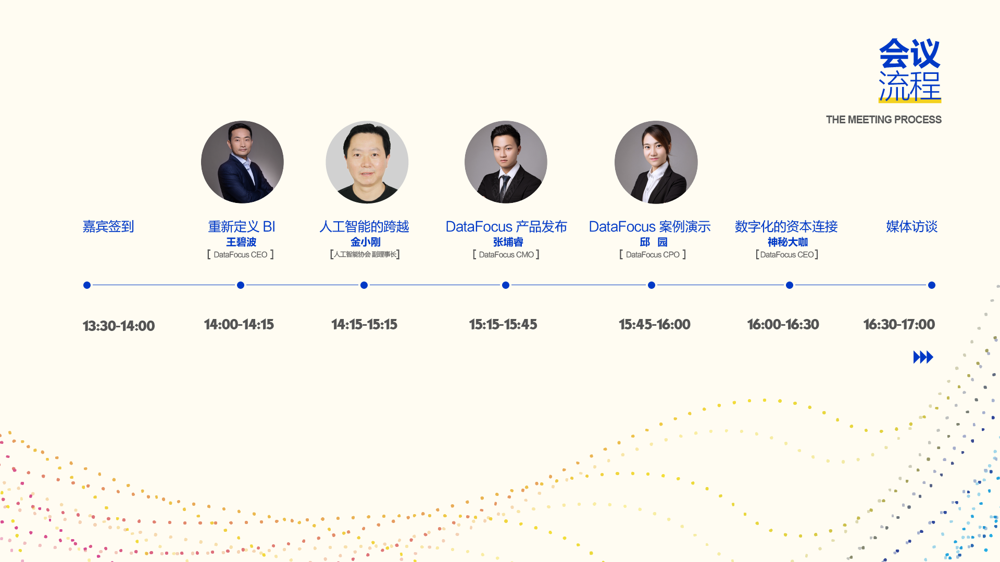
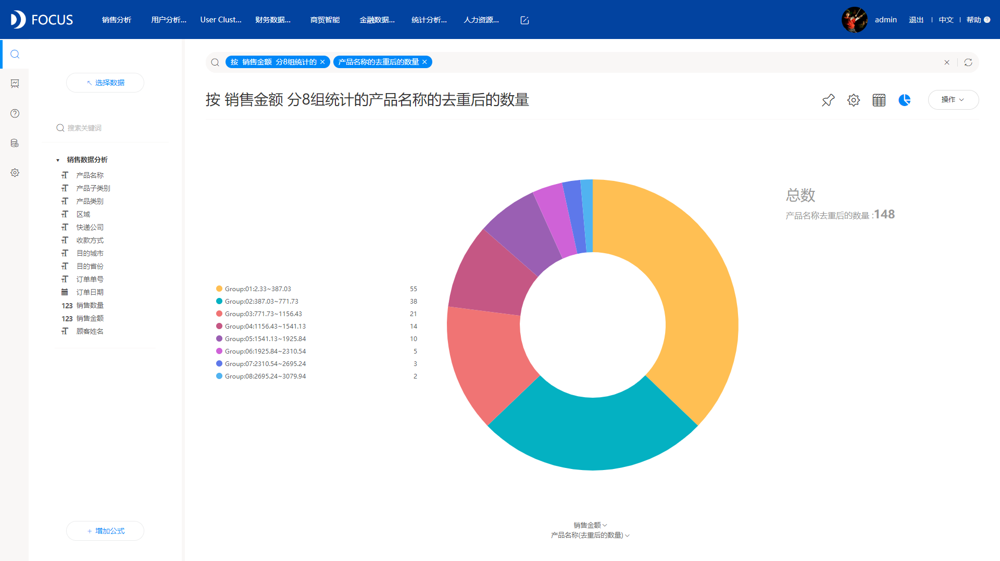

重新定义BI丨2018年度Datafocus新品发布会盛大开启

BI这个词在我们视野中已存在许久，它能快速整合企业的现有数据并提供分析报表，为商业决策提供了强有力的支持。在人工智能的赋能下，BI一直在交互和应用方面的创新路上奔跑。**但是****在这个BI本身不再是风口，BI的交互模式和产出效率才是关键的时代背景下****你会发现:**

 

**1、海量数据难题。**对于运行多年的企业系统，数据量以几何倍数增长，普通BI系统再难承受。

**2、成本过高难题。**大量时间金钱用于数据从搜集到分析的流程以及专业数据分析师的聘请。

**3、实时交互难题。**永远有新增的报表需求，永远有新增的企业数据，IT部门永远在不停的更新部署，决策者永远需要等待。

**4、数据孤岛难题。**数据耦合度高，多系统并行回归困难，关联性差导致隐性风险增加，政策传递孤岛化。

**此外，目前的国内BI产品，一直徘徊在标准化以及定制化之间，解决好标准化产品和个性化需求的悖论成为大数据分析领域产品的第一要义。****那么，我们会不会有所期待，期待有一种黑科技，既能保证标准化产品给企业带来的高效、便捷、易用，也能应对企业复杂多变的实时个性化分析需求？比如当有一天数据分析可以在搜索框搜索我们想要的命题即可得到分析结果，企业相关人员需要做的，只是打开已标准化的软件，搜索定制化的需求？**

**现在，大数据商业智能分析系统——Datafocus可以满足你的所有期待！**

**在人人都拥抱趋势，尝试变革的时代，基于国人自研算法的Datafocus系统经过数年的打磨，终将为企业在商业智能方面带来革命性的突破。在解决上述所有难题的同时，更是****全球首个中文自然语言数据分析系统！****与AI、NLP技术融会贯通，是属于中国自己的低门槛、部署快、成本低的新一代大数据分析系统。****数年伏案磨剑，终将重新定义BI，2018年度Datafocus产品发布会重磅袭来！****实打实的国人自研黑科技，百分百的商业智能新便利！****发布会流程抢先看：**

**时间：2018年8月3日14:30**

**地点：杭州滨江区阡陌路482号智慧e谷二楼会议室****欢迎您一同见证全球首个自然语言数据分析系统的发布！**

<figure>

<figcaption>

**（报名H5）**

</figcaption>

</figure>
