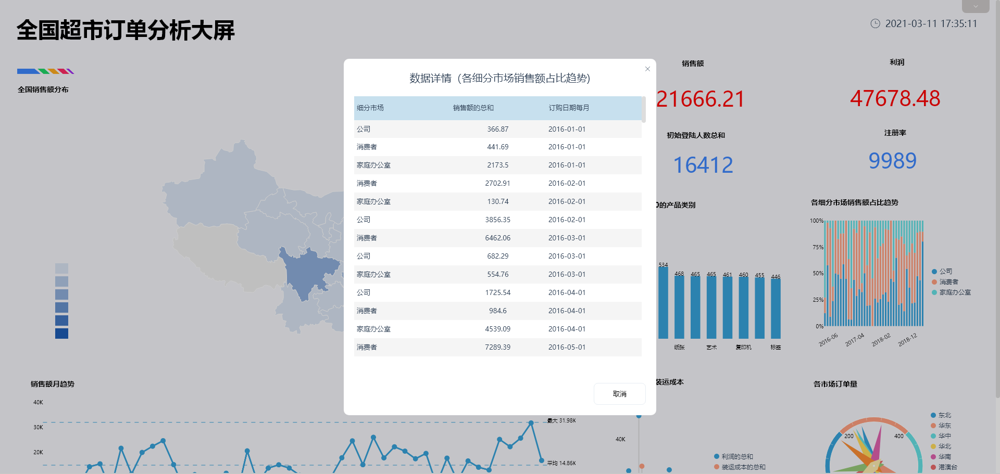

**目的：**对该公司的产品销售情况进行分析，发现销量较好、收益较高的产品类型，并且发现可能影响该类产品销售利润率的因素。

**摘要：**随着大数据的发展与进步，越来越多的企业意识到数据的能力，开始着手对数据进行一系列的分析。此次案例分析通过对产品的销售情况进行分析，希望能发现销量较好、收益较高的产品类型，并且找到可能影响该类产品销售利润率的因素，以此来提高公司的销售利润。

通过案例分析，可知该公司的咖啡类饮品的销售情况显著优于茶类饮品。浓缩咖啡的销售收入最高，库存最低，但咖啡的销售利润率要高于浓缩咖啡，成本费用利润率也基本高于浓缩咖啡。

**关键词：**零售业,咖啡销售,销售利润率,成本费用率

一、案例背景

对于传统的零售行业，大数据分析仍处于刚刚起步的阶段。但越来越多的企业已经认识到大数据的重要性，多数企业正在着手进行大数据探索以及相关项目的试点。

零售大数据通过打造智慧的购物体验，构建智慧的商品管理和供应链网络，实现智慧的运营，来帮助零售企业实现价值。大数据分析是零售业向未来转型升级的核心竞争力。

此次案例分析的数据为某公司在美国各州的产品销售数据，包括产品的成本、单价、毛利、净利润、销售收入、库存等，通过对产品的销售情况进行分析，发现销量较好、收益较高的产品类型，并且发现可能影响该类产品销售利润率的因素，据此来提高该产品的销售利润。

二、案例问题

传统零售行业的数据的大数据分析还处于起步阶段，商品的销售数据容易受到各种因素的影响。本文将着重讨论影响咖啡销售利润率的因素。但由于销售类的数据信息量巨大，数据随时间变化频繁，用EXCEL来进行操作会略显麻烦，使用Datafocus产品就可以快速处理大量数据，分析的准确性也高。

三、案例分析

（一）综合分析

1.销售收入与库存

对该公司产品的销售情况进行分析，先通过柱状图对比该公司四类产品的销售收入和库存情况，了解该公司卖的较好的一类产品。

图 1 某公司不同类型产品的销售收入与库存情况

从图中可以看到该公司主要经营的产品有四类，分别是咖啡、浓缩咖啡、花草茶和茶。从图中可以观察到浓缩咖啡的销售收入最高，库存最低，而明显茶的销售收入是最低的，库存量也较大。因此我们可以初步判定该公司咖啡类的饮品的销售情况优于茶类饮品。

2.销售利润率

从图1可知，该公司的咖啡类饮品的销售情况较好。因此接下来的分析主要围绕着该公司的咖啡类饮品展开。分别计算咖啡和浓缩咖啡的利润增长率，观察两者的差距。

图 2 分类顾客对应的消费金额

从上图可以明显的看出咖啡和浓缩咖啡的销售利润率的走势基本是一致的，但是明显咖啡的销售利润率一直高于浓缩咖啡。结合图1，可以发现，在四种饮品中，销售收入最高且库存最低的是浓缩咖啡。因此就这一疑惑，仔细分析了可能对咖啡类饮品的销售利润率存在影响的因素。

3.成本费用利润率

成本费用利润率就是企业一定期间的利润与成本的比率。成本费用利润率指标表明每付出一元成本费用可获得多少利润，体现了经营耗费所带来的经营成果。该项指标越高，利润就越大，反映企业的经济效益越好。

因此，通过计算咖啡和浓缩咖啡的成本费用增长率，观察两类产品的经济收益情况。

图 3 不同咖啡每月的成本费用利润率

从上图可以观察得到，咖啡的成本费用利润率与浓缩咖啡的成本费用利润率虽偶有交叉，但咖啡的成本费用利润率基本高于浓缩咖啡，也就意味着咖啡每付出一元成本费用可获得的利润高于浓缩咖啡，即咖啡所创造的经济收益高于浓缩咖啡。

（二）影响销售利润率的因素分析

1.不同州的影响

通过上述计算出的销售利润率和成本费用利润率，可以发现前三张图得出的结论有明显的矛盾。因此接下来主要对可能影响销售利润率的因素分解研究。首先观察这两类咖啡在美国不同州的销售情况。

图 4 不同州的咖啡销售利润率

从图中可以观察到，咖啡销售利润率最高的州是Massachusetts（马萨诸塞州），最低的是California（加利福尼亚），而浓缩咖啡销售利润率最高的州是Iowa（爱荷华州），最低的是New York（纽约）。因此，可以推断咖啡在经济发达的州的销售情况并不理想，浓缩咖啡在纽约甚至出现了最大的负利润，明显拉低了浓缩咖啡整体的销售利润率。

2.不同区域的影响

其次是产地不同的影响，这里的产地主要指咖啡在每个州的不同区域的销售情况。

图 5 不同产地的咖啡销售利润率

从图中可以观察到，咖啡在不同区域的销售利润率都为正数，特别是东部地区，咖啡销售利润率达到最高。但相反，浓缩咖啡在东部地区的销售利润率为负数。

3.不同品种的影响

其次是品种不同的影响，通过散点图观察这7种咖啡的销售利润率。

图 6 不同品种的咖啡销售利润率

从图中可以观察到，销售利润率最高的和最低的都属于浓缩咖啡，Decaf Espresso（脱咖啡因咖啡）的销售利润率最高，Caffe Mocha（摩卡）的销售利润率最低。

4.不同类型的影响

最后是类型不同的影响，通过条形图观察这4类咖啡的销售利润率。

图 7 不同类型的咖啡销售利润率

从图中可以看出，所有类型的产品中，销售利润率最高的是无咖啡因的浓缩咖啡，其次是常规的咖啡，接着是无咖啡因的咖啡，最低的是常规的浓缩咖啡。因此我们可以推断，浓缩咖啡的销售利润率可能会被常规的浓缩咖啡这一最低值大幅拉低。

（三）数据看板

最后将这7个结果图导入“某公司咖啡销售情况”数据看板中，为了使数据看板更为美观，在全局样式中选择第三个预设样本，选择“自由布局”。操作结果如下：

图 8 数据看板

四、结论

综上所述，该公司主要经营的产品有四类，分别是咖啡、浓缩咖啡、花草茶和茶。通过观察销售收入和情况，可以初步判定该公司咖啡类的饮品的销售情况优于茶类饮品。

通过计算销售利润率，可以发现咖啡的销售利润率要高于浓缩咖啡。咖啡的成本费用利润率也基本高于浓缩咖啡，即咖啡所创造的经济收益高于浓缩咖啡。这与上面所得的结论：浓缩咖啡的销售收入最高，库存最低，存在明显的矛盾。

通过分析发现，咖啡在经济发达的州的销售情况并不理想，浓缩咖啡在纽约甚至出现了最大的负利润，明显拉低了浓缩咖啡整体的销售利润率；咖啡在不同区域的销售利润率都为正数，特别是产地为东部地区的咖啡，但相反产地为东部地区的浓缩咖啡的销售利润率为负数；销售利润率最高的和最低的咖啡品种、咖啡类型都属于浓缩咖啡，因此可以推断，浓缩咖啡的销售利润率可能会被最低值大幅拉低。

五、对策建议

1、在确保咖啡销售稳定的情况下，可以对茶叶的销售进行进一步的推广和拓展。

2、较高的销售收入与较低的库存并不代表着销售利润率高，而一个产品只有销售利润率高才能为企业带来更多的利润。因此企业不能仅仅关注销售收入和库存情况，要更多的关注销售利润率等情况。

3、销售利润率容易被最低值大幅拉低，因此，要尽量减小最低的销售利润率对商品整体的影响。如减少浓缩咖啡在纽约的销售量，或者是降低东部地区的咖啡生产。
