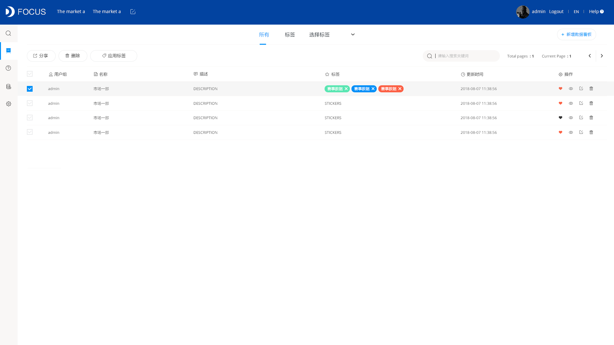
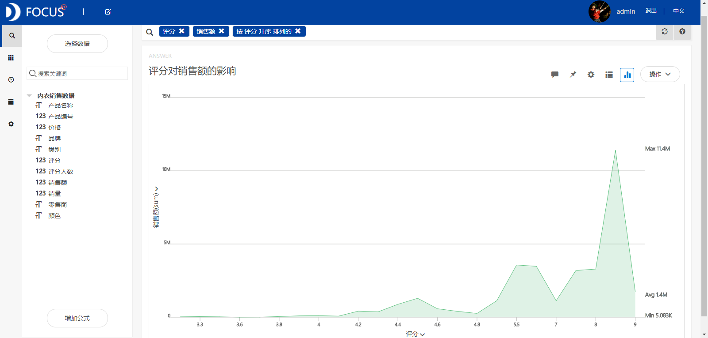
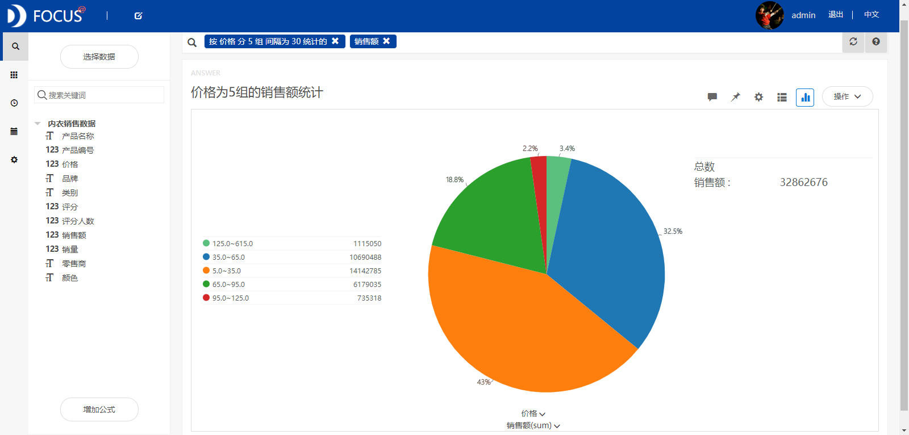
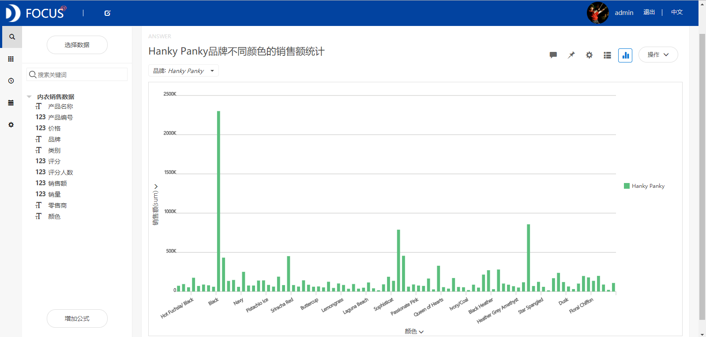
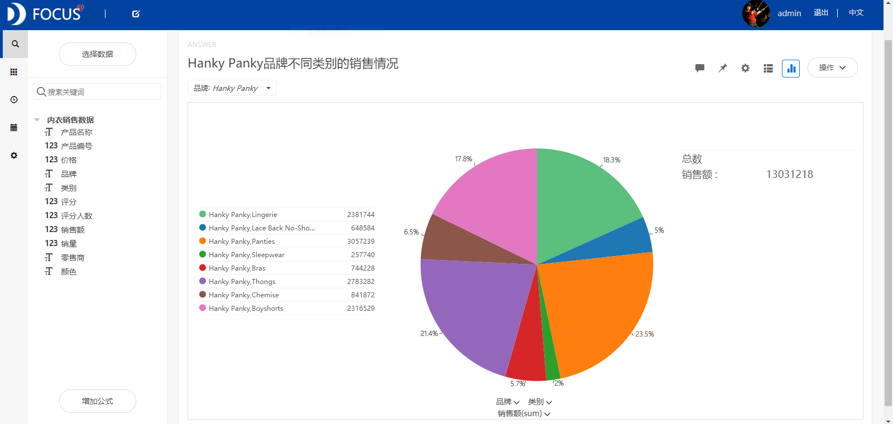

**目的：**根据不同内衣产品的销售数据，从产品的品牌、类别、颜色等方面来研究最受欢迎的内衣产品。

**摘要：**在美国，由于设计师品牌的兴盛、产品的不断研发、投入广告经费的增加及消费者需求的不断增加，内衣产业成为美国成衣市场中未曾中断增长的类别，正吸引着越来越多成衣界的焦点。本文通过分析美国某零售网站的内衣销售数据得出以下结论：最受消费者欢迎的内衣产品的品牌是Hanky Panky，消费者最愿意购买的定价区间为5.0-35.0美元之间，最喜欢的内衣颜色是黑色（其次是彩虹色和抹茶色），最常购买的内衣类别是Panties(女士短裤）。

**关键词：**Datafocus,内衣销售,销售额

**一、案例背景**

处于服饰行业一隅的内衣行业，多年来“库存失衡、利润低迷、客户流失、销售瓶颈”四大痛点一直困扰着这一古老而“全新”的行业。从私人小店、服装批发市场、百货商店、购物中心，到电商平台、移动购物，到了今天，这个行业正在全面迎来新零售的大时代。在美国，由于设计师品牌的兴盛、产品的不断研发、投入广告经费的增加及消费者需求的不断增加，内衣产业成为美国成衣市场中未曾中断增长的类别，正吸引着越来越多成衣界的焦点。

**二、案例问题**

本文所用到的原始数据来源于美国一个内衣零售网站。而作为一家内衣批发商，我们所关注的是“最受消费者欢迎的内衣产品是什么样的”，只有了解了消费者的需求，我们才能够选择合适的产品生产商和零售商进行合作，增加公司未来的销售收入。本文从产品的品牌、类别、颜色等角度出发，研究最受美国消费者欢迎的内衣产品。

**三、案例分析**

将分析的“内衣销售数据”CSV文件导入到Focus系统中。

**（一）内衣销售总体分析**

**1.不同零售商的产品销售情况**

统计分析不同零售商的销售情况，从条形图（见图1）中可以看出零售商为“Hanky Panky US”的销售额最大，说明该零售商的销售业绩最好。****

图1 不同零售商的销售额统计

**2.评分对销售额的影响分析**

为了分析消费者评分对销售额的影响，绘制评分与销售额的折线图。从图2中看出消费者的评分越低，产品的销售额也会比较低，这说明销售额在一定程度上会受到消费者评分的影响。

****

图2 评分对销售额的影响

**3.不同定价范围的销售情况**

将产品价格分为五组，统计每组的销售总额，分析定价区间的不同对销售额大小的影响，绘制出饼图如图3所示。从饼图中可以看出价格在5.0-35.0美元之间的销售额最大，其次是35.0-65.0美元，说明内衣产品的定价不能过高，最好可以将价格定在5.0-35.0美元之间。 

图3 价格分5组的销售额统计

**（二）定价在5.0-35.0美元之间的品牌情况**

筛选出5.0-35.0之间的内衣销售数据，利用面积图分析该区间内的品牌分布，以及统计各品牌的销售额。从图4中我们可以发现Hanky Panky这一品牌的销售额是最大的，说明该品牌的内衣产品最受欢迎。Hanky Panky之所以如此被消费者热爱，主要是由于其产品材质极其柔软妥帖，就像私房闺蜜，与女性用户亲密无间。 

图4 价格在5.0-35.0美元之间不同品牌产品的销售情况

**（三）Hanky Panky品牌的销售分析**

**1.不同颜色**

筛选出Hanky Panky品牌的内衣销售数据，研究消费者喜欢购买的内衣颜色。从柱状图（图5）中可以发现黑色内衣的销售额最高，其次是彩虹色和抹茶色。这表明消费者最喜欢的内衣颜色为黑色。 

图5 Hanky Panky品牌不同颜色的内衣销售情况

**2.不同类型**

基于Hanky Panky品牌的内衣数据，研究消费者最常购买的内衣类型。从饼图（图6）中可以发现销售额最大的内衣是Panties(女士短裤），其次是Thongs（丁字裤），说明这两类内衣是销售费者最常购买的。 

图6 Hanky Panky品牌不同类型的内衣销售情况

**（四）数据看板**

最后将这6个结果图导入“内衣销售案例分析”数据看板中，操作结果如下： 

图7 数据看板

**四、结论**

根据不同内衣产品的销售数据得出如下结论：

消费者的评分越低，产品的销售额也会比较低，说明销售额在一定程度上会受到消费者评分的影响。最受消费者欢迎的内衣产品的品牌是Hanky Panky，最愿意购买的定价区间为5.0-35.0美元之间，最喜欢的内衣颜色是黑色（其次是彩虹色和抹茶色），最常购买的内衣类别是Panties(女士短裤）。

**五、对策建议**

由于销售额会受到消费者评分的影响，所以我们要注重对消费者的售前售后服务，对消费者的任何问题或责难都给出友善的服务态度和积极的解决方案。作为一家内衣批发商，我们要尽力去争取与Hanky Panky品牌合作的机会，为其提供优质低成本（大概控制在30美元以下）的内衣产品。由于消费者最喜欢的内衣颜色是黑色，最常购买的内衣类别是Panties(女士短裤），因此我们要多从生产商那里购进颜色为黑色和类型为Panties的内衣。
