商业智能 (BI) 具有用于数据分析和业务信息管理的策略和技术，而人工智能 (AI) 可以显著提高准确性并减少错误。作为BI工具，Sisense和DataFocus Cloud都由AI驱动，可以帮助商业精英做决策。

DataFocus Cloud拥有完善详尽的系统，提供搜索式分析和丰富的可视化，来帮助商业精英实现数据的价值。

两个平台的页面设计、可视化、易用性等有很大不同。阅读更多内容以了解这两种工具之间的差异，并为您或您的公司选择更合适的一种。

# 简介

Sisense旨在将分析融入日常应用程序和工作流程，以帮助企业做出更好、更快的决策。Sisense采用易于使用且灵活的部署选项。

DataFocus Cloud (DFC)旨在让商业精英成为数据专家。搜索式分析让数据探索就像 Google搜索一样。DFC建立在云端，因此每个人都可以随时在任何设备上使用。

# 对比

以下的对比内容主要基于免费使用的版本。

## 界面

### 新手界面

在“数据”和“分析”模块中，如gif图 2-1 所示，Sisense 提供了快速导览以及视频、文档等一些其他选项。此外，Sisense在首次进入模块时提供了高亮的步骤，如图 2-2 所示。

GIF Figure 2-1 Novice guide 1 - Sisense

Figure 2-2 Novice guide 2 - Sisense

DataFocus Cloud在首页提供不同类型的视频，如制作图表、搜索关键词等，帮助初学者了解系统。

Figure 2-3 Novice guide - DFC

### 导航栏

Sisense的导航栏位于页面顶部，主要列出了“数据”、“分析”、“脉”3个模块。 “数据”模块展示ElastiCube和Live模型，“分析”模块是可视化模块，而“脉”模块显示重要的指标和事件。

Figure 2-4 Top navigation bar - Sisense

DFC有2个导航栏，分布在页面的顶部和左侧。左侧导航栏展示了10个模块，包括“首页”、“搜索”、“问答”等，详细解释可以看这里：[功能模块](https://wiki.datafocus.ai/index.php/%E4%BA%A7%E5%93%81%E6%89%8B%E5%86%8C_v5.0.2" \l ".E5.8A.9F.E8.83.BD.E6.A8.A1.E5.9D.97)。顶部导航栏展示固定的看板，用户可以随时快速查看这些看板，如下所示。

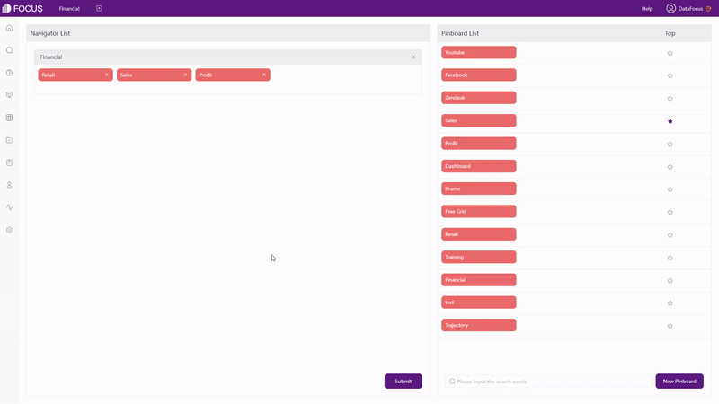

GIF Figure 2-5 Pin dashboard

### 分析界面

分析页面在这里指的是Sisense的具体可视化制作页面和DFC的搜索分析页面，对比大致可以分为三个部分。

Sisense的可视化制作页面主要由看板列表、画布和筛选窗格组成。如图2-6所示，看板列表展示了用户拥有的所有看板和样例看板，画布是可视化展现部分，筛选面板列出了所有已添加的筛选器。

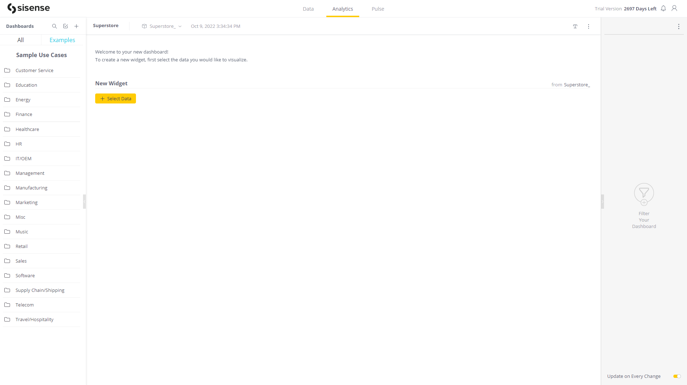

Figure 2-6 Analytics page - Sisense

DFC的搜索分析页面主要由列名、搜索栏和画布组成。列显示为属性和度量，搜索栏是分析中心，画布显示图表，如图 2-7 所示。

Figure 2-7 Analytics page - DFC

## 2.2 数据源

Sisense提供两种类型的数据连接。一种是ElastiCube，数据被导入Sisense，而且多个来源的数据可以被一起合并。另一个是Live，直接连接数据源，接近实时更新。 Sisense支持的完整数据源列表如下所示。

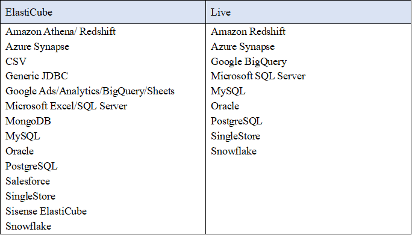

Table Figure 2-8 Data source - Sisense

DataFocus Cloud获取数据源的方式主要有3种。 **1、上传** 本地文件和数据仓库可以被导入系统，以适应数十亿数据等大数据分析。之后，用户可以在详细数据页面上覆盖或叠加新数据。 **2、连接** DFC可以连接数据库以实时更新资源。与Sisense类似，多个数据库可以被同时连接。更重要的是，用户可以直接同步进行连接分析（直接合并来自多个数据源的数据）。 **3、API** DFC还提供API接口来访问可靠的外部数据源。

DFC支持的完整数据源列表如下所示。 

Table Figure 2-9 Data sources

## 2.3 易用性

### 2.3.1 数据分析

<table><tbody><tr><td>方面</td><td>Sisense</td><td>DataFocus Cloud</td></tr><tr><td>字段/列的展示</td><td>单纯按字母顺序</td><td>分为属性和度量</td></tr><tr><td>字段/列的类型</td><td>文本、日期、数字</td><td>字符串、时间、数字、布尔值</td></tr><tr><td>添加字段/列</td><td>一个个添加</td><td>多个同时，一键添加全部</td></tr><tr><td>提示</td><td>图表类型&amp;看板样例</td><td>搜索框&amp;图表类型</td></tr></tbody></table>

**1、字段/列的展示** 如图2-10所示，Sisense中字段按字母顺序排列，用户可以搜索字段名。在 DFC 中，列被分为属性和度量，类似地，用户也可以搜索列名，如图 2-11 所示。

Figure 2-10 Field display

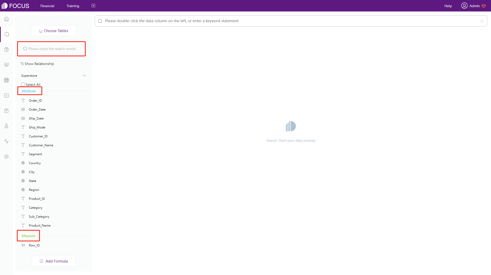

Figure 2-11 Column display **2、字段/列的类型** 如上所示，Sisense主要有三种字段类型，文本、日期和数字。此外，数字包括整数、大整数、浮点数等。DFC 提供字符串、时间戳、布尔值和数字，其中数字包括整数、小数、大整数和小整数。 **3、添加字段/列** 在Sisense中添加字段的时候，用户需要逐个选择字段，如图2-12所示。在DFC中，用户可以同时选择多个列，也可以使用“全选”选项一键添加所有列。

GIF Figure 2-12 Add fields

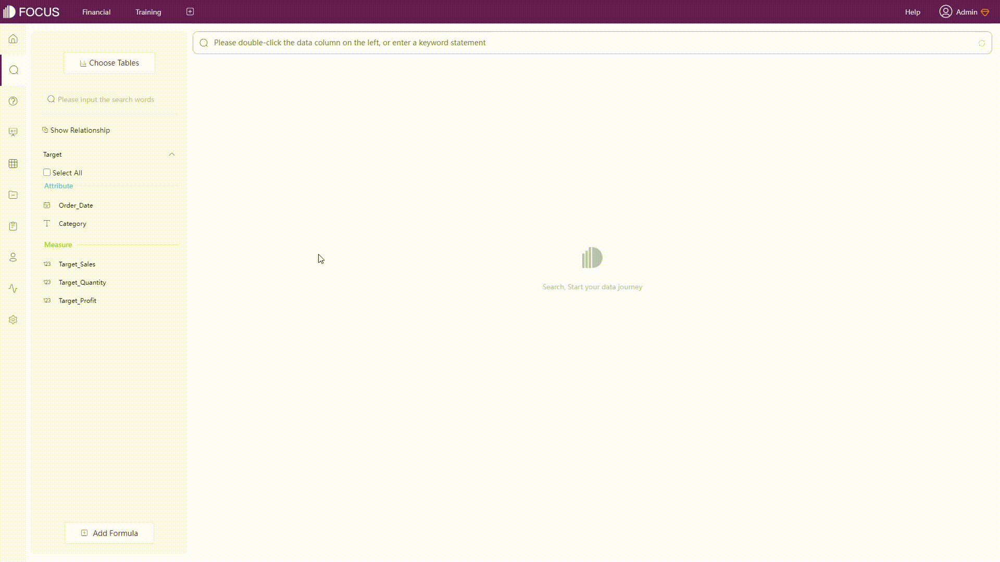

GIF Figure 2-13 Add columns **4、提示** Sisense: 将鼠标悬停在图表图标上，弹窗会提示图表类型。将鼠标悬停在示例看板上，会出现名称、所有者、创建日期和最后修改时间等相关信息，如图 2-14 所示。

GIF Figure 2-14 Prompts - Sisense

DFC: 将鼠标悬停在图表类型上，将出现显示该图表制作条件的弹框。在搜索栏输入时，系统也会提示搜索内容，如下图。

GIF Figure 2-15 Prompts - DFC

Sisense使用拖放作为交互模式，而 DFC 使用搜索式分析。DFC搜索式分析更侧重于数据分析而不是可视化创建。对于复杂的业务问题，例如季度销售额的增长率怎么样了，用户只需在搜索栏中输入相关词句，系统就会自动选择合适的图表。

GIF Figure 2-16 Search analysis

这种分析方式根据您的想法直接分析业务问题。即使遇到复杂的业务问题，系统也会快速返回分析结果，以帮助做出数据驱动的决策。

### 2.3.2 筛选

\- 整体

Sisense中的筛选器主要是小部件筛选器和看板筛选器。小部件筛选器在看板中不可见或不可编辑，看板筛选器主要由页面右侧的筛选器窗格实现。

同样，DFC中的筛选器也可以分为问答筛选器和看板筛选器。问答筛选器在仪表板中不可编辑，而在看板中添加筛选器有不同的方法。

\- 字段/列类型

Sisense: 小部件过滤器和仪表板过滤器都具有相同的过滤器配置。以下过滤器是根据字段类型来介绍的。 **1、文本** 用户可以通过选择、使用包含或开始于等文本条件以及对值进行排名的方式筛选。

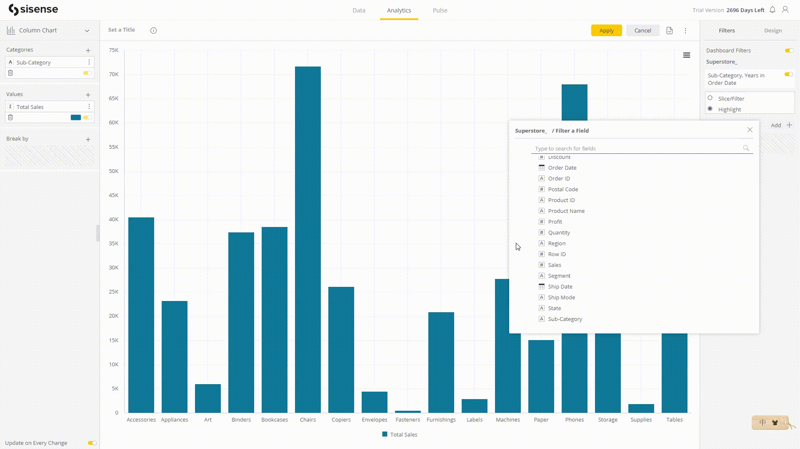

GIF Figure 2-17 Text filters - Sisense **2、数值** 同样，用户可以通过选择值、使用小于等的条件以及对值进行排名的方式筛选。

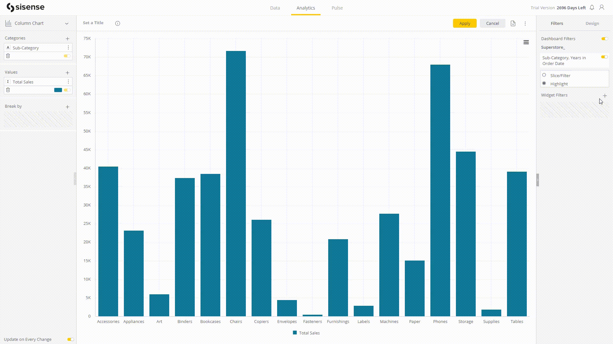

GIF Figure 2-18 Numerical value filters - Sisense **3、时间** 用户可以根据不同的时间间隔或时间范围选择时间，并对数值进行排名。

GIF Figure 2-19 Time filters - Sisense

DFC: 问答筛选器和看板筛选器完全不同，如下所示。 **1、问答** **a.关键词** 关键词是搜索式分析的中心。在搜索栏中输入关键词后数据会自动筛选。完整的关 键词列表在这里：[关键词](https://wiki.datafocus.ai/index.php/%E4%BA%A7%E5%93%81%E6%89%8B%E5%86%8C_v5.0.2" \l ".E5.85.B3.E9.94.AE.E8.AF.8D).

GIF Figure 2-20 Keywords **b.在表格上筛选**

对于数值表和数据透视表等表格，可以在通过设置按钮添加筛选器。此外，非时间属性可批量添加。

GIF Figure 2-21 Filter - tables **c.在图上筛选** 单击坐标轴添加筛选器，如图2-23所示。

GIF Figure 2-22 Filter - graphics **2、看板** **a.单击选择** 选择一个数据点或一个区域，看板上的图表将被一起筛选。如果要删除效果，只需 单击“恢复”按钮。

GIF Figure 2-23 Selection - dashboards **b.筛选器组件** 在“文本”组件下，有各种筛选器组件，它们将成为看板的一部分，其他用户可以与之交互。

Figure 2-24 Filter components

### 2.3.3 公式

本节主要比较公式编辑器。

Sisense和DFC都提供相关公式的描述和示例。不同之处在于，Sisense中用户需要将鼠标悬停在公式上才能查看说明，而在DFC中，公式编辑器右侧的公式助手持续提供帮助。

在Sisense中，点击“数据浏览”下的字段名称来添加字段。而在DFC中，用户可以通过直接输入或点击提示来添加列名。如gif图2-26所示，系统的提示不仅显示列名，还显示语法。

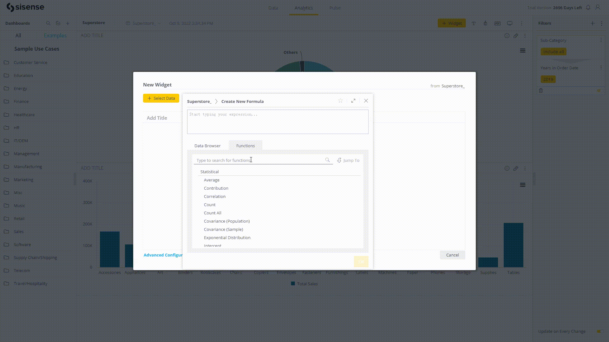

GIF Figure 2-25 Formula editor - Sisense

GIF Figure 2-26 Formula editor - DFC

在公式类型方面，Sisense 提供了统计、数学、时间等。 DFC支持字符串、数学、时间、转移、组分析、json 和许多其他公式，在这里查看完整信息：[公式列表](https://wiki.datafocus.ai/index.php/%E4%BA%A7%E5%93%81%E6%89%8B%E5%86%8C_v5.0.2" \l ".E5.85.AC.E5.BC.8F.E5.88.97.E8.A1.A8).

## 2.4 数据处理

在Sisense中，数据处理主要在“数据”模块下完成，而在DFC中则在详细数据页面和搜索分析页面进行。比较如下： **1、关联表** Sisense和DFC都可以连接多个数据表，如下gif图所示。不同的是，Sisense中的连接是根据字段来的（一条线代表一个字段的一个连接），而DFC提供了各种连接类型，例如左连接、内连接、全连接等。另外，DFC有两种连接表格得方式，点击[这里](https://bbs.datafocus.ai/topic/160)查看。

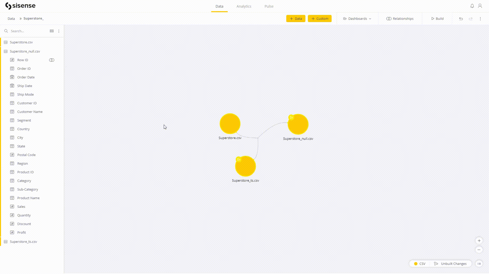

GIF Figure 2-27 Join tables - Sisense

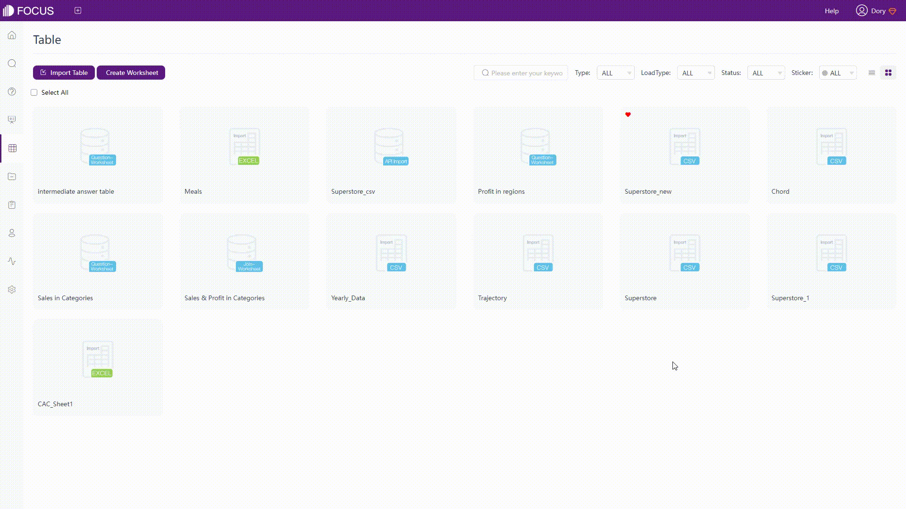

GIF Figure 2-28 Join tables - DFC **2、清理&转换数据** Sisense提供自定义代码，使用户能够运行Python代码或SQL语句来清理或转换数据。

DFC主要利用[中间表](https://bbs.datafocus.ai/topic/8)来清理数据。在转换数据方面，DFC提供行列转换、列拆分等。点击[这里](https://wiki.datafocus.ai/index.php/%E4%BA%A7%E5%93%81%E6%89%8B%E5%86%8C_v5.0.2" \l ".E6.95.B0.E6.8D.AE.E8.BD.AC.E6.8D.A2)查看。

## 2.5 可视化

### 2.5.1 表格

Sisense中有3种表：表、汇总表和数据透视表。DFC也支持3种类型的表：数值表、数据透视表和交叉表。 **1、表&汇总表&数值表** Sisense的表格列出了原始的非汇总数据，汇总表显示了聚合后的汇总数据。这两种表的设计配置包括更改边框样式、列宽、是否显示颜色或自动换行等。

Figure 2-29 Table - Sisense

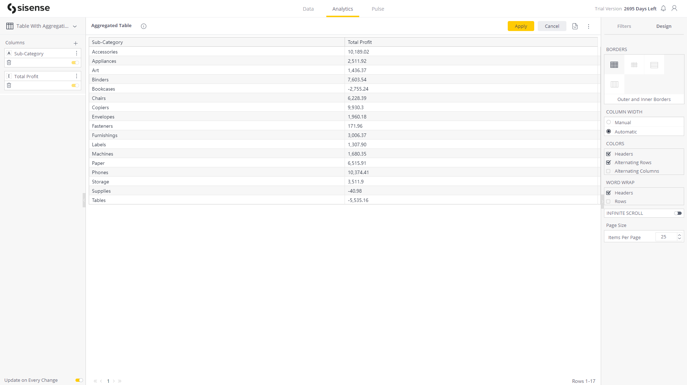

Figure 2-30 Aggregated table - Sisense

DFC的数值表以二维方式呈现数据，并且拥有很多不同的配置选项，例如添加总行、标题行、更改颜色以及字体、设置热图模式等。默认情况下，数据在DFC中是聚合的，用户可以选择不聚合数据，如图2-31所示。在[这里](https://wiki.datafocus.ai/index.php/%E4%BA%A7%E5%93%81%E6%89%8B%E5%86%8C_v5.0.2" \l ".E8.A1.A8.E6.A0.BC.E5.B1.9E.E6.80.A7)查看网格表的详细配置。

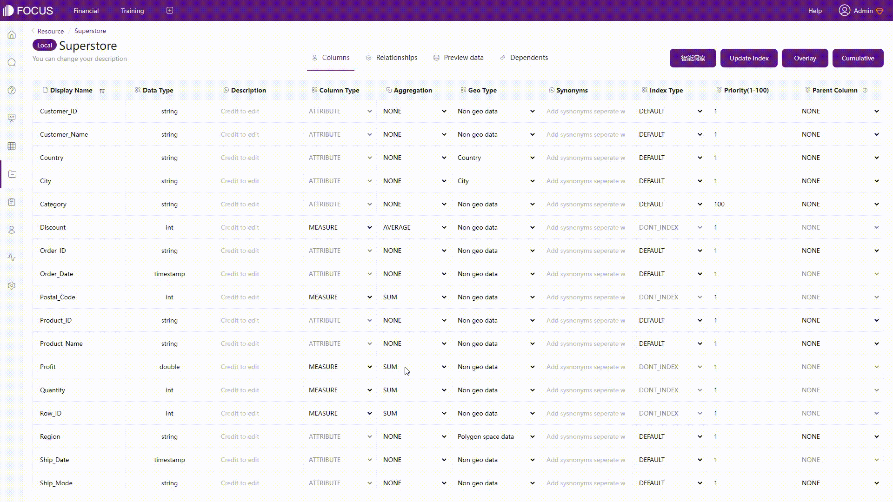

GIF Figure 2-31 Grid table - DFC **2、数据透视表** 两个平台都提供数据透视表来汇总大量数据。区别主要是具体的表格样式和配置，如下图。在[这里](https://bbs.datafocus.ai/topic/17)查看更多关于DFC的数据透视表.

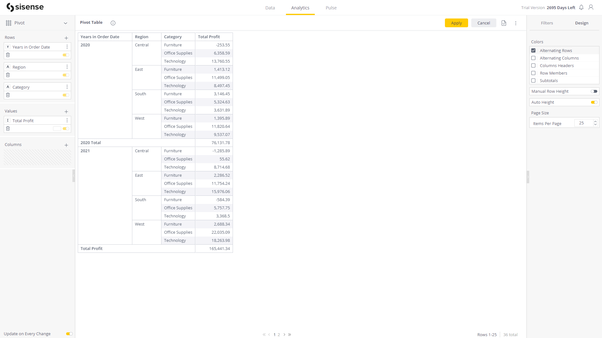

Figure 2-32 Pivot table - Sisense

Figure 2-33 Pivot table - DFC **3、交叉表** DFC提供交叉表来呈现多维数据并满足复杂的业务需求。用户可以添加、编辑和固定标题。

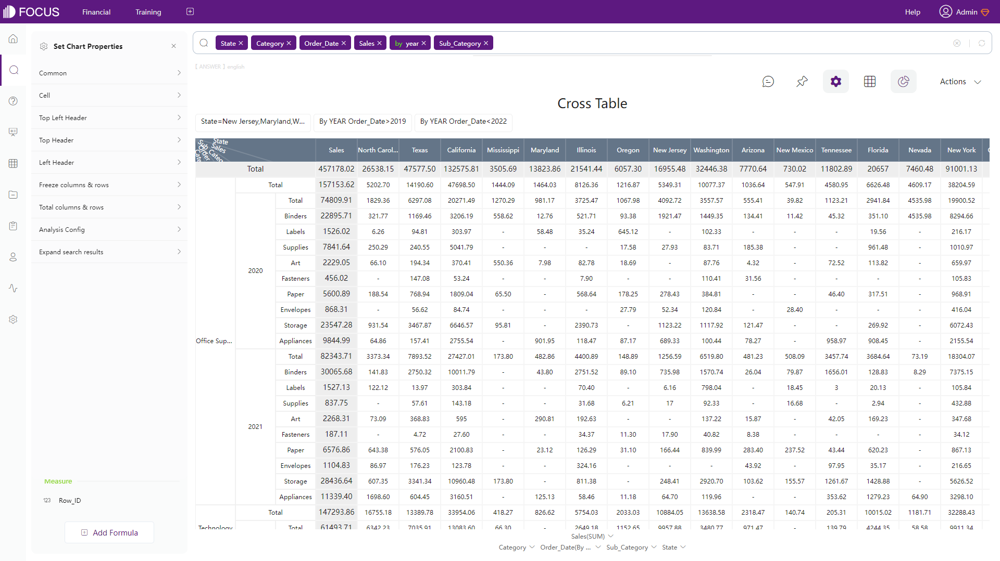

Figure 2-34 Cross table - DFC

### 2.5.2 图像

Sisense支持20种左右的图表类型，DFC支持50多种图表类型。另外，DFC的定制化程度很高，用户可以自由设计自己的图表，例如添加标签和悬浮文本、更改颜色和字体等。两个产品的图像区别分为四个部分： **1、常用图表** 以热图为例，Sisense提供日历热图和颜色热图，DFC提供日历热图、相关热图、经纬度热图和矩阵热图。此外，用户也可以给DFC的数值表和数据透视表设置热图模式。

Figure 2-35 Heatmaps - Sisense

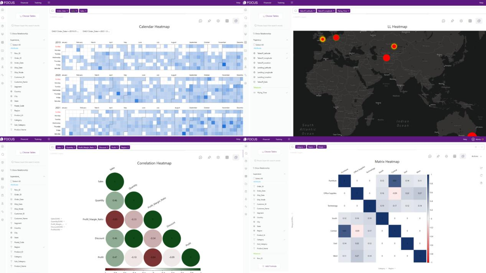

Figure 2-36 Heatmaps - DFC **2、地图** Sisense提供散点地图、区域地图、ArcGIS地图、路线图等。

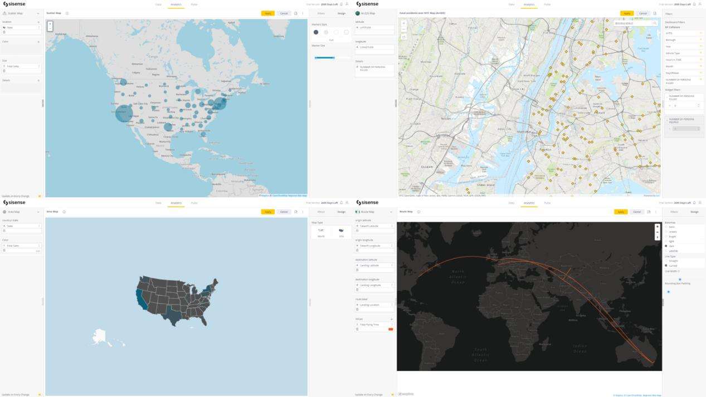

Figure 2-37 Maps - Sisense

DFC支持GIS位置图、经纬位置图、轨迹图、3D散点图等，用户可自行导入地理数据。

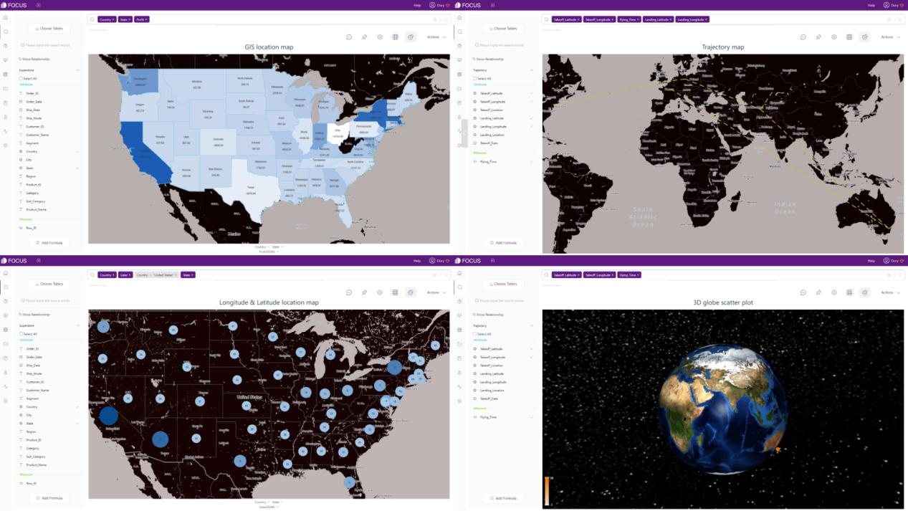

Figure 2-38 Maps - DFC **3、高级图表** 如下图，有旭日图、词云图、极坐标图、格子图、弦图、网络图等。

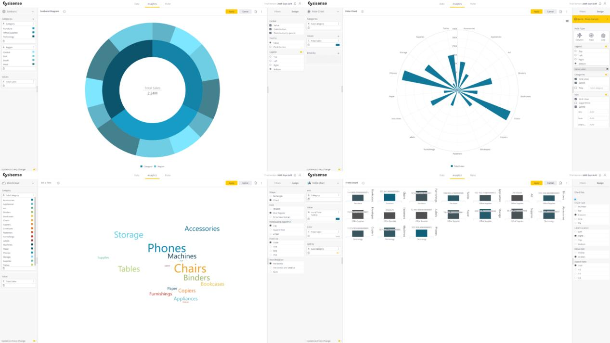

Figure 2-39 Advanced graphics - Sisense

Figure 2-40 Advanced graphics - DFC **4、动态图表** DFC还支持一些动态图表。例如，时间序列气泡图、3D 地球飞行线等。

GIF Figure 2-41 Time series bubble chart

GIF Figure 2-42 3D globe fly line

### 2.5.3 大屏

<table><tbody><tr><td>方面</td><td>Sisense</td><td>DataFocus Cloud</td></tr><tr><td>看板尺寸</td><td>PDF报告的尺寸</td><td>定制化</td></tr><tr><td>布局</td><td>拖拽</td><td>自由布局&amp;网格布局</td></tr><tr><td>交互对象</td><td>文本, 标签, 标签, 图像, ..</td><td>文本, 图像, 视频, 媒体...</td></tr><tr><td>看板模板</td><td>样例</td><td>各种模板</td></tr></tbody></table>

**1、看板尺寸** Sisense看板的宽度是固定的，页面会随着更多小部件而变长。将看板另存为pdf文件时，有许多不同的尺寸选项，如下所示。

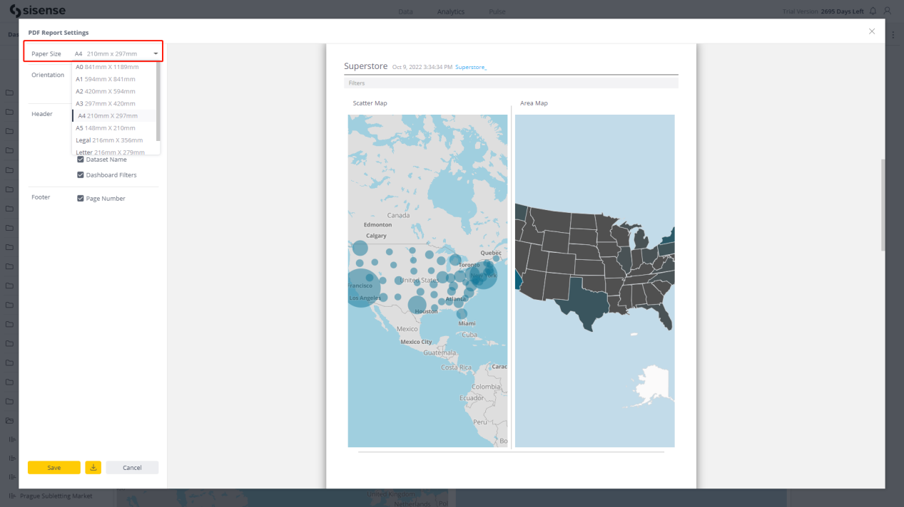

Figure 2-43 Dashboard size - Sisense

DFC中的看板有多种尺寸选项，用户可以选择预设尺寸或直接输入高度和宽度。

GIF Figure 2-44 Dashboard size - DFC **2、布局** 在画布种通过拖动小部件或其边框，可以更改Sisense中的看板布局。

GIF Figure 2-45 Layout - Sisense

DFC中有两种布局。一种是网格布局，用户可以利用网格来放置组件。另一个是自由布局，用户可以自由放置组件。

GIF Figure 2-46 Layouts - DFC **3、交互对象** 以看板内的小部件作为单个交互对象。图表也是一种小部件，不会被单独保存。 DFC使用组件作为交互对象，图表是组件的一类，且单独保存为问答。

如上所述，这两种工具都支持各种交互对象。在此处查看有关DFC自定义组件的更多信息：[自定义组件](https://wiki.datafocus.ai/index.php/%E4%BA%A7%E5%93%81%E6%89%8B%E5%86%8C_v5.0.2" \l ".E8.87.AA.E5.AE.9A.E4.B9.89.E7.BB.84.E4.BB.B6). **4、模板** Sisense有不同类型的看板示例，如下所示。用户可以查看这些示例并与之交互，并将小部件下载为图像或csv文件。

Figure 2-47 Samples - Sisense

DFC有多种看板模板，如图2-47所示。用户可以直接使用并替换成自己设计的组件。

Figure 2-48 Dashboard templates

## 2.6 资源管理

Sisense和DataFocus Cloud都提供了两种资源展示方式，分别是列表和平铺/缩略图。此外，用户可以搜索以快速找到资源。

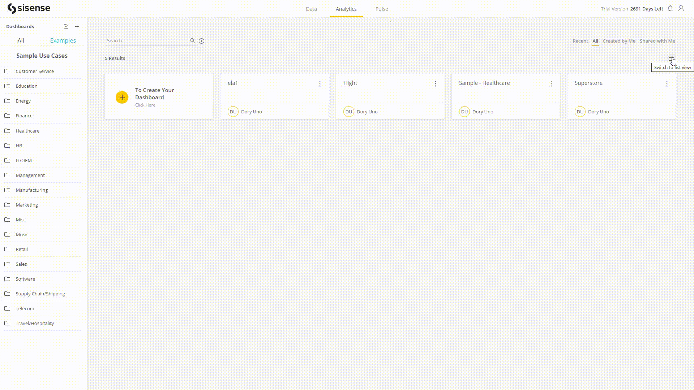

GIF Figure 2-49 Display mode - Sisense

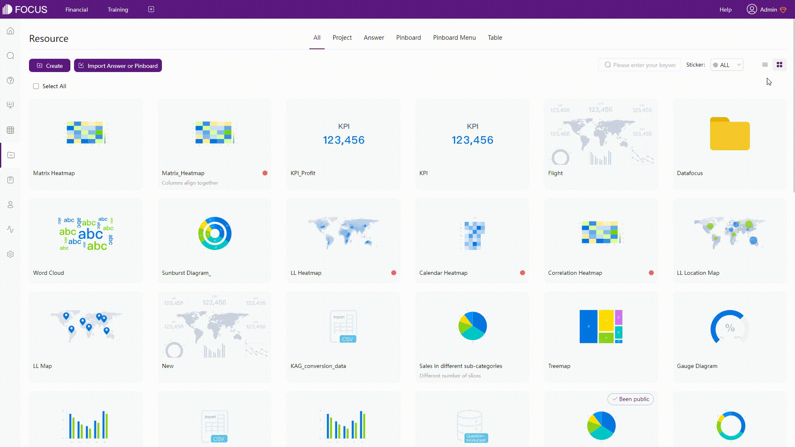

GIF Figure 2-50 Display mode - DFC

Sisense用迷你导航栏来帮助管理资源。用户可以在“最近”、“全部”、“由我创建”和“与我共享”之间切换。

Figure 2-51 Resource management - Sisense

DFC有几个模块供用户查看资源，例如问答模块、表格模块、看板模块、资源模块等。以资源模块为例，用户可以通过迷你导航栏在不同资源类型之间移动。此外，DFC 提供标签以快速从不同类别中分类。

GIF Figure 2-52 Resource management - DFC

## 2.7 协作

### 2.7.1 角色

用户角色是用来执行权限的。Sisense中有四种角色，DataFocus Cloud中有7种角色。

Sisense：四类角色分别是管理员、设计者、查看者和基本用户。此外，可以使用 Sisense REST API来自定义角色。

DFC：角色可以分为系统角色和自定义角色。用户可以根据需要直接添加任意数量的自定义角色，并决定这些角色可以对特定资源执行哪些操作。例如，“销售部小王”可以编辑与销售相关的资源，“销售部小李”只能查看这些资源。在这里查看更多： [角色](https://wiki.datafocus.ai/index.php/%E4%BA%A7%E5%93%81%E6%89%8B%E5%86%8C_v5.0.2" \l ".E8.A7.92.E8.89.B2).

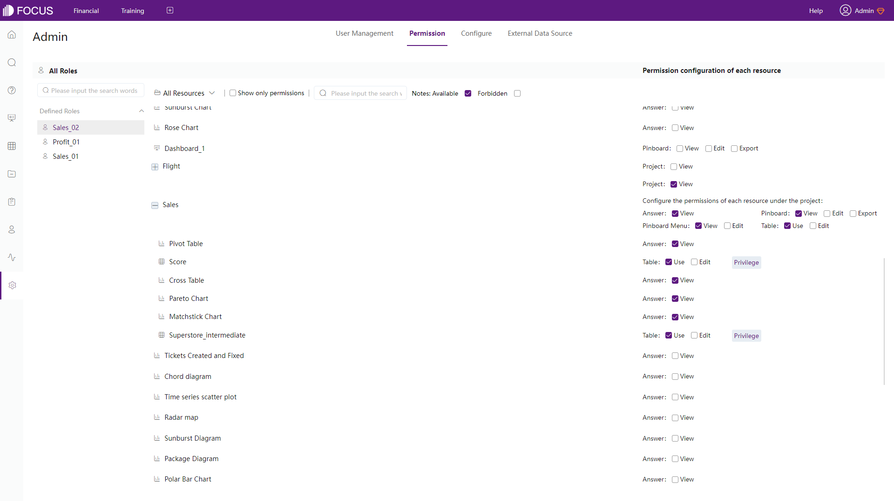

Figure 2-53 Roles - DFC

### 2.7.2 组

用户可以在Sisense中为组分配角色，然后将其他成员分配到组。由此，资源可以直接与组共享。

DFC中组的结构类似于公司中的部门。用户可以被分配不同部门的职位。结合角色，每个用户可以对不同的资源拥有不同的权限。例如，“技术”部门的“后端”“开发经理老刘”可以管理与项目W相关的部门和资源。在这里查看更多：[组织架构](https://wiki.datafocus.ai/index.php/%E4%BA%A7%E5%93%81%E6%89%8B%E5%86%8C_v5.0.2" \l ".E7.BB.84.E7.BB.87.E6.9E.B6.E6.9E.84).

Figure 2-54 Departments - DFC

### 2.7.3 分享

如果想在Sisense中共享资源，用户需要先下载资源为pdf、image、csv或其他格式，然后在其他工具中共享。

同样，资源在DFC中可以被下载和导出。此外，还有另外两种共享资源的方法。对于团队内的成员，用户可以直接在系统内共享资源或发送邮件。对于外部成员，用户可以使用外部查看链接。但是，外部用户只能与资源交互而不能编辑。在[这里](https://wiki.datafocus.ai/index.php/%E4%BA%A7%E5%93%81%E6%89%8B%E5%86%8C_v5.0.2" \l ".E5.88.86.E4.BA.AB.E7.AE.A1.E7.90.86)查看更多关于共享的信息.

## 2.8 成本

Sisense的定价是定制的，用户需要先与Sisense团队取得联系。

DFC按容量收费，这样的定价方案对用户来说是公平的。而且这种方式能够在整个组织中传播，对会员数量不是很敏感。在此处查看DFC的定价计划：

Table Figure 2-55 Cost - DFC

# 结论

作为AI驱动的BI产品，Sisense和DataFocus Cloud都是基于云的优秀可视化平台。本文展示了它们之间的异同。

Sisense 提供了大量的看板示例，包括不同的业务和方面。此外，它具有漂亮的可视化效果，可以以不同的方式显示数据。

DFC 提供有效且方便的搜索式分析。不仅拥有丰富的可视化，还有高级别的定制程度。团队可以使用这样详尽的系统轻松实现合作。DFC将不断改进系统和用户体验。欢迎在这里查看：[DFC](https://www.datafocus.ai/).
