## 一、产品简介

SmartBI主要定位于解决企业复杂报表需求以及制作交互式仪表盘。其交互方式仍然是传统的拖拽式，且操作使用上需要有一定的技术基础，比如需要**涉及到SQL语句的使用**，用户的学习成本较高，对业务人员不友好，界面展现上给人感官较差。

DataFocus Cloud（以下简称DFC）是一个基于搜索式交互方式的Saas数据分析平台，提供一站式云数据分析服务。DFC应用简单易上手的搜索框操作，就像使用Google或百度搜索引擎一样，帮助业务人员在没有技术背景的基础上也能完成高效、专业、快速的数据分析。

## 二、资源对象

SmartBI的资源（对象）有数据集、数据模型、业务主题、业务对象、业务子对象、业务属性、业务属性过滤器等。

- 业务主题是针对业务的一个概念，它将同一数据源中属于同一个分析主题的表或表中的字段组合在一起，为进一步的可视化数据集提供基本元素。业务主题我们看作是 Smartbi 产品中的数据仓库，主要应用于可视化数据集等操作。
- 业务主题是由多业务对象和业务属性组成的，业务对象中又是由业务对象和业务属性组成，即业务对象可以嵌套业务对象。
- 业务对象是构成业务主题的基本元素。业务对象可以嵌套业务对象，除了第一级业务对象，我们统称为“业务子对象”。业务对象可以从左侧拖拽表进来，也可以新建。

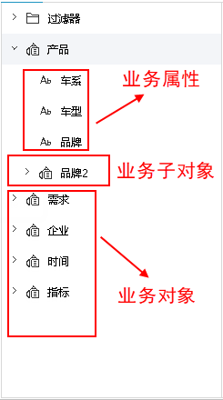

图2-1 SmartBI的业务主题

可以看到SmartBI中的概念比较复杂，既有逻辑上的数据重组，也有实际上的数据模型创建，需要较高的认知成本，且容易把人绕晕，而且对象的设置也需要消耗大量的时间，一般的业务人员不容易完成，拖拽原始表重新封装成业务主题的工作，一般都是由技术人员完成，这又给数据分析工作增加了人员压力。

DFC中的资源（对象）一共有以下几类：**数据表、历史问答（图表）、数据看板（可视化大屏）、菜单看板（一组数据看板）和项目**（可以将同一分析主题相关的数据表、历史问答、数据看板等资源打包成一个项目，便于管理）。用户不需要理解复杂的概念，学习成本很低，业务人员完全可以独立完成，并且在实践中证明，这些资源已经足够满足企业级的分析需求。

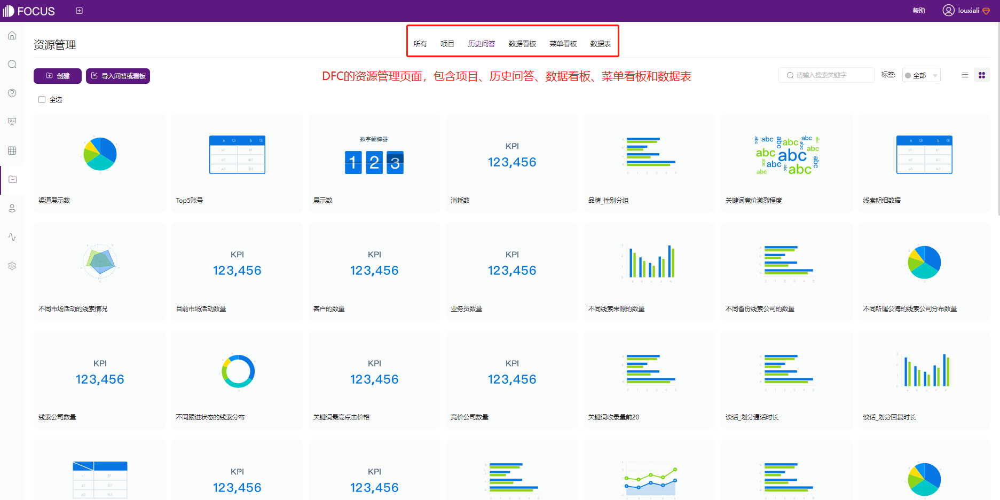

图2-2 DFC资源管理

## 三、数据源使用

SmartBI在连接数据时，需要数据整合成一个数据集合，**基于数据库获取需要的数据**，虽然它支持丰富的数据源接入，但是用户需要连接和管理的数据很多，**它并不能直接使用接入的业务库直接进行数据分析**。以使用加载文件数据功能导入数据表操作为例，首先必须满足如下两个前提条件：

a、加载的文件数据的目标数据源必须支持“允许加载Excel数据”。

b、执行加载文件数据的用户必须拥有“本地数据源”的操作权限和目标数据源的“编辑”资源权限。

由于在加载文件数据时，需要选择指定导入数据源（如下图红框处），只有勾选了“允许加载Excel数据”的数据源才可供选择。

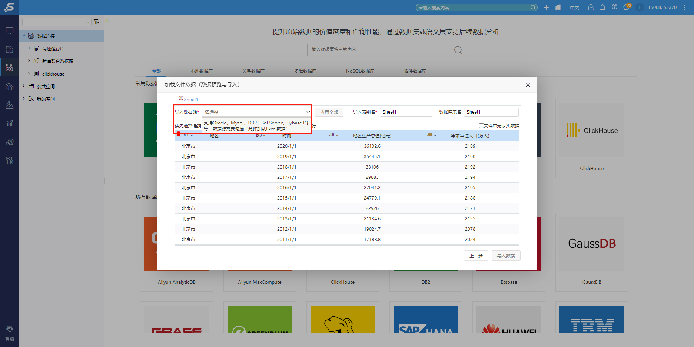

图2-3 SmartBI 导入数据源设置

DFC支持从本地上传CSV、Excel和JSON文件（存储在DFC自带的数据仓库中）；也支持导入自有数据仓库中的数据表（存储在DFC自带的数据仓库中）；或者直接连接数据库，实时更新数据、图表和可视化大屏，并且可以同时连接不同的数据库，实现来自不同数据库跨库分析。还支持使用数据访问API对外部应用进行授权，允许外部用户通过调用API接口导入数据。

DFC的数据导入方式多样，满足用户的个性化需求。在导入文件时系统自动为用户分配了专属的数据仓库，操作是无感知的，非常便捷。且本地数据和数据源连接都是可视化操作，业务人员自己完全可以搞定。

图2-4 DFC数据导入

## 四、数据分析能力

### **1.即席查询**

SmartBI 的即席查询可以查询明细数据及明细数据导出。通过简单的鼠标勾选数据字段与拖拽条件字段快速获得所需数据，并提供聚合计算、告警规则、重定义表关系、改变条件组合逻辑等功能。

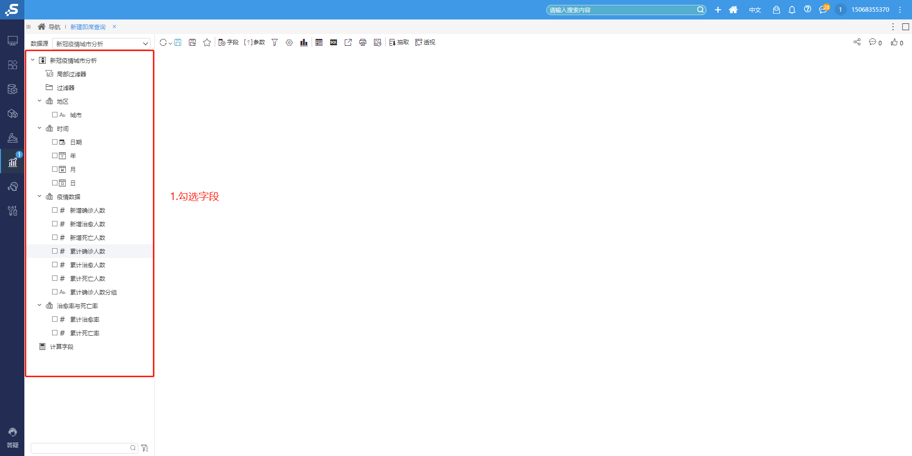

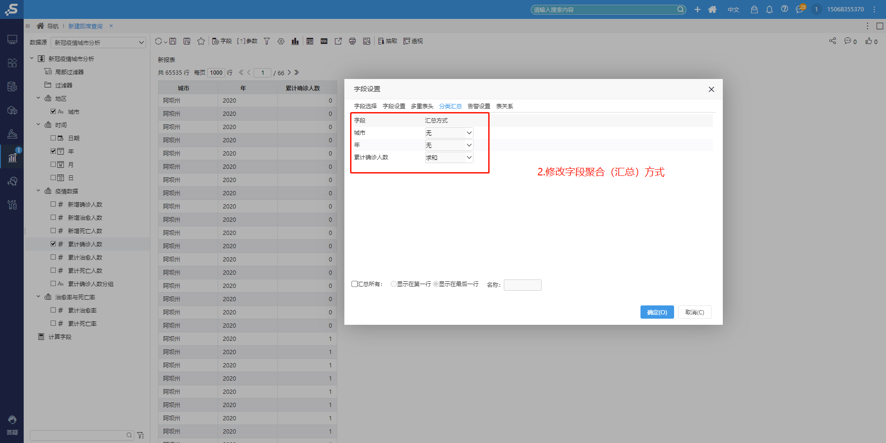

图2-5 SmartBI即席查询

SmartBI中的即席查询其实就是通过拖拽字段来实时获取一些数据。但是操作时需要**使用SQL语句进行过滤条件设置**，这一点对没有技术基础的业务人员来说非常不友好。而且又有全局过滤器，又有局部过滤器，又多出来不少理解成本。

图2-6 SmartBI需要使用SQL进行条件过滤

DFC中的即席查询叫搜索，没错，就是像使用百度一样去搜索数据表中的数据。这是DFC的核心功能之一。它的优势是**不用拖拽，直接双击数据列或者打字输入**，速度更快；DataFocus的搜索框，还能**简化繁琐的过滤条件设置**（完全不需要SQL语句），得益于强大的内置关键词库，DFC可以把需要筛选操作的步骤都直接转化成关键词输入，比如X月、X季度、周一、具体日期之前/之后、大于/小于、等于/不等于、包含、vs、最大值/平均值/方差、同比/环比等。此外，DFC还支持关键词智能提示功能。

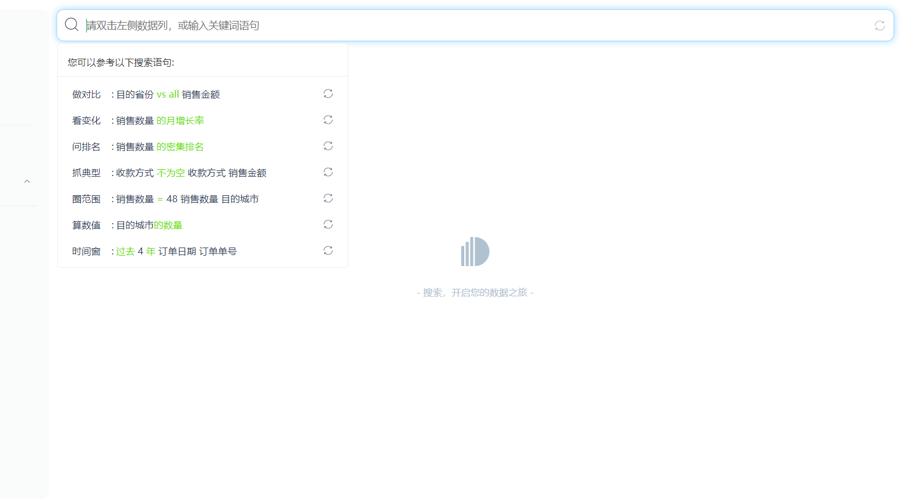

图2-7 DFC的关键词智能提示

下图演示了如何不借助SQL语句，直接在搜索框中输入过滤条件，实现筛选过滤。

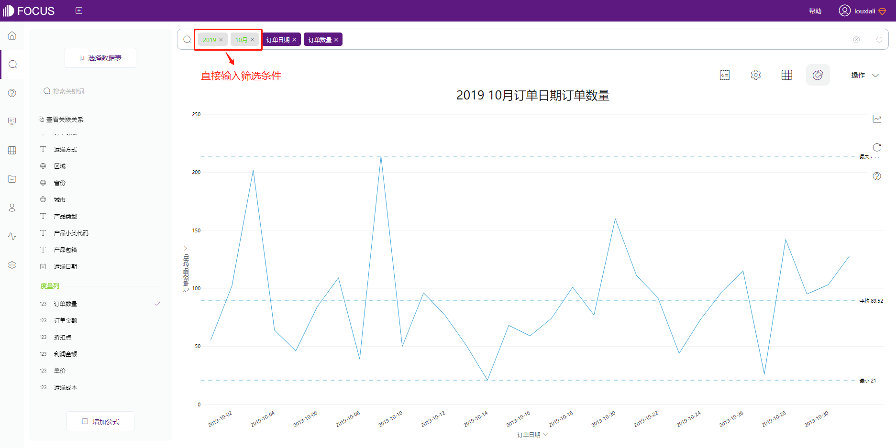

图2-8 使用关键词年、月进行筛选

图2-9使用关键词大于、按年统计进行筛选

图2-10 使用关键词排名前x的进行筛选

下表展示了DFC系统提供的关键词类型，借助这些**关键词及其组合**，用户就可以自由地进行条件过滤和筛选。

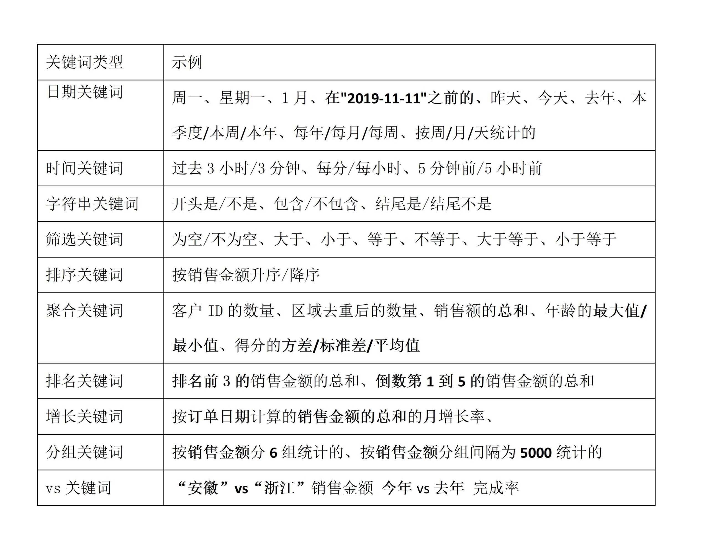

SmartBI目前也有新增搜索式智能问答创建图表。但是在使用前需选择所需的数据模型来构建知识图谱，创建过程比较耗时。**且用户每次对数据源进行变更操作后，都需要重新构建知识图谱。**

SmartBI“智能问答”搜索框支持的特殊关键字有以下几类，支持的关键词类型少于DFC。

### **2.透视分析**

SmartBI的透视分析采用“类Excel数据透视表”的设计，可以组合维度、汇总计算等。但是整个操作流程还是略显复杂，需要先将字段拖动到待选列，在拖入行区、列区、修改度量的聚合方式，点击刷新才能制作完成。

图2-11 SmartBI透视分析

DFC提供了三种表格用于数据展示。

一种是数值表，以二维表格式显示任意数据。可以添加标题、索引、总行，也可以开启热图显示、负数显示红色等。

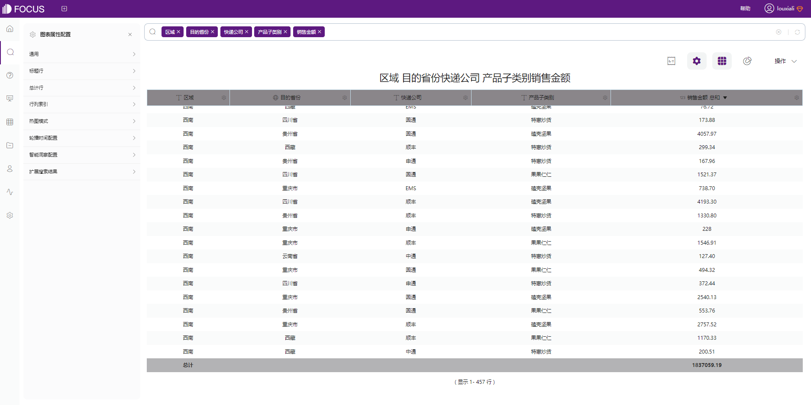 图2-12 DFC数据表

另一个是数据透视表，它以树状结构显示数据。它至少需要 2 个属性和 1 个度量。类似于数值表，可以添加总行数，以红色显示负数等。

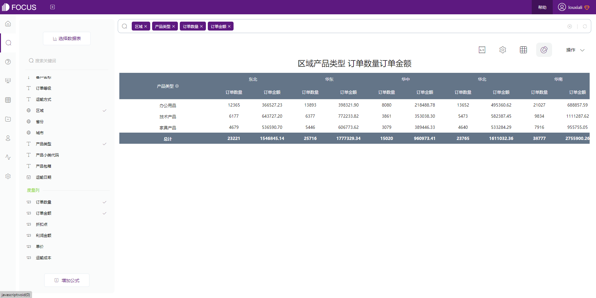

图2-13 DFC数据透视表

最后一种是交叉表，它以多维表格的形式对数据进行结构化和汇总。因此，它适合大多数复杂的结构需求。表格可选择固定特定列和行，添加顶部和左侧标题，添加汇总结果等。

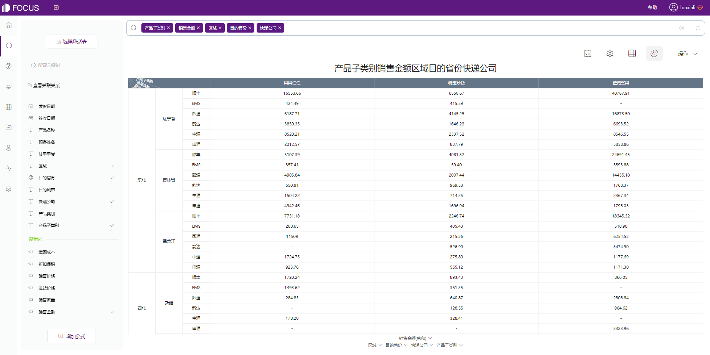

图2-14 DFC交叉表

### **3.图表可视化**

SmartBI的图表可视化仍然是基于拖拽式操作的，而DFC带来的是自适应的图表可视化。DFC 的可视化逻辑是让图形适配数据，而不是用数据适配图表。你只需要在搜索框中正确输入条件，系统系统呈现图表，不需要选择（支持自由更换）。

当然，为了得到更好的展示效果，DFC 支持的图表类型超过 50 种。除了柱状图、饼状图等常用图形外，还支持这些图表的变体，如火柴图、瀑布图、帕累托图、极坐标柱状图等。因此，您可以在系统内直接构建各种图形，而无需导入外部资源。DFC还提供了很多高级的图像，如平行坐标图、打包图、词云图、桑基图、关系网络图、弦图等。

图2-15 DFC弦图

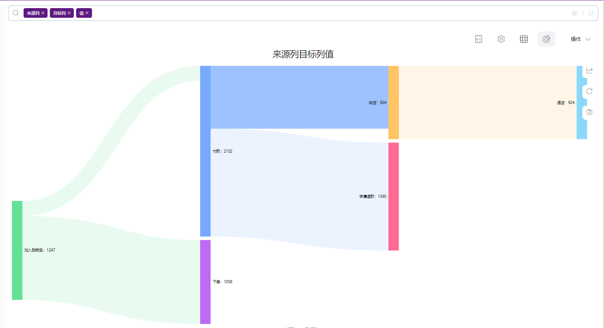

图2-16 DFC桑基图

图2-17 DFC关系网络图

DFC还支持多种地图类型，包括3D地球散点图、轨迹图、位置经纬图、GIS位置图等。此外，用户还可以将自己的地图或地理数据导入到系统，进行二次开发。

图2-18 地图可视化

或许有很多用户已经习惯了先选择图表，再拖拽字段的操作方式。但仔细想想看，这个是不符合我们的思维逻辑的。你想在大量的数据中发现有效的规律，首先必须基于数据和条件去做分析，而图表只是你分析思路的呈现手段而已。在没有思路的前提下，你怎么能够选中合适的图表呢？传统的操作方式只适合做固定维度、固定思路的分析，比如周报、月报、年报，而要想真正从数据中发现问题，思路应该是灵活多变的，只有搜索式操作才能匹配这样的思维方式。

### **4.大屏可视化**

仪表盘通过交互式设计，能够满足数据分析人员与仪表盘之间的交互需求，灵活地对业务人员的分析操作作出响应。SmartBI与DFC的交互中都支持“上卷下钻”、“看板跳转”、“展开/收缩”、“联动”等操作。DFC还可以通过**创建菜单看板，将一组有相关性的数据看板组合起来，以便更能全局展现一个业务不同分析维度的数据情况**。比如下图从盈利能力、营运能力、偿债能力、发展能力四个维度对企业财务能力进行全局分析。

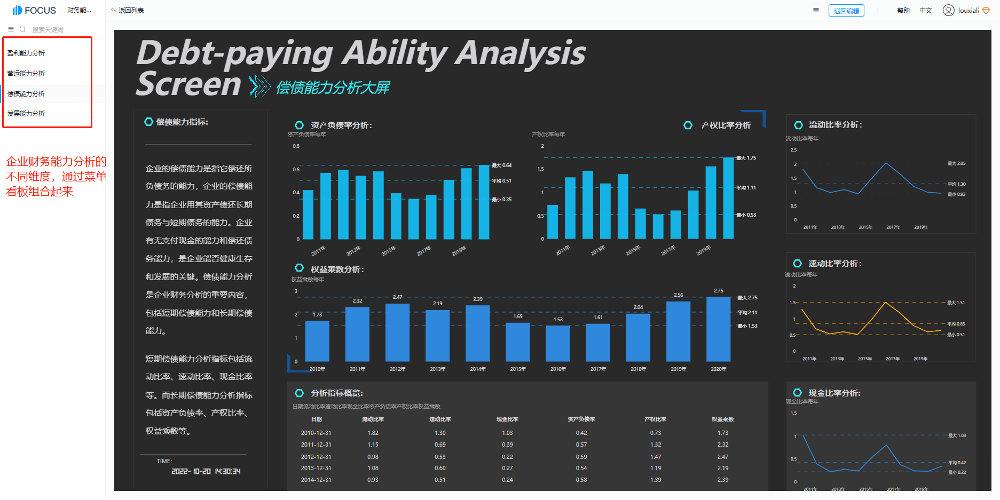

图2-19 DFC菜单看板

## **五、易用性**

使用SmartBI需要先下载安装包，配置 Smartbi 的完整流程如下：

安装完成之后，需要启动服务器，成功启动应用服务后，再次通过开始菜单访问Smartbi，或者直接在浏览器地址栏中输入访问地址，即进入登录界面。

安装程序比较繁琐耗时，并且出现安装失败或者被杀毒软件阻止安装流程时，需要用户自行处理，认知成本高。

DFC支持云端部署，**省去了繁琐的安装程序时间**，用户只需要注册登录即可使用。用户数据可以存储在DFC的数据仓库中。

图2-20 DFC免安装

## **六、零代码、零SQL**

数据分析的结果最终是要赋能业务端，但是业务端用户尚缺乏专业的数据分析能力，对BI的选择要考虑产品的易用性和学习成本。

SmartBI虽然既有报表开发功能，又开始布局智能化BI方向，但是整体的架构过于复杂，用户学习成本高，比如Web电子表格中用SQL进行查询等，这些其实是BI应该解决掉的麻烦，而不是继续按照原来的逻辑，这和Excel并没有显著差距。

DFC的核心目的就是让用户可以用类自然语言进行数据分析，省掉SQL、真正实现零代码，只要花一点时间掌握系统内置的关键词库，就可以进行任意维度的分析了。

## **七、创新灵活**

我们很难预估未来数据分析需要什么样的程度，所以在选择之前一定要足够考虑BI平台的创新能力。

在这一点上，DFC一直走在行业前列。以创新的搜索式分析区别于国内其余BI产品，并且在智能洞察、数据应用等领域持续发力，让用户实现一站式数据分析，还能够把数据用起来。

智能洞察是DFC新增的亮点功能之一。在数据表中选择洞察列，配置洞察参数，系统会自动完成洞察并生成智能洞察看板，操作流程化，不需要掌握高难度的统计学知识，帮助用户了解数据规律，预测未来动向。目前支持的分析算法有离群分析、相关性分析、趋势分析。

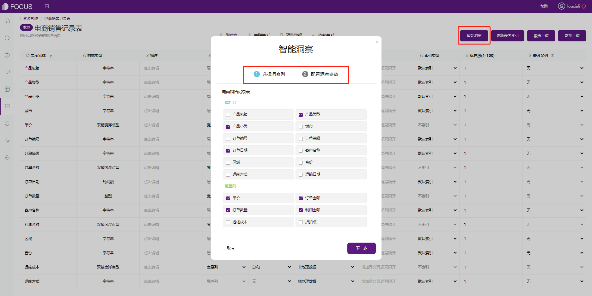

图2-21 智能洞察-选择洞察列

图2-22 智能洞察-配置洞察参数

图2-23 智能洞察-执行智能洞察任务

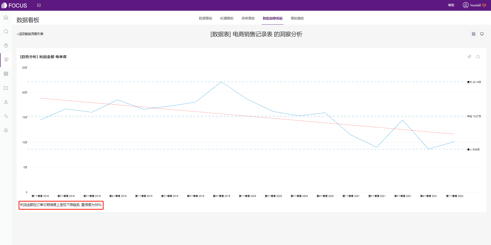

图2-24 查看智能洞察看板

## **八、结论**

总体来看，SmartBI在操作页面的可视化方面有所欠缺，参数的配置步骤复杂耗时，交互方式也决定了数据分析速度比不上DFC。

DFC革新了交互方式，适用于各种需要数据驱动的企业，产品界面非常简洁，核心功能点齐全，使得数据分析变得像搜索一样简单，普通的业务人员也可以非常流畅地实现整个搜索式分析的过程。

如果您准备提升自己的数据分析效率，创造出炫酷精美的可视化大屏。或者帮助你的企业选购一款高性能、高性价比、低学习成本的一站式数据分析工具，那么可以试用我们的[30天免费试用版](https://www.datafocus.ai/)，并从今天开始从高质量的数据可视化中受益！
