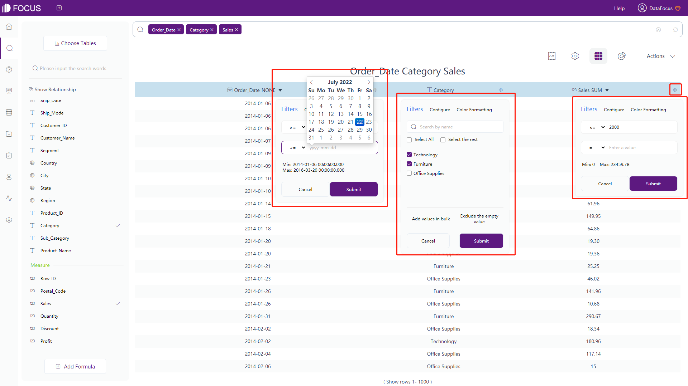
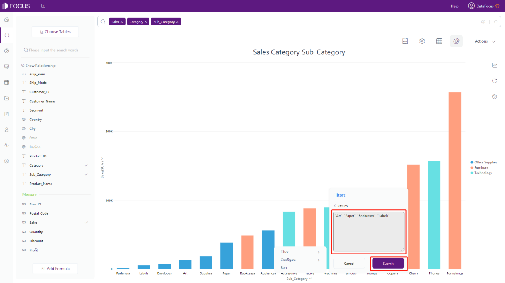
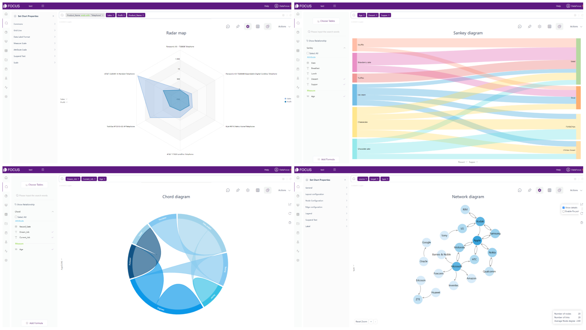
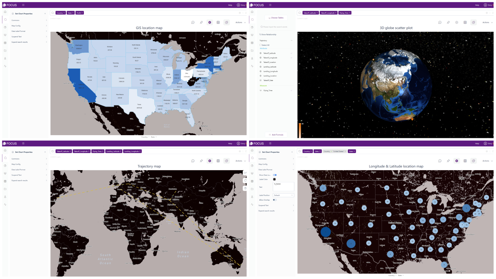
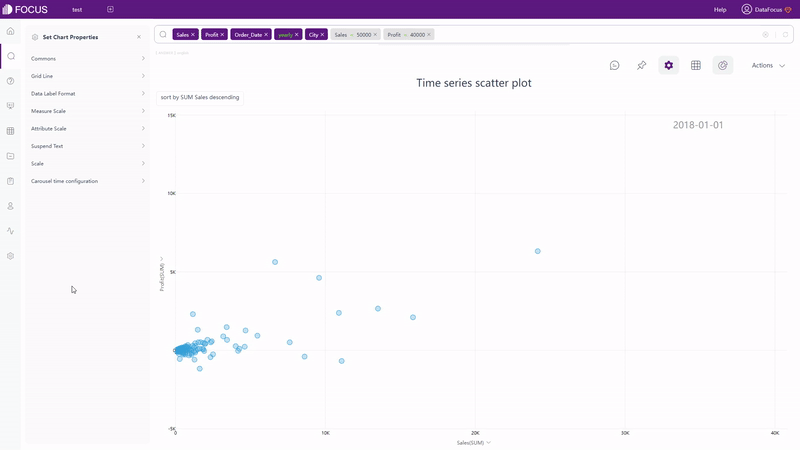
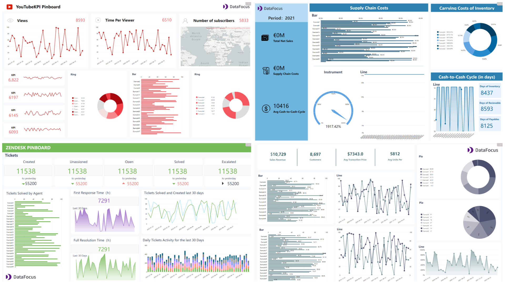
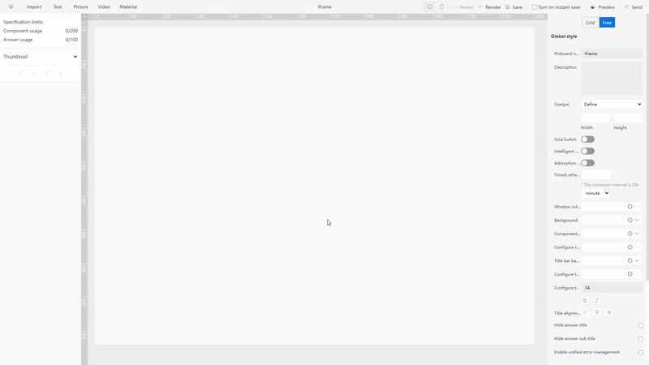
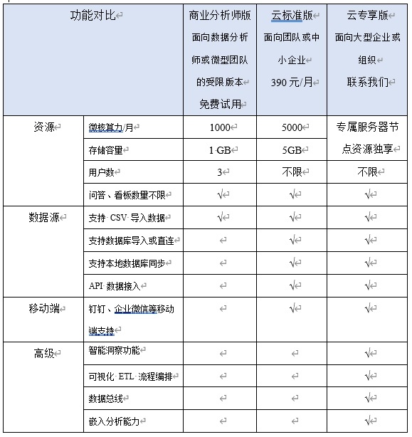

商业智能从被曾经伟大的蓝色巨人IBM创造出来至今，已经有近60年的历史了。现如今有各种 BI 技术来帮助分析和可视化数据。 Tableau Cloud 和 DataFocus Cloud 是两个出色的软件即服务 (SaaS) 平台，可帮助业务人员满足分析需求。

\[caption id="attachment\_43656" align="alignnone" width="1280"\] Tableau Cloud vs. DataFocus Cloud\[/caption\]

针对没有数据分析经验的商业精英，DataFocus 简单易用且提供多种数据源、简单而全面的数据处理、高度定制可视化、系统化的资源管理及协作和公平的成本。

怎么为每位商务精英找到最合适的一款呢？以下是两款产品的区别。

# 简介

Tableau Cloud（以下为 Tableau）是一个拖拽式可视化分析 SaaS 平台。为了改善分析流程，Tableau 通过漂亮的大屏、报告和故事的形式进行可视化，让业务人员更容易访问数据。

DataFocus Cloud（以下DataFocus）是一个搜索式分析SaaS平台，具有全栈功能。 DataFocus旨在将商业精英变成数据专家，让数据理解人类语言。

两者都是优秀的数据分析和数据可视化工具，为了帮助用户根据需要选择最合适的，下面是它们的区别。

# Tableau Cloud vs. DataFocus Cloud

## 2.1 核心用户

Tableau 具有炫酷的可视化效果，一旦熟悉后，就可以创建各种高级图表。但是，Tableau 门槛高，入门难度大。因此，它更适合有经验的专业数据分析师，而新手或普通业务人员在学习如何在 Tableau 中处理数据或实现可视化时可能会不知所措。

DataFocus旨在将商业精英变成数据专家，不仅门槛低，而且学习成本低，还提供了丰富多彩的可视化。 DataFocus 提供搜索式分析，而不是像 Tableau 那样的拖拽式分析，使数据能够理解人类语言。因此，它更适合任何数据分析师或普通业务精英。

## **2.2 Data Source**

Tableau 支持各种数据源：您可以从本地上传 Excel 或基于文本的数据源，也可以连接到云数据库或企业服务器上的数据，或者连接 Tableau Server 的REST API 接口来访问处理数据源。此外，用户可以使用 Tableau Bridge 来保持数据实时更新。

DataFocus 提供了 4 种不同的数据检索方式。

1.从本地上传CSV、Excel和JSON文件；

2.导入数据仓库，适配亿级数据等大数据场景；

3.直接连接数据库，使用DataFocus作为数据仓库，实时更新数据、图表和可视化大屏。并且可以同时连接不同的数据库，实现来自不同数据库的表的实时连接分析；

4.使用数据访问API对外部应用进行授权，允许外部用户通过调用API接口导入数据。以下是详细的数据来源：

## **2.3 易用性**

### 2.3.1 交互方式

Tableau 利用拖拽操作来创建图表、大屏和故事。虽然拖拽在构建其独特的交互方面有其自身的优势，但在构建高级的可视化时，它实际上是耗时的。

GIF Figure 2-1 Search-Based interaction mode

DataFocus 提供简单快速的搜索式分析。如图2-1所示，在搜索框中输入需求，无论图表是否高级，系统都会自动返回结果。

两种不同交互模式的重心不同。 Tableau 的拖拽操作旨在绘制图形，从而使用户专注于如何实现可视化。而DataFocus基于搜索的操作使用户专注于分析，用户可以搜索和分析他们脑海中发生的任何事情。

### 2.3.2 数据过滤

在 Tableau 中过滤数据主要有三种方式。

最简单的方法是点按鼠标并选择：您可以选择数据点或标题以在视图中包含或排除数据。另一种简单的方法是在视图中显示可以自定义过滤器卡的交互式过滤器。

这两种方式可以快速包含或排除数据。但是，要添加更高级的过滤器，需要将维度、度量或日期字段拖到“过滤器”一栏。以日期字段为例，有多种过滤器可供选择，包括相对日期、单独日期、工作日等。

但是，编辑过滤器的界面相当复杂，一旦创建过滤器，就无法编辑过滤器的类型，即不能将“相对日期”过滤器变成“单独日期”过滤器。

在 DataFocus 中有四种过滤数据的方法。

与 Tableau 类似，点按选择要包含数据的区域，然后单击“重置”按钮可以显示隐藏的数据，如gif图2-2所示。

GIF Figure 2-2 Select to include

另一种是在数值表的界面进行过滤。

Figure 2-3 Filter - grid table

第三种是在图形界面的x轴或y轴上进行过滤。

Figure 2-4 Filter - graphics

最后一种仅适用于非时间列的属性列。与第三种类似，它也在图形界面的x轴或y轴上进行过滤。

Figure 2-5 Filter - graphics\_batch

虽然 Tableau 提供了多种不同的过滤器，但界面有点复杂。 DataFocus 提供简洁、易于理解和使用的过滤器。

### 2.3.3 公式

Tableau提供了许多不同的函数，包括数字函数、字符串函数、日期函数、逻辑函数等，以便用户编写自己的公式。但是，每次创建新图表时都需要重新编写公式。

DataFocus也提供了多种公式，包括数字公式、字符串公式、日期公式、逻辑公式、JSON 公式等。另外，DataFocus 支持全局公式，这样用户每次创建新图形时都不必重新编写公式。在此处查看 DataFocus 支持的完整公式列表：[公式列表](https://wiki.datafocus.ai/index.php/V5.0.1@%E5%85%AC%E5%BC%8F%E5%88%97%E8%A1%A8)

### 2.3.4 部署

Tableau软件有本地版本和云端版本。 Tableau Cloud是一种 SaaS 部署，旨在通过共享计算环境为用户提供服务。但是，在数据连接、数据处理或共享方面，有时用户需要 Tableau Server、Tableau Prep 和 Tableau Public 来满足高级需求。

DataFocus也提供本地和云端版本。 DataFocus Cloud是一款提供一站式服务的SaaS产品。 用户可以随时随地处理、分析数据，实现可视化，并与其他协作者共享资源。 DataFocus Cloud 提供结构化且整洁的协作系统，可以帮助团队更好地管理资源。

## **2.4 数据处理**

在数据处理方面，下表显示了七个方面的差异。

## **2.5 可视化**

在可视化方面，Tableau和DataFocus的区别分别从表格、图表和大屏三个方面来描述。

### 2.5.1 表格

在 Tableau 中，文本表和突出显示表显示了数据的详细信息，可自定义显示数据的文字、颜色、标记等。

在 DataFocus 中，存在三种表。

一种是数值表，以二维表格式显示任意数据。另外，如图2-6所示，可以添加标题、索引、总行，也可以开启热图显示、负数显示红色等。

Figure 2-6 Grid table

另一个是数据透视表，它以树状结构显示数据。它至少需要 2 个属性和 1 个度量。类似于数值表，可以添加总行数，以红色显示负数等。

Figure 2-7 Pivot table

最后一种是交叉表，它以多维表格的形式对数据进行结构化和汇总。因此，它适合大多数复杂的结构需求。表格可选择固定特定列和行，添加顶部和左侧标题，添加汇总结果等。

Figure 2-8 Cross table

### 2.5.2 图像

Tableau中有15种不同的常用图表类型，包括上面提到的两种表格，以及帕累托图、人口金字塔等几种高级图表类型。虽然可以制作炫酷的可视化图表，大多数高级图表需要复杂的操作。

DataFocus 支持50种以上图表。除了常见的柱状图、饼状图等图形外，还支持这些图表的变体，如条形图、堆叠柱状图、环形图、旭日图等。因此，用户无需复杂的操作，即可轻松创建各种图表.

Figure 2-9 Common graphics

DataFocus还支持各种高级图表，如雷达图、弦图、桑基图、关系网络图等。

Figure 2-10 Advanced graphics

除了以上的图表，DataFocus也提供很多不同的地图种类，包括GIS位置图、3D地球散点图、轨迹图、经纬位置图等，用户还可以添加自己的地图或地理数据到系统。

Figure 2-11 Maps

除了静态图表，DataFocus 还提供动态图表。时间序列图（包括时间序列气泡图、时间序列散点图等），以轮播形式展示数据变化。

GIF Figure 2-12 Time series bubble chart

GIF Figure 2-13 Time series scatter plot

### 2.5.3 大屏

毫无疑问，Tableau 在数据可视化方面是业界最佳之一。通过高度的定制化，Tableau 可以提供生动的交互式可视化大屏。

虽然用户可以在网上下载大屏模板，但Tableau本身并不提供模板，用户需要先使用Tableau Desktop下载模板工作簿。Tableau Cloud不支持下载模板工作簿。

DataFocus 提供了大量的模板，可以满足系统内部的各种需求，在新建大屏时可以直接使用。

Figure 2-14 Dashboard templates

DataFocus还提供高度自由化的定制：存在两种类型的布局：网格布局，可以使用网格来帮助定位问答（图表）；自由布局，可以自由放置问答。

GIF Figure 2-15 Different layouts

除此之外，DataFocus 有一系列的素材组件，例如 tab控件和 iframe组件（添加网站），可以添加到大屏中，使可视化更加完整。

GIF Figure 2-16 Material components - tabs

GIF Figure 2-17 Material components - Iframe

## **2.6 资源管理**

根据Tableau：“Tableau Catalog、Tableau Prep Conductor、虚拟连接和数据策略通过数据管理加载项获得许可”。用户可以利用上述内容管理 Tableau 内容和数据资产。

在不使用任何外部资源的情况下，DataFocus Cloud 提供了一个详尽的系统来管理资源。用户可以使用标签对资源进行分类和快速查找。此外，每个资源都可以分配给一个所有者，通过角色管理，资源可以统一管理。

GIF Figure 2-18 Tags

## **2.7 团队协作**

通过将工作表或大屏发布到具有 Web 编辑权限的 Tableau Server 或 Tableau Cloud，团队可以协作进行更改，从而在一定程度上提高工作效率。

DataFocus Cloud 提供从用户、角色到资源的全面管理。通过为角色配置资源，为不同的用户/部门分配不同的角色，可以将打包的资源分配给特定的用户/部门。因此，不同的用户可以查看和处理不同类型的数据。

此外，DataFocus 有 2 种不同的资源共享方式。一种是在系统内，被分享的用户需要拥有自己的帐户。另一个是外部查看地址，任何人通过任何设备都可以用网站链接或二维码查看资源。

## **2.8 成本**

价格比较如下表所示，其中 Tableau 按用户收费，DataFocus 按容量收费。

 

按用户计费一方面昂贵且难以在大量用户中扩展（成本线性增加），另一方面用户难以评估成本。

按容量计费对用户更公平，在组织内部推广更方便，对用户数量的敏感度更低。

# 总结

Tableau和DataFocus都是出色的数据分析工具。

高级数据分析师用户可能更喜Tableau，因为它可以提供炫酷的可视化效果，而没有经验的数据分析师新手和业务精英在学习如何使用Tableau时可能会感到不知所措。因此，他们可能更适合DataFocus。

虽然DataFocus仍然存在一些限制，例如支持的过滤器种类及公式选择较少，以及导入后难以更改列的类型，但它仍在不断发展壮大，并具有自己的优势。相比Tableau，DataFocus操作更简单，例如添加过滤器、添加公式、处理数据。此外，DataFocus提供了更多的可视化选择，尤其是在高级图表方面。此外，DataFocus以更公平的收费为团队组织资源和协作提供了一个全面的系统。欢迎来这里试一试...（添加官网的超链接）
