软件即服务(SaaS)产品通过网络作为服务交付应用程序。无需下载软件，用户可以直接通过网站访问。作为SaaS平台，Tibco Cloud Spotfire和DataFocus Cloud (DFC)在洞察力和分析结果之间架起了一座桥梁。

DFC利用搜索式分析为用户设计可视化和相互协作提供了一个高效便捷的系统。

在界面、易用性、可视化等方面，这两款产品有很多不同之处。本文对比了两种SaaS工具，以帮助用户找到更合适的一款。

# 简介

Tibco Cloud Spotfire专为数据的可视化和洞察而设计。通过富有洞察力和身临其境的探索，决策者只需要使用一个决策平台来发现有价值的信息。

DataFocus Cloud通过精美的可视化翻译数据，帮助不同角色的商业精英做出数据驱动的决策。其搜索式分析使可视化像百度搜索一样简单。

# 对比

本文的对比主要是比较免费试用版本。

## 界面

两个平台的界面主要区别在于：

Tibco Cloud Spotfire利用弹出窗口为数据、分析和资源提供选项；

DataFocus Cloud利用模块来分离系统的不同部分。

### 导航栏

Tibco Cloud Spotfire有两个导航栏。左侧导航栏称为创作栏，其中列出了5个模块：文件和数据、分析中的数据、可视化类型、分析工具和数据画布。这些模块将在后面介绍。顶部的导航栏称为菜单栏，显示了不同功能的选项和一些工具栏。

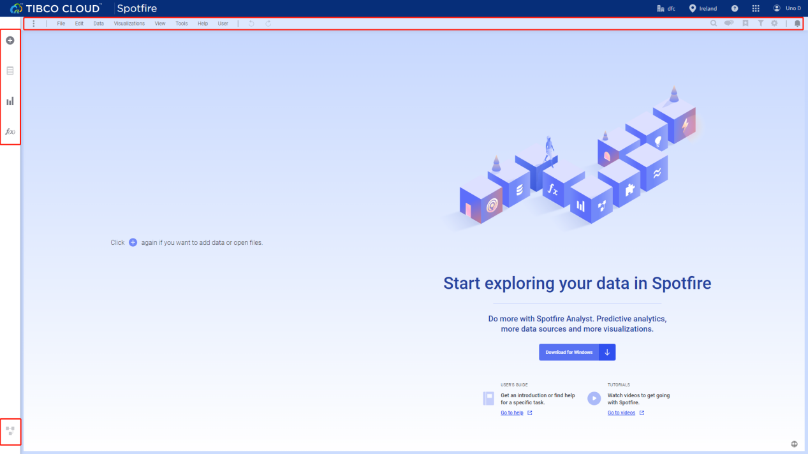

Figure 2-1 Navigation bar - Tibco Cloud Spotfire

DFC也拥有两个导航栏。左侧的导航栏展示了“搜索”、“问答”、“资源”等10个[功能模块](https://wiki.datafocus.ai/index.php/%E4%BA%A7%E5%93%81%E6%89%8B%E5%86%8C_v5.0.2" \l ".E5.8A.9F.E8.83.BD.E6.A8.A1.E5.9D.97)，之后将进行详细说明。顶部的导航栏列出了一些用户自己选择的重要看板，方便随时查看。

GIF Figure 2-2 Pin dashboard

### **数据**

\- Tibco Cloud Spotfire

通过“文件和数据”弹窗，用户可以添加新数据或打开现有分析。在“分析中的数据”弹窗中，单击列名称可以获取更多详细信息。“数据画布”弹窗会显示数据结构并提供数据转换选项，如图 2-3 所示。

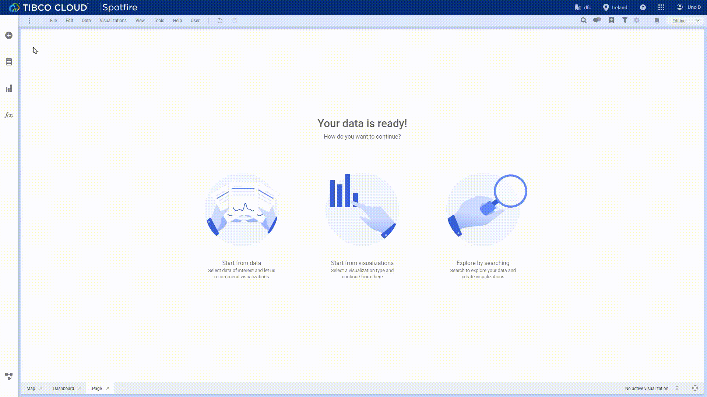

GIF Figure 2-3 Data canvas - Tibco Cloud Spotfire

**\- DataFocus Cloud**

表格模块存储了所有数据表。在数据表的详细页面，用户可以更改聚合方式、地理类型等，或者添加/叠加数据，编辑关系，预览数据，查看依赖关系等。

GIF Figure 2-4 Data table module

### 分析

\- Tibco Cloud Spotfire

“f(x)”弹窗展示一些被选中固定的数据公式，这些公式可以快速执行一些计算。而菜单栏中的“查找”按钮有助于搜索内容、操作等。前两种方式主要是搜索信息，而“分析中的数据””弹窗会显示列的详细信息以及对可视化的一些建议。

GIF Figure 2-5 Analytics - Tibco Cloud Spotfire

\- DataFocus Cloud

DFC的搜索分析模块是用户分析数据和创建可视化的地方。它由列信息、搜索框和画布组成。列显示为属性和度量，搜索框接收分析想法，而画布将想法可视化。

Figure 2-6 Analytics - DFC

### **资源**

\- Tibco Cloud Spotfire

资源在“文件和数据”弹窗中列出。如下图，用户可以在“推荐”、“样本”、团队资源、共享资源等不同选项之间进行切换。

Figure 2-7 Resources - Tibco Cloud Spotfire

**\- DataFocus Cloud**

DFC用不同的模块来管理不同的资源，例如问答、看板、表格。除此之外，资源模块列出了所有资源，其中的小导航栏可以让用户在不同种类的资源之间随意切换。

Figure 2-8 Resources - DFC

## 2.2 数据源

Tibco Cloud Spotfire有两种加载数据的方法。一是导入本地数据文件，用户可以同时上传多个文件。另一个是通过数据连接器。目前，云端版只支持直接访问Salesforce和Google Analytics的数据库。如果想要访问其他数据库，用户需要先安装客户端。

同样，DataFocus Cloud也支持上传本地文件以及外部数据源连接，支持的外部数据源如下表所示。并且，用户可以同时连接到多个数据库并一起分析它们。

除了这两种方式以外，用户还可以将数据仓库上传到系统中，这满足数十亿数据的大数据分析。更重要的是，DFC提供API接口来帮助访问可信赖的来源。

Table Figure 2-9 Data sources

## 2.3 易用性

### 2.3.1 制作可视化

在Tibco Cloud Spotfire中有三种分析数据、制作可视化的方式。

1.“分析中的数据”弹窗

如上文[第2.1.3节](#post-44792-_分析)所述，“分析中的数据”弹窗提供了列的详细信息以及给出了可视化建议。选择列和图表类型来分析数据。

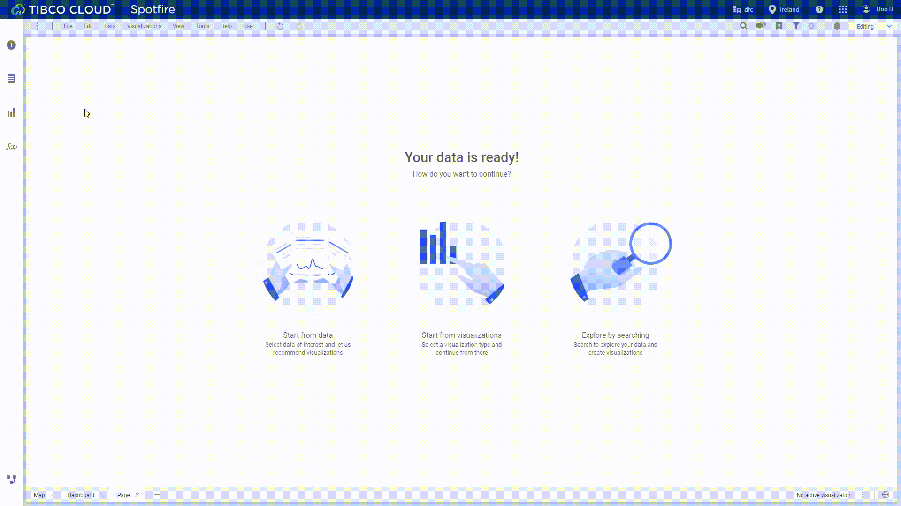

GIF Figure 2-10 Data in analysis flyout

2.“可视化类型”弹窗

或者用户可以先通过“可视化类型”弹出框选择可视化的类型，选择后系统会自动返回对应图表。

GIF Figure 2-11 Visualization type flyout

3.“搜索”按钮

除了搜索信息，菜单栏的“查找”按钮还支持可视化的推荐。输入列名，之后的操作方式与以上两种方式相同。

GIF Figure 2-12 Find button

在DataFocus Cloud中，数据分析和图表创建主要是通过搜索框进行的，主要有两种方式在搜索框中添加列名等内容。

1.单击选择

一种是从列信息区域中选择列名。用户可以一个个选择，也可以同时选择几个，或者全选。

GIF Figure 2-13 Select columns

2.输入

另一种是直接在搜索框中输入列名，用户可以输入列名、关键字和公式等不同的组合。此外，系统还会提示来帮助决定要搜索的内容。

GIF Figure 2-14 Type in search bar

以上是关于简单的列数据分析。当涉及到复杂的业务问题，例如产品名称中包含“电话”、增长率、比较不同产品等，DFC提供的搜索方式会容易得多。

通过搜索式分析，用户可以使用各种关键词直接完成分析。以下是一个用DFC分析增长率的示例。

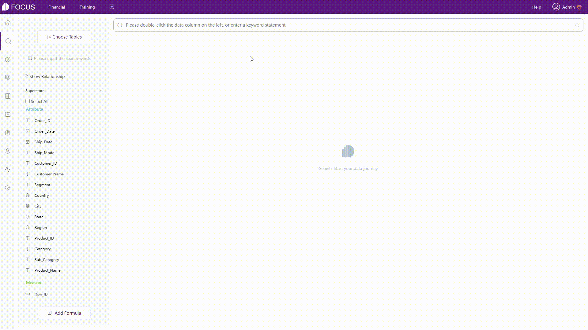

GIF Figure 2-15 Search analysis

### 2.3.2 筛选

\- Tibco Cloud Spotfire 1.标记

标记就是高亮，可以看作是筛选的一种形式。用户可以通过点击条、线、扇形等来标记。在看板中标记项目时，如果同一页面上的图表来自同一数据源，那么他们会一起被标记。

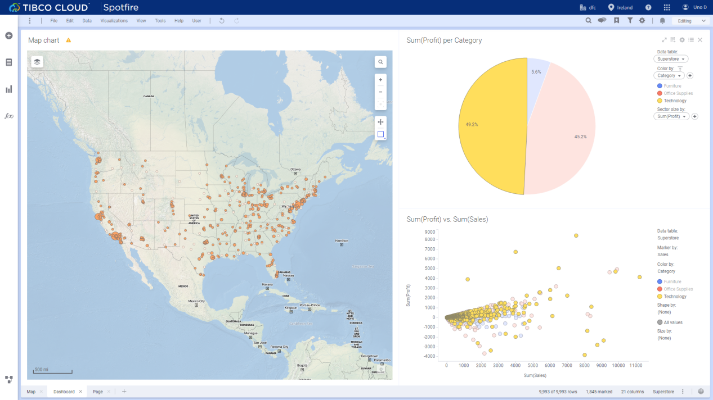

Figure 2-16 Marking 2.筛选器类型

Spotfire有七种筛选器类型，包括范围筛选器、项目筛选器、复选框筛选器等。用户可以针对不同的值使用不同的筛选器类型，如图2-17所示。 3.筛选面板

筛选器面板位于页面右侧，会显示数据表中所有列的筛选的选项。筛选条件将出现在面板的底部。在筛选面板中更改筛选条件，看板中的相关图表将被一起筛选。

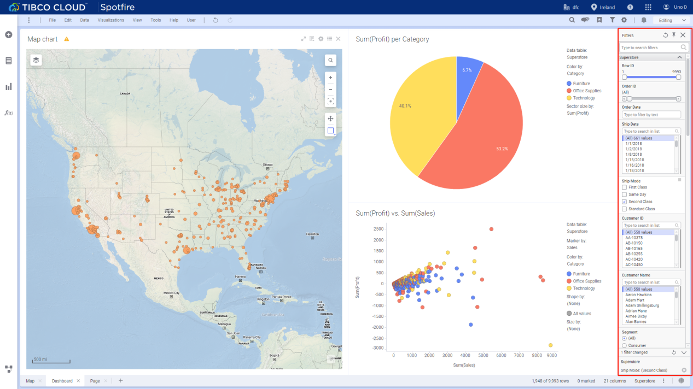

Figure 2-17 Filter pane 4.“分析中的数据”弹窗

展开“分析中的数据”弹窗，用户可以通过筛选器图标来筛选。同样，筛选条件将出现在弹窗的底部。

Figure 2-18 Flyout filter

\- DataFocus Cloud 1.高亮

与Spotfire的标记类似，单击或选择图表区域以突出显示数据。

在问答界面，如果将鼠标悬停在图表的一部分上，未高亮的区域将变灰。部分图表类型会隐藏未高亮的区域。

GIF Figure 2-19 Highlighting charts

同样，在看板中，由一个数据源制作的图表将一起高亮数据。但是，部分图表类型不会淡出未高亮显示的数据的颜色，而是隐藏该部分数据，如下所示。

GIF Figure 2-20 Highlighting dashboards 2.筛选器类型

DFC没有提供不同的筛选器显示类型，而是为时间、字符串和数字等数据类型提供了不同的筛选器类型。如下图，字符串可以被批量筛选，而另外两种数据类型的筛选器会列出最小值和最大值。

Figure 2-20 Filter types - DFC 3.问答筛选 （1）关键词

搜索分析的中心是[关键词](https://wiki.datafocus.ai/index.php/%E4%BA%A7%E5%93%81%E6%89%8B%E5%86%8C_v5.0.2" \l ".E5.85.B3.E9.94.AE.E8.AF.8D)。关键词也是一种筛选方式。例如，用户可以输入“排名 前5 的销售额”来选择5个最畅销的产品。

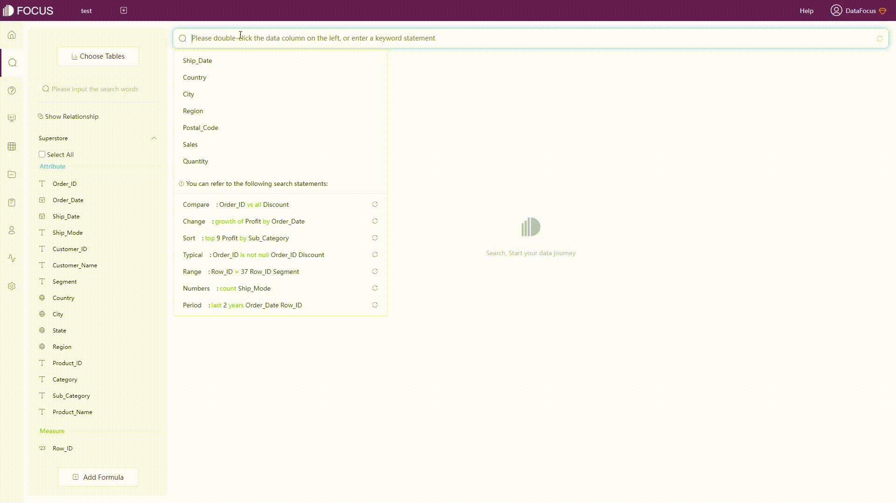

GIF Figure 2-21 Keywords （2）表格的筛选

对于网格表和数据透视表，用户可以通过设置按钮添加筛选器，如图2-20所示。 （3）图的筛选

筛选器可以通过轴添加到图表中，如下所示。

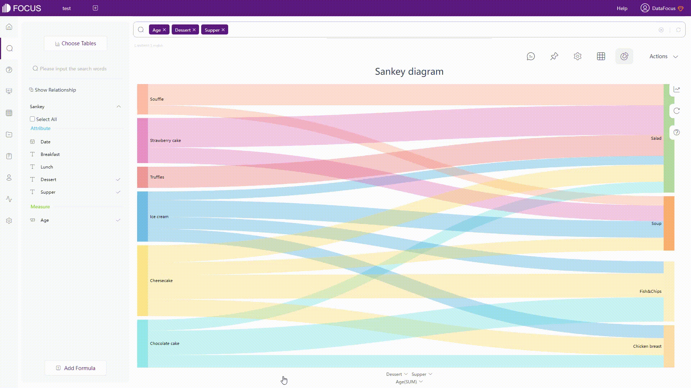

GIF Figure 2-22 Filter - graphics 4.看板筛选

如果用户选择添加筛选器组件，那么它们将显示在看板中。如下图，可以在“文本”组件下找到各种筛选组件类型。

Figure 2-23 Filter components

### 2.3.3 公式

这一节主要比较了公式编辑器。

<table><tbody><tr><td>方式</td><td>Tibco Cloud Spotfire</td><td>DataFocus Cloud</td></tr><tr><td>公式类型</td><td>转换，排名，空间，统计，文本，......</td><td>聚合、分析、转换、日期、字符串、JSON、...</td></tr><tr><td>提示</td><td>公式名，列名</td><td>公式名，列名，格式</td></tr><tr><td>描述&amp;示例</td><td>悬浮文本</td><td>公式助手</td></tr><tr><td>验证</td><td>错误提示</td><td>自动</td></tr></tbody></table>

1.公式类型

这两个工具都提供了各种类型的公式，Tibco Cloud Spotfire有一些统计和空间公式，而DFC有一些分析和JSON[公式](https://wiki.datafocus.ai/index.php/%E4%BA%A7%E5%93%81%E6%89%8B%E5%86%8C_v5.0.2" \l ".E5.85.AC.E5.BC.8F.E5.88.97.E8.A1.A8)。 2.提示

如gif图 2-24 所示，Tibco Cloud Spotfire会提示公式名和列名。

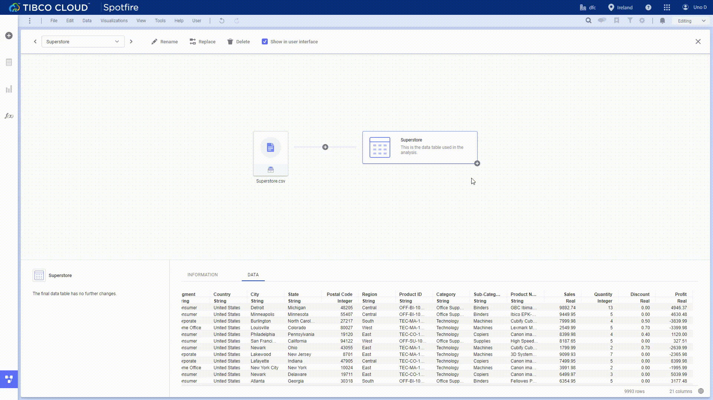

GIF Figure 2-24 Prompt - Tibco

除了公式名和列名，DFC还提供语法提示，以帮助用户快速构建公式。

GIF Figure 2-25 Prompt - DFC 3.描述&示例

两个平台都提供描述和示例等帮助。

不同的是，Tibco Cloud Spotfire中的描述窗口是悬停的，不能持续显示，而DFC中的公式助手会停留在公式编辑器的右侧，以持续提供信息。

Figure 2-26 Description window - Tibco Cloud Spotfire

Figure 2-27 Description window - DFC 4.验证

单击“确定”，如果公式不合适，则Tibco Cloud Spotfire的窗口会弹出错误消息。而公式在DFC中是自动实时验证的，如下所示。

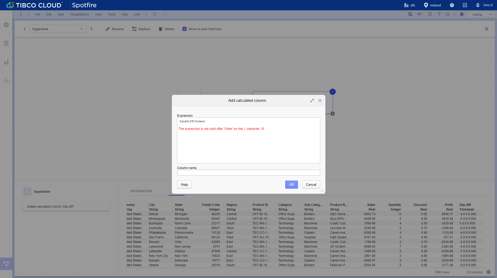

Figure 2-28 Validation - Tibco Cloud Spotfire

Figure 2-29 Validation - DFC

## 2.4 数据处理

1.添加行

Tibco Cloud Spotfire:

在通过“文件和数据”弹窗或“数据画布”添加新数据时，可以添加行。以下是“数据画布”添加行的示例。

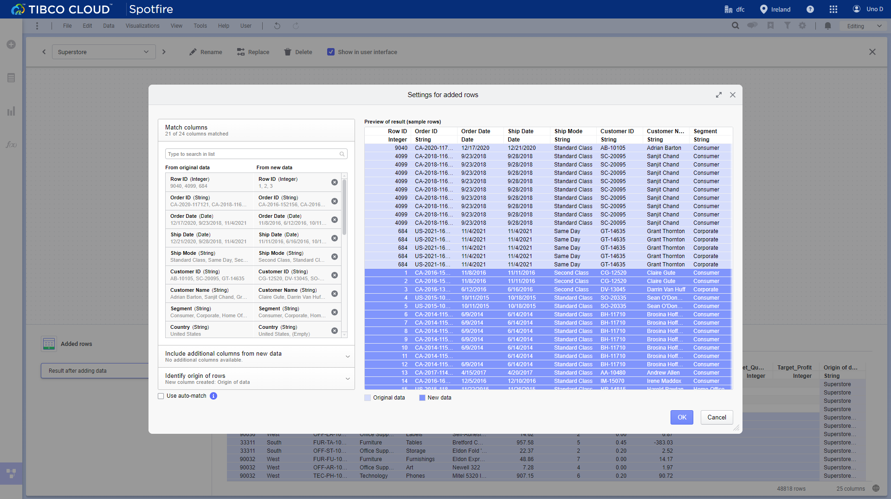

Figure 2-30 Add rows - Tibco Cloud Spotfire

DataFocus Cloud:

在数据表详情页面，用户可以添加新数据或覆盖整个数据表，如下图所示。

Figure 2-31 Add rows - DFC 2.添加列

要添加列值，首先需要关联表，Tibco Cloud Spotfire和DFC都提供了几种不同的连接类型。并且，DFC还支持在关联关系上添加筛选器，如下所示。

Figure 2-32 Add columns - Tibco Cloud Spotfire

Figure 2-33 Add columns - DFC 3.行列转换

Tibco Cloud Spotfire:

“逆透视”功能可以将具有相似值的几列组合成一列。但是，当涉及到相对较为复杂的数据结构时，逆透视功能可能无法满足用户的需求。

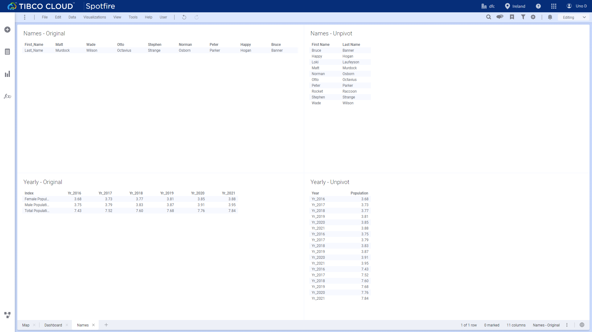

Figure 2-34 Unpivot - Tibco Cloud Spotfire

DataFocus Cloud:

在DFC中，即使数据结构较为复杂，行和列仍可以自由转换。

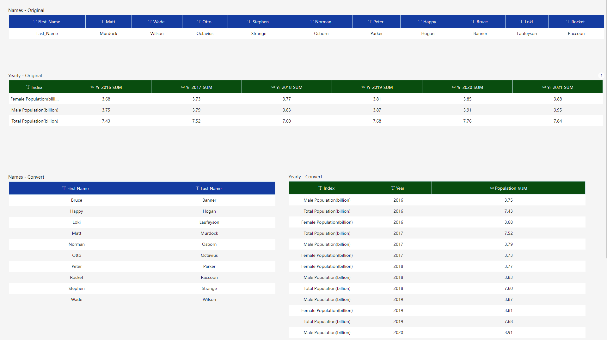

Figure 2-35 Convert rows&columns - DFC 4.拆分列

Tibco Cloud Spotfire:

用户可以通过“分析中的数据”弹窗来拆分列。如图2-36所示，用户可以选择分隔符、列数等，并且系统有提供预览。

Figure 2-36 Split columns- Tibco Cloud Spotfire

DataFocus Cloud:

用户可以通过“操作”按钮下的“数据转换”来拆分列。如下图，用户可以选择分割数和分隔符，并且分隔符可以添加多个。

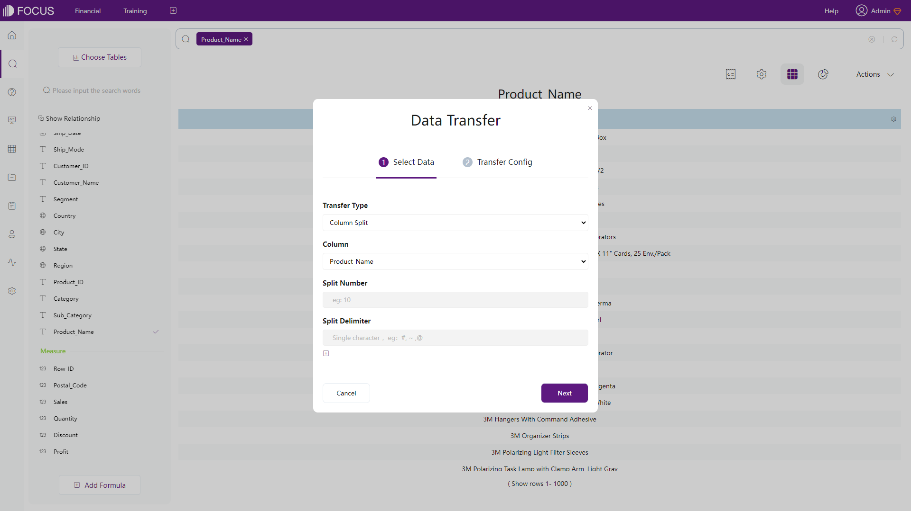

Figure 2-37 Split columns - DFC

除了上面提到的数据处理的方式之外，DFC还支持中间表来帮助清理数据，例如转换、合并、过滤等。另外，即将到来的DataSpring将提供更强大的数据处理能力。

## 2.5 可视化

### 2.5.1 表格

Tibco Cloud Spotfire和DataFocus Cloud都有这两种类型的表：表格（在DFC中称为网格表）和交叉表。 DFC还提供数据透视表。 1.表格&数值表

表格以行和列的形式展示数据的详细信息。两个平台都提供改变颜色、对齐方式，DFC的[数值表](https://wiki.datafocus.ai/index.php/%E4%BA%A7%E5%93%81%E6%89%8B%E5%86%8C_v5.0.2" \l ".E8.A1.A8.E6.A0.BC.E5.B1.9E.E6.80.A7)还提供设置标题行、总行、热图模式等设置。

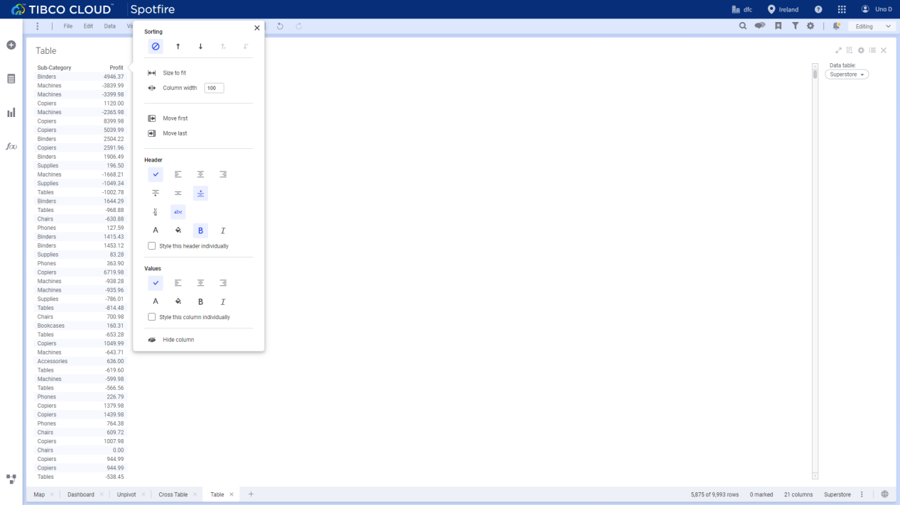

Figure 2-38 Table - Tibco Cloud Spotfire

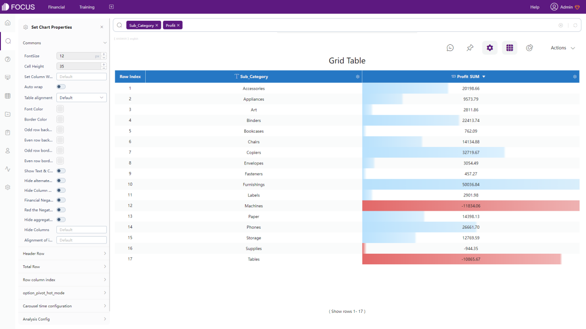

Figure 2-39 Grid table - DFC 2.交叉表

交叉表展现多维数据，适用于复杂的业务场景。用户可以添加总计和小计。此外，DFC 的交叉表还提供固定行列的选项，以便在移动表时固定某些列或行。

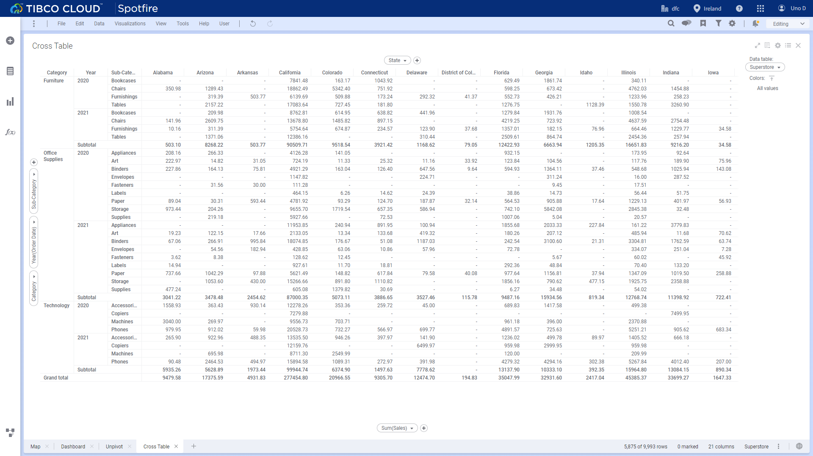

Figure 2-40 Cross table - Tibco Cloud Spotfire

Figure 2-41 Cross table - DFC 3.数据透视表

数据透视表可以汇总大量数据。配置类似于数值表。

Figure 2-42 Pivot table - DFC

### 2.5.2 图

Tibco Cloud Spotfire支持12种图表（包括表格），DataFocus Cloud支持50多种图表。就像上面提到的一样，这两种工具都为图表提供了不同的配置。 DFC拥有高度的定制化配置，用户可以自由地创建自己的图表，如添加悬浮文本、标签等。该节比较了四种不同类别的图表。 1.常用图表

两个平台都提供条形图、折线图、组合图、饼图等。

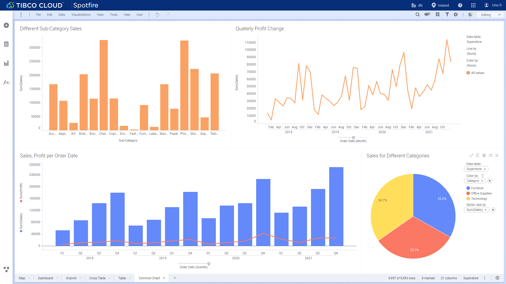

Figure 2-43 Common charts - Tibco Cloud Spotfire

Figure 2-44 Common charts - DFC 2.地图

Tibco Cloud Spotfire有1种地图。用户可以使用不同的颜色、形状和大小来添加更多细节。

Figure 2-45 Map - Tibco Cloud Spotfire

DFC提供GIS位置图、经纬度位置图、轨迹图、3D散点图等，用户还可以导入自定义地理数据。

Figure 2-46 Maps - DFC 3.高阶图表

示例：瀑布图、矩形树图、散点图、平行坐标图。

Figure 2-47 Advanced charts - Tibco Cloud Spotfire

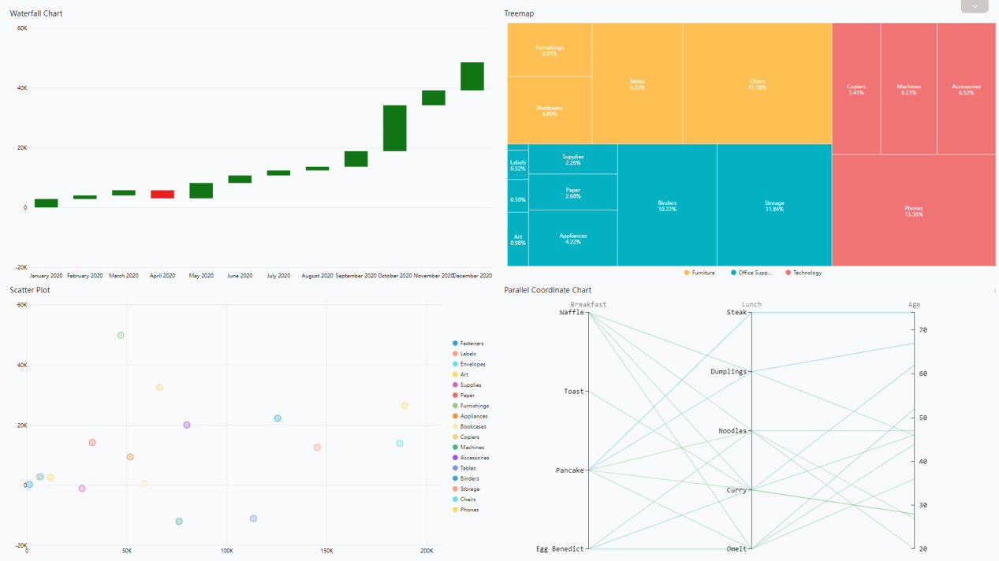

Figure 2-48 Advanced charts 1 - DFC

DFC中的其他示例：雷达图、旭日图、相关热力图、桑基图等。

Figure 2-49 Advanced charts 2 - DFC 4.动态图表

DFC还支持动态图表，如时间序列气泡图、3D地球飞线图等。

GIF Figure 2-50 Time series bubble chart

GIF Figure 2-51 3D globe fly line

### 2.5.3 看板

<table><tbody><tr><td>方面</td><td>Tibco Cloud Spotfire</td><td>DataFocus Cloud</td></tr><tr><td>看板尺寸</td><td>固定</td><td>定制化</td></tr><tr><td>布局</td><td>拖拽</td><td>自由布局 &amp; 网格布局</td></tr><tr><td>背景</td><td>定制化</td><td>定制化</td></tr><tr><td>多个看板</td><td>页面</td><td>轮播</td></tr><tr><td>更多</td><td>/</td><td>交互对象、看板模板</td></tr></tbody></table>

1.看板尺寸

Tibco Cloud Spotfire的看板具有恒定大小，如前面图表部分所示。

DFC中的看板有多种尺寸可供选择，用户可以在预设尺寸和自定义尺寸之间进行选择。

GIF Figure 2-52 Dashboard size - DFC 2.布局

在Tibco Cloud Spotfire中，拖拽图表到不同位置以改变布局。其他图表也会调整相应位置，如下图所示。

GIF Figure 2-53 Layout - Tibco Cloud Spotfire

DFC提供了两种布局模式，用户可以选择从网格中获取帮助，也可以选择自由放置组件。

GIF Figure 2-54 Layouts - DFC 3.背景

如下图所示，在Tibco Cloud Spotfire中，用户可以选择不同的画布样式，并且可以编辑自定义主题颜色等。

Figure 2-55 Background - Tibco Cloud Spotfire

在DFC中，用户可以选择不同颜色的背景，也可以上传图片作为背景。

Figure 2-56 Background - DFC 4.多个看板

Tibco Cloud Spotfire利用“页面”来切换和显示不同的看板，DFC则利用看板轮播来做到这一点。

GIF Figure 2-57 Multiple dashboards - Tibco Cloud Spotfire

GIF Figure 2-58 Multiple dashboards - DFC 5.更多

DataFocus Cloud提供了许多不同的自定义选项。用户不仅可以添加各种交互对象和[自定义组件](https://wiki.datafocus.ai/index.php/%E4%BA%A7%E5%93%81%E6%89%8B%E5%86%8C_v5.0.2" \l ".E8.87.AA.E5.AE.9A.E4.B9.89.E7.BB.84.E4.BB.B6)，还可以直接使用看板模板进行可视化。

Figure 2-59 Dashboard templates

## 2.6 资源管理

\- Tibco Cloud Spotfire

数据表、看板等资源主要与分析一起存储。如[第2.1.4节](#post-44792-_资源)所述，可以通过“文件和数据”弹窗的文件夹来管理分析等资源。

\- DataFocus Cloud

包括数据表、问答（图表）、看板等在内的资源存储在不同的模块中。用户可以在不同的模块之间切换以查看资源。“资源”模块列出了所有资源。更重要的是，DFC提供标签来帮助管理资源。

GIF Figure 2-60 Resource management - DFC

## 2.7 协作

### 2.7.1 评论

Tibco Cloud Spotfire和DataFocus Cloud都支持添加评论的功能。用户可以添加评论并相互交流，如下图所示。

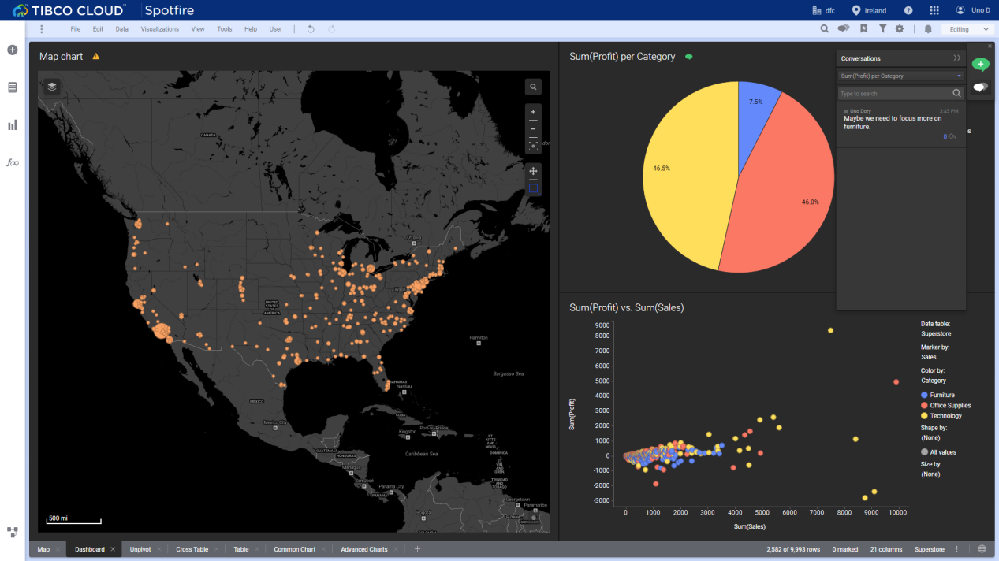

Figure 2-61 Comments - Tibco Cloud Spotfire

Figure 2-62 Comments - DFC

### 2.7.2 角色

两个系统都使用角色来为团队成员分配权限。

\- Tibco Cloud Spotfire

系统共有三种角色，使用者、作者和分析师。此处的角色决定用户是否可以编辑分析、用户可以访问哪些功能等。并且，一个用户只能拥有一个角色。

\- DFC

[角色](https://wiki.datafocus.ai/index.php/%E4%BA%A7%E5%93%81%E6%89%8B%E5%86%8C_v5.0.2" \l ".E8.A7.92.E8.89.B2)有两种类型，系统角色和自定义角色。为角色分配权限，并赋予成员不同的角色，然后不同的成员对不同的资源可以具有不同的权限。例如，“销售经理”可以编辑任何与销售相关的资源，而“销售-项目甲”只能编辑项目甲中与销售相关的资源。

除此之外，DFC的[组织架构](https://wiki.datafocus.ai/index.php/%E4%BA%A7%E5%93%81%E6%89%8B%E5%86%8C_v5.0.2" \l ".E7.BB.84.E7.BB.87.E6.9E.B6.E6.9E.84)可以更好地帮助管理团队成员。

### 2.7.3 分享

\- Tibco Cloud Spotfire

资源主要通过文件夹来共享，或者用户可以将分析导出为图片或pdf，然后共享。

Spotfire共有四个共享级别，“公开”表示任何人都可以编辑该内容，“共享”表示内容仅供选定的人群使用，“私人”内容仅供作者使用，而“团队文件夹”中的资源可以在整个团队中共享。

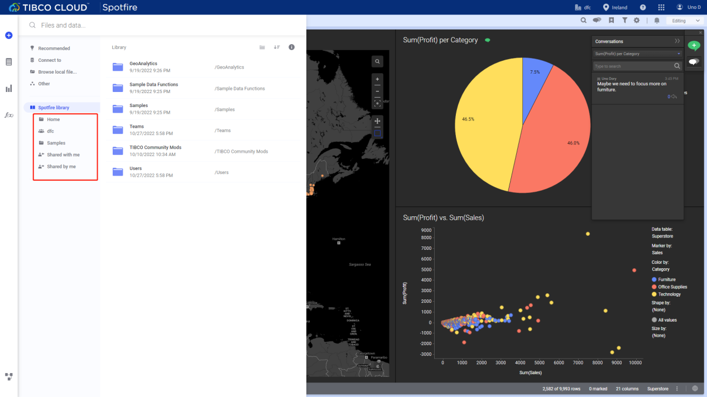

Figure 2-63 Share - Tibco Cloud Spotfire

\- DFC

DFC中的[分享](https://bbs.datafocus.ai/topic/22)方式有很多种，例如系统内分享、导出、使用外部查看地址等，其中主要的方式是通过角色来分享。如前所述，用户可以为不同的角色分配对不同资源的不同权限。结合项目，跨团队共享资源非常快捷。

Figure 2-64 Roles - DFC

## 2.8 成本

Tibco Cloud Spotfire的收费计划是根据角色和容量来定的。每个用户都需要购买一个角色，这对团队来说成本很高，而且这种方式很难在大量用户中传播。成本会线性增加，并且很难评估。

<table><tbody><tr><td>分析师</td><td>作者</td><td>使用者</td><td>额外存储</td></tr><tr><td>$125 / 月

或

$1250 / 年</td><td>$65 / 月

或

$650 / 年</td><td>$25 / 月

或

$250 / 年</td><td>$25 / 月

或

$250 / 年</td></tr></tbody></table>

Table Figure 2-65 Cost - Tibco Cloud Spotfire

DataFocus Cloud按容量收费，因此成员数量不是很重要。团队会发现这种收费方式更公平、更容易传播。定价计划如下所示：

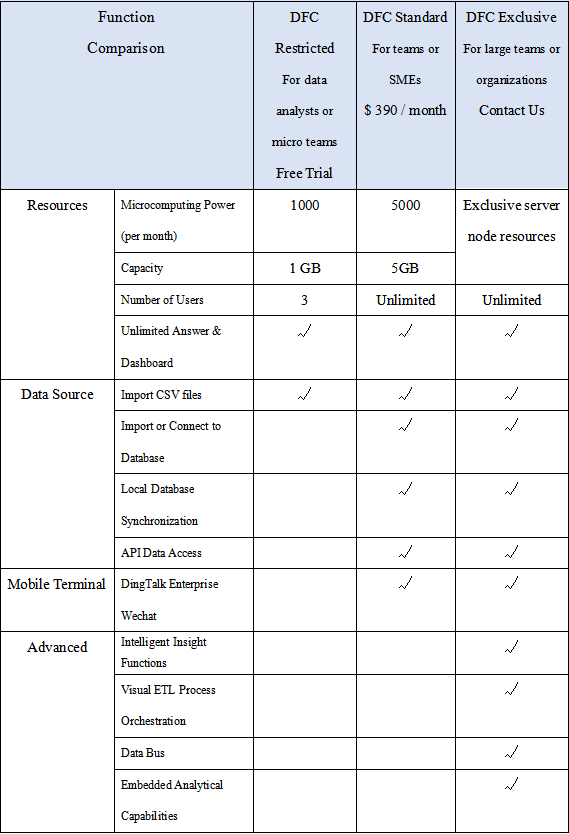

Table Figure 2-66 Cost - DFC

# 总结

这两款BI产品都提供沉浸式的可视化分析，以帮助做出数据驱动的决策。 Tibco Cloud Spotfire和DataFocus Cloud的异同在本文中进行了说明。

Tibco Cloud Spotfire通过弹窗提供方便的可视化操作。用户可以使用页面在不同的看板之间快速切换。此外，库中的函数可以帮助获得分析数据的灵感。

DFC提供了一个全面的系统来进行搜索式分析，帮助商业精英更好地理解数据的价值。团队可以在整个广泛的系统中轻松协作。DataFocus Cloud将继续让用户体验更好。点击这里试试：[DFC](https://www.datafocus.ai/)。
