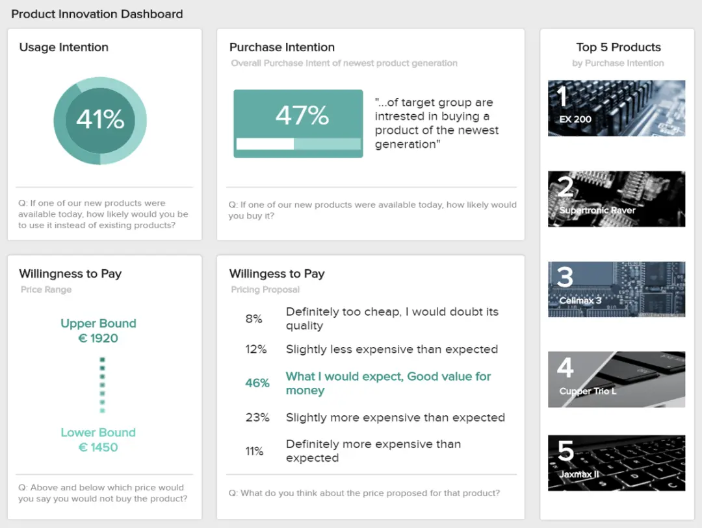

自古以来，企业一直在制作报告。无论您从事什么角色或行业，您都可能面临生成繁琐报告以显示您的进度或绩效的任务。

虽然报告几十年来一直是一种常见的做法，但商业世界不断发展，随着竞争的行业竞争日益激烈，生成快速准确的报告的需求变得至关重要。这对当今的许多现代组织来说是一个问题，因为构建报告可能需要数小时到数天的时间。事实上，德勤（Deloitte）对管理报告进行的一项调查显示，50%的经理对交付速度和收到的报告质量不满意。

 

考虑到这个问题，已经开发了几种[BI工具](https://www.datafocus.ai/infos/best-bi-tools-software-review-list)，以帮助企业只需单击几下即可生成交互式报告。促进公司与其数据交互的方式并改进其决策过程。

但是，由于每天使用如此多类型的报告，您如何知道何时使用它们？在这篇文章中，我们将介绍 10 种最常见的报告类型，并提供一些何时使用它们的示例。此外，我们将看到[在线仪表板](https://www.datafocus.ai/infos/online-dashboard)如何推翻经典报表的静态性质，并让位于更快、更具交互性的数据处理方式。

让我们从简短的报表定义开始吧！

 

您的机会：[想免费测试现代报告软件吗？](https://www.datafocus.ai/console)试试我们的 14 天免费试用版，立即开始构建交互式报告！

## 什么是报表定义？

报表是以有组织且易于理解的格式呈现相关业务信息的文档。每份报告都针对特定的受众和业务目的，并根据目标和目的总结不同活动的绩效。

也就是说，有各种类型的报告可用于不同的目的，而是您想跟踪策略的进度或遵守金融法律，每个任务都有不同的报告。为了帮助您确定何时使用它们，我们将介绍当今企业最常用的 10 种报告格式。

## 报告有哪些不同类型？

### 1\. 信息报告

报告类型列表中的第一个是信息报告。顾名思义，此报告类型旨在提供有关特定主题的事实数据。这可以包括绩效报告、费用报告、理由报告等。与这些报告的一个区别在于它们的客观性，它们只是为了提供信息，而不是提出解决方案或假设。常见的信息报告示例用于性能跟踪，例如年度、每月或[每周报告](https://www.datafocus.ai/infos/weekly-report-templates)。

### 2\. 分析报告

此报告类型包含一系列有用的信息，通过定性和定量数据以及实时和历史数据的混合来促进决策过程。与纯粹告知用户主题的信息报告不同，此报告类型还旨在提供有关后续步骤的建议并帮助解决问题。有了这些信息，企业就可以根据分析证据而不是简单的直觉来制定战略。通过使用正确的[BI报告工具](https://www.datafocus.ai/infos/bi-reporting)，企业可以通过预测分析技术生成分析报告，其中包括准确的预测。让我们用一个分析报告示例来看一下它。

\*\*点击放大\*\*

上面的例子完美地代表了[分析报告](https://www.datafocus.ai/infos/analytical-report-example-and-template)如何提高企业的绩效。通过获取销售机会、概率率以及基于历史数据的准确管道价值预测等详细信息，销售团队可以提前制定策略，解决任何低效率问题，并做出明智的决策以提高效率。

### 3\. 运营报告

这些报告跟踪公司运营任务的每个相关细节，例如其生产过程。它们通常是短期报告，因为它们旨在描绘当前的图景。企业使用这种类型的报告来发现任何问题并定义他们的解决方案，或确定改进机会以优化其运营效率。[运营报告](https://www.datafocus.ai/infos/strategic-operational-reporting)通常用于制造、物流和零售，因为它们有助于跟踪库存、生产、成本等。

### 4\. 产品报告

顾名思义，此报告类型用于监视与产品性能和开发相关的几个方面。企业经常使用它们来跟踪他们的哪些产品或订阅在给定时间段内销售最多，计算库存或查看客户最看重的产品类型。这些报告的另一个常见用例是研究新产品的实施或开发现有产品。让我们通过一个视觉示例更详细地了解它。

\*\*点击放大\*\*

上图是一份产品报告，显示了有关使用意图、购买意向、支付意愿等的宝贵见解。在这种情况下，该报告基于旨在了解目标客户将如何获得新产品的调查的答案。通过此报告类型获得这种级别的见解对企业非常有用，因为它允许他们在新产品方面进行明智的投资，并根据客户的支付意愿设定切合实际的定价。

### 5\. 行业报告

在我们的最常见报告类型列表中的下一个，我们有行业特定的报告。通常，这些报告提供特定行业、市场或部门的概述，包括定义、主要趋势、领先公司、行业规模等。对于想要进入特定行业并希望了解其竞争力的企业或希望根据平均行业价值设定绩效基准的公司，它们特别有用。

### 6\. 部门报告

这些报告特定于每个部门或业务职能。它们是经理和团队成员之间的沟通工具，他们需要保持联系并为共同目标而共同努力。相反，销售部门、客户服务、物流或财务，这些特定的报告类型有助于在更深层次上跟踪和优化绩效。让我们以团队绩效报告为例来看一下。

\*\*点击放大\*\*

上图是使用[在线数据分析工具](https://www.datafocus.ai/infos/data-analysis-tools)创建的部门报告，它正在跟踪支持团队的绩效。这份富有洞察力的报告显示了相关指标，例如表现最佳的座席、净推荐值、首次联系解决率等。掌握这些信息不仅可以帮助团队的每个成员跟踪他们的个人绩效，还可以让经理了解谁需要更多培训以及谁表现最佳。

### 7\. 进度报告

从信息报告的早午餐中，进度报告提供有关项目状态的关键信息。这些报告可以由员工或经理每天、每周或每月生成，以跟踪绩效并微调任务，以便更好地开发项目。进度报告通常用作支持会议和讨论的视觉材料，一个很好的例子是[KPI 记分卡](https://www.datafocus.ai/infos/kpi-scorecard-examples-templates-to-track-performance)。

### 8\. 内部报告

内部报告是一种包含此列表中的许多其他报告类型的报告，是指公司内部使用的任何类型的报告。它们在团队成员和部门之间传递信息，以保持有关目标和业务目标的沟通畅通。

\*\*点击放大\*\*

如上所述，内部报告是有用的沟通工具，可以让组织中的每一位相关人员了解情况并参与其中。这份[医疗保健报告](https://www.datafocus.ai/infos/healthcare-report-benefits-and-examples)旨在做到这一点。通过深入了解医院不同部门和区域（如住院和门诊患者、平均等待时间、治疗成本等）的绩效，医疗保健经理可以准确分配资源和计划时间表，并实时监控任何变化或问题。

### 9\. 外部报告

尽管此处列出的大多数报告类型都用于内部目的，但并非所有报告都旨在闭门使用。创建外部报告的目的是与客户或投资者等外部利益相关者共享信息，以承担预算或进度责任，并与政府机构共享信息，以遵守法律要求。

\*\*点击放大\*\*

上图是来自 IT 项目的外部[客户报告](https://www.datafocus.ai/infos/client-dashboard-report-examples)的完美示例。这份富有洞察力的报告提供了有关项目发展的每个相关方面的直观概述。从截止日期、预算使用情况、完成阶段和任务分解，客户可以充分了解并参与项目。

### 10\. 纵向和横向报告

最后但并非最不重要的一点是，在我们对前 10 种类型的报告的概述中，我们有垂直和横向报告。此报告类型是指报告传输的方向。垂直报表旨在向上或向下移动层次结构，例如，管理报表。而横向报告有助于处于同一层次结构级别的组（例如财务和营销部门）之间的组织和沟通。

 

您的机会：[想免费测试现代报告软件吗？](https://www.datafocus.ai/console)试试我们的 14 天免费试用版，立即开始构建交互式报告！

## 报表是什么样的？

现在我们已经介绍了最相关的报告类型，我们将回答这个问题：报告是什么样的？

正如本有见地的指南开头所提到的，静态报告已成为过去。随着[自助式 BI 工具](https://www.datafocus.ai/infos/self-service-bi-tools)等现代技术的兴起，以业务仪表板的形式使用交互式报表在公司中越来越受欢迎。

与需要时间生成且难以理解的静态报告不同，仪表板很直观。它们的视觉特性使它们易于任何类型的用户理解，并且它们为企业提供了其最重要的绩效指标的中心视图，以改进决策过程。在这里，我们将介绍来自不同行业和功能的 10 个有用的仪表板示例，以正确看待[仪表板报告](https://www.datafocus.ai/infos/dashboard-reporting)的价值。

### 1\. 财务报告

\*\*点击放大\*\*

控制财务状况对于成功至关重要。这份财务报告概述了公司监控其经济活动所需的最重要的[财务](https://www.datafocus.ai/infos/daily-weekly-monthly-financial-report-examples)指标，并回答了确保健康财务状况的重要问题。

凭借对流动性、发票、预算和一般财务稳定性的见解，管理人员可以提取长期和短期结论，以减少效率低下，对未来绩效做出准确预测，并保持业务的整体财务效率。例如，获得业务营运资金的详细计算可以让您了解公司的流动性。如果它高于预期，这意味着你有投资和增长的潜力。

### 2\. 营销报告

\*\*点击放大\*\*

我们的下一个示例是营销[报告](https://www.datafocus.ai/infos/daily-weekly-monthly-marketing-report-examples)，可确保营销工作获得健康的投资回报。此类报告提供了过去 12 周广告系列效果的详细概览。通过访问此信息，您可以通过提供有针对性的体验来最大化促销活动的价值，让您的受众参与其中。

例如，您可以实施不同的广告系列格式作为测试，然后比较哪种格式对您的业务最成功。这要归功于对重要营销指标的监控，例如点击率 （CTR）、每次点击成本 （CPC）、每次获取成本 （CPA） 等。

此报表的视觉性质使重要见解一目了然。例如，顶部的四个[指标图](https://www.datafocus.ai/infos/gauge-chart-examples)显示所有广告系列的总支出以及每个广告系列的总预算已使用量。在短短几秒钟内，您就可以看到您是否达到了满足每个广告系列的营销预算的目标。

### 3\. 销售报告

\*\*点击放大\*\*

像上面这样的直观销售仪表板是监控和优化[销售](https://www.datafocus.ai/infos/dashboard-examples-and-templates-sales)业绩的完美分析工具。凭借强大的高级指标，这种报告类型对于经理、高管和销售副总裁来说特别有趣，因为它提供了相关数据以确保战略和运营成功。

此销售报告的价值在于，它提供了做出明智[销售](https://www.datafocus.ai/infos/sales-report-kpi-examples-for-daily-reports)决策所需的相关数据的完整和全面的概述。例如，在仪表板的顶部，您可以获得重要的指标，例如销售数量、收入、利润和成本，所有这些都与设定的目标和上一个时间段进行了比较。在制定成功的销售策略时，使用历史数据至关重要，因为它们提供了未来可能发生的事情的图景。能够在一个屏幕中筛选所有数据是现代仪表板报告的主要优势。

### 4\. 人力资源报告

\*\*点击放大\*\*

我们的下一个报表示例是关于[人力资源分析](https://www.datafocus.ai/infos/workforce-people-hr-analytics)的。人力资源部门需要跟踪大量数据，例如员工绩效和效率。但总的来说，他们需要确保员工快乐并在健康的环境中工作，因为不快乐的员工队伍会严重损害公司。借助这个直观的仪表板，这一切都可以实现。

这份以员工为中心的报告提供了全面的指标组合，深入探讨了确保成功劳动力管理所需的每个主要元素。例如，我们看到仪表板的顶部以 3 种不同的方式涵盖缺勤情况：年平均值、目标为 3.8% 的缺勤率和过去 5 年的缺勤率。详细跟踪缺勤率很有帮助，因为它可以告诉您员工是否跳过了工作日。如果利率超过预期目标，那么您需要更深入地挖掘原因并找到可持续的解决方案。

另一方面，仪表板的第二部分涵盖了整体劳动效率 （OLE）。这可以根据人力资源部门预定义的特定标准进行跟踪，并帮助他们了解员工是否正在实现目标或他们需要额外的培训或帮助。

### 5\. 管理报告

\*\*点击放大\*\*

管理人员需要监控大量数据，以确保业务平稳运行。其中之一是投资者关系。该[管理仪表板](https://www.datafocus.ai/infos/dashboard-examples-and-templates-management)侧重于股东在投资前需要查看的高级指标，例如资产回报率、股本回报率、债务权益比率、股价等。

通过了解这些重要指标的概述，投资者可以轻松提取所需的信息，以便就贵公司的投资做出明智的决定。例如，资产回报率衡量公司资产用于产生利润的效率。有了这些信息，投资者可以了解与市场上其他公司相比，贵公司部署可用资源的效率如何。另一个很好的指标是股票王子，你的股价涨幅越高，你的股东从他们的投资中赚的钱就越多。

### 6\. 信息技术报告

\*\*点击放大\*\*

就像此列表中涵盖的所有其他部门和部分一样，IT 部门特别可以从这些类型的报告中受益。由于有如此多的技术问题需要解决，因此对一种可视化工具的需求变得至关重要，该工具将帮助 IT 专家保持其所有工作负载的正轨。

如上图所示，此[IT 仪表板](https://www.datafocus.ai/infos/dashboard-examples-and-templates-it)提供有关不同系统指标的详细信息。对于初学者，我们可以直观地了解每台服务器的状态，然后是显示每周正常运行时间和停机时间的详细图表。这些信息与最常见的市中心问题和一些票务管理数据相辅相成。获得这种级别的洞察力有助于您的 IT 员工了解正在发生的事情以及何时发生，并找到适当的解决方案来避免这些问题再次发生。持续跟踪这些指标将确保强大的系统性能。

### 7\. 采购报告

\*\*点击放大\*\*

下一个报告示例是使用直观的采购[分析软件](https://www.datafocus.ai/infos/business-intelligence-procurement)构建的，它提供了采购部门需要定期使用的各种指标的一般视图。

这个直观的[采购仪表板](https://www.datafocus.ai/infos/dashboard-examples-and-templates-procurement)可以过滤、向下钻取并与数据交互，提供关键信息，以确保与供应商的健康关系。通过合规率、供应商数量或采购订单周期时间等指标，采购团队可以对不同的供应商进行分类，定义每个供应商与公司的关系，并优化流程以确保公司保持盈利。

### 8\. 客户服务报告

\*\*点击放大\*\*

在我们的报告示例列表之后，有一个来自支持区域。该仪表板配备了强大的[客户服务 KPI](https://www.datafocus.ai/infos/kpi-examples-and-templates-customer-service)，是监控绩效、发现趋势、识别优势和劣势以及提高客户支持部门整体效率的有用工具。

这个完整的仪表板涵盖了客户支持的收入和成本以及客户满意度等方面，对于需要从绩效和运营角度关注每个小细节的经理来说，这是一个完美的工具。例如，通过监控您的客户服务成本并将其与收入进行比较，您可以了解您是否在支持流程中投入了正确的金额。这可能与您的座席解决问题的平均时间直接相关，解决支持票证所需的时间越长，花费的钱就越多，带来的收入就越少。如果您发现您的代理需要很长时间来解决某个问题，您可以考虑一些训练实例来帮助他们减少此数字。

### 第9章 市场调查报告

\*\*点击放大\*\*

如果没有[市场研究报告](https://www.datafocus.ai/infos/market-research-results-and-reports-example)，此报告类型示例列表将不完整。市场研究机构处理来自调查和其他研究来源的大量信息。考虑到所有这些因素，对于这个行业来说，对可以过滤以进行更深入交互的报告的需求变得比其他任何行业都更加必要。

上图是一个品牌分析仪表板，显示有关公众如何看待品牌的调查结果。仪表板包含不同的图表类型，便于直观地理解数据。例如，具有不同颜色的地图可让您快速了解每个年龄范围所在的区域。可以进一步过滤数据以查看每个组的详细答案以进行更深入的分析。

### 10\. 社交媒体报告

\*\*点击放大\*\*

最后但并非最不重要的一点是，我们有一个[社交媒体报告](https://www.datafocus.ai/infos/social-media-reports-examples-and-templates)。这个记分卡格式的仪表板监控 4 个主要社交媒体渠道的表现：Facebook、Twitter、Instagram 和 YouTube，它可以作为一个完美的视觉概览来跟踪不同社交媒体的努力和成就的表现。

跟踪关注者、展示次数、点击次数、参与率和转化率等相关指标，此报告类型可作为完美的进度报告，向需要查看其社交渠道状态的经理或客户显示。每个指标都以其实际值显示，并与设定的目标进行比较。第四列中的绿色和红色可让您快速了解指标是否超出或低于其预期目标。

如果您从此列表中受到启发，那么我们建议您查看我们的[仪表板示例](https://www.datafocus.ai/infos/dashboard-examples-and-templates)库，您可以在其中找到来自不同行业、功能和平台的 80+ 多个模板，以获得额外的灵感！

 

您的机会：[想免费测试现代报告软件吗？](https://www.datafocus.ai/console)试试我们的 14 天免费试用版，立即开始构建交互式报告！

## 每个业务和目的的报告类型

正如我们在这篇文章中看到的那样，企业在日常活动中将不同的报告格式用于各种目的。在这篇文章中，我们介绍了前 10 种最常见的问题，并为您提供了仪表板报告如何彻底改变企业处理报告流程的方式的示例。

借助现代工具和解决方案，报告不一定是一项繁琐的任务。组织中的任何人都可以依靠数据进行决策，而无需技术技能。相反，您希望让您的团队保持联系或向投资者或客户展示进度，因此该工作有一个报告类型。为了让您保持头脑清醒，以下是本文涵盖的前 10 种报告类型：

- 信息报告
- 分析报告
- 运营报告
- 产品报告
- 行业报告
- 部门报告
- 进度报告
- 内部报告
- 外部报告
- 纵向和横向报告

如果您想立即开始构建自己的报告，那么您应该免费试用我们的 BI 报告软件[14 天](https://www.datafocus.ai/console)！
