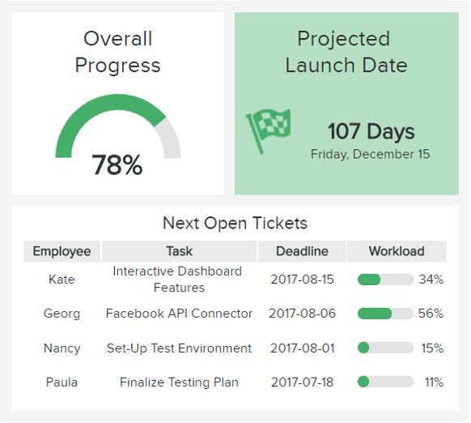
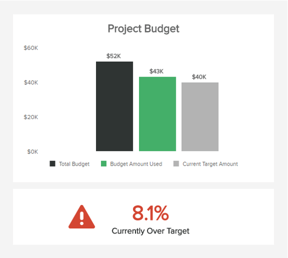
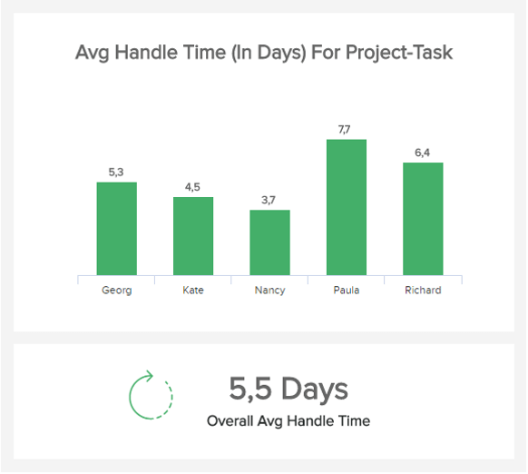
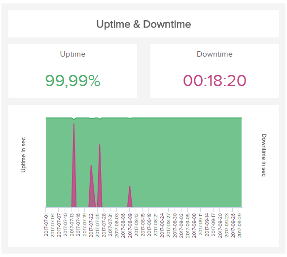
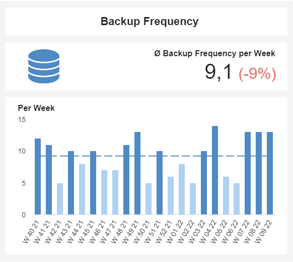
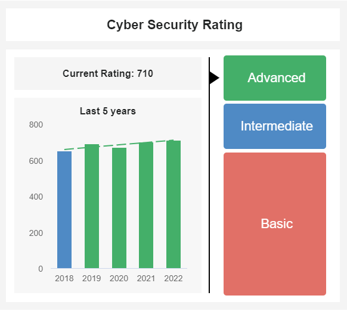
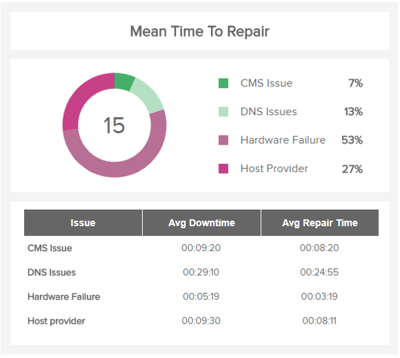
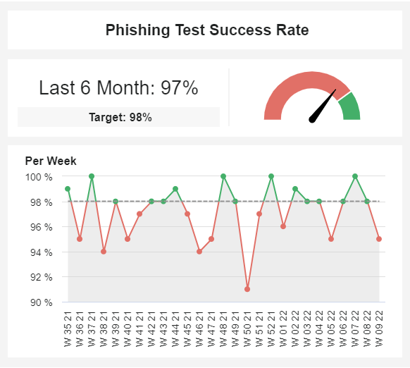
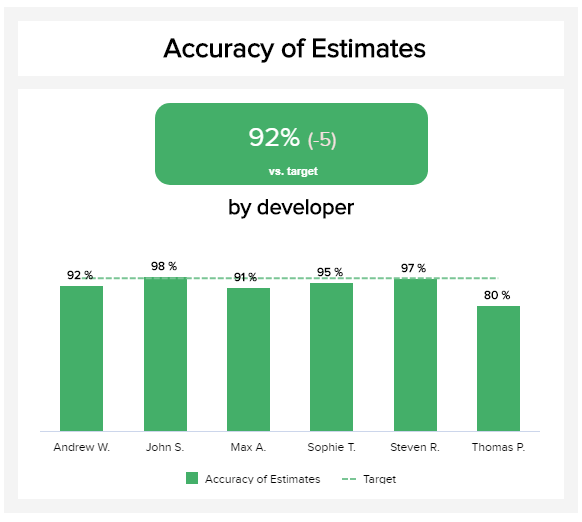
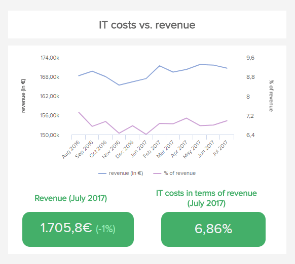

**IT KPI 或关键绩效指标**有助于跟踪 IT 项目质量的所有相关方面。KPI 通过分析和优化 IT 工单管理、IT 问题解决和 IT 成本管理，帮助在预算和时间内交付项目。

现代时代需要现代解决方案，而 IT 行业通常处于创新的最前沿。CTO、经理、专业人员和项目负责人需要不断跟上变化，以优化他们的绩效和结果。现代[KPI 软件](https://www.datafocus.ai/infos/kpi-dashboard-software)可帮助组织自动化流程并从其 IT 数据中生成即时洞察。为了完全成功，我们建议您根据我们在下面选择的 IT 指标创建一个完整的[IT 仪表板。](https://www.datafocus.ai/infos/dashboard-examples-and-templates-it)这样，您将获得对绩效的完全控制，同时利用专业的[IT 分析](https://www.datafocus.ai/infos/business-intelligence-it)解决方案来提高您的底线。

**_由于我们已经解释了 IT 中的 KPI 是什么，现在我们为您提供每个 IT 专业人员都需要了解的前 20 个 IT KPI 和指标的完整列表：_**

[总票数与公开票数](https://www.datafocus.ai/infos/kpi-examples-and-templates-it#total-tickets-vs-open-tickets)：您是否衡量票数随时间的流失？

[按预算交付的项目](https://www.datafocus.ai/infos/kpi-examples-and-templates-it#projects-delivered-on-budget)：您能否将预算控制在限制范围内？

[平均处理时间](https://www.datafocus.ai/infos/kpi-examples-and-templates-it#average-ticket-handle-time)：你如何控制你的任务？

[新开发的功能](https://www.datafocus.ai/infos/kpi-examples-and-templates-it#new-developed-features)：您不断开发多少功能？

[严重错误数量](https://www.datafocus.ai/infos/kpi-examples-and-templates-it#critical-bugs)：您经常遇到多少错误？

[服务器停机时间](https://www.datafocus.ai/infos/kpi-examples-and-templates-it#server-down-time)：您知道停机的原因和时间吗？

[备份频率](https://www.datafocus.ai/infos/kpi-examples-and-templates-it#backup-frequency)：您多久备份一次数据？

[网络安全评级](https://www.datafocus.ai/infos/kpi-examples-and-templates-it#cyber-security-rating)：您的整体安全策略如何？

[入侵尝试的数量](https://www.datafocus.ai/infos/kpi-examples-and-templates-it#intrusion-attempts)：您面临什么频率和类型的威胁？

[平均检测时间](https://www.datafocus.ai/infos/kpi-examples-and-templates-it#mean-time-to-detect)：检测攻击威胁需要多长时间？

[平均修复时间](https://www.datafocus.ai/infos/kpi-examples-and-templates-it#mean-time-to-repair)：您处理意外事件的效率如何？

[网络钓鱼测试成功率](https://www.datafocus.ai/infos/kpi-examples-and-templates-it#phising-test-success-rate)：您的员工是否意识到潜在威胁？

[每位员工未解决的工单](https://www.datafocus.ai/infos/kpi-examples-and-templates-it#unsolved-tickets-per-employee)：您是否监控员工的效率？

[重新开放的门票](https://www.datafocus.ai/infos/kpi-examples-and-templates-it#reopened-tickets)：您是否有效地处理门票？

[每个最终用户的 IT 支持员工](https://www.datafocus.ai/infos/kpi-examples-and-templates-it#it-support-employees-per-thousand-end-users)：您是否有足够的 IT 支持？

[估算的准确性](https://www.datafocus.ai/infos/kpi-examples-and-templates-it#accuracy-of-estimates)：您是否正确估算了团队的时间？

[IT 投资回报率](https://www.datafocus.ai/infos/kpi-examples-and-templates-it#it-roi)：您的投资利润如何？

[IT 成本](https://www.datafocus.ai/infos/kpi-examples-and-templates-it#it-cost-break-down)细分：您能否确定成本细分？

[IT 成本与收入](https://www.datafocus.ai/infos/kpi-examples-and-templates-it#it-costs-vs-reveneue)：您是否将 IT 费用与收入进行比较？

[团队流失率](https://www.datafocus.ai/infos/kpi-examples-and-templates-it#team-attrition-rate)：您是否设法留住有才能的员工？

## 总票数 VS开票

**您是否衡量随时间推移的门票流失率？**

监控您的任务和项目的整体进度是关键，这就是为什么这个 IT KPI 成为我们列表顶部的原因。大量未解决的任务堆积起来可能会导致整个系统或代理出现问题。这就是为什么与我们的示例中显示的其他指标（员工的工作量，他们的截止日期等）相关的监控它很重要。借助现代 KPI 软件（如 datapine），您可以轻松跟踪未解决工单与已解决工单的比率，同时密切关注最重要的未结工单以按时完成任务。您还可以使用工单历史记录的各种过滤选项，并按特定项目（例如，按单个团队或员工）进行过滤。

**性能指标**

随着时间的推移，监控不同项目、团队或员工的未结工单与已完成工单的比率，并在工单系统中发现潜在的战略优化。

**相关展示仪表板**

- [IT 项目管理仪表板](https://www.datafocus.ai/infos/dashboard-examples-and-templates-it#project-management-dashboard)

## 按预算交付的项目

**你能把预算控制在限制范围内吗？**

我们的第二个 IT KPI 示例反映了项目费用：它估计您的项目成本是否低于或高于最初计划的上限。要计算成本差异，请将计划预算除以给定时间的实际预算。在我们的示例中，我们看到当前预算超出目标 8.1%。在为项目制定预算时，我们会尝试将所有成本考虑在内，但不可避免地会出现新的成本、改变计划的意外事件等——这就是为什么添加一定的误差幅度以将其考虑在内很重要的原因.

**性能指标**

如果您的项目预算在交付的早期或中期已经超出目标，您应该调查原因：估算不准确？发展中的根本问题？找出潜在问题以更好地保持在您的预算范围内。

**相关展示仪表板**

- [IT 项目管理仪表板](https://www.datafocus.ai/infos/dashboard-examples-and-templates-it#project-management-dashboard)

## 平均处理时间

**你如何控制你的任务？**

这个 IT KPI 是每个项目经理的关键指标，也适用于员工，它可以帮助您监控计划的任务、项目和冲刺。通过分析您过去的冲刺，您可以优化每位员工的工作量。在我们的示例中，我们以 5 天冲刺为例。我们看到 Nancy 在 5 天的 sprint 限制内完成了她的任务，通常已经在 3.7 天之后，并且没有繁重的工作量。然而，宝拉很少能在 5 天内完成她的任务。因此，您应该分析其背后的原因：是由于计划管理不善，还是保拉缺乏完成该任务所需的技能？但总体而言，所有员工的平均处理时间为 5.5 天，仍在框架内。

**性能指标**

以您喜欢的时间间隔（一周、两周、四周等）分析您的冲刺，并优化所有团队成员的工作量。然后，您可以更准确地计划平均处理时间，从而更好地控制您的项目截止日期。

**相关展示仪表板**

- [IT 项目管理仪表板](https://www.datafocus.ai/infos/dashboard-examples-and-templates-it#project-management-dashboard)

## 新开发的功能

**您不断开发多少功能？**

每个 IT 团队都专注于开发新产品功能，但重要的是随着时间的推移测量和比较结果。IT 部门的此 KPI 将确保您对功能开发有一个清晰的概述，以便在您的下一个 sprint 计划中、在整个业务内部或向公众发布时实施这些发现。通常，每个功能都应与更大的业务目标（获取、保留、转换等）相关联，重要的是要过滤那些不会为组织带来额外价值的功能，并专注于最有利可图的目标，同时跟踪团队的表现。

**性能指标**

根据您的整体业务目标和团队的生产力水平，随着时间的推移衡量开发的功能、比较和优化。

**相关展示仪表板**

- [首席技术官仪表板](https://www.datafocus.ai/infos/dashboard-examples-and-templates-it#cto-dashboard)

## 严重错误的数量

**您经常遇到多少错误？**

问题和/或错误每天都会出现，但最关键的必须随着时间的推移进行监控、直观地组织和深入分析。这就是为什么 IT 经理的 KPI（例如左侧的可视化 KPI）在显示关键错误总数、团队内部报告以及最终用户外部报告的问题方面具有优势。关键是将这些数字保持在尽可能低的水平，因为大量外部报告的错误会因此影响您的品牌。随着时间的推移，概览可以告诉您关键错误是否正在上升，在这种情况下，深入挖掘原因可能是有意义的。也许产品发布得太早或新功能没有按预期工作？

**性能指标**

密切关注关键错误的总数，以避免业务中出现更深层次的问题以及对品牌形象的潜在损害。

**相关展示仪表板**

- [首席技术官仪表板](https://www.datafocus.ai/infos/dashboard-examples-and-templates-it#cto-dashboard)

## 服务器停机时间

**您知道为什么以及何时会发生停机吗？**

市中心的服务器是服务器性能管理的一个很好的 IT KPI。它跟踪您的 IT 基础架构停机且无法正常工作的时间量。可以计划停机时间：用于维护、更新或重新启动，这是运行良好的基础架构所必需的。然而，停机时间也可能是意外的，当系统崩溃时——此时，您需要制定有效的停机响应计划，以最大限度地减少不可预见的停机时间。您可以按月、按季度或按年衡量此 IT 指标 - 但越频繁越好，这样您就可以更准确地跟踪是否有特定时间发生这种情况，并更多地确定根本原因容易地。

**性能指标**

您可以以分钟为单位衡量停机时间以及正常运行时间的百分比。正常运行时间超过 99.9% 被认为是好的并且是有利的。

**相关展示仪表板**

- [IT 问题管理仪表板](https://www.datafocus.ai/infos/dashboard-examples-and-templates-it#issue-management-dashboard)

## 备用频率

**您多久备份一次数据？**

我们的下一个示例是跟踪备份频率的简单指标。企业和小型企业都收集需要不断保存在其他安全位置的敏感数据。随着网络攻击成为一种持续的威胁，定期备份数据的需求变得至关重要。为此，该指标按周为您提供支持操作的可视化概览。这使您可以保留记录并确保在需要时保存所有内容。这样，如果发生任何攻击，您可以确保业务受到的影响最小。

**性能指标**

可接受的数据备份频率应该是每周一次。然而，理想的频率是每 24 小时一次。自动化工具可以帮助您解决这个问题。

**相关展示仪表板**

- [网络安全仪表板](https://www.datafocus.ai/infos/dashboard-examples-and-templates-it#cyber-security-dashboard)

## 网络安全评级

**您管理网络安全的能力如何？**

我们的下一个 KPI 示例旨在帮助企业定义其安全措施的质量。网络安全已成为 IT 部门的首要任务，这已不是什么秘密。因此，衡量和优化安全措施的需求变得至关重要。网络安全评级没有标准计算，因为它将取决于公司预先定义的各种因素。一些计算可能包括此列表中提到的其他网络安全指标，例如停机时间、检测和修复的平均时间以及攻击尝试，仅举几例。这里的最终目标应该是始终尝试通过新操作来提高您的网络安全等级。在上面的例子中，

**性能指标**

在考虑新的业务关系时，预计网络安全评级将被视为一个重要因素，因此确保您的公司在内部和外部获得良好评级至关重要。

**相关展示仪表板**

- [网络安全仪表板](https://www.datafocus.ai/infos/dashboard-examples-and-templates-it#cyber-security-dashboard)

## 入侵尝试的数量

**最常见的入侵尝试有哪些？**

顾名思义，我们的下一个示例涵盖了每周入侵尝试的次数——这意味着未经授权的尝试访问您公司的系统。这个相当简单的 KPI 也按尝试的类型进行划分，并与前六个月进行比较，以了解它是如何及时发展的。实时跟踪此信息可为 IT 部门定期提供有关其系统面临的风险级别的准确数据。除此之外，查看最常见的尝试类型还可以提供有关您应该将精力集中在哪里的见解。例如，这家公司有大量的广告软件攻击，因此这是一个开始优化的地方。

**性能指标**

尽管这似乎不是一个关键的 IT 指标，但定期跟踪它是相关的。虽然您的安全系统可能会阻止事件发生，但这并不意味着您不是目标。因此，跟踪常见尝试是整体网络安全的关键。

**相关展示仪表板**

- [网络安全仪表板](https://www.datafocus.ai/infos/dashboard-examples-and-templates-it#cyber-security-dashboard)

## 平均检测时间

**检测攻击需要多长时间？**

与入侵尝试相结合，要监控的另一个最相关的网络安全指标是平均检测时间 (MTTD)。该指标显示在 IT 团队的某个人处理它之前，安全线程会被忽视多长时间。自然，MTTD 应始终尽可能低，因为检测和攻击所需的时间越长，攻击者破坏系统的时间就越长。当然，MTTD 将取决于攻击的类型，因为其中一些可能比其他攻击更难被注意到。每周跟踪此指标还可以告诉您一些可以改进的领域。例如，在这里我们可以看到第 4 周的检测时间出现了峰值。可以对此进行调查并在检测过程中找到改进机会。

**性能指标**

定期跟踪您的平均检测时间，因为一些网络攻击越早被发现就越便宜。随着时间的推移，它不仅可以保证组织的安全，还可以降低安全支出。

**相关展示仪表板**

- [网络安全仪表板](https://www.datafocus.ai/infos/dashboard-examples-and-templates-it#cyber-security-dashboard)

## 平均维修时间

**您处理突发事件的效率如何？**

平均修复时间是一个 IT KPI，计算从事件开始到解决的时间之间的时间。它包括诊断时间、修复时间、校准、校准、测试和等待恢复生产的时间。这是一个可靠的性能 IT 指标，因为它衡量了团队在面对、响应和修复问题方面的表现。除了我们的 IT KPI 示例之外，还根据其性质（DNS 问题、硬件故障等）和需要解决问题的时间来组织不同的修复时间：这样，您不仅知道应该在哪里分配更多的员工来解决问题，还有平均需要多长时间。这对于提前计划很重要。

**性能指标**

通过了解出现了哪些问题以及出现了多长时间，您可以更好地制定标准流程和有效的策略来解决这些问题，并随着时间的推移对演变进行基准测试。

**相关展示仪表板**

- [IT 问题管理仪表板](https://www.datafocus.ai/infos/dashboard-examples-and-templates-it#issue-management-dashboard)

## 网络钓鱼测试成功率

**您的员工是否意识到潜在的威胁？**

继续使用一些有见地的网络安全指标，我们得到了网络钓鱼测试的成功率。随着网络攻击变得越来越频繁，公司需要确保其员工不会因这些威胁而跌倒。网络钓鱼已成为过去几十年中最常见的攻击之一，因为它不需要突破先进的安全系统即可到达。为此，特别是大型企业每周都会对其员工的不同部分进行网络钓鱼测试，以衡量员工遭受这些攻击的可能性有多大，并找到避免它们的预防措施。在上面的示例中，我们可以看到该组织勉强实现了 98% 成功的目标。为了改善这一点，

**性能指标**

对于小型企业而言，每周实施网络钓鱼测试的效果可能会降低，因为员工可能会怀疑正在发生某些事情。相反，您可以计划培训实例以提高对该主题的认识。

**相关展示仪表板**

- [网络安全仪表板](https://www.datafocus.ai/infos/dashboard-examples-and-templates-it#cyber-security-dashboard)

## 每位员工未解决的工单

**您是否监控员工的工作效率？**

这是另一个不言自明的 IT KPI。未解决的问题也可以称为未解决的问题，并计算仍未解决且需要进一步沟通的问题的数量。跟踪员工仍未解决的问题数量可以很好地了解每个员工的绩效。它还可以创造一个健康的竞争，让每个人都了解他们在同龄人中所处的位置。将它们显示为已解决和未解决的票证之间的比率将显示谁偏离轨道，您应该调查原因：这可能是因为客户要求非常高，或者缺乏培训等。

**性能指标**

百分比越低越好，因为这意味着您解决的问题多于未解决的问题。

**相关展示仪表板**

- [IT 问题管理仪表板](https://www.datafocus.ai/infos/dashboard-examples-and-templates-it#issue-management-dashboard)

## 重新打开的工单

**您是否有效地处理您的问题？**

如果没有专注于重新打开的工单的指标，我们对最突出的 IT 性能指标的总结是不完整的。这基本上显示了任务处理的有效性，通常是反馈或错误，并且不需要额外的重新打开。如果团队表现良好，那么重复次数较少的问题就会再次出现，您的改进努力将是积极的。随着时间的推移跟踪这个指标并查看哪些月份带来了更多重新打开的问题以提高团队的绩效是很好的。目标是保持票务系统尽可能干净，并保持频谱低端的数字。

**性能指标**

随着时间的推移跟踪重新打开的工单数量，并与团队交谈以了解在指标数据的某些峰值期间发生了什么。

**相关展示仪表板**

- [首席技术官仪表板](https://www.datafocus.ai/infos/dashboard-examples-and-templates-it#cto-dashboard)

## 它支持每千名最终用户的员工

**您是否有足够的 IT 支持人员？**

这个 IT KPI 代表一个不言自明的比率：贵公司需要多少支持人员来帮助一千名最终用户？在我们的示例中，每天平均有 99.177 名最终用户有 10 名支持员工。但随着时间的推移，该比率不断增长，从目标区域的低端开始，它会增加到顶部，甚至超过。这意味着需要雇用更多的支持人员，以便他们继续提供高质量的工作而不会承受太大的压力，试图解决一堆永不减少的问题。没有确切的比例可以遵循，因为它取决于您面前的用户类型，还取决于您支持的产品：与高端分析软件套件相比，小型移动应用程序需要更少的支持时间。此 IT KPI 对于难以扩展的 IT 公司尤其重要。

**性能指标**

要了解您的当前比率是否良好，请使用不同的质量支持指标对其进行验证。如果这样的比率不能提供良好的支持，请通过雇用新的支持员工来降低它。

**相关展示仪表板**

- [IT 问题管理仪表板](https://www.datafocus.ai/infos/dashboard-examples-and-templates-it#issue-management-dashboard)

## 估计的准确性

**您是否正确估计了团队的时间？**

在许多 IT 场景中，开发人员需要估计完成一项任务所需的时间。每次都很难 100% 正确估计，但关键是要尽可能接近。由于开发人员需要处理的错误数量增加而错过发布日期在 IT 领域很常见，并且需要定期跟踪以便更好地为未来做好准备。在这里，了解“公正”任务也很有意义：这只是一项小任务，只需 10 分钟即可修复它，不应该花费很多时间，等等。这些通常是临时任务，导致延迟和错过最后期限，因为开发人员很容易低估关注问题所需的时间。

**性能指标**

以百分比监控任务效率并按团队成员细分，以便您了解哪些任务导致估计不准确并检查原因。

**相关展示仪表板**

- [首席技术官仪表板](https://www.datafocus.ai/infos/dashboard-examples-and-templates-it#cto-dashboard)

## IT 投资回报率

**你的投资有多大的利润？**

IT 指标相对普遍，IT 投资回报衡量您的投资效率。ROI 分析通常会回答著名的问题，“我能得到多少收益？”。它是衡量盈利能力的简单衡量标准，可以评估您从一美元的投资中获得多少回报。为了更进一步，在衡量回报时，您应该超越成本节约或收入增加等明显的指标，并包括与计划或项目目标相关的所有绩效水平。因此，您将不仅仅衡量财务、原始回报，并将其扩展到实现预期的结果并产生正确的结果。

**性能指标**

投资回报率是用收益除以投资成本来衡量的。当然越高越好。重要的是随着时间的推移对其进行测量以查看其演变，这应该向上。

**相关展示仪表板**

- [IT 成本仪表板](https://www.datafocus.ai/infos/dashboard-examples-and-templates-it#cost-dashboard)

## IT 成本细分

**您是否能够确定您的成本细分？**

了解如何以及在何处分配资金是您应该跟踪的另一个重要 IT KPI。将投资分解为不同的单位级别（软件、硬件、SP、人员）及其每个组成部分（维护、基础设施、开发、运营......）将使您更好地了解资金的用途，并让您确定您的主要成本驱动因素以及改进机会。这还可以让您执行更准确的财务预算和预测。但是，为了获得最佳预算，最好每个部门都确保详细衡量其 IT 支出。

**性能指标**

此 IT 指标的目标是确定主要的成本驱动因素并对其进行更详细的分析。尽量使其准确和详细。

**相关展示仪表板**

- [IT 成本仪表板](https://www.datafocus.ai/infos/dashboard-examples-and-templates-it#cost-dashboard)

## IT成本与收入

**您是否将 IT 支出与收入进行比较？**

我们的最后一个 IT KPI 将 IT 费用与一年内产生的收入进行比较。对于在短时间内大规模扩展并见证收入大幅增长的科技公司来说，这是一个重要的指标。成本与收入的百分比是否保持相同水平？或者它们是否像经常发生的那样呈指数级增长（而且经常是无法控制的）？这种情况并不少见，并对潜在利润产生负面影响，这就是为什么跟踪该指标并将其保持在稳定水平很重要的原因。另一种情况是，在收入停滞不前的情况下，如果 IT 成本随着时间的推移稳步增加，对利润率的影响将是不利的。

**性能指标**

为您的 IT 成本定义一个目标范围作为收入的百分比，这样您就可以获利。如果该比率急剧上升，请找出其背后的原因，并在必要时采取措施降低这些成本。

**相关展示仪表板**

- [IT 成本仪表板](https://www.datafocus.ai/infos/dashboard-examples-and-templates-it#cost-dashboard)

## 团队流失率

**您是否设法留住有才能的员工？**

团队减员是一个真正的问题，尤其是在人才稀缺的技术领域，公司需要为他们希望长期保留的候选人提供良好的报价，以避免额外的招聘成本。高流失率对组织产生巨大影响，这意味着软件行业公司的离职成本可能超过员工工资的 125%。为了使这个数字尽可能低，IT 领导者需要培养留住有才能的员工的能力，为此，在一段时间内跟踪相关流失率的 IT 指标肯定会有所帮助。

**性能指标**

监督一段时间内的流失率，并与人力资源部一起制定战略以留住人才，以避免潜在的额外业务成本。

**相关展示仪表板**

- [首席技术官仪表板](https://www.datafocus.ai/infos/dashboard-examples-and-templates-it#cto-dashboard)
