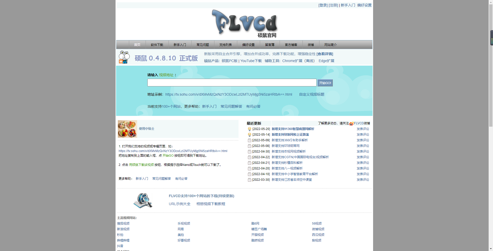

今天来给大家推荐4款优秀的国产良心软件，每款都是经过时间检验的精品，用起来让你的工作效率提升飞快。

**1.**

**Quicker**

**指尖快速启动和操作软件**

工作中经常需要短暂性地使用到一些小工具，比如用计算器算个数字、用Everything搜个文件、用印象笔记保存一些内容等等。但只是这样执行这些操作，往往需要花费不少时间。而把它们添加到Quicker面板中的固定位置，就可以快速启动。

除了可以添加软件外，还可以添加软件内的功能。比如Excel中可能经常要筛选数据、添加框线等，就可以把这些常用的功能也放在Quicker面板中。

如果你有自己的想法，并且逻辑清晰，就可以设计出强大的动作了。在Quicker空白按钮处右击就可以自主设计动作。如果不想设计，还可以在Quicker的动作库中找到适合自己的动作。

总之，Quicker是一款可以极大提高效率的软件。它主要通过减少鼠标和键盘的切换、减少鼠标和键盘的操作，来减轻你工作负担。

**2.**

**无痕去水印**

**一键擦除水印，操作简便**

日常工作处理图片时，遇到图片水印总是很苦恼，尤其是复杂的水印。如果靠PS工具，恐怕花了好久时间都不一定能处理干净。

而这款软件有非常强大的一键擦除水印功能,通过框选或涂鸦模式，轻松选择水印区域，一键生成无水印图片，且保存图片时更高清。

**3.**

**硕鼠**

**在线视频解析下载**

工作中常常会需要收集视频素材，然而对于大多数想要的视频，网站都没有提供下载入口。这时候想下载下来又无法下载，甚至需要下载强行绑定的播放器才能下载视频，很麻烦。

而硕鼠就可以将在线视频解析并下载，只需要将视频链接复制粘贴到软件搜索框上，便能快速进行解析下载，而且下载速度还很快。它支持搜狐、CCTV等多种类型的视频网站和电视直播。

4.

DataFocus

**[搜索式数据分析](https://www.datafocus.ai)，秒级响应数据**

日常工作中需要做数据展示汇报时，常常会用到Excel、PPT等工具。但由于不够熟练、软件卡顿等问题，每次做起来要花几天甚至几周的时间。如果领导不满意，还需要反反复复修改。

DataFocus就是一款非常强大的数据处理和数据展示工具，将数据导入进去，像百度一样搜索关键词，系统就会以可视化的效果告诉你答案。比如导入“全国超市订单”数据，搜索“2019年每月销售额”，就可以看到部门2019年每月销售额的情况。

接下来可以把所需要的数据图表汇总到一张大屏里展示。如果有需要修改的地方，直接替换导入的数据表就可以了，大屏会自动修改更新。此外，**大屏还是联动的**，比如当你汇报“浙江省”的情况时，只需要点击一下大屏，则整个大屏都是“浙江省”的数据。

上手快，使用简单，不用学习代码知识。此外还有数据仓库、数据管理、数据预处理等等功能，更重要的是有**个人免费版**。

以上就是今天介绍的4款职场必备国产软件，希望对你有帮助。那么你有什么好用的办公神器推荐吗？欢迎补充分享。
