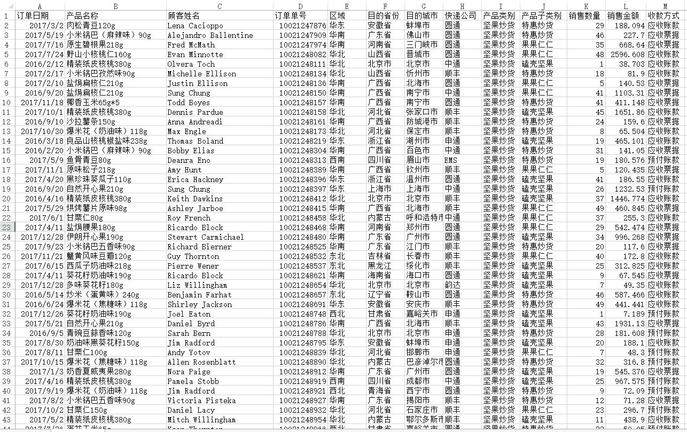
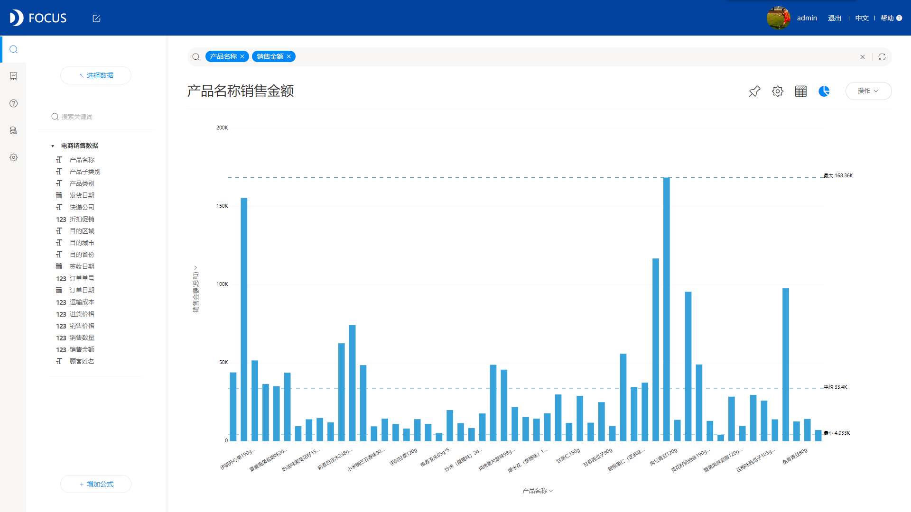
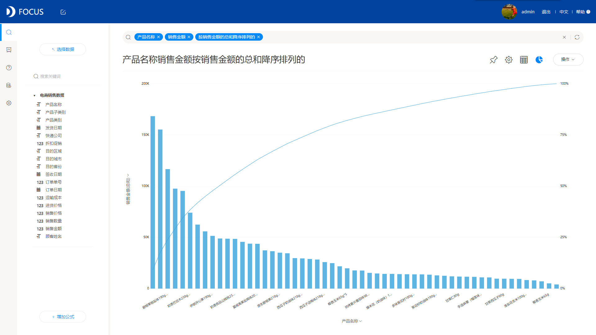

什么是帕累托图？帕累托图是一种按发生频率大小顺序绘制的特殊直方图，故又名排列图、主次图。帕累托图与帕累托法则一脉相承，帕累托法则认为，相对少量的原因通常造成大多数的问题或缺陷，即80%的问题是由20%的原因导致的，故又称二八法则或80/20法则。帕累托图也用于汇总各种类型的数据。

在DataFocus 30多种图表样式中，也包含有帕累托图。那具体怎么制作呢？下面我们一起动手制作一个帕累托图：

1、准备数据。没有数据何来的图，所以首先我们要准备好数据；

2、其次将数据导入DataFocus系统，在数据管理页面点击右上角“操作——导入数据”，按照提示导入；

3、在搜索页面，选择刚刚导入的数据源，选择后可看到数据源在页面左侧显示；

4、数据源选好之后，可以在搜索框内加入想要展示的列，可以手动输入列名，也可以在左侧双击选择列，系统实时搜索并以图表的形式返回结果，此处系统默认显示柱状图；

5、图形转换，将柱状图更改为帕累托图，并在搜索框内输入：按销售金额的总和降序排列；

上图中，可看到帕累托图用双直角坐标系表示，左边纵坐标表示频数（销售金额），右边纵坐标表示频率（百分比），折线表示累积频率（百分比），横坐标表示产品种类，按销售金额总和的大小(即出现频数多少)从左到右排列，通过对帕累托图的观察分析，可以抓住市场的喜好，判别畅销产品，从而优先加强对畅销产品的进销存管理。

现在，帕累托图，你学会了吗？
