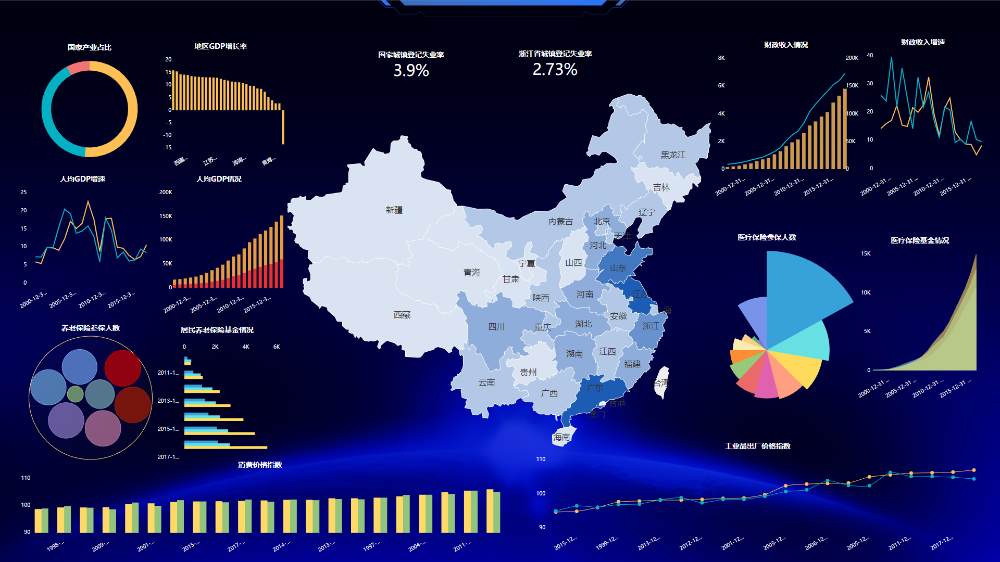

大数据的数据量积累因各个行业不断的数字化交易属性，各个数字化转型的企业在此过程中积累了大量的数据，在此基础上，企业并不止步于积累数据本身，而是并不断的利用大数据进行数据分析，以赋能企业决策，让企业决策更为精准更为高效。对于新零售企业来说，数字化是一切大数据进程发展的基石，商品数字化、客户数字化、销售数字化等等。这样一来，就有大量企业开始使用如DataFocus、Power BI等大数据工具分析数字化的企业场景，亦或是聘请专业的大数据分析团队。

我们都知道，零售核心组成要素是人、货、场。对于数字化的新零售来说，本质将被重新定义，以大数据分析的角度进行分析。人，从单纯的消费者开始数字化，变成了企业的客户数据以及反向推导企业运营的“合作生产者”数据。货，从件件分明的商品，变成了商品数据以及包含商品全消费体验过程的流程数据。场、从线上和线下固定的网站及门店，变成了全渠道企业大数据库，能够让消费者触达其多元化的购买场景并被采集数据，所见即所得。

第二是关系的数字化重构。原本消费者在固定的场所内浏览并购买现有商品。当数据驱动赋能后，首先企业能够依照大数据，以消费者需求为中心，定制化商品生产与组合，交易可以发生在任何可以想象触达的场景下，超越时间和空间的限制。举个例子，尤其是家装行业，原本需要消费者到店甚至到场进行挑选和采购，并自主思考和设计自家的装修。而现在，各大家装品牌已经能够利用大数据进行定制化的全屋一站式解决方案。第二，消费需求、消费场景和商品产出更加的分散化、轻量化。从以前的卡拉OK，到量贩式KTV，到如今的商场中随处可见的扫码消费式2人K歌玻璃房，是此变革体现最好的例子之一。

因此，数字化的新零售已经步入每个人的生活和工作当中，应对此最好的方式，就是认同并拥抱科技带来的趋势。
