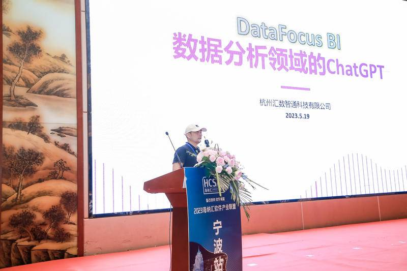

商业智能(Business Intelligence, BI)作为一种以数据分析、数据挖掘及在线分析处理(OLAP)技术为核心的软件发展方向，近年来发展迅速。商业智能被广泛应用于各个领域，如金融、电商、医疗等，其应用场景不断拓宽。而在大数据时代，商业智能也面临着新的挑战和机遇。

\[caption id="attachment\_43444" align="alignnone" width="983"\] banner 封面 特色图片\[/caption\]

## 一、商业智能BI行业现状

当前，商业智能BI行业正处于快速发展阶段。一方面是市场需求不断增加，另一方面则是技术的不断进步和创新。市场上的商业智能工具也呈现出多元化、普及化和专业化的趋势。各家厂商之间的市场战略也日益明朗，例如有些工具更注重可视化效果，有些工具则更加强调数据挖掘和分析能力。

同时，随着大数据时代的到来，商业智能行业也正在经历着从传统静态报表到多样化分析方法的转变。近年来流行的数据挖掘、机器学习、自然语言处理等应用技术，对于商业智能的应用提出了更高的要求。因此，商业智能工具需要更快速、精准的处理大量数据，并提供更丰富多样化的可视化方式。

## 二、大数据商业智能技术

随着数据量的不断增加，商业智能技术也在不断升级发展，从传统的关系型数据库(OLTP)向面向列存储的数据库(OLAP)转化，再到NoSQL、Hadoop等新兴技术的出现。同时，注重数据安全性和分析效率的企业和组织开始使用大数据商业智能技术，如StreamSQL、Tez、Spark等，以拓展商业应用及产业封闭链条。

大数据商业智能技术的主要作用是支持实时查询、多维度分析预测、数据挖掘和自动报表生成等功能。这些特点使企业能够更快速、更高效地对各类数据信息做出相应的决策。而搜索式BI系统datafocus则是一个非常好的解决方案，其拥有诸如快速高效的搜索和多种数据库支持等特点，可以满足企业的数据处理和分析需求。

## 三、大数据商业智能平台

大数据商业智能平台是基于面向列存储技术进行开发的，利用分布式集群技术实现快速处理大规模数据和分析，还可以将各种不同类型的数据并集成到一个统一平台上，并确保数据更加可用、更高效地存储和访问。这些特点使得大数据商业智能平台成为当前企业决策的主要工具之一。

大数据商业智能平台的优点有：

**1\. 接口规范**：平台遵循了开放API设计架构原则，方便开发人员进行整合，提高应用程序价值；

**2\. 数据整合性**：通过集成多来源数据，可以转化为全面、真实、及时、准确的数据，为数据决策提供更可靠的基础；

**3\. 高性能**：在处理大数据时表现出更快的速度，支持批量处理和实时流式处理；

**4\. 可负担性**：可以根据企业需求灵活设置大数据分布式存储和分析处理系统，降低运营成本。

## 四、DataFocus作为推荐使用的搜索式BI工具

作为搜索式BI工具的典型代表，DataFocus是一款非常优秀的工具。它在数据库类型支持、快速高效搜索、数据可视化等方面都有着显著的优势，可以满足企业对于数据处理和分析的各种需求。

推荐DataFocus的理由有：

**1\. 强大的数据库支持**：DataFocus支持多种类型的数据库，包括MySQL、CSV等各种类型，并且无需手动修改复杂解析方法就能进行连接操作；

**2\. 快速高效的搜索能力**：DataFocus具有强大的搜索判断功能，用户只需要输入查询关键词查询即可快速获取对应数据信息；

**3\. 数据分析全面**：DataFocus支持多维度和交叉查询，并可以实现数据可视化。企业可以利用该工具进行数据整合分析以及建立仓库，实现业务智能提升；

**4\. 安全稳定**：保证了数据安全性和操作稳定性，并支持随时更改报表展示，自定义导出Excel或PDF文件，更方便分享结果！

研究数据处理与分析，我们会深入感受到数据分析对于企业决策的重要性。在市场竞争日益激烈的今天，依靠商业智能BI工具实现数据可视化、快速高效的处理和多维度分析已成为企业提高管理效率、优化运营流程的必要手段之一。同时，大数据商业智能技术和平台也为商业智能行业带来了全新的机遇。

作为CTO，在自己的职责范围内推动企业用现代化数据分析手段，如[**搜索式BI**](https://www.datafocus.ai)，可以更加准确地评估公司的状态并提升决策质量。DataFocus是我在日常工作中使用的搜索式BI工具，它以其简单易用、高效快速、支持各种数据库等特点得到了我的关注和认可。

最后，我认为，未来商业智能行业还将继续发展和创新，需求也会不断涌现。因此，企业应该根据自身需求和预算选择合适的商业智能BI工具，并及时跟进最新技术的发展，始终保持在数据领域的前沿。
