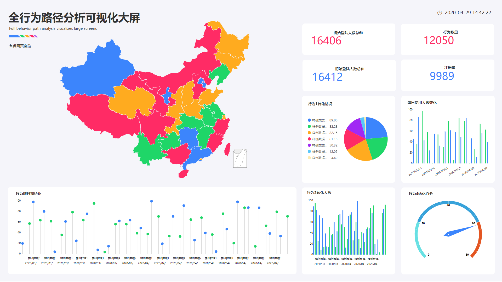

大数据的热度不减，企业的数据化转型也迫在眉睫。然后，就在这样的趋势下，越来越多的企业和业务人员却意识到一个棘手的问题：**企业庞大的数据资源与业务人员的数据分析能力之间存在巨大的断层。**

首先，让我们定义一下什么是有效的数据分析？《深入浅出数据分析》的作者米尔顿对数据分析的定义是：数据分析是一种技术方法，这种方法可以帮助我们将原始数据转变为推进现实工作的策略，进而把握住工作中各种问题的要害。

米尔顿的定义告诉我们，业务是数据分析的本源，脱离业务的数据分析是没有意义的。也就是说，**企业中业务人员的数据分析能力，直接关系着企业的数据利用水平。**

> _1_
> 
> 庞大的数据资源vs缺失的数据分析能力

一项针对500名美国员工如何使用数据的调查显示，很多企业没有从数据中获得洞察力。例如，68%的营销人员需要更多的数据可视化特征，54%的会计师需要更多的预测分析特征来预测风险。

 

  统计数据来源：GetApp

**大量的业务人员因为不懂数据库，不懂SQL，不懂python，缺乏对数据有效利用的能力，无法从数据中获取有效的洞察，找到解决问题的关键。**这已经严重影响企业的数据化决策了。即使拥有了庞大的大数据资源，这样的资源也是一潭死水，毫无作用。

在互联网诞生早期，创建网站是一门高端技术活。而现在，Wordpress这样的无代码工具让每个人都能迅速地创建一个网站。同样，当今的高技术准入门槛是数据科学发展的阻碍，但无代码数据分析工具将让数据分析也实现平民化。**现在，是时候让每个人都成为数据分析师了。**

> _2_ 像搜索一样简单的数据分析平台

DataFocus Cloud就是这样一款为业务人员准备、零代码实现数据分析、学习成本低、快速上手的数据可视化分析平台。

DataFocus Cloud和一般的数据分析工具不同，它最大的特点是可以用类自然语言来交互，只需像使用搜索引擎一样输入问题，DataFocus就能自动进行数据分析和可视化呈现。

从下图中我们也可以看出，在搜索框中输入信息，系统能够实时展示搜索结果，达到秒级相应的水平。并且还可以根据需要任意更改图表的类型。业务人员再也不用为不会代码烦恼啦，只需要搞清楚需要分析的问题，其他都交给DataFocus就行了。 

DataFocus作为全球首个中文类自然语言数据搜索分析系统，可以让不懂python、不会SQL的业务人员通过搜索完成图表制作，让业务人员真正关注图表背后的意义挖掘，而不被工具困住。

> _3_ 云端感受数据分析的乐趣

DataFocus Cloud颠覆了传统作业模式，采用**AaaS（Analyze as a Service）分析即服务模式**。使用DataFocus Cloud，无需购买任何硬件，只需在云端注册登录即可。另外不需要软件的升级维护，也不需要为维护和管理人员支付额外费用。这极大地降低了成本和使用门槛，尤其当数据需要迁移时，无需收取昂贵的费用。

另外，DataFocus Cloud自带**基于云计算、支持大规模并行处理的数据仓库**，**给予您无限扩展的计算和存储资源支持**。使用云数据仓库，企业可以快速在云端搭建**TB级-PB级**数据仓库，无需关注集群的管理以及繁重的运维工作，并且成本远远低于企业自建数据库。
