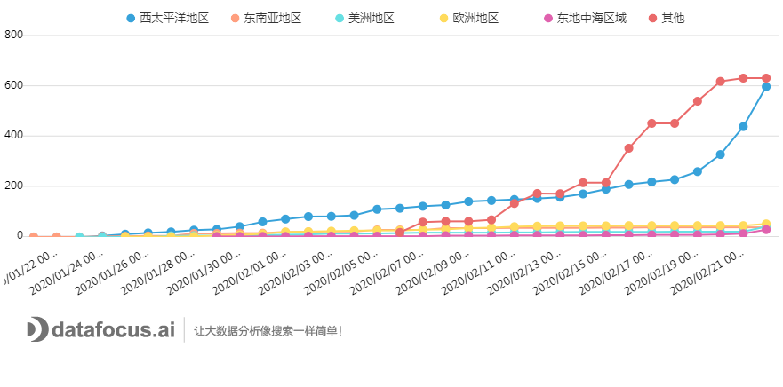
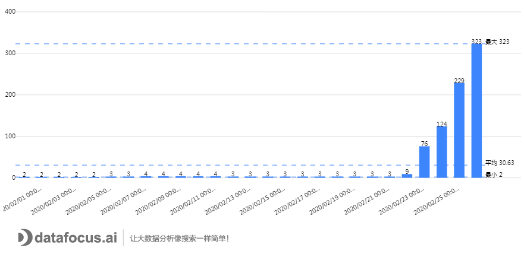
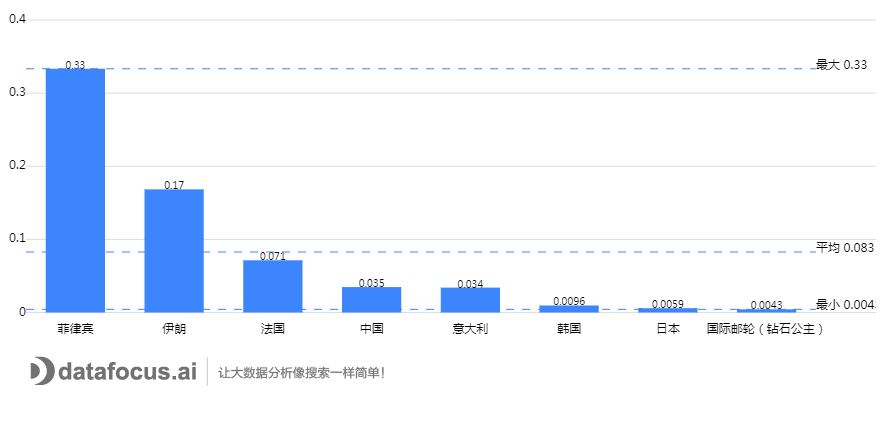

_这一个月以来，中国倾举国之力，耗费无数资源应付此次“来势汹汹”的新冠肺炎病毒，终在这几日取得了喜人的成果。除湖北武汉和港澳台地区外，全国的新增确诊病例已经降至个位数，西藏青海地区的疫情已全部清零，也有很多省市已经连续多日“零新增”，这代表我们此次的疫情对抗战迎来了转折性的变化，这是全体中国人心连心，众志成城所带来的阶段性成果。_

**_然而，在中国以外的世界，这场威胁全人类社会发展的“浩劫”，才刚刚开始。_**

1. **日韩疫情告急**

海外地区最先发现疫情的，基本是处于中国周边、与中国交往甚密的国家。1月21日，几乎与中国除湖北省之外的其他省市同一时间，日本、韩国、泰国也都发现了第一例新冠肺炎患者。

图1：海外首日确诊疫情

图2显示的是海外疫情确诊的发展态势图，图3则是国内除湖北省以外的疫情发展态势图。1月20日，上海发现首例新冠肺炎的确诊病例，拉开了此次抗疫的全国战，次日，日本、韩国和泰国就相继发现了新冠肺炎的病例。但与国内的疫情发展情况不同，海外疫情经历了一个长达7天的潜伏期，和将近半个月的发展期，**疫情发展至2月18日，开始过渡到全球爆发期，确诊病例增长速度堪称恐怖。其中日本、韩国的确诊人数又是占了全球确诊的绝大比重。**

图2：海外疫情确诊情况

图3：国内疫情确诊情况（除湖北省）

1. **意大利“一夜沦陷”**

据不完全统计，截至到今天中午12点，海外地区已确诊病例2817例，比昨日新增358例，死亡45例。除中国外，已经有37个国家受到新冠病毒的侵扰，而且今日出现首例确诊病例的瑞士、奥地利、克罗地亚就在意大利附近。

图4：欧洲地图

2月21日之前，疫情上升趋势最大的地区无疑是西太平洋地区，而且最严重的国家正是中国的两个近邻：日本和韩国，远在大洋彼岸的欧洲地区，看起来风平浪静。谁能想到，就在21日下午开始至22日，意大利突然大规模爆发疫情，到23日下午意大利时间14点，**短短两日时间，确诊病例激增数十倍，死亡人数2人，数万人被紧急隔离，10多个城市“封城”。**位于欧洲西部的意大利，这个号称拥有全世界最好的医疗保障的国家，几乎是一夜之间“沦陷”。（截至发稿前，也就是北京时间26日14点，意大利已累计确诊323例，位居海外疫情世界第三）

图5：海外各地区确诊情况（截至22日）

图6：海外各地区确诊情况（截至26日）

此消息一出，意大利举国恐慌，市民抢购口罩和消毒水、口罩消毒剂价格疯涨。意大利政府当即宣布，效仿中国的防疫模式，封锁了米兰、罗马等周边的十多个出现疫情的城市，同时宣布学校、教堂、酒吧等场所关停，由此，意大利也成为了第二个向中国“抄作业”的国家。

此次疫情发展的速度和波及程度都超出了想象，身为中国人，小编深有体会。每日醒来的第一件事就是确认今日的确诊人数和新增人数，但小编仍有一个很大的疑问？意大利是一个号称拥有领先全球最健全医疗体系的西方发达国家，且意大利是最早学习美国，关停中国航班、取消所有中国公民签证、启动为期长达六个月的“国家紧急状态”的国家之一，为什么还会在一夜之间出现了50例新增病例，且拿这个疫病束手无策？？？

1. **海外疫情追根溯源**

今日，小编就意大利的现状为例，和大家唠一唠疫情在海外爆发的那些事儿。说的不好或者不对的地方，欢迎大家批评指正。

第一点，一定是政策的拖拉。

想当初，疫情刚刚波及全中国的时候，各省也未对其报以极大重视。但随着事态的恶化，国务院开始出手干预，少聚会、少出门、勤洗手、戴口罩、量体温等等各项防“疫”措施的落实，农村、社区严格控制居民的出入，国家普及疫情常识，广大民众积极学习预防知识，几乎是坚持了一个月没有出门，才使疫情得到了些许控制。

反观意大利，早在1月31日，意大利总理就曾宣布意大利举国进入为期六个月的“紧急状态”，同时关闭所有中国航班、取消全部中国公民的签证。那又为何会在2月21日，爆发出这么严重的疫情？

**实则意大利政府内部存在非常严重的制度漏洞。**意大利实行的是多党派权力“分散制”，权力的分散就意味着政见的不统一，例如究竟是“对抗病毒”还是“管制中国人”，意大利政府就此事玩起了政治游戏，并试图激化意大利内部种族矛盾。

在这些极具误导性的言论之下，意大利境内的防疫风向，也从“防病毒”转向极端的“防中国人”。**而可怕的是，对于本国的归侨和其他可能有感染风险的族群，却不管不顾，任由其自由行动。**

第二点，民众的防范意识薄弱。

回想一个月前，政府除了报道疫情现状，几乎天天通过各种媒体渠道，向社会民众分享防疫知识，让大家对新冠病毒的可怕性能有一定的了解。为了让大家减少出门次数，并且做到出门都能一定带上口罩，政府劳心劳力。所以我们的民众基本都能做到，在有确诊病例的地区自觉带上口罩，毕竟一旦患上病毒，给自己带来的伤害是不可逆的。

图7：意大利确诊情况

其实意大利早在1月31日就已经出现了两例确诊为新冠肺炎的患者，均存在中国旅游史，但是因为之前确诊情况一直没有波动，且该病毒存在较长的潜伏期，死亡率也较低，意大利民众并未将其当做一回事该聚会的聚会，该溜达的溜达，该自由奔放就自由奔放。**在媒体和部分政客的渲染下，他们除了远远地“躲着中国人”，并没有科学地“躲着病毒”。**

图8：各国死亡率

第三点，经济实力不足

由于此次疫情，国务院研究决定将春节假期延长三日，各省地方政府也纷纷下令，学校推迟上课，企业延缓复工。除了口罩厂的工人们还在加班加点的生产，几乎全国都安静了下来，这一举动无疑给全中国带来了巨大的经济损失。

**而意大利、韩国、日本这些国家的国土面积可能还比不上中国的一个省，如果完全学习中国的举措，实行“举国封锁”，政府可能就会面临巨大的经济危机。**

第四点，“就医难”

文章前半点就说过，意大利号称拥有领先全球最健全医疗体系。据小编了解，意大利的医疗就诊程序是“预约制”，如果你需要看医生，除非你病得快死了，否则最少都需要等待数日。在这种医疗程序的情况下，不少被感染的患者都被当做普通流感患者对待，**没能及时进行隔离，成为了此次疫情扩散的“帮凶”。**

第五点，信息化程度不够

近些年来，中国社会的信息化水平有了非常明显的提升，一张身份证加一台手机就可以走遍天下。

而像意大利这类西方资本主义发达国家，因为社会发展效率问题，其内部整体还没有形成系统化的“数据信息”，显得相对原始。这也就意味着，确诊患者前期乘坐火车等交通工具是没有实名制联网的，同车乘客有哪些人也查不到，如果不如实交代，行踪轨迹更是一片空白。**信息化的落后，导致了他们对病例的排查和接触者的追踪显得困难重重。**

主要原因基本就是上述介绍的这些了。此次新冠肺炎已经开始波及全球，不论是发现疫情还是未发现疫情的国家，都要对此严格防范，一切以防疫为中心，能够多多研究中国的防疫措施，毕竟从现阶段看来，中国的防疫战打的还是很成功的。

在这里，小编真诚的希望，全世界人民一起同舟共济，早日结束这场全世界的浩劫。
