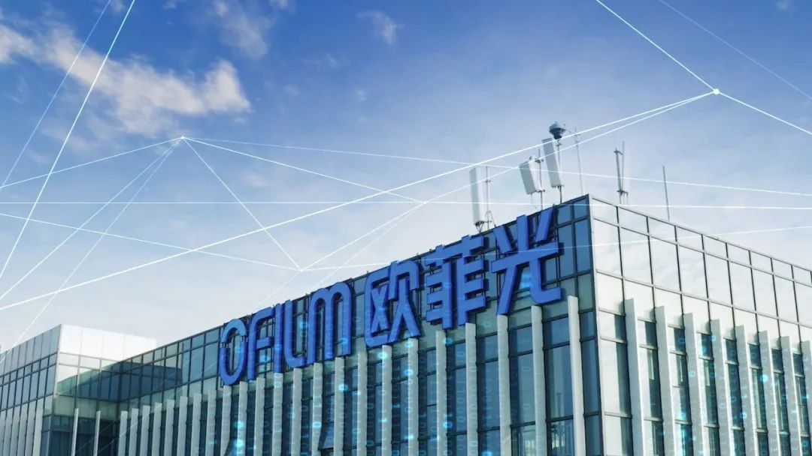
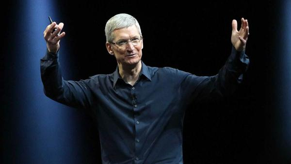
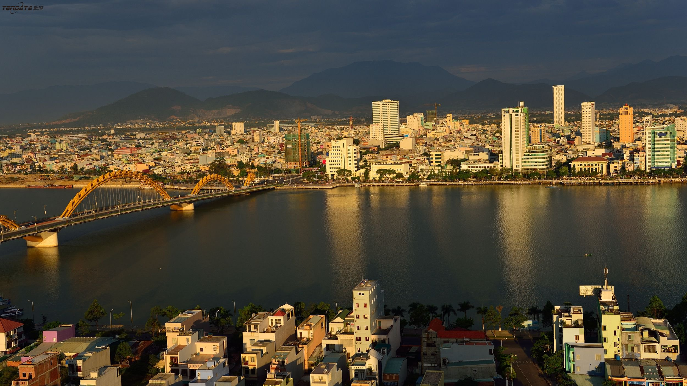
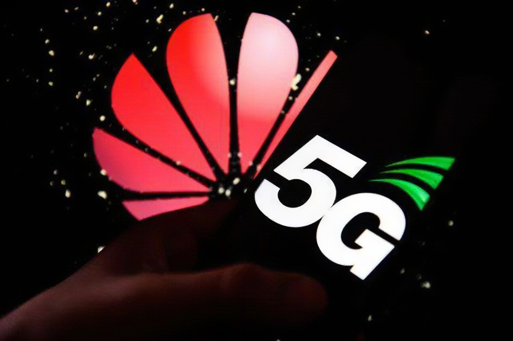

国产手机都在“去美化”，5G之光华为就做了很好的表率，不管是系统还是芯片都采用自己的技术。但目前苹果又何尝不是在“去中化”呢？

短短两年内，苹果就已经将34家中企踢出苹果供应链，这让一些过度依赖苹果订单的企业蒙受巨大损失。最典型的是电子生产商欧菲光，被苹果踢出供应链后市值一落千丈，为了减少损失甚至将价值8亿元的设备贱卖800万。

而近日外媒也传来消息，**库克已经告诉合作的代工厂，希望他们能扩大中国以外的代工厂建设，而印度和越南将被纳入考虑范围**。由此可看出，库克正在降低对中国供应链的依赖，Iphone产品线也已经在向印度、越南等东南亚国家转移。

为了避免损失中国市场份额，被问及到苹果的供应链时，库克的说辞还是比较委婉的，“供应链确实是全球性的，因此产品无所不在，并会继续考虑优化供应链。”如他所言，苹果确实早已开始“优化”，踢出中企后立马又在东南亚扩产。

那么“优化”背后的真实原因到底是什么呢？

一方面当然是控制成本，东南亚国家工人基数大，人工报价也不高，而且工人质量也不差。另外，东南亚国家资源也相对比较丰富，仍有很多还未开发。

另一方面还是考虑到苹果的长远发展，尽量减少对中国供应商的依赖。苹果始终坚信不可以将鸡蛋放在一个篮子里，那只会让苹果陷入被动状态中。因此苹果会考虑全球化地布局自己的供应链。

此外，国内央视也呼吁过好多次，中企要减轻“苹果依赖症”。国内很多厂商为了拿到苹果订单，严格按照苹果严苛的标准执行，有的甚至还专门定制生产线。如果不能继续保住苹果的大腿，那么生产标准和生产线就都作废了，企业将直接面临破产。而这些也都是苹果要顾忌到的，那就是苹果供应链可能存在断裂的风险。

富士康算得上是最积极响应苹果号召的代工厂，速度最快、规模最大。尤其近两年，富士康外迁动作不断，赴美建厂、赴印建厂、赴越建厂，看起来办起来风风火火。可实际情况中却因为招工问题和补贴问题蒙受不少损失。

所以说，库克把产能转移到中国市场外，难免会带来苦果，甚至还有更多潜在危机。但归根结底还是要让企业实现自主自强，减少对其它企业的依赖，等到受人摆布而蒙受巨额损失的时候就已经来不及了。

目前自主研发核心技术的企业可谓层出不穷，5G领导者华为逐渐“去美化”后的发展也越来越好了，接连拿下5G大额订单，成为5G最大赢家。

去年，无代码搜索式BI平台**DataFocus**和华为展开了合作，助力华为数字化转型。D**ataFocus**掌握**数据仓库、内存计算引擎、机器学习引擎、智能分析引擎、分布式集群、语义解析引擎**等等核心技术，为华为5G技术提供支持。

在它的支持下，企业业务精英不需要学习代码知识，通过像谷歌搜索一样就可以自主数据分析。目前DataFocus也已成为知名5G供应商，同时也为万向集团等众多国内知名企业服务。

相信国内企业对于苹果“去中国化”都做好了相应的准备，就算苹果撤出中国市场，中企也必定创造新的奇迹！对此你怎么看？欢迎评论、转发。
