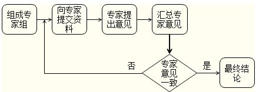
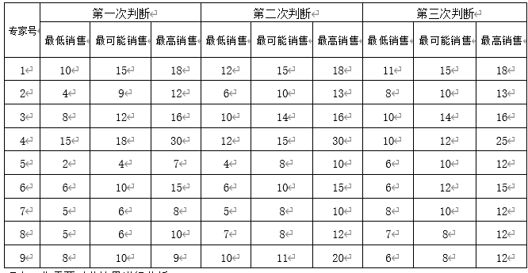

现在你的公司刚开发了一款新产品，但在正式推出之前你的心里其实还挺慌的，虽说打造这款新产品前自己对于市场也做了一定的调研，可光凭这点还远远不够，自己的视角终究是有限的。

到底未来的市场需求会如何变化？

推出的这款新产品销售情况究竟会如何？

它能占领市场的一席之地吗？

新产品在正式推出前，你还应该再获取更多的反馈信息，以方便调整产品。

请教一下专业的人帮忙预测，会是一个不错的办法。毕竟专家拥有丰富的业务经验，掌握了大量的市场信息，你的视角也会比原先更开阔。

那就请一个信任的专家来做预测是不是就够了？

不行，可参考的意见太少了，视角很容易出现偏差。

那请一大堆专家全都一块来帮忙预测够吗？

太多了，也不太合适，意见又很难统一起来。

那请适当人数的专家一起开个会讨论一下？

专家最后意见统一了当然很好，可是开会时专家之间会互相影响判断，而且如果意见完全不同，开会很可能成了吵架，也讨论不出什么结果。

那到底怎么办？

**定义：专家预测法——德尔菲法**

专家预测法，是**基于专家的知识、经验和分析判断的能力，在综合分析历史和现实有关资料的基础上，对未来市场的变动趋势作出预见和判断的方法。**

其中德尔菲法是定性预测法中最重要、最有效的一种，而且应用非常广泛。

它本质上是一种**反馈匿名函询法**，其做法是**在对所要预测的问题征得专家的同意后，进行整理、归纳、统计，再匿名反馈给各专家，再次征求专家意见，再集中，再反馈，直到得到稳定的意见为止。**

****

德尔菲法

总之，它是用一种函询形式的集体匿名思想交流过程。最大的特点就是**匿名性、多次反馈、小组的统计回答**。匿名避免了专家之间的互相影响，同时意见又能够不断调整反馈，避免了各自秉持“自家之言”的尴尬局面，最终形成专家小组的一致意见，决策者得到的是更全面更专业更有价值的决策支持。

**应用：德尔菲法实例分析**

现在你终于下定决心聘请9位专家对新产品投放市场1年的销售额进行预测。在专家进行预测前，公司把产品的样品、特点、用途和用法进行了介绍，并且将同类产品的价格、销售情况作为背景资料，以书面形式发给专家参考，之后采用德尔菲法，请专家进行各自判断。经过三次反馈后，专家意见大体接近，得出了以下预测结果。

**九位专家的预测意见**

销售额（百万元）

现在，你需要对此结果进行分析。

**用DataFocus销售额构建预测模型**

**快速构建模型**

DataFocus使用像google一样搜索式的交互方式，用类自然语言提问，系统自动以可视化形式呈现搜索结果。

搜索结果一键保存为历史问答后，即可放置于数据看板，将多个历史问答进行组合快速制作可视化大屏，构建市场预测分析模型。

精通业务的非工程技术人员，经过30分钟的培训即可熟练掌握， 7分钟即可构建分析模型。

**灵活搭建模型**

自己动手就可搭建可视化大屏。

你可以将保存好的带有图表的历史问答自由组合成个性化的数据看板（数据可视化数据看板），自行DIY数据看板组件，设计可视化大屏，形成市场预测分析模型直观呈现分析结果。

根据分析反馈还可以灵活快速更改、完善分析模型，而不再是固定的分析模型。

**快速深入模型**

如若需要重点关注模型其中某个环节，你可以在数据看板中查看当前组件的对应数据明细。在展示数据明细界面还可以点击增加列进行对比分析，以及下载当前数据，深度剖析信息。

**分析思路**

1.计算最低销售、最可能销售、最高销售的中位数、平均值。

2.再用简单平均法、加权平均法、中位数法，分别计算最终预测销售额。

3.最后根据三种方法的计算结果得出最终预测销售额的范围。

**具体实现步骤**

将最终（第三次判断）的专家意见取出来，将我们需要的信息形成一个新的表。

**第三次判断专家意见**

销售额（百万元）

将该表导入DataFocus中，取名为「9位专家第三次判断的预测意见」。

**中位数计算**

搜索框输入专家号、最低销售，并将最低销售按降序排列，图标属性设置中将行索引开启，由于专家一共有9人，那么行索引为5所在的最低销售即为最低销售的中位数。

利用公式，记录最低销售中位数为8。

同理可得

最可能销售中位数为10。

最高销售中位数为13。

**中位数法**

中位数法，即计算最低销售中位数、最可能销售中位数、最高销售中位数的中位数。

建立公式，中位数法，即按中位数法计算的预测销售额为10。

**平均值计算**

搜索框输入最低销售的平均值、最可能销售的平均值、最高销售的平均值，即可自动计算销售额的平均值。

**简单平均法**

将平均值的数据表保存为中间表，取名为「销售额平均值情况」。

建立公式，简单平均法，(最可能销售的平均值+最低销售的平均值+最高销售的平均值)/3。

最后得出结果，简单平均法下的销售额为11.33。

**加权平均法**

这里假设最低销售的权重为0.3，最可能销售的权重为0.5，最高销售的权重为0.2.

建立公式，加权平均法，0.5\*最可能销售的平均值+0.3\*最低销售的平均值+0.2\*最高销售的平均值。

最后得出结果，加权平均法下的销售额为10.9。

**综合以上三种方法**

综合简单平均法、中位数法、加权平均法，最终确定预测新产品销售额范围为10~11.33百万元。

**总结**

**德尔菲法是在对所要预测的问题征得专家的同意后，进行整理、归纳、统计，再匿名反馈给各专家，再次征求专家意见，再集中，再反馈，直到得到稳定的意见为止。**

其优点是匿名避免了专家之间的互相影响，同时意见又能够不断调整反馈，避免了各自秉持“自家之言”的尴尬局面，最终形成专家小组的一致意见，决策者得到的是**更全面更专业更有价值的决策支持**。

本文通过一个对于新产品上市销售额的预测这样简单的案例，实际应用德尔菲法获取专家统一的预测意见。并且对于专家预测的结果综合运用简单平均法、中位数法、加权平均法三种方法最终确定新产品的预测销售额范围。

快来试用DataFocus学以致用吧！
