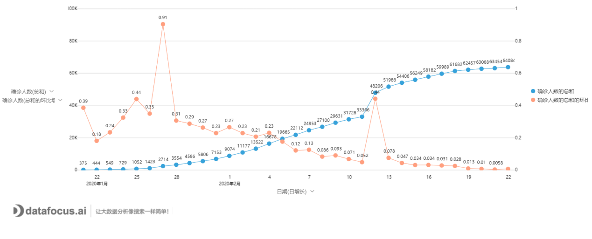
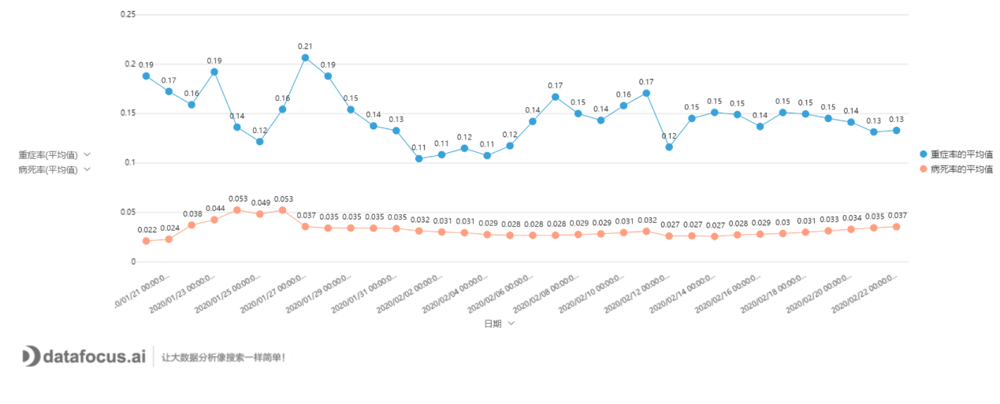

2020年1月，一场不明来源的病毒席卷了武汉，导致整个湖北省被封锁至今。封城前夕，从武汉流出的几十万人口，则导致了全国31个省市启动了“一级应急响应”状态。

这般光景，真是百年罕见。

相比2003年的sars，这次瘟疫的速度和广度是有过之而无不及。即使从“吹哨人”李文亮医生发出善意警告算起，也不足两月的时间；然而，全中国感染人数已将近8万人，死亡逾2000人。这场突如其来的瘟疫，打乱了全中国人的计划，影响了政策的走向；最终将深刻地影响全球经济和政治。

图1：中国感染人数趋势图

从1月22日武汉封城的第一天算起，直至全中国最后一片净土西藏的沦陷（1月29日）结束——瘟疫点亮全中国仅仅用了7天。如今，当中国人民还沉浸在“山川异域，日月同天”的感动中时，日本本土的感染人数则已攀升到136人，韩国的情况则更为糟糕——三天之内净增数百人，感染者已达602人之多。

如果说武汉沦陷还不能让人感受到病毒的可怕，那么钻石公主号邮轮的“隔离实验”则是一部活生生的恐怖剧。短短两周，一名游客即将整船3700多人感染了20%以上。要知道钻石公主号可是世界排名前十的豪华邮轮！发生在韩国的传播事件同样让人惊讶，1名教众轻松感染近百人；一个102名病患的精神病院，被一例患者感染99人，近乎团灭。

可见病毒经过多代传播，并未如人们所愿，降低传染性。观其致病率，也没有减低的迹象——两天之内确诊43人的伊朗，已经报告8例死亡。截止2月23日，海外已有28个国家累计1918例感染确诊，死亡23人。最令人担忧的是，欧洲的中心地区“意大利”也即将沦陷——不到一周，确诊人数增长至157人，死亡3人。据相关报道称，意大利已开始封锁多个城镇，随时可能实行军事管制。

图2：疫情已波及全球28个主要国家

从湖北的发展情况来看，新型冠状病毒在无外界干预的情况下，其感染速度之快可谓“空前绝后”。已知的7万多名感染者，不过只是冰山一角。由此看来，发生在日本、韩国、意大利和伊朗的情况，预示着其实际感染人数很可能早已破千；最为可怕的是，多个地区的感染都已与中国游客无关，无法追本溯源，这正说明病毒传播已进入广泛的本地社区传播阶段。对比湖北曾经的增长速度，**世界地图全部被点亮，可能也就只需要数周时间。**

图3：COVID-19可怕的传播速度

图4：确诊患者人均接触人数

新加坡总理李显龙曾经说COVID-19只是大号的流感。然而迅速扩散的疫情，却令人不得不担忧。虽然新冠病毒的死亡率不足2%，但根据国内的统计数据，其重症率接近15%，蕴含着极大的风险。虽然年老体衰者的死亡风险更大，但大量的案例表明，年轻力壮者因诱发细胞因子风暴而死亡的，也不在少数。**这种无差别攻击，以及较高的重症率，都表明该病毒显然比流感更加致命。**

图5：中国平均重症率和死亡率统计

**新型冠状病毒将对社会经济生活产生深远的影响**

疫情对中国经济的影响已然显现。湖北省是全球汽车产业供应链的重要环节之一，因为封城停工，已导致全球多家汽车制造商零部件库存告急。而在韩国三星，因一名员工的确诊，导致其生产线全部关停。韩国是全球半导体存储器件生产重镇，这样的关停必将对消费电子产业造成影响。

随着广东等多个城市将“应急响应状态”逐级降低，在中国逐步控制住疫情发展之后，迎来的将是中国制造产能的极大释放，口罩等医用物资的短缺将迅速消失。而与此同时，随着东亚（日、韩）、中东、欧洲的疫情爆发，全球供应链将再次遭受打击；病毒超长的潜伏期，以及大量轻症甚至无症状患者的存在，最终将会引发病毒的全球性广泛传播。随着北美地区的陷落，可以想像，未来G7国家将迎来大范围的社会失序、产业链重塑、甚至是经济崩溃。

到那时，谁能有效控制国内疫情的发展、稳定国内生产秩序，谁就将引领“瘟疫流行时代”的政治经济发展。可以想见，蓬佩奥和罗斯之流希望的“疫情击垮中国经济，进而使得供应链脱钩中国、美国制造业坐享回流红利”的美梦即将破裂。

时至今日，有两次瘟疫的流行改变了历史的走向。近的一次，是1918年全球流行的西班牙大流感，导致全球5亿人感染（总人口17亿），死亡3000多万人。这比一战时期参战各国发明的机枪大炮杀死的人多得多，最终导致参展国家没有男丁，第一次大战直接结束。稍远一点的，是1492年，西班牙征服者皮萨罗带领169名士兵，凭借着自身免疫力，以天花的带毒之身，彻底摧毁了拥有1000多万人口、近千年历史的印加帝国。

2020年，又一个庚子轮回，从中国倒霉开始，**最终将谱写成中国制造拯救世界的戏剧性转折。**

做好眼前事，让我们拭目以待——这即将上演的全球魔幻剧！
