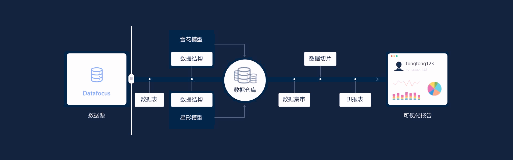
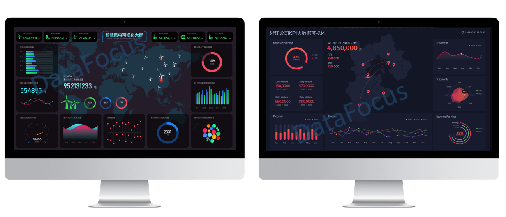
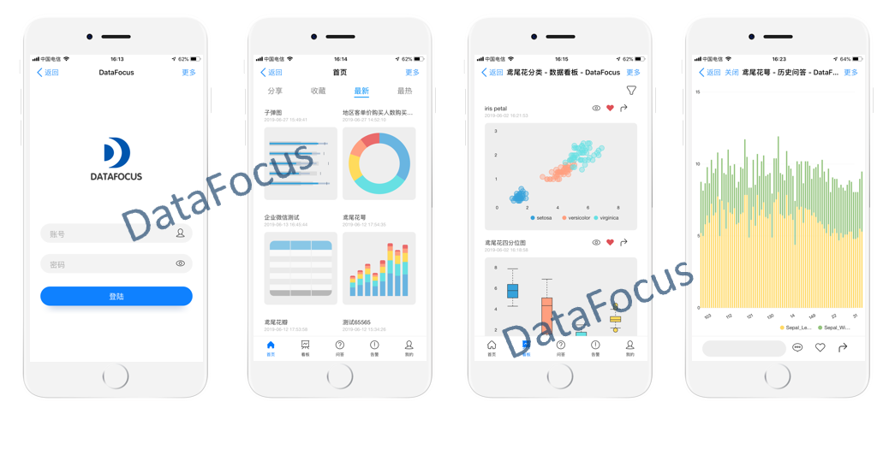

利用数字化技术来推动企业组织转变业务模式，组织架构，企业文化等的变革措施，是当前企业面临的挑战和机遇。如何打造自主可控的PAAS平台，赋能企业数字化转型，开创企业信息化新趋势是这个时代的命题。

为了应对这个挑战，助力企业从信息化向数字化转变，企业必须转变思想，以客户需求为中心，以数据为资产，以技术为手段，以人才为依托，构建能快速满足客户需求的支持业务创新的技术平台体系，支撑客户服务和业务创新。

今年兴起了一个新的概念：业务中台+数据中台，低代码零代码PaaS平台+新一代智能化BI+各类新型数字化技术的应用，这里就不得不提到两个产品了，云表和DataFocus。

**自主可控的零代码PaaS平台——云表**

2010年7月，一支金山系创业团队创立乐图软件Latosoft，历时三年，倾力研发云表“表格编程技术”。零代码、零编程，中文公式设置软件业务逻辑，1天做OA，10天做进销存，30天做ERP，当开发效率提升100倍的时候，软件项目，想失败也会变成一件难事。

**数据分析中台——DataFocus**

DataFocus是由一群热衷于技术的极客倾情三年打造的智能数据分析系统。DataFocus是个数据分析的多面手，你可以把他当作下一代BI系统，或者创新的报表分析工具使用，它包含了传统商业智能软件系统所具备的全部功能，她的智能数据分析功能可以针对较高维度的大数据集展开分析，并生成智能诊断报告，在此基础上，专家版产品还提供了机器学习开发平台。

**业务中台+数据中台=？**

答案是：

**一个自主可控的互联网平台**

盘活IT资产，把信息部门从费用中心变成利润中心。
