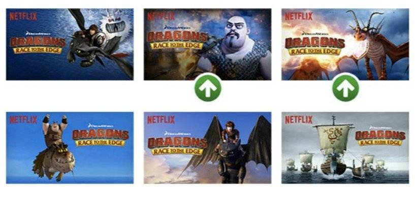
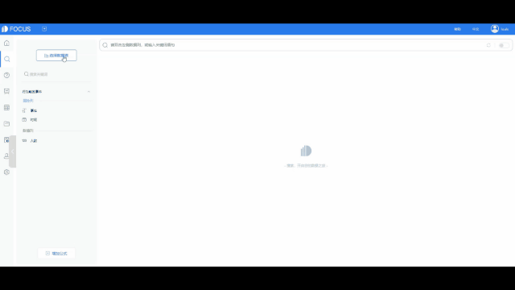

2016 年麦肯锡在报告 《分析的时代》 中提出，人类已经进入数据驱动的世界，数据智能将在未来十年产生 13 万亿美元的经济收益。

随着数据的指数级增长、算力提升和AI技术的不断发展，数据驱动替代流程驱动将是势不可挡的趋势。但是，仍然有很多企业对此有疑问。今天我们就来说说，为什么数据驱动是必然趋势，企业要怎么顺应趋势，先发制人。

**从中国制造到中国创造**

过去很长一段时间，都是“中国制造”的时代，在这个时代的管理模式是怎么样的呢？是一个杰出的管理者，带着一帮普通的员工在干活——那时候，管理型人才很重要，人手不重要。一个工厂的厂长是最宝贵的，不能把厂长随意换掉，但是工人可以随便换，这是中国企业过去最主要的管理形态。

在这种管理模式下，企业对软件产生了一个基本的要：**软件可以通过牺牲员工的效率来提升管理者效率**。所以，那个时代的企业软件，不管是OA、ERP，还是CRM软件，都是不停地要求员工录入，通过牺牲员工的效率，让管理者看到各种图表，实现数字化管理，提高管理者的效率。**企业软件的最大价值就是管理，关键就是为管理者服务的。**

但在今天，中国制造进入中国创造的时代。企业的情况发生了本质的变化。在中国创造的时代，员工价值变得极其重要，而管理者的角色弱化了。企业的经营模式发生了巨大变化，管理者也不再像过去一样管理公司了。

**企业的管理理念发生了改变，相应的，企业的流程管理、使用的工具软件都需要经历革新。今天的产品价值，除了考虑管理价值，最核心的要考虑用户（员工）价值，让员工发挥出个人价值。**

**传统的流程驱动**

所谓的信息化，就是给企业灌输或者梳理一套公司的流程，在这个流程的基础上，帮助企业完成IT化，然后让员工按照这个流程去执行，这是传统管理软件的思维。

由于流程是有层次的，所以能够通过层层分解将高复杂度的事情分解成一层层相对简单的流程，最后达到可以被理解和管理的程度，通过层层流程分解设计的方法可以管理更高复杂度的问题。

但在今天，我们应该重视另外一个理念——数据驱动业务，企业真正的流程不应该是预设的，这是因为整个商业环境的变化速度早已不同往日。花费几个月甚至一两年的时间梳理业务流程，企业一定会跟不上商业世界的发展速度。

**使用数据的三个哲学**

熟悉影视行业的应该对Netflix这个名字不陌生。从2007年创立以来，Netflix已获得了1.5亿个付费用户，股价增幅高达6493%！！

**在Netflix，数据是沟通的语言，是分享的工具，是一种文化。Netflix数据平台负责人Jeff Magnusson分享了Netflix使用数据的三个哲学，强调数据驱动本质是提供一种理性决策依据，让团队在面临数不清的增长策略时，作出效益最高的选择。**

1）每一个人能够很容易的访问、探索和处理数据；

2）不论数据集的大小，第一件事情是让它可视化，从而很容易被理解；

3）找到数据的时间越长，产生的价值越小。

那么，Netflix是如何利用“数据驱动”实现用户高速增长的呢？

**CineMatch 推荐算法：**简单地说，当你登录Netflix后，你对每一个视频所做出的举动（包括点击、播放、暂停、快进、回放、退出）都会成为Netflix数据库里的一个“事件”。

久而久之，它就能通过数据分析，知道你在周末的晚上喜欢看什么类型的电影，更喜欢伍迪·艾伦还是韦斯·安德森… 这套算法让Netflix在降低成本的同时，总能帮助用户找到最符合自己喜好的内容。凭借数据，Netflix还能决策应该制作什么内容，如何基于不同的时间段、不同的客户提供不同的内容。强大的推荐算法让Netflix拥有了90%的续订率！

Netflix还开发了一套系统，能够自动将具有相同背景，但不同剪裁、装饰、标题、长宽比等元素的图像组合在一起，拼成一张海报，然后分别A/B测试用户对这张海报的点击转化率和后续行为，最终挑选出转化率最高的海报。

将“数据为王”执行到极致，连宣传海报都要做无数次A/B测试来增加其转化率的Netflix，有什么理由不该高速增长呢？

**塑造数据驱动型组织**

维基百科对数据驱动的定义是这样的：数据驱动指的是流程中的行为是被数据驱动而不是被人的直觉和经验驱动的。Carl Anderson 在《创造数据驱动的组织》一书中，对于数据驱动的定义是“构建工具、能力，最重要的是，依据数据去行为的文化”。

结合上述的分析，DataFocus对数据驱动的理解是：**利用数据工具，帮助用户（员工）获取随时随地分析数据的能力，并用数据提供决策依据，最终构建人人都是数据分析师的数据驱动型组织。**

怎么做？DataFocus来帮你！

DataFocus ，独创的搜索式数据分析体验，让业务人员即开即用，只需要使用搜索就可以进行数据分析，提升数据应用效率。

 

 

DataFocus如何帮助企业塑造数据驱动型组织呢？我们结合NetFilx的数据哲学对照一下：

1）DataFocus Cloud采用了SaaS部署模式，企业购买之后，只需要为使用用户创建账号，用户使用账号就能方便地登录系统并进行数据分析。同时，也提供了数据权限管理系统，既便捷，又安全。

2） DataFocus提供了高效的数据可视化方案，在DataFocus中制作一张可视化大屏只需7分钟，DataFocus支持40多种可视化图表类型，支持添加自定义文本框、背景、边框装饰、时间器、Tab控件等。还提供联动、跳转、上卷下钻、筛选等交互式分析能力，便于用户构建实时分析型数据看板，驱动业务决策。

 

3）DataFocus cloud提供了云端大数据仓库，可以帮助企业整合不同数据库、数据表格中的数据，避免数据孤岛问题，让数据触手可得。

让DataFocus帮助企业塑造数据驱动型组织，在浪潮中乘风破浪！
