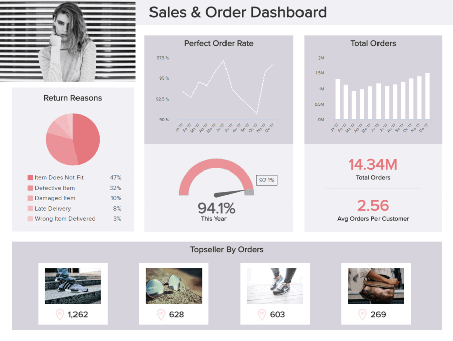
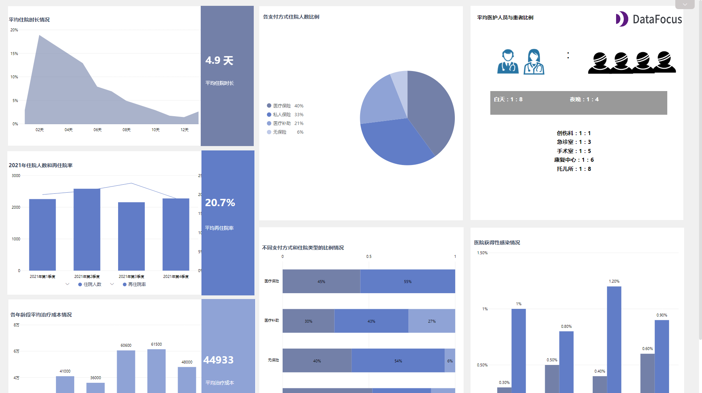

近段时间，单单“大数据”一词就成为了一个流行词——这是有充分原因的。

通过利用触手可及的丰富数字洞察力拥抱[商业智能](https://www.datafocus.ai/infos/bi-skills-for-business-intelligence-career)的力量，您可以自信地做出明智的决策——这将带来商业增长、进化和更健康的利润。

通过实施正确的[报告工具](https://www.datafocus.ai/infos/online-reporting)，并了解如何准确地分析和衡量数据，您将能够做出能够作出推动业务发展的数据驱动型决策。当然，这在理论上听起来很不可思议。

但在实践中，即使您可以访问世界上最丰富的数据，也有可能做出无视实际洞察力的决定，而是听从你的直觉。在大多数情况下，这可能会对业务不利。

虽然有时跟随你的直觉是可以的，但绝大多数基于业务的决策都应该有犀利的指标、事实、数据或与你的目标、计划或倡议相关见解作为支持，这些可以确保你的[管理报告](https://www.datafocus.ai/infos/management-reporting-best-practices-and-examples)和业务运营的稳定支柱。基于数据的决策将推动您的业务达到新的高度，同时使其更适应不断变化的商业环境。它应该是您所有战略、活动和运营的核心。

为了帮助您寻求分析启蒙，我们将探索数据驱动的决策制定，研究数据驱动决策的重要性，考虑发展数据驱动文化的好处，并研究一些真实案例，将洞察力转化为促进业务的行动。

## 什么是数据驱动决策？

数据驱动决策 (DDDM) 是使用数据做出明智且经过验证的决策的过程。交互式仪表板等现代分析工具可帮助人们克服偏见，并做出与商业战略相一致的最佳管理裁决。

从根本上说，数据驱动的决策意味着通过利用经过验证和分析数据来实现关键业务目标，而不仅仅是在黑暗中射击。

但是，要从您的数据中提取真正的价值，它必是准确的且与您的目标相关。收集、提取、格式化和分析业务中增强的数据驱动决策洞察曾经是一项包罗万象的任务，这自然会延迟整个数据决策过程。

但是今天，[商业智能软件](https://www.datafocus.ai/infos/best-bi-tools-software-review-list)的开发和民主化使没有深厚的技术专长的用户能够分析并从数据中提取见解。其直接结果是，生成促进数据决策过程的报告、趋势、可视化和洞察力所需的 IT 支持更少。

从这些发展中，数据科学诞生了（或者至少是巨大的发展）——一门将黑客技能和统计数据特定专业知识相结合的学科。这个相当新的职业涉及筛选大量原始数据，以做出智能数据驱动的业务决策。

数据科学家“挖掘”的“黄金”有两种不同的类型：定性和定量，两者对于做出数据驱动的决策都至关重要。

定性分析 侧重于不是由数字或指标定义的数据，例如采访、视频和轶事。定性数据分析基于观察而不是测量。在这里，对数据进行编码以确保项目有条不紊地、智能地组合在一起至关重要。

定量数据分析侧重于数字和统计。中位数、标准差和其他描述性统计数据在这里起着举足轻重的作用。这种类型的分析是测量而不是观察的。应同时分析定性和定量数据，以做出更明智的数据驱动业务决策。

既然我们已经探讨了决策在业务中的含义，那么是时候考虑数据驱动决策 (DDDM) 为何如此重要的原因了。

我们已经回答了这个问题，“什么是数据驱动的决策？现在，让我们考虑一下它的重要性。

## 为什么数据驱动的决策很重要？

基于数据的决策为企业提供了生成实时洞察和预测的能力，以优化其性能。这样，他们可以测试不同策略的成功，并为可持续增长做出明智的商业决策。

有大量理由表明，使用数据进行决策是每个现代企业都应该置于文化核心的追求——我们将探讨其中的主要要点。

**1\. 持续的组织成长**

数据在决策中的核心重要性在于一致性和持续增长。数据驱动的决策使公司能基于众多职能、运营和部门活动来磨练关键洞察力。

一个接一个具有性的数据决策将使您能够设定可操作的基准，从而实现持续的进步和增长——这是在当今残酷的数字时代取得长期成功的关键因素。

**2\. 知识与创新**

数据驱动的商业决策决定着公司的成败。这证明了[在线数据可视化](https://www.datafocus.ai/infos/data-visualization-tools)在决策中的重要性。

麻省理工斯隆管理学院教授 Andrew McAfee 和 Erik Brynjolfsson 曾在《华尔街日报》的一篇文章中解释说，他们与麻省理工学院数字商业中心合作进行了一项研究。在这项研究中，他们发现，在接受调查的公司中，主要受数据驱动的公司生产率提高了 4% ，利润提高了 6% 。

与采用其他更模糊方法的公司相比，采用协作方式制定决策的公司更倾向于将信息视为一种真正的资产。此外，当您将数字洞察视为真正的资产时，您将培养一种数据驱动的教育文化——一个商业生态系统。在这个生态系统中，每个人都可以利用信息的力量学习更多知识，同时尽其所能。

**3\. 新的商机**

基于数据的决策可以发现新的、令人兴奋的商业机会。深入研究可访问的可视数据将使您全面了解企业的​​核心活动，进而确保您做出一系列有利于业务商业发展的可靠决策。

凭借可以提高您的判断力的深入见解，您将发现扩大增长的机会，建立新的专业联系，并发展创新，从而使您在竞争中获得最重要的优势。

**4\. 更好的沟通**

使用数据驱动的决策管理思维方式，您将成为一个更好的领导者——这将渗透到整个组织。

无论您是在谈论的是数据驱动的财务、数据驱动的销售策略，还是任何其他类型的洞察驱动计划，使用强大的 KPI 和可视化将改善整个部门的沟通。

作为一个有凝聚力的数据驱动单元，您的每个部门都将获得轻松分享见解并就关键战略进行协作的能力，这些战略最终将使您的业务更智能（和更有利可图）。

**5\. 无与伦比的适应性**

最后，数据驱动决策的主要好处之一是，它将使您的业务具有难以置信的适应性。

通过采用数字数据，您的商业帝国会随着时间的推移而发展，从而使您的组织更具适应性。数字世界处于不断变化的状态，为了适应您周围不断变化的环境，您必须利用数据做出更明智、更强大的数据驱动业务决策。

数据驱动的决策工具将使您能够与新兴趋势和模式联系起来，这些趋势和模式不仅涉及您的内部活动，还涉及您周围的行业。如果您能够更层次地了解这些趋势或模式，您就可以做出明智的决定，确保您始终保持竞争力、相关性和盈利能力。

## 增强数据驱动决策策略的 14 条技巧和要点

既然您已经理解了以数据为中心的决策的重要性，这里有 14 个实用技巧和要点，可帮助您在业务中做出更好的基于数据的商业决策。到最后，你会 110% 相信做出这些决定的重要性。

### 1）避免偏见

我们所做的大部分脑力工作都是无意识的，这使得我们很难验证我们做出决定时使用的逻辑。我们甚至会因为看到了我们希望的数据而不是真正摆在我们面前的数据而感到内疚。这是一优秀的团队可以提供帮助的方式之一。由一个有能力但不认同（甚至不知道）您的偏见的人来执行您的决定是非常宝贵的一步。

如果的团队了解你所处理的数据，便能够获得有帮助且有洞察力的反馈。数据民主化使所有人，无论他们的技术技能如何，都可以访问数据并帮助做出明智的决定。这通常是通过创新的[仪表板软件](https://www.datafocus.ai/infos/best-dashboard-software-features)来完成的，以这样的方式将曾经复杂的表格和图表可视化，这样更多人可以发起良好的数据驱动的商业决策。

随着越来越多的人了解这些正在发挥作用的数据，您将有机会获得更可信的反馈。数字就是证明。2010 年麦肯锡对 1,000 多项主要商业投资的研究（即使在今天也很有帮助）表明，当企业致力于减少决策过程中的偏见影响时，他们的回报率最高可提高 7%。在数据驱动决策 (DDDM) 方面，减少偏见并让数字自己说话会产生重大影响。

**克服偏见行为的技巧**

- 简单的意识——每个人都有偏见，但意识到偏见的存在会影响你的决策，可以帮助限制它们的影响。
- 协作——你的同事可以帮助你控制自己，因为在别人身上看到偏见比在你自己身上更容易。让其他人来做决定，并注意会议中的偏见行为。
- 寻找矛盾的信息——向自己和他人提出正确的问题，认清自己的偏见，并在决策过程中消除它们。

通过消除偏见，你可以敞开心扉去发现更多的机会。摆脱先入为主的观念，并真正研究数据可以提醒您，真正改变你的底线。记住，商业智能不应该只是为了避免损失，而是要赢得收益。

### 2) 定义目标

为了充分利用数据团队，公司应该在开始分析之前确定他们的目标。制定一个策略，避免跟随炒作而不是您的业务需求，并定义明确的关键绩效指标 (KPI)。尽管您可以从各种[KPI 示例](https://www.datafocus.ai/infos/kpi-examples-and-templates)中进行选择，但不要过度，而是集中在行业内最重要的那些。

### 3) 立即收集数据

收集正确的数据与提出正确的问题同样重要。对于小型企业或初创企业，数据收集应从第一天就开始。Twitter 的联合CEO兼创始人 Jack Dorsey与斯坦福大学分享了这一经验。“在 Twitter 诞生的头两年，我们是盲目的……我们将一切都建立在直觉之上，而不是在直觉和数据之间取得良好的平衡……所以我为 Square 写的第一件事就是管理仪表板。我们有一个非常严格的纪律来记录和衡量一切”。也就是说，在您的公司中实施[业务仪表板](https://www.datafocus.ai/infos/dashboard-examples-and-templates)文化是正确管理您将收集的数据浪潮的关键组成部分。

### 4) 有效地清理和组织您的数据

在数据分析方面，分析师有相当一部分时间用于清理和组织信息，以确保在分析开始之前，将任何格式错误的数据排除在外。这是一个关键的过程，因为您的分析结果是成功的数据驱动策略的基础，并且您的数据需要百分百准确。

面对看似无限的字符串或数据集，深入挖掘最相关、最有价值的见解是获得清晰信息和做出更好决策的唯一途径。也就是说，一旦您从最相关的来源收集了数据，花时间挖掘最能促进业务发展的洞察力，将确保您可以从分析工作中榨取每一滴价值。

在您清理和组织数据时，您应该专注于以几点：

- 过时或与您的特定目标和结果无关（删除）
- 需要格式化和分类（排列）
- 重复并造成混乱（擦除和排列）

简化您收集的数据，记下您最有价值的来源，对已清理的数据进行逻辑分类——这样您就走上了数据驱动的成功之路。

### 5) 找出未解决的问题

一旦设定了策略和目标，就需要找到需要答案的问题，以便实现这些目标。提出正确的[数据分析问题](https://www.datafocus.ai/infos/data-analysis-questions)可以帮助团队专注于正确的数据，从而节省时间和金钱。在本文前面的示例中，沃尔玛和谷歌都有非常具体的问题，这极大地改善了结果。这样，您就可以专注于您真正需要的数据，并且从“以防万一”直接了当地收集所有内容，转向“收集这个来回答那个”。

### 6）找到解决这些问题所需的数据

在你收集的数据中，试着专注于你的理想数据，这将帮助你回答上一阶段定义的未解决问题。一旦确定，请检查您是否已经在内部收集了这些数据，或者您是否需要设置一种方法来收集或从外部获取它。

### 7) 分析和理解

这似乎是显而易见的，但我们不得不提一下：在设置所有要回答的问题和数据收集的框架之后，您需要通读它，以提取有意义的见解和[分析报告](https://www.datafocus.ai/infos/analytical-report-example-and-template)，见解和报告将引导您做出数据驱动的业务决策。事实上，用户反馈是一个很有用的工具，可以对客户体验进行更深入的分析并提取可操作的见解。 要想成功地做到这一点，重要的是要有上下文。例如，如果您想提高购买渠道的转化率，那么了解访问者流失的原因将是一个重要的洞察。通过分析反馈表单（在此漏斗中）的公开评论中的回复，您将能够了解他们在结帐时未成功付款的原因，并相应地优化您的网站。

### 8) 发现趋势和模式

任何有效的基于数据的决策过程中最不可或缺的部分之一就是发现关键的趋势和模式。在您设置了可行的目标并在业务的相关领域进行了一些有针对性的测试之后，您可以进一步深入到您最新的情境化数据洞察中，并设置可视化 KPI，以发现任何新出现的相关性、信息趋势或任何可能被证明有价值的模式。

例如，如果您已经设置了一个 KPI 来可视化一个月内的客户呼叫服务解决率，并且您注意到解决率在周末逐渐下降（低于您设定的目标率）的模式，您将能够检查原因。您可能会发现员工的积极性在本周晚些时候有所下降，并根据该发现推出提高参与度或激发员工积极性的策略。

### 9）不要害怕重新审视和重新评估

我们的大脑会迅速得出结论，不愿考虑其他替代方案；我们特别不擅长重新审视我们的第一次评估。一位平面设计师朋友曾经告诉我，他经常会发现自己在项目结束时陷入困境。他致力于他选择的方向，不想放弃它。由于错误的原因，他被投资了。毫无疑问，当这种情况发生时，他将不得不从头开始，才能看到让他陷入困境的失误。与他从初稿中拼凑出一个解决方案相比，最终产品的重做效果要好得多。

验证数据并确保跟踪正确的指标可以帮助您摆脱决策模式。依靠团队成员的观点并分享它可以帮助您看到偏见。但不要害怕退后一步，重新考虑你的决定。可能会感觉到一时的失败，但要成功，这是必要的一步。了解我们可能出错的地方并立即解决它会产生比我们静观其变更积极的结果。等事态发展的代价都是有据可查的……

### 10) 以有意义的方式呈现数据

挖掘和收集洞察力很好，但设法讲述你的发现并传达你的信息更好。你必须确保你的聪明才智不会一直被埋没和蒙尘，而且它将被用于未来的决策。借助出色的数据可视化软件，您无需成为 IT 专家即可构建和自定义功能强大的[在线仪表板](https://www.datafocus.ai/infos/online-dashboard)，该仪表板将讲述您的数据故事，并帮助您、您的团队和您的管理层做出正确的数据驱动的商业决策。例如，您需要不惜一切代价控制自己的财务状况：

[财务仪表板上](https://www.datafocus.ai/infos/dashboard-examples-and-templates-finance)显示的大纲将确保对公司的财务业绩的概览一目了然。凭借营业费用比率、净利润率、损益表和息税前利润等核心 KPI，此仪表板可在专注于实时数据的同时实现快速决策过程。

如需更多灵感，可以查看来自世界上最具前瞻性的品牌和企业的这些令人难以置信的[数据可视化示例。](https://www.datafocus.ai/infos/best-data-visualizations)

### 11) 使用人工智能技术

71% 的关键决策者表示，人工智能技术已经让他们的业务变得更好。通过使用由人工智能驱动的数据平台，您不仅可以通过消除繁重的手动分析任务来提高生产力，还可以更快地做出更明智、更明智的决策。

人工智能数据技术将使您能够以最高效率收集、组织、呈现和处理您的数据，进而显著加速您的商业增长。人工智能驱动的创新将提供持续健康的投资回报 (ROI)——这在数字时代是无价的。

人工智能技术的另一个提高生产力和投资回报率的好处是，当应用于数据时，它能够自动化基本的分析任务和流程，以减少手动工作，并使用户能够专注于利用他们的洞察力来制定有利于业务的创新战略。借助 AI 技术，您还可以设置智能[数据警报](https://www.datafocus.ai/infos/business-intelligence-data-alerts)，以便在您达到目标、发生事件或出现异常情况时通知您。这些好处将使您的业务更智能、更快捷、对变化更敏感。

### 12) 为决策制定可衡量的目标

在您提出问题、数据和见解之后，困难的部分就来了：决策。您需要将获得的发现应用于业务决策，但也要确保您的决策与公司的使命和愿景保持一致，即使数据相互矛盾。设定可衡量的目标以确保您走在正确的轨道上，并将数据转化为行动！

### 13) 投资于正确的基于数据的决策工具

当涉及到数据驱动决策的业务分析时，如果您想实现您的目标并做出始终如一的明智决策，那么使用正确的工具是必不可少的。

我们谈到了人工智能技术的价值——并在这一点上进行了扩展（以及设定可衡量目标的重要性），使用正确的工具将使每个人都可以访问数据。通过访问一个集中仪表板，提供丰富的可消化的数据驱动洞察，企业中的每个人都将蓬勃发展，从而实现持续增长、创新和盈利。这些自助式分析工具将使企业内的每个人都能在没有技术技能的情况下使用数据 - 当每个人都可以利用数据来发挥自己的优势时，您的业务将会蓬勃发展。

我们先进的[BI 报告工具](https://www.datafocus.ai/infos/bi-reporting)将使您组织内的每个人都能够有效地协作，同时尽其所能。

### 14) 继续发展数据驱动的业务决策

这一点经常被忽视，但它非常重要：_您永远不应该停止检查、分析和质疑您的数据驱动决策。_在我们高度互联的数字时代，我们比以往任何时候都能接触到更多的数据。将数据驱动的教育作为您组织的关键价值观之一，并鼓励一种文化，在这种文化中，每个人不仅要提高自己的分析技能，还要负责周围环境的测试、探索，并调整他们的业务决策。

为了从这些丰富的洞察中提取真正的价值，根据客户、合作伙伴和消费者不断变化的思维方式或偏好，不断更新和发展您的业务目标才是至关重要的。

## 您应该不惜一切代价避免的数据驱动决策错误

此时，数据在决策中的重要性就显而易见了。但是，虽然了解数据驱动的业务决策的动态并探索现实世界的数据驱动决策示例将引导您朝着正确的方向前进，但了解应该避免的事情将帮助您巩固成功。

在你的一生中，你准备过多少次会议，准备好事实和数据，但最终却做出了完全相反的决定？

感觉好像在会议开始之前就已经做出了决定。如果这听起来很熟悉，那么您并不孤单。我们不仅仅是在谈论一家初创公司，这家公司认为凭直觉行事比 KPI 更重要；我们谈论的是大公司。前 IBM 员工兼 Forrester 研究员 Rob Enderle 写了一篇精彩的文章，记录了 IBM 和微软高管的缺点。

虽然这篇文章充满了例子，但也许最令人震惊的是 IBM 将其 ROLM 部门的部分出售给了西门子。Enderle 和他的团队制作了一份内部报告，证明将公司卖给西门子将是一个灾难性的失败。结果发现，这个决定在研究结果出来之前就已经做出了。事实上，高管们根本忘记了这项研究是受委托进行的。他们的大胆决定最终使公司损失了超过 10 亿美元。

BI-Survey 的一份出版物显示，他们调查的公司中有 58% 表示，他们至少有一半的常规业务决策基于直觉或经验，而不是数据和信息驱动。平均而言，他们意识到公司在决策时只会使用 50% 的可用信息。

作为商业智能提供商，我们了解数据驱动决策的重要性。这就是为什么我们创建了一个[在线数据分析工具](https://www.datafocus.ai/infos/data-analysis-tools)，使客户能够最大限度地利用他们的数据，以一种有意义的方式将其可视化，并在令人惊叹[的实时仪表板](https://www.datafocus.ai/infos/live-dashboards)中轻松分享这些生成的见解，从而更快地做出更好的业务决策。但是，如果最终决策者忽略了这些报告，我们提供的见解将毫无用处。

这个难题促使我们深入研究：为什么企业领导者不使用数据驱动的决策？你应该注意什么来确保你的决定是基于数字而不是感觉？

既然我们已经概述了让您的数据驱动决策正确的基础，我们将通过深入研究数据分析师和业务领导者过去常见的错误，以避免一些事情。[通过在数据分析软件](https://www.datafocus.ai/infos/data-analyst-tools-software)的帮助下观察和吸收这些关键点，您将能够确保您的数据驱动的商业决策是一致的、以结果为导向的，并且始终以您的目标为中心。

### 1) 数据质量

首先，通常调用的主要原因是[数据质量](https://www.datafocus.ai/infos/data-quality-management-and-metrics)。根据作者 Thomas C. Redmann 撰写的一篇文章，数据质量是一组定性或定量变量的条件，应“适合其在运营、决策和规划中的预期用途”。良好的数据质量管理（从获取到维护，从部署到组织内适当的的分发流程）也是未来使用此类数据的关键。收集和聚合只有在事后妥善管理和利用时才是好的，否则，资产的潜力仍然没有被挖掘和利用

### 2）过度依赖过去的经验

过度依赖过去的经验会扼杀任何企业。如果您总是在后面看，那么您很可能会错过前面的内容。很多时候，商业领袖被聘用是因为他们以前的经验，但环境和市场会发生变化，同样的技巧下次可能就行不通了。引用最多的例子之一是迪克·富尔德，他在长期资本管理公司危机后拯救了雷曼兄弟。十年后，他使出了同样的伎俩，正如《华尔街日报》报道的那样，“他所依赖的经验与这次由房地产引发的大规模崩盘不同。” 这次的危机要复杂得多。环境和市场不断变化，为了成为一名成功的管理者，必须将过去的经验与当前的数据结合起来。

### 3) 随心所欲地处理数据

虽然一些管理者会自然而然地按照自己的直觉行事，但也有相当一部分人首先相信自己的直觉，然后说服他们的研究人员或外部咨询公司具报告，以证实他们已经做出的决定。根据上面提到的 Enderle 的文章，这在微软是司空见惯的。研究人员的任务是提供报告，为高管的决定提供可信度。

### 4) 认知偏差

认知偏差是指人们倾向于根据有限的信息或与当前情况无关的过去经验教训做出决策。认知偏差每天都会以某种方式发生在我们做出的每一个决定中。这些偏见可能会影响企业领导者忽略可靠的数据，转而相信他们的假设。以下是一些常见的认知偏差示例：

- 确认偏差——企业领导者倾向于选择能证实他们已有信念的信息，无论是对还是错。
- 认知惯性——尽管数据证明并非如此，但无法适应新的环境条件并坚持旧信念。
- 群体思维——无论支持的证据或动机如何，都希望站在大多数人一边，成为群体的一员。
- 乐观偏见——基于对未来会比过去好得多的信念做出决策。

管理者需要认识到我们在任何情况下都存在偏见。根本不存在客观性这回事。好消息是，有办法克服偏见行为。

因此，这些企业可以更准确地识别商机并预测未来趋势，通过数据决策产生更多收入并促进更大的增长。

## 3 个成功的数据驱动决策示例

现在我们已经对做出数据驱动决策的意义以及数据驱动决策的重要性有了更清晰的理解，我们将深入研究 3 个鼓舞人心的数据驱动决策示例。

### 1) 谷歌

根据smartdatacollective.com上的一篇文章，数据驱动决策的最著名例子之一来自搜索巨头 Google 。初创公司以解散等级制度而闻名，谷歌很好奇拥有经理是否真的很重要。

为了回答这个问题，谷歌的数据科学家查看了经理下属的绩效评估和员工调查（定性数据）。分析师将信息绘制在图表上，并确定经理通常被认为是优秀的。他们更进一步，将数据分成顶部和底部四分位数，然后进行回归。这些测试表明，在团队生产力、员工幸福感和员工流动率方面，最好的和最差的管理者之间存在巨大差异。好的经理让谷歌赚更多的钱，创造更快乐的员工，但什么样才是一经理呢？

分析师再次审查了“优秀经理奖”评分中的数据，员工可以在其中提名工作出色的经理。员工必须提供例子来解释是什么让经理如此出色。还采访了最高和最低四分位数的经理以完善数据集。谷歌的分析发现了在谷歌成为一名优秀经理的前 8 种行为和 3 种不能。他们修改了他们的管理培训，纳入了新发现，继续授予卓越经理奖，并实施了每年两次的反馈调查。

### 2) 沃尔玛

据《纽约时报》报道，沃尔玛在应对 2004 年飓风弗朗西丝做准备的紧急商品方面使用了类似的流程。高管们想知道暴风雨来临前他们应该储存的商品类型。他们的分析师挖掘了在类似条件下从其他沃尔玛商店购买的历史记录，对 TB 级的客户历史记录进行排序，以决定将哪些商品发送到佛罗里达州（定量数据）。事实证明，在自然灾害发生时，美国人会选择草莓馅饼和啤酒。沃尔玛当时的首席信息官 Linda M. Dillon 解释说：

_“通过预测将要发生的事情，而不是等待它发生……装满面包糕点和六块装的卡车很快就在的95 号州际公路上飞驰，驶向弗朗西丝大道上的沃尔玛。”_

沃尔玛的分析师不仅让佛罗里达人在风暴期间愉快的享受啤酒和馅饼的美味，而且还通过预测需求来创造利润，因为大多数产品销售很快。

### 3) 西南航空公司

数据驱动的决策在所有行业中都具有令人难以置信的价值，但有一个行业是众所周知的受益于这种见解的，那就是航空业。

西南航空公司的高管利用有针对性的客户数据来更深入地了解哪些新服务最受客户欢迎，也最有利可图。

在此过程中，航空公司发现，通过观察和分析消费者的在线行为和活动，它可以为不同细分客户群提供最适合他们需求的价格，以及堪称典范的客户体验 (CX)。

这种强调数据驱动决策的直接结果是，西南航空公司的客户基础和品牌忠诚度逐年稳步增长。

## 仪表板在数据驱动决策中的作用

当您必须做出数据驱动的业务决策时，仪表板可能会发挥关键作用。将所有历史和当前数据显示在一个屏幕上，可以交互和深入挖掘单个 KPI ，或者生成部门或公司的概览，仪表板将支持重要信息的整体概述。为了在实践中看到这一点，我们现在来看看一些选定的示例。

### 1) 数据驱动的高层管理决策

C 级管理人员必须掌握他们的数据。为了能够根据他们的战略和目标有效地跟踪信息，每个经理都专注于在特定时间范围内产生实际收入，与目标收入相比，并清晰地可视化它是如何发展（或不发展）的，例如本例所示为使用现代[管理报告软件开发](https://www.datafocus.ai/infos/management-reporting-tools)的：

它还显示了基于客户级别的收入，以及与获客成本和获客总数相关的统计数据。这可以帮助每位经理成功地根据可视化数据做出决策，从而使流程更快、更有效。这证明了为什么数据驱动的决策在当今的商业世界中是很重要的。

### 2) 数据驱动的零售决策

在线上零售中，数据收集是非常简单且丰富的。不同的购物方式、获得评论和在线意见使消费者比以往任何时候都更了解情况。这就是为什么清楚地了解数据对于小企业主和大型企业来说都至关重要。在下面的示例中，我们可以看到作为选定[零售 KP](https://www.datafocus.ai/infos/kpi-examples-and-templates-retail)的示例：

订单总量、每位客户的平均订单量、畅销商品以及退货原因统计数据和数据字可以让您了解消费者的行为、退货原因以及一年中的哪个时间是您的最大的订单量的基准。这样，您就可以仅根据[零售分析](https://www.datafocus.ai/infos/retail-analytics)数据做出未来的决定，而不是基于可能会破坏您的商业战略的直觉。

### 3) 数据驱动的医疗决策

我们的下一个仪表板示例显示[了医疗保健领域强大的关键绩效指标](https://www.datafocus.ai/infos/kpi-examples-and-templates-healthcare)，这是数据驱动决策如何增强患者护理和设施管理的完美示例。

数据截图：DataFocus（数据已脱敏）

我们的动态[医疗保​​健面板是一个](https://www.datafocus.ai/infos/dashboard-examples-and-templates-healthcare)视觉平衡的信息中心，旨在简化患者护理和关键运营成本。在医疗保健方面，失误或效率低下可能是生死攸关的问题——风险非常高。

这个功能强大的仪表盘有三个 KPI，可对护士与患者的比例、患者住院时间、再入院率、治疗成本以及在设定的时间范围内基于医院的感染水平提供丰富的洞察力，它确保了日常医疗手术以极高的效率展开，同时改善了患者护理并减少了不必要的医疗错误。这是任何忙碌的医疗决策者的必备工具。

### 4) 数据驱动的金融战略

代表数据如何推动财务决策的可视化[财务报告可帮助负责组织财务健康的人员评估和缓解波动的趋势和模式。](https://www.datafocus.ai/infos/daily-weekly-monthly-financial-report-examples)

数据截图：DataFocus（数据已脱敏）

通过对重要财务方面（包括营运资金、现金转换周期和供应商错误率等）的洞察，您可以在此处快速深入了解潜在的财务效率低下并正面解决问题。借助基于您当前流动资产和负债的全面信息，就有可能做出影响组织财务流畅度的精确决策。使用此类财务仪表板，还可以管理您的外部合作伙伴关系，包括供应商，并修复任何消耗您的业务效率或财务健康的关系。

### 5）数据驱动的销售策略

在商业中，数据驱动的业务决策促进了各个部门制定创新战略——销售也不例外。

最完整的[销售仪表板示例之一](https://www.datafocus.ai/infos/dashboard-examples-and-templates-sales)，配备了优化追加销售或交叉销售计划所需的所有数据可视化和 KPI，跟踪每个渠道的增量销售、准确分解销售和市场营销成本、监控收入，轻松分析利润。

即使在您最忙碌的时期，这个高度可视化的仪表板也能让您在压力下做出明智的、价值驱动的决策。此外，这种视觉洞察力的大熔炉将允许您能够发现新兴模式，并调整您的销售策略，以吸引更广泛的受众，同时从您的所有潜在客户活动中获得更好的投资回报率。

## 基于数据的高效决策的关键要点

我们已经探索了几个数据驱动决策的令人信服的例子，这是不可否认的——通过以正确的方式利用数据并衡量您的成功，您可以将您的业务推向新的令人兴奋的高度。

现在，您已经获得了为业务做出最佳数据决策的所有关键要素，是时候将您的计划付诸行动了。请记住——为了获得最大的成功，您必须不惜一切代价避免采取错误的方法来进行数据驱动的业务决策。如果做不到这一点，将导致您凭直觉做出选择、偏见做出选择或在组织内培养不良的数据文化。

在 DataFocus，我们 100% 致力于帮助您为您的业务做出最佳的数据驱动决策。我们的解决方案结合了最优秀的[业务报告软件](https://www.datafocus.ai/infos/business-reporting-software)和最前沿的视角，以评估您的决策，开始看到结果。

要开始您自己的成功的数据驱动决策之路，在一个地方可视化您的所有数据，只需点击几下即可生成见解，您可以试用我们的仪表板软件，完全免费[试用](https://www.datafocus.ai/console) 30天！
