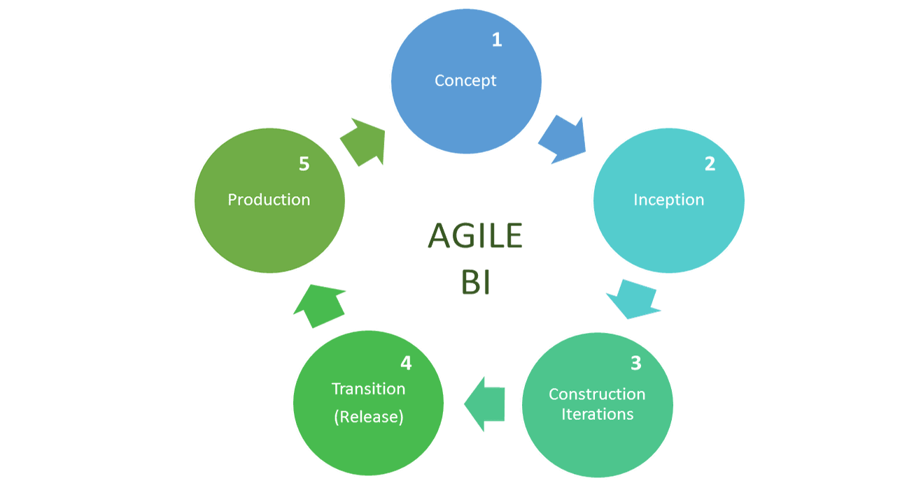
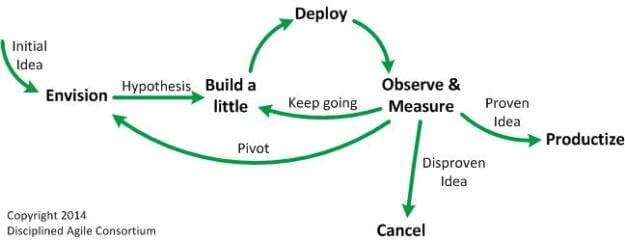
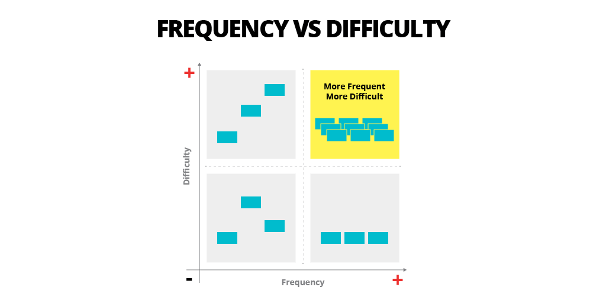

当涉及到实施和管理一个成功的 BI 战略时，我们一直宣称：从小处着手，使用正确的[BI 工具](https://www.datafocus.ai/infos/best-bi-tools-software-review-list)，让您的团队参与进来。我们知道，最好的方法是迭代和灵活的方法，无论您的公司、行业或部门的规模如何。在鼓励这些 BI 最佳实践时，我们实际上是在倡导敏捷的商业智能和分析。

也就是说，在本文中，我们将从基本定义开始介绍敏捷分析和 BI，并继续介绍方法、技巧和窍门，以帮助您实施这些流程，并为您提供如何使用它们的清晰概述。在我们看来，敏捷 BI 和敏捷分析这两个术语可以互换并且含义相同。因此，我们将引导您完成这份关于敏捷商业智能和分析的初学者指南，以帮助您了解它们的工作原理以及它们背后的方法。事不宜迟，让我们开始吧。

## 什么是敏捷分析和 BI？

敏捷分析（或敏捷商业智能）是一个术语，用于描述 BI 和分析过程中使用的软件开发方法，以建立灵活性、改进功能并适应 BI 和分析项目中的新业务需求。

有必要说，这些流程是反复出现的，需要不断改进报告、[在线数据可视化](https://www.datafocus.ai/infos/data-visualization-tools)、仪表板和新功能，以适应当前流程并开发新流程。从本质上讲，这些流程被划分为更小的部分，但具有相同的目标：帮助公司、小型企业和大型企业等快速适应业务目标和不断变化的市场环境。为了更好地建立您的公司，我们建议您阅读我们关于[企业软件应用程序](https://www.datafocus.ai/infos/enterprise-software-applications-tools)主题的文章。

通常情况下，企业需要开发一种敏捷的 BI 方法，以有效的满足公司对战略发展和运营的要求。无论您是否需要开发全面的[在线数据分析](https://www.datafocus.ai/infos/data-analysis-tools)流程或降低运营成本，敏捷BI开发肯定会在您的项目中占据重要位置。

“敏捷”一词最初是在 2011 年作为为一种软件开发方法而提出的。17 位软件开发人员开会讨论轻量级开发方法，随后产生了以下宣言：

_敏捷软件开发宣言：_

**个人和互动**胜过流程和工具 **工作软件**胜过综合文档 **客户协作**胜过合同谈判 **响应变化**胜过遵循计划

_也就是说，虽然右边的项目有价值，但我们更重视左边的项目。_

就这样，敏捷诞生了。作为一种软件开发方法，敏捷是一种有时间限制的迭代软件交付方法，它逐步构建软件，而不是试图在最后交付整个产品。由于其方法论的成功，敏捷已经成功地超越了其最初的范围，现在被成功地用作许多行业的[项目管理方法论](https://www.datafocus.ai/agile-project-management-non-software-projects)。由于强调适应性而不是刚性，强调协作而不是层次结构，所以很容易理解为什么敏捷正在成为许多人选择的方法。

_资料来源：__pmi.org_

为了更详细地研究这些过程，我们现在将解释敏捷 BI 方法以及分析方法，并提供敏捷 BI 开发的步骤。

## 敏捷商业智能和分析方法论

商业智能正在远离传统的工程模型：分析、设计、构建、测试和实施。在传统模型中，开发人员和业务用户之间的沟通不是优先事项。此外，开发人员更关注数据和技术，而不是回答更重要的问题：

- “为了支持决策过程，我们希望用可用数据回答哪些业务问题？”
- “我们的用户真正需要什么？”

通过采用敏捷，组织可以更快地获得 BI 投资回报，并能够快速适应不断变化的业务需求。为了充分利用敏捷业务分析，我们将介绍BI实施和管理方面的基本敏捷框架。您可能会发现不同版本，但基本方法是相同的。让我们从概念开始。

### 1\. 概念

这是您开始制定宽松的 BI 愿景的阶段。敏捷 BI 实施方法从简单的文档开始：你不需要详细地规划它。一个白板会议就足够了，您可以在其中解释初始架构，考虑交付项目的实际方面，并确定它们之间的优先级。细节将在后面考虑，因此，将重点放在概念上，并从那里开始发展。

### 2\. 起步

初始阶段是关键的启动阶段。这是您第一次让积极的利益相关者参与。你也需要：

- 对项目利益相关者培训敏捷基础知识
- 确定 BI 资金和支持
- 确定关键业务需求和需求。这包括了解要通过 BI 系统回答的业务问题
- 发现可用的数据源
- 了解预期的信息传递途径：报告、仪表板、[临时报告](https://www.datafocus.ai/infos/ad-hoc-reporting-analysis-meaning-benefits-examples/)等。
- 然后在考虑时间和预算限制的情况下，优先考虑关键业务需求和需求。一种有效的优先级排序技术，是为每个确定的业务问题编写用户叙述。然后使用**频率与难度**象限来确定它们的优先级。右上象限包括最常见的业务问题，这些问题是现有数据中最难回答的问题。这些叙述可以被视为高优先级。最不难和最需要的右下角也可能是一些很好的容易攻克的东西！

_资料来源：__thoughtworks.com_

- 在此阶段，您还将研究和审查要使用的[在线商业智能软件](https://www.datafocus.ai/infos/online-bi-tools) 。您需要确定是采用内部部署策略还是云托管策略。然后，您需要为您的组织选择并设置正确的 BI 解决方案！

### 3\. 构建迭代

在构建过程中，您将交付一个满足利益相关者不断变化的需求的工作系统。您将以设定的增量持续地从该阶段循环到第4阶段，通常为1-3周。最终，在第 3 和第 4 阶段完成后，您将进入第 5 阶段（生产）。但在生产之前，您需要开发文档、测试驱动设计 (TDD)，并实施这些重要步骤：

- 再次让主要利益相关者积极参与
- 协作开发报告
- 利用“及时制”（JIT）模型：确定一个需要解决的问题，找几个同事探讨这个问题，然后每个人都像以前一样继续。这也称为模型风暴，是敏捷分析开发中的一种实践
- 在小组中测试 BI ，并在内部部署软件

### 4\. 过渡（又名发布或结束游戏）

在此阶段，您将先前的构造迭代发布到生产环境中。然后您返回迭代，之后再次返回转换，以将这些更改发布到生产环境。在过渡期间，您：

- 让关键利益相关者参与（是的，仍然！）
- 完成测试
- 必要时完成文件
- 小组中试运行发布环境
- 培训终端用户
- 培训生产人员
- 部署到生产环境

这些步骤对于在商业智能中采用敏捷至关重要，强调您需要支持您的团队及时交付价值是很重要的，但不要坚持“单一真理”，因为不同部门有不同的工作方式和风格。在完成过渡和迭代之后，您将进入 BI 和敏捷分析开发的下一步。

### 5.生产环境

生产环境是您操作和支持从构建和过渡迭代到生产的所有东西的地方。在此阶段，您：

- 操作和支持系统、仪表板和报告
- 识别缺陷和改进。任何这些更改都必须从构建阶段开始，并逐步进入生产阶段。

从本质上讲，生产阶段是您需要关注整个系统、利用[仪表板创建器](https://www.datafocus.ai/infos/dashboard-creator)并支持发布的阶段。

无论您的公司规模如何，这些基本步骤都将使您能够将敏捷数据分析和 BI 方法付诸实践。永远记住要以用户为中心，了解人们可能如何使用您的 BI 系统并实现您的短期和长期业务目标。

现在您已经了解了基本框架及其工作原理，我们将把注意力转移到其他技巧上，以确保您不会错过成功开发敏捷分析方法和提高最终项目质量的任何重要部分。

## 敏捷 BI 和分析开发的 10 大技巧

为确保您的 BI 和敏捷数据分析方法得到成功实施并交付实际的业务价值，我们在此提供一些额外的技巧，这些技巧将确保您保持跟踪，并且不会忘记过程中任何重要的点，从利益相关者开始。

### 1\. 活动的利益相关者参与

这是非常重要的，我们再次声明。涉众参与在[BI 项目的每个阶段都至关重要](https://www.datafocus.ai/infos/analytics-and-bi-projects-examples-templates/). 在敏捷中，涉众和产品负责人在整个过程中定期体验团队进展，增加利益相关者的投入意味着更好的整体业务价值。利益相关者在整个项目中至关重要，他们需要被包括在大多数步骤中，因为您需要定期反馈，无论他是直接用户、高级经理、员工、开发人员还是项目经理。通常，您需要与利益相关者密切合作，以便最终根据他们的反馈和对他们实际需要的整体理解来更新解决方案。在与利益相关者打交道时，请记住要灵活，教育高级管理人员，并了解他们的重要性。这样，您就可以在交付最终项目和结果时避免许多潜在的瓶颈。

### 2\. 采用进化方法

这是给定的：需求，或者至少你对它们的理解，会因为各种原因在项目的整个生命周期中发生变化. 为了最好地开发满足利益相关者需求的解决方案，您必须采用进化（迭代和增量）方法进行开发。请记住对方法灵活性的需求，因为每个团队都是独一无二的，各种技术需要各种技术，并且在数据分析和 BI 中没有“一刀切”的敏捷方法。可以与不同的团队合作，无论他们的重点是数据管理还是敏捷商业智能平台实施。重要的概念是，您需要准备好以一种渐进的方式工作，并随着时间的推移逐步交付您的项目，而不是一个大版本。这个概念对于数据专业人员和传统程序员来说可能是新概念，但它肯定会在现代软件流程中有所帮助。

### 3\. 仅在必要时记录

这个建议应该是您的最爱。传统方法需要大量时间来规划和编写文档，而敏捷方法则依赖于日常的 Scrums 和面对面的团队交流。通过最小化文档，团队能够快速响应项目障碍并消除冗余。我们并不是说要完全丢失文档，而只是专注于必要的内容。有效的团队通常专注于开发报告等活动，而不仅仅是记录您在某个时候需要交付的内容。您将通过交付项目来衡量您的成功，而不是通过您正在制作的文档级别，因此，文档应该只在必要的时候开发。最好定期对最终产品进行反馈，以便您知道需要更新和改进哪些内容，而不是填写无休止的文档。这样，您的反馈周期将大大缩短，工作流程更有效，风险最小化。

### 4.接受改变

如果您可以在生命周期的后期对更改的需求采取行动，则可能会带来竞争优势。与其采用严格的变更管理流程，不如采用敏捷的变更管理方法。使用敏捷方法，利益相关者可以随着进展的进展轻松改变他们的想法。但不仅如此，敏捷 BI 解决方案和服务希望交付高质量和高价值的项目，而最简单的方法是首先实现高优先级的需求。这样，利益相关者的投资回报率可以最大化，而敏捷开发人员可以真正管理变更，而不是阻止变更。发生变化的原因有很多，从缺少需求、识别缺陷、立法甚至市场都可能会发生变化。重点是不要在生命周期的早期就确定需求，这样您就有空间来适应和交付涉众的要求。这对于 BI 和有效的组织能否取得成功来说，是至关重要。

### 5\. 整个生命周期的测试

请记住，敏捷商业智能是一个持续的过程，而不是一次性的实施。数据变化。组织发生变化。您将需要不断地返回您的[业务仪表板](https://www.datafocus.ai/infos/dashboard-examples-and-templates/) ，以确保它正常工作、数据准确并且仍然以最有效的方式回答正确的问题。测试将消除大量的数据质量挑战，并在您的敏捷周期中引入测试优先的方法。这是整个项目的一个持续过程，目标始终相同，正如我们之前提到的：交付高质量的结果。敏捷测试中常用的方法包括：

- **行为驱动开发 (BDD)：**这里的目标是改善利益相关者之间的沟通，以便在开发过程开始之前，每个人都能了解功能
- **验收测试驱动开发 (ATDD)：**此方法用于创建一组验收测试，以便客户、开发人员和测试人员将他们的观点纳入敏捷业务分析开发中
- **探索性测试：**在这种情况下，项目中包含的客户协作和一般个人比流程本身和全面的文档更重要。

每种方法都有自己的一组可实现的特性和场景，并具有额外的好处，比如节省很多时间，从而节省成本。

### 6\. 选择合适的 BI 软件

不要为了实现敏捷而进行所有这些努力，然后使用传统方法中的敏捷商业智能平台。确保您的BI软件：

- 支持快速迭代：如果您的工具笨重、难以使用或不能与其他系统和数据源协同工作，则迭代将花费更长的时间。
- 使基本功能易于使用：[自助式 BI 工具](https://www.datafocus.ai/infos/self-service-bi-tools) 甚至允许不那么精通技术的终端用户参与所有阶段。
- 便于轻松地向大量受众交付：如果软件限制了能够提供反馈并参与过程的最终用户的数量，那么有价值的反馈将会丢失。如果您希望整个组织都接受您的商业智能战略，那么，每个应该有权访问的人都必须获得访问权。
- 支持协作：为了促进利益相关者的积极参与，该工具必须使这些用户之间的协作变得容易。
- 它允许您可以轻松发布报告：敏捷的全部意义在于将产品推向市场。找一个可以让您快速部署新仪表板和报告的[业务报告软件。](https://www.datafocus.ai/infos/business-reporting-software)只需确保您可以轻松地对它们进行更改即可。

### 7.尽可能自动化

要在敏捷方面取得成功，将尽可能多的流程自动化是关键。楼宇自动化将在您需要构建完全可用的系统版本的预生产环境（或演示）中有所帮助。敏捷分析工具可以帮助团队自动化任何多次完成的流程。这样您就可以专注于功能开发并避免重复流程，从而提高运营效率。例如，如果您使用[嵌入式 BI 工具](https://www.datafocus.ai/infos/embedded-bi-tools-and-business-analytics-software/)，请确保它们具有适当的自动化功能，这样您的分析团队就不必处理许多手动任务，此外，还可以_无缝_集成到您现有的应用程序中。您可以自动化的流程越多，从长远来看，您将获得越多的好处。

### 8\. 评估您的关键绩效指标

为了有效地评估进度、反思绩效和改进讨论，有必要在敏捷环境中定期使用 KPI。应该向整个团队介绍将评估敏捷框架成功与否的 KPI，并且每个成员都应该知道他们需要履行的角色，然后定期将其提交给高层领导。每周或每两周跟踪特定的运营指标，以便快速解决任何问题或潜在瓶颈，可能是有意义的。例如，您可以每周收集大量输入数据湖的业务信息，因此，如果出现问题，您可以立即做出反应。

### 9、保证生产质量

敏捷的要点是逐步发展到最佳的[BI 解决方案](https://www.datafocus.ai/infos/business-intelligence-bi-solutions)，而不是构建恒定（和空洞）的原型。如前所述，在整个项目中都需要进行无情的测试，当用户对交付的价值感到满意，并且开发人员对他们的工作感到自豪时，才能实现生产质量。每个功能都必须按时进行测试和调试，以确保产品质量，最后，当所有利益相关者都接受最终产品时，将其视为“完成”。

### 10\. 支持协作和自我管理

在传统环境中，开发团队通常承担着遵守最后期限、管理预算、确保质量等的责任。数据分析和商业智能中的敏捷方法承认，有一个更广泛的社区需要分担成功交付项目的责任，如技术专家、项目经理、业务所有者、利益相关者等。每天与技术团队合作很重要，并且在整个项目社区中进行协作，以便在敏捷方面取得成功。这种协作还需要一种自我管理的方法，团队可以自行决定他们需要多少时间来进行某些开发。

## 使用敏捷策略让您的商业智能落地...

....并保持相关性和有效性。

敏捷分析拥抱变化，将其视为竞争优势而不是障碍。结果是一个更灵活、更有效的商业智能，可以在不断发展的行业中取得成功。您可以从使用 DataFocus 在您的组织中实施敏捷商业智能开始，[试用期为 30天](https://www.datafocus.ai/console/)，完全免费，并获得全面的收益。
