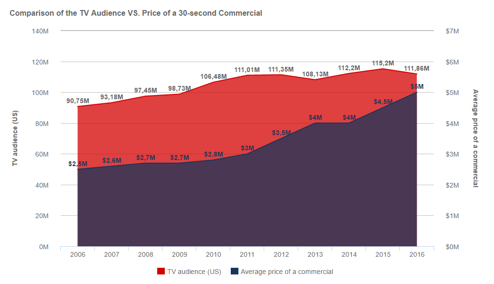
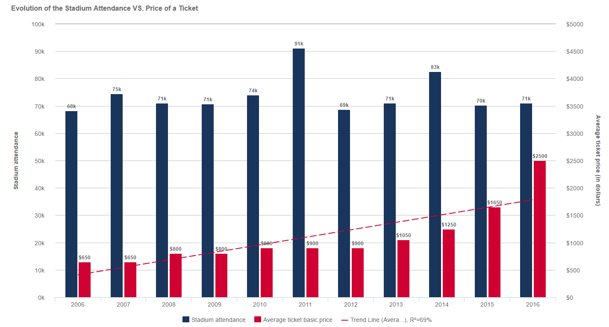
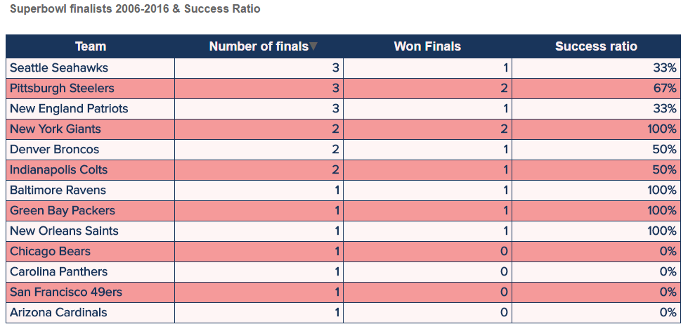

你猜对了：今天我们将谈论当下激动人心的话题，超级碗的 LI（第 51届）版！2 月 5日，星期日在休斯顿，我们将见证新英格兰爱国者队挑战亚特兰大猎鹰队，这是一场数百万美国人高度关注的决赛。我们 DataFocus 借此机会仔细研究了分析在美式橄榄球中的作用，物联网和预测分析如何改变比赛，以及大数据给体育行业带来了什么。不要忘记查看文章末尾的图表和表格，感受超级碗的规模及其演变！

## 从起源到今天：一个巨大的成长

1967 年 1 月 15 日，绿湾包装工队在洛杉矶几年体育馆与堪萨斯城酋长队进行了第一届超级碗比赛。绿湾包装工队以 35-10 击败堪萨斯城酋长队。虽然最终目标是在击球的同时试图触地得分，但自从洛杉矶的那一天以来，NFL已经有了很大的发展。

自 1967 年首场决赛以来，超级碗的人气一直在增长：在过去的 51 年中，超级碗的观众人数从 6000 万增长到 1.15 亿以上。更令人震惊的是，一个 30 秒广告的成本从 4.2 万美元飙升至 500 万美元以上。更何况，即使基本票价在800美元到2500美元不等，平均转售/二级市场的价格也超乎想象：今年目前的平均转售价格为5216美元，而目前市场上最贵的以“套餐”形式出售（包括派对、交通和其他福利）将近12,750 美元。与此同时，考虑到联赛的发展以及所有规则、装备和比赛风格的变化，您将会看到一场完全不同的比赛。对于橄榄球迷来说，这些都不是新闻。可能令人惊讶的是，最近最大的变化之一，也可能是最颠覆的，是大数据在美式橄榄球中的作用。

橄榄球运动运用统计数据并不新鲜。在洛杉矶举行的第一场超级碗比赛中，我们收集和分析了球员和球队的数据。但是大数据和数据可视化革命一如既往地震撼着世界。[在过去的几年里，各行各业和体育运动](https://www.datafocus.ai/infos/big-data-in-sports-revolution)的数据收集技术和能力有了巨大的进步。美式橄榄球也不例外。与受《点球成金》启发的棒球相比，NFL在方面有点晚了，但在过去的几年里，NFL 已经发布了大数据的力量。

## 橄榄球和物联网

物联网也给美式橄榄球带来了巨大的变化。2014 年，NFL 与Zebra Technologies合作，在 NFL 球员的左右肩垫中植入 RFID 芯片。每个体育场都有 20 个无线电接收器，这些接收器策略性地安装在体育场的上下两层，以接收球员频率并收集数据。

获得专利的 RFID 球员跟踪技术系统“斑马运动解决方案”，提供对球员速度、加速、减速、行进距离和路线的实时指标，这是 NFL 的“下一代统计数据”的一部分。此外，这些数据还能捕捉到球员在球场上的位置、他们的方向以及他们的速度或加速度如何影响他们的场上表现。

在合作的第一年，17 个体育场安装了这项技术。现在，随着合作关系进入第三个赛季，所有 31 座体育场都已加入。NFL 现在将为每支球队提供由 斑马运动解决方案产生的数据，以便更好地评估运动员的表现，因为NFL看到了美式橄榄球大数据的巨大潜力。NFL 数字媒体副总裁 Vishal Shah在 2016 年的新闻稿中表示：“我们对 2016 赛季感到很兴奋，因为追踪技术可以通过增加对球员表现的了解来帮助球队改进训练、侦查和评估，并提供方法为我们的团队和合作伙伴提升粉丝体验。”

斑马的体育产品总监 Michael King 断言：“橄榄球更像是一场国际象棋比赛。这项技术在这方面意义重大。” 对于花费数百小时查看统计数据和磁带的橄榄球教练和工作人员来说，对大数据进行强大的分析可以节省时间并帮助他们制定有效的决策。Zebra 还提供数据可视化来帮助洞察。但所有这些数据不仅适用于 NFL 工作人员。NFL 也从这些数据中看到了商机。“最好的粉丝是最投入的粉丝，”金在谈到潜在的财务意外之财之前说道。“他们将为获取这些数据的订阅计划付费。” 粉丝参与已经开始。微软Xbox One 可以通过 NFL 的 Next Gen Stats 功能访问收集的数据。

数据跟踪并不仅限于玩家。Zebra 还与 Wilson Sporting Goods 合作，在橄榄球中安装 RFID 传感器。这些启用传感器的橄榄球在 2016 年季前赛中使用。截至到目前，传感器还不能测量压力（参见Deflategate），但这些数据将用于研究，最早在 2017 赛季，可能会在裁判、踢球和其他领域引发重大变化。

## 用大数据保护玩家

众所周知，游戏的安全性是可以提高的，特别是通过预防、诊断和治疗头部损伤。在这方面，20 个大学橄榄球项目安装了头盔传感器来监测脑震荡并收集数据。像以往NFL 和脑震荡一样，存在争议，目前头盔传感器不会用于监测脑震荡。但随着技术的进步和形势的变化，大数据有望用于保护头部受伤的NFL球员。

幸运的是，数据已经对其他受伤病例有所帮助。光学跟踪系统公司 STATS LLC 的首席技术官达里尔·刘易斯 (Darryl Lewis) 在微软负责 Xbox 游戏部门时，再一次动作捕捉过程中，软件注意到一名 NBA 球员身上出现了轻微的动作抖动。“我们注意到他喜欢偏向左侧，并指出了这一点，当他被医生检查时，他们注意到他的脚骨有轻微的发际骨折，”刘易斯说。如果伤病没有得到控制，它可能会变得更加复杂并对球员的职业生涯造成影响。

## 场外实时数据

Microsoft 和 NFL 于 2013 年合作，使 Microsoft Surface 成为 NFL 的官方平板电脑。这是一场公关噩梦。在新英格兰爱国者队的教练比尔·贝里奇克遇到各种各样连接问题后， Microsoft Surfaces 宣布他已经完成了这项技术。也就是说，这些平板电脑可以让教练在场边演示和回顾比赛，还可以访问 NFL 数据库中的实时数据。如果可以对一些辅助技术进行微调，那么对大数据的访问可能会对游戏产生积极影响。

## 游戏、大数据和橄榄球

伤害预防并不是游戏世界和真实橄榄球比赛的唯一现实交汇点。橄榄球视频游戏“Madden NFL”使用每个球员的 60 多个数据点来支持其游戏模拟，包括有关受伤的信息。在常规赛结束时，工程师输入有关参赛球队的新数据。并进行最终模拟。所有这些数据导致 Madden NFL正确预测2015 年超级碗 XLIX。它预测新英格兰爱国者队将以 28-24 击败西雅图海鹰队，爱国者队四分卫汤姆·布拉迪将投出四次触地得分，并被选为比赛中最有价值的球员。而最终的触地得分将由朱利安·埃德尔曼完成。在过去的12场超级碗中，游戏正确预测了 9 场的获胜者。而且情况正在好转。随着数据的增加，其准确性也会增加。

## 预测分析和橄榄球

Madden NFL 并不是唯一利用大数据来预测 NFL 比赛结果的软件。预测机器是由 Varick Media Management 创建的，用来预测一场比赛将如何结束。随着数据的增加，它的洞察力也在增长，目前在 NFL 季后赛历史中拥有 48-20 (70.6%) 的 ATS。然后科技初创公司Unanimous AI，使用他们称为 UNU 的群体人工智能平台。联合国大学正确地预测了上一届肯塔基赛马的全部结果，包括每一匹马。然而，在过去几个月提出的一些实时问题中，联合国大学预测绿湾包装工队将捧回今年的超级碗奖杯。对包装工队来说不幸的是，我们知道这不会发生，因为这个超级碗的两支决赛球队是新英格兰爱国者队和亚特兰大猎鹰队。

尽管有一些错误，但所有这些数据都保持正常。大数据还有助于推动价值 700 亿美元的梦幻橄榄球行业的预测。

## 十年超级碗

现在让我们仔细看看我们能收集到的关于这个年度重大事件的各种统计数据，以及其中一些数据是如何随着时间的推移而演变。所有图表均使用 DataFocus 的 [数据可视化软件](https://www.datafocus.ai/infos/data-visualization-tools)创建。

### 电视观众vs广告的价格

在过去 11 年中，美国人打开电视的数量增加了 20%，收看上一期节目的观众人数接近 1.12 亿。相比之下，广告的价格翻了一番，从 250 万美元涨到 500 万美元，观众的注意力持续 30 秒。

### 体育场上座率vs票价

体育场的上座率每年都保持稳定，因为美国大多数橄榄球场的规模都差不多，而且每年都爆满。唯一的细微差别发生在 2011 年，当时达拉斯的杰里琼斯想要打破上座记录，但几乎相差无几。然而，门票价格在短短 10 年内翻了 4 倍！

### 超级碗决赛选手

自 2006 年以来，三支球队出现了三次，另外三支球队出现了两次，而七支球队只出现过一次。

### 超级碗冠军

为了与上一张图表有所区别，下表提供了每支成功晋级决赛球队的成功率。自 2006 年以来成功率最高的是纽约巨人队，他们在参加 的两场决赛中都获胜了。

## 大数据与美式橄榄球

2 月 5 日星期日，在德克萨斯州休斯顿，美国国家橄榄球联盟 (NFL) 的赛季达到顶峰：超级碗 LI。超过 1 亿人会一边吃着油腻的食物，也许还会喝一两杯啤酒，观看美国国家橄榄球联盟 (NFC) 中最好的球队和美式橄榄球大会 (AFC) 中最好的球队为名誉、荣耀和金钱的对决。或者他们可能正在收看 Lady Gaga 的表演，或者看看哪个 500 万美元的广告是今年最好的。无论哪种方式，实时和历史数据都将推动橄榄球比赛、广告、预测和赌博的方方面面。官方消息，大数据和美式橄榄球的时代已经到来。
