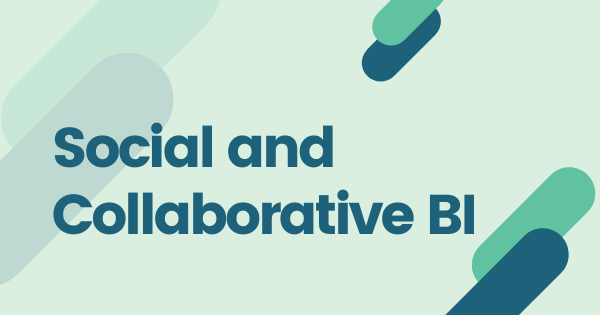

在这个时代，我们经常听到“大数据”、“数据科学家”和“内存分析”等术语。几乎所有主要的软件公司都在不断利用市场上领先的商业智能 (BI) 和[数据发现工具](https://www.datafocus.ai/infos/what-are-data-discovery-tools)来推动他们的品牌发展。在社交和协作商业智能工具的帮助下，可以在组织内创建有效的策略，以更好的进行整体决策过程。无论是否有企业社交网络 (ESN)，这都可以借助企业商业智能工具中的社交化想法来实现。让我们看一下社交和协作商业智能的各个概念，了解更多关于它们如何帮助公司的信息。

## 什么是社交商业智能？

社交 BI 表示收集、分析、发布和共享数据、报告和信息的过程。这是使用交互式商业智能和分析仪表板以及直观的工具来完成的，以提高数据的清晰度。分析工具被用来实现用户理解和舒适。通过使用社交 BI 可以做出自信的决定，因为它使所有用户放在有关活动、任务和目标方面同一页面上，由对分析工具和结果的共同理解和使用驱动。

社交 BI 最重要的功能之一是它能够创建自助服务和用户生成的分析，以及业务用户知识的应用。它还包括在没有数据科学家或 IT 部门任何员工帮助的情况下生成和共享报告和数据的技能。通过社交 BI 跨团队、部门和业务单位的数据共享和分析，可以看到产品开发、项目、业务流程和质量控制方面的改进结果。

## 社交 BI 如何帮助企业取得成功

让我们想象一个环境，在这个环境中，业务用户可以利用商业智能和分析门户，并查看可以评级、共享和评论的流行数据。通过允许用户访问报告、仪表板和数据，可以通过这种类型的共享优化资源，这些数据可能正是他们完成任务或分析所需的。在商业智能环境中实施社交媒体和社交网络时，商业用户可以分享、评价、讨论和向他人学习。

通过社交商业智能的应用，可以在组织内培养高级用户。这些用户以富有洞察力和创造性的方式进行数据分析。例如，社交媒体用户通过“点赞”和鼓励评论或转发来表达他们对帖子的支持。同样，只要您的组织看到一种积极的共享、协作和学习时，社交商业智能工具就可以支持它。一旦数据共享变得更加普遍并且出现更多的高级用户，业务用户可以学习更好地理解分析，并且也可以熟练地使用这些技术。这也将导致一个组织见证用户对[在线 BI 工具](https://www.datafocus.ai/infos/online-bi-tools)的改进。

社交商业智能工具有助于鼓励协作，揭示对用户有价值的数据和内容，并帮助创建受欢迎的商业用户和内容。选择人气不仅是为了衡量质量，也是为了衡量商业价值。它为 IT 和 BI 团队提供标准化数据和内容的洞察力，并向用户提供高质量、经过认证和管理的数据。业务用户可以互相学习，也可以分享、评价和讨论。如果他们不需要重新编写报告，他们还可以优化自己的时间。通过使用社交商业智能软件，可以促进商业用户之间的协作决策。它还促进了 BI 工具用户的采用，允许组织共享知识和资源。

## 协作商业智能

协作商业智能是商业智能和协作技术结合在一起，以支持一种新的和改进的决策方法的氛围的过程。在协作商业智能中，工作人员和业务经理通过交互来改进通信系统。他们分享了与商业智能相关的重要发现，并讨论了它们各自的含义以及可用于提高业务绩效的可能选项。发现和文档是协作 BI 的关键特性。

在协助方法的帮助下，借助诸如[业务仪表板](https://www.datafocus.ai/infos/dashboard-examples-and-templates)，工作人员能够共享有关为什么某些事件以特定方式展开的信息等。使用发现背后的相关数据、内容和业务背景，用户可以将自己的知识添加到商业智能的结果中。通过包括评论、评分、标签、博客和微博在内的反馈机制，可以增强发布的 BI 的结果。

任何 BI 程序背后的主要动机都是做出及时和更有效的商业决策，而协作商业智能环境通过让成员评估情况并作为一个团队做出决策来支持这一点。组织还可以分析所做出决策的有效性以及它们将对业务产生的影响。这种分析产生的反馈有助于改进决策过程，让公司记录最佳实践并监控在这种情况下最有用的数据。

协作商业智能的三个最重要的方面如下：

- **知识发现**：当 IT 部门将用户体验与单纯的报告隔离时，可能会非常令人窒息。但是，借助协作式商业智能，用户可以重用现有的想法和功能，从而无需重新发明轮子。当使用这种协作软件时，用户也可以通过与其他用户共享来增强他们拥有的信息。
- **知识保留**：世界各地组织的知识产权及其下的项目不是每天都记录在案的。但是，协作式 BI 有助于改变这种状况。协作软件有助于将结构化和非结构化数据制度化，以促进见解、思想、信息和实践的共享。
- **知识扩散**：随着互联网和社交媒体的普及，所有美好的事物都在几分钟内被分享和传递。同样，当用户遇到易于使用的软件站点和解决方案时，他们会将这个词传递给他们的朋友、家人、同事等。因此，由于将发生的所有对话都需要来自组织内部和外部的信息，这将导致数据仓库的增长。

## 总结

社交和协作商业智能都是有助于制定商业决策的新时代工具。他们通过让来自任何特定组织的更多人参与进来，使过程更加顺畅。每个人都汇集他们的思想和想法，评估见解、发现和结果，发布关于如何在任何给定情况下前进的决定。因此，它们都是商业智能工具，在当前的时代，公司应该使用它们来做出更有效和更有能力的商业决策。
