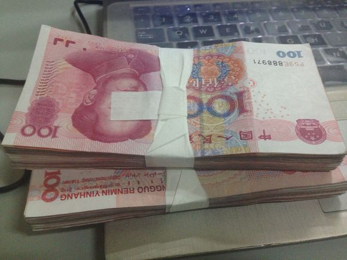

日前，“京津冀大数据协同处理中心”在国家超级计算天津中心揭牌。该中心着力开展基于大数据，面向产业应用的共性技术研究开发，并积极形成行业解决方案或产品，广泛辐射和开拓应用领域，推动大数据自主创新、产业融合和应用服务。

结合该中心成立，超算天津中心与中石油东方物探、中国恩菲、天津港、河钢集团、华大基因、中国医促会、国研智库、天科院、航天云网、北京大学、天津大学、天津麒麟公司代表分别签订大数据协同创新、产业应用等深入合作协议，推动该中心发展建设。

　　超算天津中心、中科院网络中心、北京计算中心、和润泽科技有限公司还以建设该“中心”为契机，倡议构建“京津冀数据走廊”，共建高速数据通道、建设区域共享骨干节点、共建京津冀大数据中心体系、共促京津冀大数据合作，实现三地数据资源的互联、共享和开放。该中心将率先面向能源、交通、矿业、钢铁、医疗健康、智慧港口等行业领域提供大数据产业应用服务，提升产业发展和应用水平，将京津冀地区建成国际一流的大数据创新与应用领航区。
