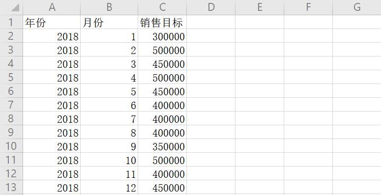

为找到一些可以帮助进行可视化的工具，最近一直在网上瞎搜搜，结果真让我找到了一款叫做DataFocus的一款可视化工具，操作上手真的是很简单，还有很多免费的视频，可以在官网进行免费观看学习，真的是可以称为“人人可以使用的数据分析系统”。

为了更加客观的评估这款可视化工具，我在官网免费下载了一款个人版进行使用，接下来，我就会通过讲述我的使用体验来具体介绍一下这款工具。

首先是操作简单，学习起来非常容易，这款工具不需要自己编写程序代码，这就能大大降低员工学习培训的时间；其次就像产品介绍里说的那样，这款工具不需要专业的数据分析人员来进行操作，普通业务人员也能进行使用，首创中文自然语言搜索，通过简单在搜索框进行搜索，就能得出需要的答案；第三点可以处理比较庞大的数据，且响应速度很快，属于现阶段较热门的敏捷BI类产品；第四点，制作出的可视化大屏效果相当不错，可视化的图表类型差不多有30多种，非常丰富，基本都能满足企业日常需要；第五点，对数据权限进行了设置，支持企业私有化部署，能最大程度上保证数据的安全性。

DataFocus主打的标语是比tableau更好用，比powerBI更智能。中国在BI工具这块领域可能与国外还存在着一定的差距，但是只有我们自己是最懂自己的需求的，国外产品不会人性化考虑到某部分特定人群的感受，我觉得中国人还是更加适合使用中国自己的BI工具。

