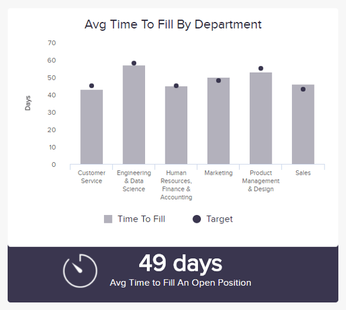
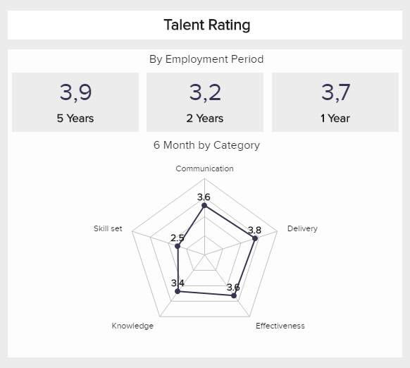
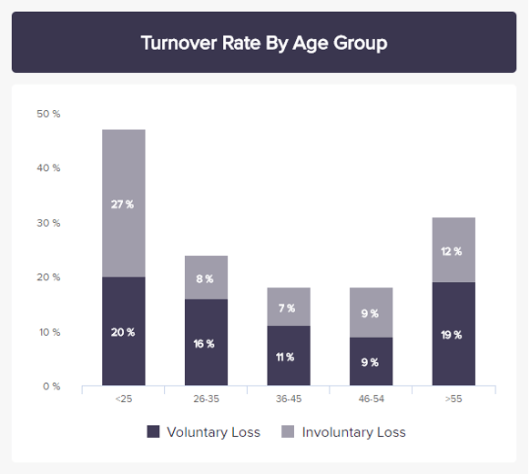
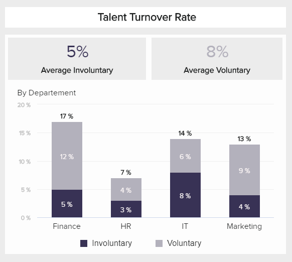
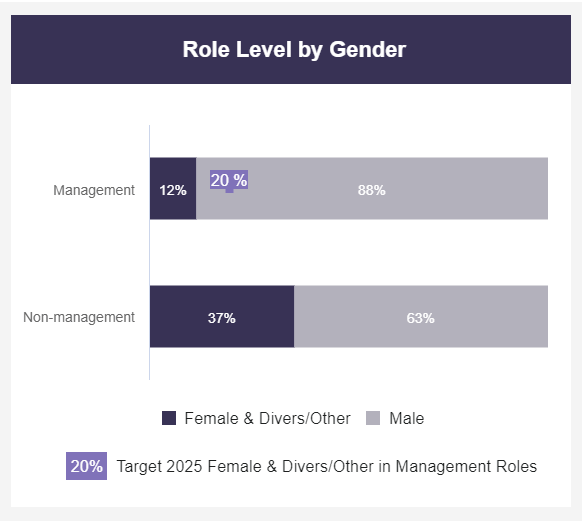
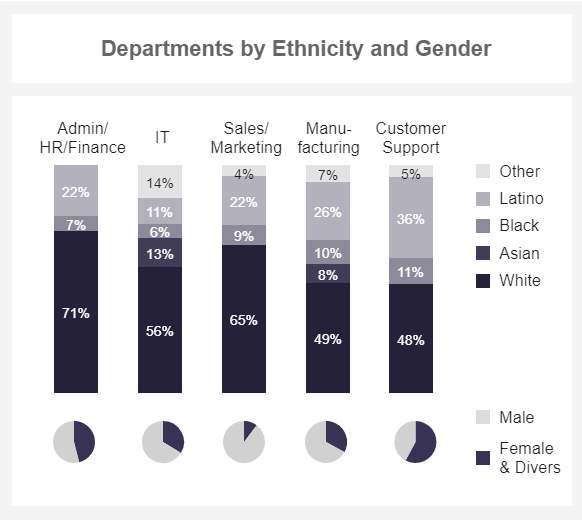
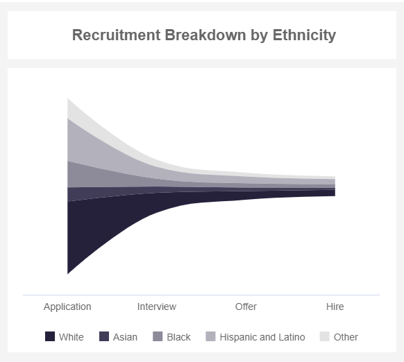
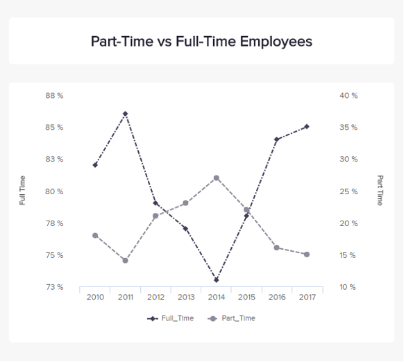
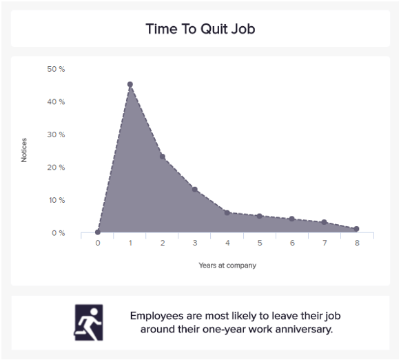

### ✔ 查看不同的模板和设计✔ 查找和跟踪正确的 HR KPI 以满足您的企业目标

**人力资源关键绩效指标或度量**是一个可衡量的值，有助于跟踪人力资源管理的预定义组织目标。人力资源部门使用 KPI 来优化招聘流程、员工敬业度、离职率、培训成本等。

对人力资源专业人士的期望不断提高，在本文中，我们将着眼于人力资源最重要的 KPI，以便开发现代和有效的管理流程。专业的[人力资源分析软件](https://www.datafocus.ai/infos/business-intelligence-human-resources)将为您提供所有必要的工具，以从现有的人力资源数据中提取有价值的见解，并获得新的、宝贵的信息。这包括一个动态的交互式[HR 仪表板](https://www.datafocus.ai/infos/dashboard-examples-and-templates-human-resources)，它将所有相关指标整合到一个中心位置，无需高级技术知识。此外，您可以自动化每个 KPI 并利用现代[在线报告工具](https://www.datafocus.ai/infos/online-reporting)（例如 DataFocus），以便在整个团队中共享最新和相关的 HR 数据。

**_以下是每个 HR 专业人员和经理都应该知道的 19 大人力资源 KPI 和指标的完整列表：_**

[缺勤率](https://www.datafocus.ai/infos/kpi-examples-and-templates-human-resources#absenteeism-rate)：评估员工的敬业度

[加班时间](https://www.datafocus.ai/infos/kpi-examples-and-templates-human-resources#overtime-hours)：详细监控员工的工作量

[培训成本](https://www.datafocus.ai/infos/kpi-examples-and-templates-human-resources#training-costs)：分析对员工的投资

[员工生产力](https://www.datafocus.ai/infos/kpi-examples-and-templates-human-resources#employee-productivity)：跟踪员工的整体效率

[人才满意度](https://www.datafocus.ai/infos/kpi-examples-and-templates-human-resources#talent-satisfaction)：确保您的员工长期满意

[每次雇用成本](https://www.datafocus.ai/infos/kpi-examples-and-templates-human-resources#cost-per-hire)：分析找到完美契合度所需的成本

[招聘转化率](https://www.datafocus.ai/infos/kpi-examples-and-templates-human-resources#recruiting-conversion-rate)：找到最好的招聘方法

[填补时间](https://www.datafocus.ai/infos/kpi-examples-and-templates-human-resources#time-to-fill)：监控您需要多长时间才能找到新员工

[人才评级](https://www.datafocus.ai/infos/kpi-examples-and-templates-human-resources#talent-rating)：评估员工的素质

[员工流动率](https://www.datafocus.ai/infos/kpi-examples-and-templates-human-resources#turnover-rate)：了解您的留住员工工作

[人才流失率](https://www.datafocus.ai/infos/kpi-examples-and-templates-human-resources#talent-turnover-rate)：评估您不断改变的人才数量

[按组划分的周转率](https://www.datafocus.ai/infos/kpi-examples-and-templates-human-resources#turnover-rate-by-group)：监控您的多元化组是否满意

[解雇率](https://www.datafocus.ai/infos/kpi-examples-and-templates-human-resources#dismissal-rate)：了解您是否正在招聘合适的员工

[男女比例](https://www.datafocus.ai/infos/kpi-examples-and-templates-human-resources#female-to-male-ratio)：了解贵公司的性别多样性

[按角色划分的性别多样性](https://www.datafocus.ai/infos/kpi-examples-and-templates-human-resources#gender-diversity-by-role)：跟踪管理职位的性别比例

[种族多样性](https://www.datafocus.ai/infos/kpi-examples-and-templates-human-resources#ethnicity-diversity)：发现您的部门有多多样化

[按种族划分的招聘细分](https://www.datafocus.ai/infos/kpi-examples-and-templates-human-resources#recruitment-breakdown-by-ethnicity)：确保多元化的招聘流程

[兼职员工](https://www.datafocus.ai/infos/kpi-examples-and-templates-human-resources#part-time-employees)：观察兼职员工随着时间的推移的演变

[平均停留时间](https://www.datafocus.ai/infos/kpi-examples-and-templates-human-resources#average-time-stay)：查看您的员工在公司停留的时间

## 缺勤率

**您的员工的敬业度如何？**

我们的第一个人力资源指标衡量的是平均缺勤率占整个劳动力总工作日的百分比。这是一个非常重要的员工敬业度 KPI，因为它说明了员工在工作中以及更普遍地在组织中的积极性和敬业度。过去的研究表明，积极性和敬业度低的员工更有可能请病假或不工作几天。随着时间的推移，观察这个指标并降低它很重要，因为它不可避免地会影响您的业务：无论是公司氛围还是整体效率，最终您的财务和企业的整体福祉都将面临风险.

**性能指标**

如果您发现过去一个月的缺勤率高于历史，请调查并找出原因：是某个部门特有的问题还是全公司范围的问题？为什么？然后实施适当的策略来补救这种情况。

**相关展示仪表板**

- [员工绩效仪表板](https://www.datafocus.ai/infos/dashboard-examples-and-templates-human-resources#employee-performance-dashboard)

## 加班时间

**您如何监控员工的工作量？**

加班时间在许多层面上都是一个很好的指标，但必须根据具体情况做出不同的解释。加班时间的突然增加可能会导致订单量暂时增加，或经济增长。它们可以显示您的员工的奉献精神以及工作流程中的缺陷，或者可能是必须应对高压的人员的不足。这将直接影响我们之前看到的另一个人力资源指标：缺勤率。事实上，如果人们不介意时不时地加班，那么长时间的加班时间和长期的高工作量会降低员工的积极性和满意度，这可能会导致旷工率上升。

**性能指标**

长期高加班率的原因应该在内部进行调查，因为当它导致订单或项目丢失时，它也会限制企业的潜在增长。

**相关展示仪表板**

- [员工绩效仪表板](https://www.datafocus.ai/infos/dashboard-examples-and-templates-human-resources#employee-performance-dashboard)

## 培训成本

**你投资你的员工吗？**

这是一个人力资源 KPI 示例，用于衡量您在新员工入职和提升教育方面的投入。这是一个有用的指标，可以跟踪员工的发展成本，并在他们被录用后在发展他们的技能方面做出更明智的决定。然而，培训成本不应仅限于新员工——今天越来越多的员工希望他们有更好的工作发展，并希望在自己的岗位上不断学习。为员工投资以培养他已经获得的技能或新技能，是人力资源管理人员通常很少考虑的一种选择。通常，培训成本的回报大于初始投资。

**性能指标**

实施一些知识测试并评估工人的分数可以帮助您了解所提供的培训是否有效。

**相关展示仪表板**

- [员工绩效仪表板](https://www.datafocus.ai/infos/dashboard-examples-and-templates-human-resources#employee-performance-dashboard)

## 员工生产力

**你衡量员工的效率吗？**

整体生产力效率是一个非常有趣且完整的人力资源 KPI，在彻底衡量时会考虑多个维度。它通常通过将总销售额除以员工人数来计算。但要进行更深入的分析，最好考虑影响生产输出的组件：可用性，即员工实际工作的时间；交付产品的性能或数量；最后是质量，或在那段时间生产的完美/可销售产品的数量。它更多的是一种以制造为导向的方法，但仍可应用于其他部门。除了审查员工绩效之外，生产率书测量还可以帮助他们了解他们做了多少工作以及做得如何，并在需要时调整他们的工作方式。

**性能指标**

这个比率越高，对组织越好。准确衡量生产力可以确保更大的利润，但也可以提高员工的积极性和认可度。

**相关展示仪表板**

- [员工绩效仪表板](https://www.datafocus.ai/infos/dashboard-examples-and-templates-human-resources#employee-performance-dashboard)

## 人才满意度

**您的员工满意度如何？**

这是我们在技术工人短缺和相关的“人才争夺战”时期不应忽视的人力资源 KPI 示例之一。特别是对于年轻的专业人​​士来说，不仅工资和其他经济福利等方面在就业选择中起着至关重要的作用，而且还包括良好的工作与生活平衡、灵活的工作时间模式、偶尔在家办公以及可持续和社会化的企业文化. 您应该满足这些要求，尤其是为了长期留住备受追捧的专家。为了定量评估您在这方面的措施，您应该定期进行员工满意度调查。例如，您可以使用净推荐值 (NPS)。

**性能指标**

使用此指标来评估您的招聘和员工保留策略的质量。根据雇佣时间和部门/团队的长短来查看员工或专家是有意义的。

**相关展示仪表板**

- [人才管理仪表板](https://www.datafocus.ai/infos/dashboard-examples-and-templates-human-resources#talent-management-dashboard)

## 每次雇佣成本

**找到完美契合需要什么？**

在这里，我们有一个非常简单的 HR KPI，它衡量您为所需的每个新员工投入的资源量。它涵盖了从招聘（广告/营销、推荐激励、招聘人员审查和选择简历，然后进行面试的时间成本）到培训（经理/讲师的时间成本、材料和新员工的时间成本）的所有成本。这些成本在公司预算中迅速增加，这就是为什么不应轻视招聘的原因——但没有员工，工作就无法完成，业务也无法运营。归根结底，这是每项业务的底线：投资于人才，将带来更多价值。因此，即使投资可能会让财务部门感到不快，但获得人才的潜力总是值得的。

**性能指标**

根据招聘来源衡量每个招聘的成本，看看哪个最贵或最便宜。这不应该是决定来源是否好的唯一理由，因为流动率（人们在公司停留的时间）也很重要。

**相关展示仪表板**

- [招聘仪表板](https://www.datafocus.ai/infos/dashboard-examples-and-templates-human-resources#recruiting-dashboard)

## 招聘转化率

**您如何找到最佳的招聘方法？**

招聘人员转化率更像是一个人力资源绩效指标，因为它更多地关注人力资源主管，而不是普通员工。该 KPI 衡量在流程结束时实际转为雇用员工的申请人总数的比率。有效招聘没有特定的既定比例，这取决于您的公司、地区和部门。但这是一个衡量标准，您可以用来更仔细地观察所有涉及的步骤，并比较您实施的不同招聘方法，以选择最有效的方法，同时仍然考虑其他指标（如招聘后90天的保留率）。主要目标是找到以最低成本提供最佳候选人的来源。

**性能指标**

将不同方法的比率与每次雇用的成本进行比较。然后，选择您认为最适合您公司风格和预算的。

**相关展示仪表板**

- [招聘仪表板](https://www.datafocus.ai/infos/dashboard-examples-and-templates-human-resources#recruiting-dashboard)

## 填写时间

**您需要多长时间才能找到新员工？**

另一个易于理解的人力资源绩效指标的定义就在其名称中。该指标仅衡量从发布工作机会到聘用新员工担任该特定职位之间的时间。就像招聘转化率一样，它跟踪招聘过程在填补空缺所花费的时间和资源方面的效率。它还有助于制定切合实际的业务计划，因为在可能的情况下必须处理和预期裁员或有人辞职。低的数字总是更好的；但是，它不应该是主要标准。投入时间对于找到最合适的人很重要，一开始可能会花很多钱，但之后的收益总是会越来越大。

**性能指标**

要正确使用此指标，请记住，这是一个过程评估，而不是通过不惜一切代价降低数字来达到的目标。招聘的目标仍然是结果，即一个非常适合这个职位的员工。

**相关展示仪表板**

- [招聘仪表板](https://www.datafocus.ai/infos/dashboard-examples-and-templates-human-resources#recruiting-dashboard)

## 人才评级

**您如何评估员工的素质？**

定期的、建设性的员工和内部反馈会议的相关性是无可争议的，并且在当今大多数公司中被认为是理所当然的。然而，人力资源部门需要衡量其员工的质量，以便能够评估其招聘措施。例如，可以确定 IT 部门的员工评估不令人满意，这可能是由于招聘过程中的评估标准不正确，或者缺少和无关紧要的测试，重点是错误的主题。为了能够识别此类缺陷并始终对员工的素质充分了解，您应该开发个人员工评估系统（人才评分）。我们使用五个选定的评分标准作为示例为您说明了这一点。

**性能指标**

您的员工评估系统越个性化、越完善，该 KPI 对人力资源经理的潜在好处就越大。

**相关展示仪表板**

- [人才管理仪表板](https://www.datafocus.ai/infos/dashboard-examples-and-templates-human-resources#talent-management-dashboard)

## 员工流动率

**您的留用工作效果如何？**

人力资源指标的另一个例子是员工流动率，衡量有多少员工自愿离职。它表明贵公司在留用工作方面的成功，就像填补时间一样，对计划人才更换有很好的帮助。最好是，不适合公司的人离开——这对双方来说都不是坏事。然而，当你的人才离开时，人员流动就成了问题，因为它是最终的：人们永远不会回来，或者很少。通常，人们会辞去他们的经理，而不是他们的工作。这就是为什么如果您的营业额很高，您应该跟踪根本原因并确定需要修复的潜在问题区域。

**性能指标**

从长远来看，较低的流动率总是更好地实现令人满意的业绩，并降低总体招聘成本。

**相关展示仪表板**

- [劳动力仪表板](https://www.datafocus.ai/infos/dashboard-examples-and-templates-human-resources#workforce-dashboard)

## 人才流动率

**你需要改变多少员工？**

对于难以填补的职位，高流动率尤其成问题。这就是通常是人才（初级专家）和一般高素质的专家（专业人员）的需求。一方面，从财务角度来看，高支出意味着高昂的招聘成本，另一方面，这些通常是公司内部的关键职位，可以从长期的雇佣关系中受益。因此，借助 DataFocus 等数据分析软件仔细研究这些细分市场是有意义的。我们在针对公司不同部门专业人员的人力资源 KPI 之一中说明了这一点。

**性能指标**

你应该尽量降低这个比率，尤其是对你的初级员工，因为他们将是你未来最宝贵的人力资源。

**相关展示仪表板**

- [人才管理仪表板](https://www.datafocus.ai/infos/dashboard-examples-and-templates-human-resources#talent-management-dashboard)

## 集团营业额

**您的多元化员工是否正在离开公司？**

继续另一个 KPI，我们有多样性组的流动率。这个简单的指标跟踪了多样性群体中自愿离职者的百分比，可以让您了解特定群体是否对您的组织不满意。例如，在这里我们可以看到黑人员工的流动率为 18%，甚至高于整个公司，这意味着显然正在发生一些事情，使您的组织中的黑人工人不满意。为了提高多元化群体的这些比率，请确保您跟踪某人离开的原因，并找到足够的解决方案以防止您的员工再次离职。

**性能指标**

衡量该指标的另一种方法是将自愿休假与非自愿休假进行比较。如果您发现特定群体中非自愿离职的比例也很高，您还需要质疑您的理由以避免任何偏见。

**相关展示仪表板**

- [多样性仪表板](https://www.datafocus.ai/infos/dashboard-examples-and-templates-human-resources#diversity-dashboard)

## 解雇率

**您是否在招聘合适的员工？**

流动率受两个主要因素影响：雇员或雇主解雇。此外，还有其他影响因素，如雇佣合同到期、退休、因无法工作而辞职等。为了以透明和可理解的方式监控您的招聘措施的质量，您可以使用解雇率，这是关注流失人才的人力资源关键 KPI 之一。如我们的模板所示，从不同的角度来看待它，例如，根据工作年限、团队、部门或特别针对初级专家。

**性能指标**

您应该尽量降低这个指标，尤其是对您的初级员工，因为他们将是您未来最有价值的资源。

**相关展示仪表板**

- [人才管理仪表板](https://www.datafocus.ai/infos/dashboard-examples-and-templates-human-resources#talent-management-dashboard)

## 男女比例

**贵公司是否存在性别多元化？**

这种人力资源指标并不经常使用，并且在许多公司中仍然是一个禁忌。衡量女性与男性员工的比例，尤其是在高层管理职位上，可以了解很多关于一家公司的信息。一些行业非常具有性别偏见（IT 和工程领域的男性居多，而护理和护理行业则以女性居多）。这有历史和社会的原因，但随着我们社会的发展，重要的是要意识到并鼓励多样性——无论是性别多样性，还是国籍和课程方面的多样性。您收集的视野越多，视野就越广，您将拥有的方法和创新可能性也就越多样化。在我们的全球化经济体中，这是一项令人难以置信的竞争资产。

**性能指标**

没有特别的目标率，因为它还取决于候选人在特定时间的可用性。但无数研究证明，从长远来看，一个平衡的环境——尤其是董事会——比其他任何环境都更成功。

**相关展示仪表板**

- [劳动力仪表板](https://www.datafocus.ai/infos/dashboard-examples-and-templates-human-resources#workforce-dashboard)

## 按角色划分的性别多样性

**您的管理职位是否足够多样化？**

我们的下一个示例是按性别划分的角色级别。它专门跟踪担任领导职务的男性与女性或多元化员工的比例。如前所述，仍有许多行业存在男性偏见。因此，当涉及到多样性时，这是一个重要的跟踪指标，因为您希望确保您的组织在各个级别上都是多样化的。确保这一点的一个好方法是设定切合实际的目标。如上例所示，目标是到 2025 年将担任管理职务的女性或多元化员工增加到 20%。这可以让您了解您所采取的行动是否有助于实现您的最终目标。

**性能指标**

考虑用其他多样性群体（如残疾或种族）来衡量这个 KPI。这将允许您确保您不会对任何人口群体产生偏见。

**相关展示仪表板**

- [多样性仪表板](https://www.datafocus.ai/infos/dashboard-examples-and-templates-human-resources#diversity-dashboard)

## 种族多样性

**您的业​​务部门有多多样化？**

扩展上一个示例，我们现在将按部门介绍种族和性别。业务多元化不是一个容易的话题，虽然一些公司可能以拥有多元化的工作场所而自豪，但在涉及特定职能或部门（例如雇用男性或高薪职位的白人）时，他们可能仍然存在偏见。为避免这种情况，此 KPI 提供了按部门划分的种族和性别细分。在这里我们可以看到，财务职位主要由白人员工担任，而制造业职位主要由男性担任。这可能是需要考虑的事情，以确保全面的多样性。

**性能指标**

开始按部门分析您的多样性的一个好方法是研究最普遍男性前瞻性的领域，例如 IT 和销售，以及其他种族前瞻性的领域，例如人力资源或财务。这些将是了解您的招聘和选拔流程的绝佳起点。

**相关展示仪表板**

- [多样性仪表板](https://www.datafocus.ai/infos/dashboard-examples-and-templates-human-resources#diversity-dashboard)

## 种族招聘漏斗

**您的招聘流程是否存在偏见？**

继续使用另一个多样性指标，按种族划分的招聘细分是了解招聘流程包容性的一种有价值的方式。如果您的团队缺乏多样性，但您发现您的应聘者来自不同的种族，那么您的招聘策略中有一些事情需要研究。避免招聘偏见的一种有效方法是对您的人力资源团队进行多元化措施教育、标准化面试、确定进入障碍并使用匿名简历来选择候选人。另一方面，如果您发现根本没有多样化的候选人，那么您需要重新考虑您的职位描述，以使其对更广泛的申请人群体更有吸引力。

**性能指标**

如果您发现您的公司在多元化招聘方面遇到困难，那么设定现实的目标来逐步改善这一点。

**相关展示仪表板**

- [多样性仪表板](https://www.datafocus.ai/infos/dashboard-examples-and-templates-human-resources#diversity-dashboard)

## 兼职员工

**你考虑兼职工人吗？**

兼职员工一天或一周的工作时间少于全职员工，后者通常每周工作约 40 小时。拥有兼职员工有几个好处，尤其是当您创办公司并且不能承担太大风险时，或者当需要一个职位但不需要有人花完整的 40 个小时来完成时。许多不同的人可以寻找兼职工作，因为这些工作更适合他们的需求和日程安排。但 CEO 应牢记，累积数名兼职员工以避免全职职位所需的收益和成本是一个糟糕的战略选择，因为兼职员工可能需要更长的时间来学习工作、公司文化，并且如果他们想要一份全职工作，但却不会实现，就很难留住他们。

**性能指标**

跟踪兼职合同随时间的演变，并将其与公司绩效和结果，或员工满意度和参与度等其他指标并行化。

**相关展示仪表板**

- [劳动力仪表板](https://www.datafocus.ai/infos/dashboard-examples-and-templates-human-resources#workforce-dashboard)

## 平均停留时间

**你的员工在你的公司呆多久？**

我们的最后一个人力资源 KPI 示例很好地表明了您的业务流失，并让您知道您是否擅长留住人才。该人力资源指标跟踪员工在公司停留的平均周数、月数或年数。衡量留任员工对其职位、团队或经理的满意度是有效的。您已经知道雇用和培训一名新员工的成本是多少——所以他或她留下的时间越长越好！这样，您就可以获得更大的投资回报。如果与员工流动率等其他 KPI 一起衡量，这个指标会更加强大：短期逗留加上高流动率并不意味着任何好处，应该尽快评估其原因。

**性能指标**

时间越长，贵公司在招聘和培训投资方面的回报就越好。

**相关展示仪表板**

- [劳动力仪表板](https://www.datafocus.ai/infos/dashboard-examples-and-templates-human-resources#workforce-dashboard)
