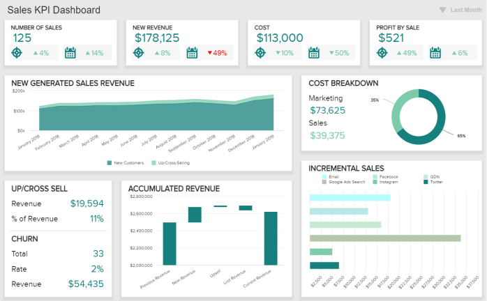

KPI 工具是一种业务报告解决方案，公司用于跟踪、监控和根据特定于公司业务目标的关键绩效指标生成可操作的见解，以实现可持续的业务发展并最终实现利润。

在当今残酷的环境中，利用公司可以获得的所有可能资源至关重要，而 KPI 报告工具则位居榜首。通过使用专业的[KPI 仪表板](https://www.datafocus.ai/infos/best-kpi-dashboard-examples)，选定的绩效指标将始终保持最新状态，确保公司的健康持续发展。但不仅如此，这些工具还为企业提供了许多功能和优势，这些功能和优势对于让您的公司走上正轨非常宝贵：

- **可视化数据并与数据交互：**借助 KPI​​ 报告软件，您可以在自定义图表上可视化每个[KPI](https://www.datafocus.ai/infos/kpi-examples-and-templates)，让与数据的交互成为一种乐趣。只需单击几下即可连接数据源后，您就可以完全自行执行数据分析和可视化。您可以监控和衡量关键绩效指标，以评估您的运营是否达到预期结果。跟踪业务运营和绩效之间的相关性，以识别您的弱点并迅速采取行动消除它们。
- **掌握复杂分析：**现代[在线报告工具](https://www.datafocus.ai/infos/online-reporting)旨在帮助您对数据源执行复杂分析，无论是平面文件、营销数据、CRM 或 ERP 数据，还是最常见的 SQL 数据库，如 MySQL、PostgreSQL 、Oracle 和 MS SQL。KPI 工具允许您将所有数据存储在一个地方，并以轻松的方式对多个来源执行复杂的分析。您只需单击几下即可创建自定义图表，并跟踪与您的特定部门（如销售、财务或营销）相关的可变绩效指标。[操作我们全面的MySQL 报告工具](https://www.datafocus.ai/infos/mysql-reporting-tools)不需要事先的 SQL 知识或 IT 支持。
- **从多个角度查看您的 KPI：**完美的[在线仪表板](https://www.datafocus.ai/infos/online-dashboard)包含对您的业务很重要的各种指标，并包含多个时间段的数据。然而，对于一些组织来说，衡量 KPI 的过程似乎是徒劳的——他们错过了分析一些失败的业务决策的原因，或者倾向于孤立地观察数据与他们的业务目标。使从多个角度查看数据成为您业务战略的重要组成部分，并使您的公司在竞争中脱颖而出。
- **受益于专业仪表板：**专业的 KPI 管理工具使您可以通过交互式关键绩效指标衡量业务目标的绩效。但它们也让您更进一步，让您将所有最相关的 KPI 组合到一个交互式[商业智能仪表板](https://www.datafocus.ai/infos/bi-dashboard-best-practices)中。通过将所有这些绩效指标汇总在一起，您可以提取高级见解并以交互方式查找绩效中不同因素之间的相关性。例如，datafocus 的交互式仪表板模板可以让您了解您的销售中有多少来自您的营销活动，并以明智的方式规划您的策略。
- **随时随地共享您的报告：**专业 KPI 报告工具的另一个显着优势和特点是能够从任何设备、任何地点共享您的报告；唯一的要求是有互联网连接。无论您是需要快速发送共享链接、根据特定时间间隔自动生成报告、为查看者分配指定的过滤器以使他们能够自行探索数据，还是通过 PDF、CSV、XLS 或 PNG 文件发送，现代 KPI报告工具提供了许多选项，您可以选择以最安全、最有效的方式有效地安排和共享您的报告。
- **利用预测分析和人工智能：**忙碌的经理需要跟踪无数的 KPI 并监控整个公司和/或部门的绩效。基于人工智能和预测分析模型的智能警报等智能解决方案将使您能够窥探您未来的表现，以便每个人都可以利用可以提高生产力的现代技术，因为快速准确的决策过程是支柱的运营和战略目标。

### 为什么 KPI 报告工具如此重要？

众所周知，人脑处理视觉信息的方式比数字或文本更快、更清晰。出于这个原因，使用专业的 KPI 工具交互式地可视化您的 KPI 将为您打开一扇通往大量业务洞察力和改进机会的大门，这将使您组织中的每个人都能够依靠数据分析来制定决策过程。

KPI 工具的重要性不仅在于易于实施到您自己的运营和已建立的程序中，还在于它们还确保了协作环境以及对于在当今残酷的业务环境中取得成功至关重要的其他多种功能：

- **提供即时绩效快照：** KPI 报告工具提供公司整体绩效的即时快照。他们简明扼要地提供绩效反馈，将注意力吸引到需要改进的领域以及认识到做得好的事情上。借助[在线数据可视化](https://www.datafocus.ai/infos/data-visualization-tools)，您的企业将可以访问实时数据，从而使您的企业保持健康；您将拥有必要的工具来做出正确的业务决策并衡量公司在实现其目标方面的进展。通过在交互式图表上可视化您的所有指标，您将对自己的表现有一个清晰的了解，并且任何电子表格或 PowerPoint 都无法超越这一概念。
- **过滤不必要的噪音：** KPI[报告](https://www.datafocus.ai/infos/what-are-kpi-reports-examples)应侧重于对贵公司特别重要的指标。它们使您有可能消除可能与手头业务问题无关的其他指标的噪音，并深入研究真正有意义和可管理的指标。通过充分利用这些 KPI 跟踪工具，您监控的指标将确保您获得可持续发展——您将只关注重要的事情和重要的时间。
- **促进协作：** KPI 报告促进公司内部的团队合作和相互学习。您可以通过立即提醒同事注意问题区域来改善团队合作。专业的 KPI 报告软件使他们可以自由地通过个人设备上的 Web 浏览器访问仪表板并当场采取行动。通过共享数据（和可视化），您可以让员工了解业务决策背后的整个背景，并为创新解决方案敞开大门。衡量关键绩效指标产生的数据促进了团队成员之间的关键对话，他们可以交流知识并共同制定战略决策以改善公司的业绩。
- **交互式分析功能：**正如我们之前提到的，通过投资现代 KPI 报告工具，您将确保每个重要的利益相关者都参与到报告过程中。但是，除了促进协作之外，这样的工具还可以使分析过程更快、更高效，这要归功于交互式过滤选项，使您能够在一个屏幕上进行整个分析过程。像这样，您可以在过去留下无限的 PowerPoint 演示文稿和静态 Excel 工作表，并在交互式[业务仪表板](https://www.datafocus.ai/infos/dashboard-examples-and-templates)中展示您最相关的 KPI ，每个人都可以根据需要访问和过滤。
- **提供速度和准确性：**报告必须包含行业特定指标，以便与竞争对手进行基准比较，并突出公司与行业标准相比的绩效。借助现代软件，您将能够更快地对新兴业务趋势采取行动，并轻松掌握跨多个数据集的客户行为和市场状况的变化。不仅如此，这些 KPI 工具的速度和准确性将在需要更新信息时提供安全网，无论是在临时会议期间、每周报告期间，还是在公司或部门的年度战略发展期间。
- **提供实时数据：**今天重要的是让数据触手可及，无需无休止地挖掘大量文件、笔记、电子表格或演示文稿。无需担心手动更新报告的实时、丰富数据的可能性使这些工具成为成功业务的关键部分。这个基础提供了令人难以置信的机会，可以提高企业的效率，从而降低成本。

正如我们所阐述的，KPI 报告解决方案不仅提升了公司的业绩，而且为仅基于数据的决策提供了坚实的基础，并确保您为获得实质性业务成功开辟了坚实的道路。与您创建的报告交互的可能性，完全消除了繁琐的手动任务和对已创建报告的无休止检查，更不用说在您需要处理的所有信息堆中丢失它们的可能性，使您的数据故事更易于管理和跟随。KPI 监控工具创造了一个稳定的环境——再加上现代技术和人工智能的强大功能，您可以从一个单一的访问点了解所有关于您的 KPI 的信息。

### 免费测试最佳 KPI 报告软件

datafocus 建立在安全、稳定和预算友好的软件概念之上，该软件使用专业的[仪表板构建器](https://www.datafocus.ai/infos/dashboard-builder)，可轻松跟踪和监控自定义图表、表格和交互式仪表板上的个人 KPI 。坐下来观看仪表板上的数据自动更新。如前所述，我们的软件为您节省了手动输入更新数据到每个报告的时间。然后，您可以向选定的收件人报告有趣的 KPI 见解。选择您希望以 PDF、XLS 或 PNG 格式作为报告发送的仪表板。安排您希望发送一次报告的日期或设置分发报告的固定时间间隔。您还可以通过向选定的查看者发送 URL 来共享仪表板，并帮助他们更好地理解数据。

多功能性是 datafocus 的 KPI 测量工具的主要优势之一。我们为您提供范围广泛的图形和图表类型，以便您以最有效的方式可视化最相关的 KPI。选择错误类型的图表来可视化您的数据可能会严重损害您的报告流程以及其他人感知数据的方式。使用 datafocus，您的可能性是无限的，您可以从各种可视化中进行选择，并根据您品牌的配色方案个性化您的图形、图表和仪表板，以获得更专业的外观。

datafocus 让您可以随时随地在线访问 KPI 报告，而不必担心将它们放在便携式数据存储设备上，也不会担心带有有价值报告的笔记本电脑会丢失或被盗。借助 KPI​​ 报告软件，您可以通过任何 Web 浏览器和任何设备（无论是移动设备、平板电脑还是台式机）查看更新的数据。借助最先进的安全层，您可以使用您的用户名和密码从任何位置登录，知道您的数据是安全的。您只需要一个 Internet 连接，您的数据就在那里：在一个安全的云上，为您提供无限的可能性来处理您的 KPI、深入了解您的报告，并创建强大的仪表板来展示您的部门或公司的数据故事。

了解 datafocus 在竞争对手中脱颖而出的原因以及它对您的业务不可或缺的原因。免费试用我们的智能 KPI 报告软件 14 天。立即开始在线注册免费试用，只需单击几下即可创建仪表板。
