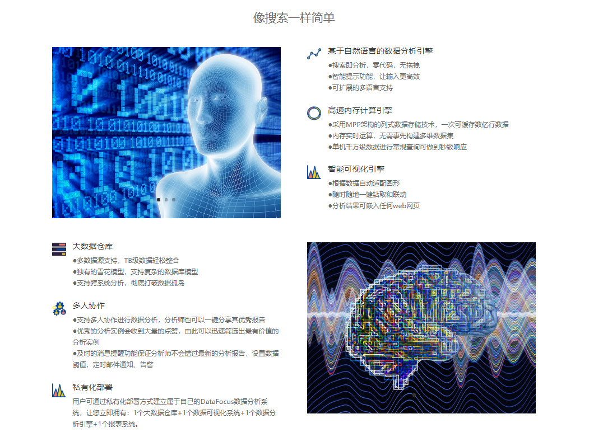

何为BI？这应该是刚刚踏入BI领域最开始想要了解的问题。现如今，我们经常会看到像是数据分析，数据可视化，商务智能，大数据等词汇，很多人可能并不理解这些代表什么，那本文，小编就带大家了解什么是BI，什么是商务智能。

Excel，相信大家都接触过，基本上这是每个电脑的标配，excel可以用来做数据汇总，可以用来处理销售数据等，但是excel只能支持一定量的数据，如果你有大量的数据，excel就会很吃力。可偏偏企业的数据都是成倍成倍的增加，通过多年的积累，早已超过excel能承受的范围，故此时就需要更强大的数据处理工具，来代替excel在企业中的位置。

这时候，BI该出场了，BI就是商务智能，它是一套完整的解决方案，用来将企业中现有的数据进行有效的整合，快速准确地提供报表并提出决策依据，帮助企业做出明智的业务经营决策。简单来说，就是用BI工具，来代替excel处理海量数据。

BI能做什么？

BI在数据处理，数据分析，数据展示上的功能远远强于excel，例如DataFocus这款BI工具，其可以整合企业中所有不同业务系统中的数据，这是excel无法实现的，另外还可以对数据按照不同的维度进行分析，系统会以数据的特点来适配图表展示，这些也都是excel做不到的。DataFocus同样和excel一样拥有强大的公式计算能力，而且图形的样式配色都比excel略胜一筹。

如果你要处理数据，分析数据，或者展示数据，BI都比excel效果来的高，又简单又高效，这也是BI的优势之一。

