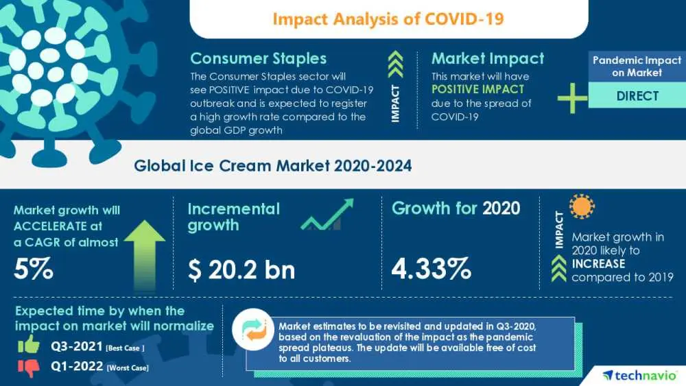
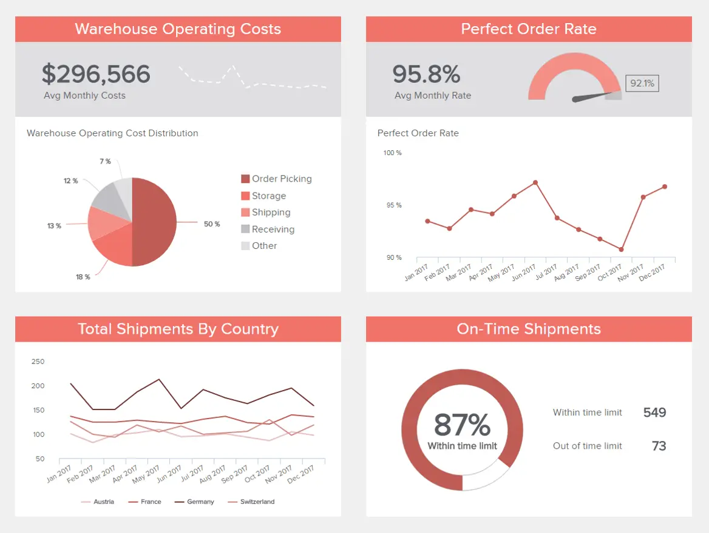

在您的日常运营中，您可能会注意到您的流程和“活动”在不断变化——销售趋势和数量、营销绩效指标、仓库运营转变或库存管理变化等等。

组织活动中的所有这些微小变化都在影响您的公司、仓库、餐厅甚至医疗机构的全球福祉。无论您是管理大公司还是小公司，都必须合并业务报告以建立目标、跟踪运营和战略，以深入了解公司的整体状态。

但是，由于每天从每个部门收集如此多的信息，手动创建的静态业务报告将无法为您的公司提供保持竞争力所需的新见解。想要在当今拥挤的市场中取得成功的企业需要以可访问且有效的方式利用其洞察力的力量。这就是使用交互式数据可视化创建的现代业务报告派上用场的地方。

 

传统的报告方式既繁琐又耗时。由于人脑处理信息的方式，以图表或图形呈现见解以可视化大量复杂信息更易于访问和直观。得益于配备强大可视化功能的现代、用户友好的[在线数据分析工具](https://www.datafocus.ai/infos/data-analysis-tools)，公司可以从交互式业务报告中受益，每个人都可以访问和理解这些报告，而无需事先的技术技能。

在这里，我们花时间定义业务报表，探索可视化报表示例，并了解如何为各种需求、目标和目的创建它们。在此过程中，我们将使用[在线数据可视化软件](https://www.datafocus.ai/infos/data-visualization-tools)，让我们与相关数据的零碎进行交互并更深入地钻取。让我们开始吧。

## 什么是业务报告？

业务报告是一种工具，可帮助收集和分析来自公司运营、生产等的历史和当前数据。通过各种类型的业务报告，组织可以做出关键决策，以确保增长和运营效率。

要了解这些报告的最佳用途，必须正确定义它们。根据作者Lesikar和Pettit的说法，“公司式报告是对事实信息的有序，客观的沟通，服务于某些组织目的”。它为特定的业务目的组织信息。虽然一些报告将采用更详细的方法来分析部门的功能和战略，但其他业务报告的例子将更侧重于组织管理的更大图景，例如投资者关系。这就是这类报告的魔力真正闪耀的地方：无论您需要哪个公司目标，它们的用法都可以多种多样，同时又有效。

传统的业务报告通常是静态的，文本范围（项目符号、标题、副标题等）。这种报告格式采用经典的摘要、目录、引言、正文和结论等部分，在提取在这个快节奏的世界中取得成功所需的见解时，它不再是最有效的。一方面，当这些报告完成时，其中包含的见解可能不再有用。另一方面，它主要是文本和数字的事实使它们难以理解，使得分析策略分离且效率低下。

现代业务仪表板的可视化性质将上述所有问题都留在了过去。借助交互式数据可视化和现代[商业智能解决方案](https://www.datafocus.ai/infos/business-intelligence-bi-solutions)，可以快速高效地完成分析序列，同时使非技术用户能够依靠数字见解进行决策过程。

您的机会：[想测试专业的业务报告软件吗？](https://www.datafocus.ai/console/)探索我们的 14 天免费试用版。立即从出色的业务报告中受益！

## 业务报告的类型

在创建业务成果报告之前，重要的是要考虑您的核心目标和目的，这样您就可以为每种情况选择正确的报告类型。在这里，我们为您提供了 5 种常见的可视化业务报告类型，您可以将其用于不同的分析目的。

### 1\. 分析报告

分析报告是业务报告工具，它使用定性和定量数据来分析业务战略的绩效，或在公司需要做出重要决策时提供支持。使用[报告工具](https://www.datafocus.ai/infos/online-reporting)创建的现代分析仪表板可以包括统计信息、历史数据以及预测和实时信息。让我们用一个销售示例来研究它。

 这份视觉上吸引人的业务分析报告充满了相关的[销售 KPI](https://www.datafocus.ai/infos/kpi-examples-and-templates-sales)，用于衡量绩效，例如每单位平均收入、客户生命周期价值、获取成本以及一些要实现的销售目标。此分析报告的价值在于，您可以在单个仪表板中获得大量相关指标。可以在不同的时间范围内（例如每天、每周、每月或每季度）筛选和浏览数据，具体取决于它需要支持的讨论。

有了这种业务报告样本，管理人员可以快速了解他们是否达到了目标，找到改进机会，更全面地了解他们的销售情况，并找到有效的方法来实施新战略。

### 2\. 研究报告

接下来，我们将讨论的业务报告类型是研究报告。公司经常使用这些类型的报告来测试新产品的可行性，研究要销售的新地理区域，或了解客户对其品牌形象的看法。为了生成这种类型的业务报告，管理人员经常联系市场研究机构，以收集与所研究主题相关的所有相关信息。这个品牌分析仪表板就是一个很好的例子。

上图是品牌分析的业务报告模板。在这里，我们可以看到一项调查的结果，该调查旨在了解该品牌对不同主题的公众看法。这个市场研究仪表板的价值在于它的交互性。通常，研究报告被描述在冗长的静态PowerPoint演示文稿中。使用像这样的现代[市场研究仪表板](https://www.datafocus.ai/infos/dashboard-examples-and-templates-market-research)，可以根据需要过滤所有信息，并且可以在一个屏幕上完成结果的整个呈现。例如，如果您想知道特定地区或年龄组的品牌知名度，只需单击图表，整个仪表板将根据此信息进行过滤。这样，分析序列是快速、交互式和高效的。

### 3\. 行业报告

继研究主题之后，我们的下一种业务报告是行业报告。基准和目标是衡量公司绩效和成功的绝佳方法。但是，这些目标需要基于现实的价值观，特别是考虑到当今市场的拥挤和竞争。为此，公司通过清楚地了解平均行业数字（例如竞争格局，行业规模，经济指标和趋势）来执行行业报告，他们可以计划明智的战略并制定切合实际的绩效目标。

来源：美国商业资讯

让我们以Technavio关于全球冰淇淋市场的行业报告为例。在这里，我们可以看到有关冰淇淋市场的相关数字，它如何受到COVID-19的影响，以及2020-2024年间预计会发生什么。例如，业务报告样本显示，冰淇淋市场实际上受到了大流行的积极影响，并在 2020 年增长了 4.33%。该报告还显示，植物性冰淇淋越来越受欢迎，这一趋势正在推动市场增长。对于冰淇淋公司来说，这是非常宝贵的信息，因为他们有机会投资新产品，几乎可以肯定的成功。

### 4\. 进度报告

接下来，我们有进度报告。与我们的其他示例不同，这种类型的业务报告不一定基于深入研究或高级分析，而是基于提供特定领域或业务目标绩效的清晰图片。它们的视觉性质使它们成为支持会议或业务讨论的完美工具，因为它们提供了不同指标状态的概览。进度报告的常见用途是使用[KPI 记分卡](https://www.datafocus.ai/infos/kpi-scorecard-examples-templates-to-track-performance)。让我们看一个例子。

 上图是平衡记分卡的业务报告示例。这里的目标是快速了解与 4 个关键业务领域相关的指标的发展：财务、客户、学习和增长以及内部目标。这些指标中的每一个都以当前值显示，并与设定的目标进行比较。与此配对，业务报告模板具有 5 种颜色用于性能状态。这使使用此报告的任何人都可以通过查看颜色来快速了解是否达到目标。

### 5\. 按业务功能

全面了解公司的业绩是现代商业报告的一大好处。但是，除了帮助整个公司之外，这些报告的真正价值在于它们使各部门能够利用数据分析的力量进行决策过程。相反，销售部门、人力资源或物流，您的整个组织都将是数据驱动的。让我们通过按营销功能划分的业务报告示例来查看它。

 此业务报告示例使用现代[营销仪表板软件](https://www.datafocus.ai/infos/marketing-dashboard-software-tools)创建，完全专注于营销活动的开发。通过在直观的仪表图上显示展示次数、点击次数、获取次数和每次获取费用等指标，您可以快速清楚地了解广告系列的效果。通过这种方式，您可以在任何效率低下的问题变成更大的问题之前发现它们，并找到改进机会以确保您的营销工作得到回报。如果您想更深入地挖掘，可以针对特定广告系列筛选此交互式业务报告，以便您只看到与之相关的见解，从而使此仪表板成为支持团队会议的完美工具。

您的机会：[想测试专业的业务报告软件吗？](https://www.datafocus.ai/console/)探索我们的 14 天免费试用版。立即从出色的业务报告中受益！

## 业务报告示例和模板

我们已经回答了这个问题，“什么是业务报告？”现在，是时候看看一些真实世界的例子了。

我们在本文中包含的业务报告示例可用于许多不同的行业，数据可以根据特定部门、组织、公司或企业的事实信息进行定制。然后，部门间沟通可以有效地利用调查结果，并且可以与关键利益相关者共享内容。

现在我们知道了它们是什么，让我们来看看一些具体的、真实的视觉对象实例，你需要包含在报表中。

### 1\. 可视化财务业务报表示例

第一个例子侧重于任何公司中最重要和数据驱动的部门之一：财务。它收集了经理人做出明智决策所需的最重要的[财务 KPI](https://www.datafocus.ai/infos/kpi-examples-and-templates-finance)：毛利率、运营费用率 （OPEX）、息前利润 （EBIT） 和净利润率以及损益表。接下来是与预定目标相比的一年内的收入变化，各个内部部门运营费用的年度演变以及EBIT与其目标相比的演变。

 数据的不同可视化表示集可以清楚地指出为保持公司的财务轨道而需要采取的特定趋势或行动。您的所有财务分析都可以集成到单个视觉对象中。当演示文稿变得交互式时，点击将更深入地了解您的财务 KPI，以及使公司财务运营健康所需的结果。此财务仪表板的重要性在于，每个财务经理都可以轻松跟踪和衡量特定公司的整体[财务](https://www.datafocus.ai/infos/dashboard-examples-and-templates-finance)概览，同时深入了解最有价值的 KPI 和指标。授权一个坚定和对运营敏感的计划是公司可以拥有的最重要的目标之一，而财务部门正处于这一过程中的中间。

由于所有这些信息都显示在单个仪表板上，您的报告将大大增强，并以准确的信息为后盾，以便您做出明智的决策。实施可靠且对运营敏感的管理计划变得更加容易。

### 2\. 视觉投资者业务报告示例

如前所述，持有您的活动、绩效和组织资产的账户对于公司外部人员了解其运作方式非常重要。当这些人是投资者时，拥有一份干净和最新的报告让他们知道他们投资的公司有多成功，并让您增加拥有更多资金的机会就更加重要了。此示例仅提供：特定时间范围内最重要的见解和特定值的准确概述。

 计算和传达有关公司整体情况的 KPI 是此投资者关系仪表板试图关注的重点。您将了解股本回报率和资产回报率、债务权益比率和营运资本比率，但也可以看到股价随时间推移的演变。这些指标中的每一个对潜在股东都至关重要，如果不定期监控和控制，很容易失去投资者的兴趣。通过现代仪表板跟踪它们并可视化它们是投资者报告的竞争优势。您甚至可以在此视觉对象上看到一组清晰的数据，因此您不必挖掘大量电子表格，而是清楚地看到一段时间内的具体发展、收益或损失百分比、比率和投资回报。不仅限于这些数据，您可以随时根据您的特定需求自定义和制作示例业务报告。

### 3\. 可视化管理业务报表示例

下面介绍的管理 KPI 侧重于一年中特定季度的收入和客户概览。只需单击一下，您就可以轻松更改特定日期范围，并概述不同的月份或年份。

 在更具体地分析见解时，您可以轻松发现收入是否接近您的目标值，将其与上一年进行比较，看看您还需要努力实现多少目标。与目标相比，每位客户的平均收入数量也可以在更具体的层面上确定您需要根据客户价值调整策略的程度。如果您发现自己的价值观超过了目标，您可以专注于尚未达到目标成就的 KPI。在这个具体示例中，我们深入了解了如何呈现您的管理数据、比较它们并评估您的发现以做出更好的决策。

这种清晰的数据概述可以区分您的管理策略的成功，因为不可能遗漏重要信息。通过将您的所有发现收集到一个[CEO 仪表板](https://www.datafocus.ai/infos/ceo-dashboard-report-examples-and-templates)中，所提供的信息清晰且特定于管理层的需求。此示例报表的最佳部分是通过其交互性看到的：单击的次数越多，可以呈现的数据就越多，并且可以查找更具体的结论。

我们在本文中分析和介绍的这些报告模板可以作为有效创建您自己的报告的路线图，也可以自定义您自己的数据以定制您的需求和发现。

### 4\. SaaS 管理仪表板

动态业务报告示例摘要中的下一个以我们专门的[SaaS 指标仪表板](https://www.datafocus.ai/infos/saas-dashboard-examples-metrics-templates)的形式出现。

 SaaS 公司报告示例包含真正的信息冲击力，这种特殊的报告格式提供了每个雄心勃勃的软件即服务业务成功所需的见解和信息的全景快照。

通过包括客户获取成本、客户生命周期价值、MMR 和 APRU 在内的可视化 KPI，在这里，您将一目了然地找到简化公司计划所需的一切。这是短期和长期发展的重要工具。

### 5\. 销售 KPI 仪表板

撇开利基或行业不谈，这个最强大的业务报告样本将使您的销售团队能够提高生产力，同时可持续地增加收入。

 我们的[销售仪表板](https://www.datafocus.ai/infos/dashboard-examples-and-templates-sales)是一份强大的每日业务活动报告以及长期增长的工具，拥有一系列具有凝聚力的可视化组合，旨在提高您的业务底线。

通过集中访问基于流失率、每个销售代表的收入、追加销售和交叉销售等的销售图表和[图表](https://www.datafocus.ai/infos/sales-graphs-and-charts-for-managers)，这是一种公司报告格式，可帮助您将自己推向领先地位（并保持在那里）。它是任何现代销售团队的必备工具。

### 6\. 零售商店仪表板公司报表示例

零售业是另一个值得充分利用您的数据的行业。无论您在零售业的哪个分支工作，知道如何编写业务报告示例都至关重要，知道要使用哪种类型的报告也至关重要。

 我们的交互式零售仪表板是我们最好的可视化报告示例之一，因为它提供了一个易于理解的窗口，可以深入了解以[零售](https://www.datafocus.ai/infos/dashboard-examples-and-templates-retail)为中心的部门以及基于交易的信息，可以帮助您降低成本，同时随着时间的推移提高销售数字。

这是目标设定和基准测试以及战略制定的理想选择，对于任何零售商来说，这是一个无与伦比的工具，可以在我们快节奏的数字时代进行活动。如果您是一家寻求稳定、正增长的零售商，那么从[您的零售指标](https://www.datafocus.ai/infos/kpi-examples-and-templates-retail)中榨取最后一滴价值至关重要，而此仪表板将助您实现目标。

### 7\. 客户服务团队仪表板

作为任何成功组织战略的关键方面，优化跨渠道的客户服务沟通至关重要。这就是我们的客户[服务分析](https://www.datafocus.ai/infos/business-intelligence-service-support)报告发挥作用的地方。

 使您的客户服务工作更加高效、有效和响应迅速，不仅可以大大提高您的消费者忠诚度，还可以使您与竞争对手区分开来。

实现一台平均、精益、运转良好的面向消费者的机器的最佳方法之一是为您的客户服务代表提供工具，让他们始终尽其所能。这个最强大的业务报告示例配备了平衡的 KPI 组合来跟踪和增强服务绩效，将帮助您缩短响应时间，同时提高首次呼叫解决率。这种组合将导致持续的增长和成功。

### 8\. 员工绩效仪表板

除了您的客户，您的员工也是您组织跳动的心脏。我们的[员工仪表板](https://www.datafocus.ai/infos/dashboard-examples-and-templates-human-resources)将使您能够跟踪内部人才的持续价值和生产力。

 对于任何现代人力资源部门来说，这是一个理想的业务报告示例，这个生动的仪表板将让您深入了解您的员工在特定时间范围内的表现和行为。

在这里，您可以检查缺勤率的趋势，按年龄组跟踪加班时间，监控您的培训成本，并探索整个劳动力生产力的高峰和低谷。这个一目了然的信息大熔炉将使您能够在需要的地方提供培训，并深入了解影响生产力或参与度的任何问题的核心。

始终如一地使用这种业务报告格式将最终确保您从内部人才那里获得最佳的投资回报 （ROI）。

### 9\. 营销关键绩效指标仪表板

如果没有可靠的多渠道营销策略，您就不太可能从促销工作中看到始终如一的健康投资回报率。在营销方面，在黑暗中射击也会让你落后于竞争对手。进入我们的[营销仪表板](https://www.datafocus.ai/infos/dashboard-examples-and-templates-marketing)。

 这个充满洞察力的业务报告模板可让您设置准确的绩效基准，同时从一个直观的仪表板中发现丰富的见解。

为了优化您的促销活动和活动，在正确的时间使用正确的接触点与特定的受众群体交谈至关重要。如果没有有针对性的方法，您所做的只是浪费时间和金钱。

这个有效的公司报告示例通过提供深入挖掘重要指标（如每次获取成本 （CPA）、客户生命周期价值 （CLTV） 和投资回报率）的工具，对您的广告系列的效果进行了平衡的概述。

这个完美的指标风暴将向您展示您的沟通或活动在哪些方面未能提高参与度，以及它们在哪些方面产生了积极的结果。有了这些关键信息，您就可以优化所有工作，以跨渠道产生最大的影响。对于任何希望快速、一致地扩展的现代组织来说，这是必不可少的业务报告设计。

### 10\. 仓库 KPI 仪表板

作为仓库经理或决策者是一项高压工作，每个决定都很重要。为了使您的履行活动和计划保持流畅、实用并为组织发展做好准备，必须以正确的方式为数据出汗。

 我们的[仓库 KPI 仪表板](https://www.datafocus.ai/infos/dashboard-examples-and-templates-logistics)是一个业务报告样本，有助于实时决策和长期战略规划。

凭借强大的基于物流的 KPI 选择，这种高度可视化的业务报告结构具有基于准时发货率、仓库成本明细、指定时间范围内发货数量和完美订单率的指标。

通过将这种业务报告格式作为日常运营的核心部分，您可以消除不必要的成本或活动，同时提高整体生产力并显着提高仓库运营的成功率和准确性。一个宝贵的工具，将有助于始终如一地兑现您的履行承诺，在此过程中提高您的品牌声誉。

### 11\. 网络安全仪表板

在我们这个高度互联的数字时代，未能投资于足够的网络安全解决方案就像在度假时敞开前门一样。

 为了避免组织网络攻击或信息泄露的破坏性影响，我们的网络安全[IT仪表板](https://www.datafocus.ai/infos/dashboard-examples-and-templates-it)将确保您的公司从各个角度得到加强。这个最重要的业务报告示例将帮助您抵御任何潜在的网络犯罪行为，同时实时监控任何攻击或异常情况。

在这里，您可以掌握网络安全评级，跟踪网络钓鱼测试成功率，了解识别攻击（并提高响应能力）所需的时间，查看备份公司敏感信息的频率，并从有凝聚力的空间发现与公司相关的最常见入侵率。它是一种必不可少的分析工具，旨在确保您的公司安全、可靠和快乐。

现在我们已经查看了报表示例，让我们考虑一下这些基本分析工具的明显业务提升优势。这些福利将使贵公司在可持续的基础上更强大、更流畅、更高效。

您的机会：[想测试专业的业务报告软件吗？](https://www.datafocus.ai/console/)探索我们的 14 天免费试用版。立即从出色的业务报告中受益！

## 为什么需要业务报告？

这些报告还通过记录您所做的进度来启用数据收集。通过它们，您可以比较不同的时间段和活动、增长等。您可以更好地了解哪些产品或服务比其他产品或服务更成功，哪个营销活动优于其他产品或服务，以及哪些市场或细分市场需要更多关注。收集所有这些数据是必不可少的 - 通过这样做，您可以建立过去的书面记录（或数据记录）。它们让公司外部的人员（如银行或投资者）了解您的活动和绩效，并使利益相关者能够了解您组织的有形和无形资产。

- 风险评估和机会：通过业务报告样本，您可以增加[对公司内部](https://www.americanexpress.com/en-us/business/trends-and-insights/articles/7-business-risks-every-business-should-plan-for)风险和机遇的理解。样本报告强调了财务和非财务绩效之间的联系：它们以知情的、商业上“安全”的方式简化流程、降低成本并提高整体凝聚力。
- 趋势和联系：业务报告样本可以帮助您将绩效与同一行业中的其他内部单位或公司进行比较。在更具体的层面上，报告模板可以帮助您彻底挖掘[运营指标](https://www.datafocus.ai/infos/operational-metrics-and-kpi-examples)和详细信息，并发现否则会被忽略的相关性。在当今高度互联的数字时代，更深入地了解您的数据将使您能够制定战略，通过趋势识别来加速业务增长的关键领域。仅这一事实就凸显了业务分析报告的重要性。
- 商业智能（BI）：如果使用得当，[最好的BI工具](https://www.datafocus.ai/infos/best-bi-tools-software-review-list)将为一个重要问题提供答案：“我会在市场上生存吗？通过创建为改进您的 BI 活动并回答基本组织问题而构建的公司的业务报告，您将能够处理更深入的具体见解，从而带来运营价值并控制整体支出。通过了解如何使用特定示例和模板设置此类报表，您将能够提供构建基块来建立成功的商业智能策略。
- 买入：虽然公司有许多不同类型的业务报告，但它们都有一个共同的特征：收集数据并跟踪与特定事物相关的业务活动。通过使用正确的报告，用户可以对许多关键领域或功能进行深入的可视化分析，并提供明智的建议，最终提高效率并鼓励创新。无论一个想法有多好或多有益，获得高级管理人员或外部合作伙伴的支持通常是取得进展的主要障碍。但是，一个好的报告模板提供了既真实又令人信服的深度和呈现水平，并将鼓励有权签署新战略、计划或想法的人的支持。
- 运营效率：报告越真实，数据越清晰。当您的数据组织良好且清晰时，就可以以经济高效的方式解释您的业务活动，从而减少分析结果所需的时间，同时节省无数的工作时间来筛选指标以获得可操作的见解。一个好的业务报告模板提供了一个深入的分析，作者展示了他们如何解释他们的发现。例如，营销报告可以减少分析特定活动所需的时间，而[人力资源报告](https://www.datafocus.ai/infos/monthly-and-annual-hr-report-templates)可以提供对招聘流程的见解，并评估为什么每次招聘的成本增加？
- 特异性：当您创建业务报告时，您给了自己一个关键的机会来解决需要做出决策时经常使用的特定问题。正如作者艾伦·汤姆森（Alan Thomson）所说，“公司报告传达信息以协助业务决策。\[它\]是呈现这些信息的媒介。它们有几个目的：一些记录信息以计划未来，一些记录过去的信息以了解情况，还有一些为紧迫的问题提供解决方案。一些[执行仪表板](https://www.datafocus.ai/infos/executive-dashboards-and-reports)供日常使用，而月度业务报告模板将帮助您以更渐进、增量的方式确定您的活动。它们对于商业成功都至关重要，因为它们使复杂的分析变得清晰。如前所述，数据越清晰，结果就越具有成本效益，因此，在决定生成哪种报告时，请记住要纳入此类报告的确切数据至关重要。您可以在不同行业找到多个[关键绩效指标](https://www.datafocus.ai/infos/kpi-examples-and-templates)示例，在创建此类报告时应考虑这些示例。您还可以生成部门间报告或企业之间报告，以比较行业价值并了解您的公司在市场中的地位。
- 准确性和一致性：在信息时代，数据是一个巨大的景观，如果你想利用它来发挥自己的优势，那么一致性和准确性是关键。如果您的数据关闭或显示的结果是命中和未命中，从长远来看，这可能会使您的公司付出代价。使用[在线仪表板工具](https://www.datafocus.ai/infos/online-dashboard)生成报告对于易用性、节省时间以及最重要的是您将使用的信息的准确性来说是一个令人难以置信的优势。当您使用实时数据时，报告上的所有内容都将是最新的，您将做出的决策将得到最新信息的支持。当您需要探索数据并执行数据分析以提取可操作的见解时，业务报告示例非常有用。由于您的发现的可视化，它们将为您的报告带来重要的附加值，使分析更加清晰和理解，这是它们的主要目的。
- 参与度：作为直观、易消化和可视化的工具，以业务为中心的报告工具更易于理解，并讲述更有可能引起受众共鸣的故事。在探索数据时，只需单击几下即可生成更深入的见解，报告不必枯燥、无聊，也不会丢失在数百页或电子表格的数据中。如果您创建一个干净且自定义的报表，您将比打印或搜索电子表格带来更多的价值。使用正确的[KPI 仪表板软件](https://www.datafocus.ai/infos/kpi-dashboard-software)实现这样的设计很简单。想象一下自己在开会，有过去 200 年业务管理的 5 页分析。一位参与者问您一个关于 3 年前运营成本的具体问题。你坐在那里，试图找到可以成就或破坏你的商务会议的特定信息。使用[业务仪表板](https://www.datafocus.ai/infos/dashboard-examples-and-templates)，您不会出错，您需要的所有信息都是通过单击，单击，单击生成。
- 基准测试：如果您知道如何高效地设置以业务为中心的报告，您将能够设置定义、准确的基准。通过经常根据最重要的组织目标设定目标并使用可视化报告工具，您将保持组织的流动，同时促进整体增长和生产力水平。
- 沟通：业务报告的最佳用途之一是改善内部协作和沟通。通过获得对最重要的业务数据的 24/7 全天候访问，同时增强您分析和呈现数据的方式，您将使企业中的每个人都能够更好地访问信息，从而增强内部沟通和协作。
- 创新：这些报告的直观性使其成为指导渐进式分析策略的最有效方法。因此，发现隐藏的见解、发现趋势和磨练关键信息更容易（也更快）。正是这种速度、易用性和准确性释放了创造力并改善了整个组织的创新，从而加速了增长。

这些报告也可以是许多不同的类型，但它们都有一个共同的特征：收集数据并跟踪与特定事物相关的组织活动。从那里，他们的作者通常会进行分析并向组织提供建议。

## 如何做业务报告

以企业为中心的报告的首要重要性在于获得信心和清晰度。在开始创建报表之前，确定目标和受众至关重要。知道你想把它定向到谁是它阐述的关键，从你选择的语气、词汇/行话到你将关注的数据。向外部利益相关者、首席执行官或技术工程师团队提交的报告将彼此截然不同。

同样，范围也因报告的目标而异。事先陈述需求和目标，引导您走上正确的道路。它应该是公正和客观的，有一个计划的演示或[仪表板报告工具](https://www.datafocus.ai/infos/dashboard-reporting)，可以实现交互式数据流并立即访问生成明确调查结果所需的每条信息。

为了帮助您自信地编写每日、每周或每月以业务为中心的报告模板，让我们回顾一下您应该关注的一些基本步骤和提示：

1\. 考虑您的受众

首先，如果您想了解如何以正确的方式制作业务报告，您必须从一开始就考虑您的受众。您的报告工作必须有意义，并为最终观众或用户提供直接价值 - 否则，它们将毫无意义。也就是说，花时间考虑谁将使用报告工具最多以及哪些信息或功能将增加最大价值，从而在此过程中帮助改善组织至关重要。花点时间了解您的受众，您的报告工具不仅会满足预期，而且会超越他们 - 一次一个位置良好的可视化。

2\. 确定并说明目的

正如我们在上一段中所说，定义受众的需求对于报告成功至关重要。正如我们所说，报告通常有助于决策并解决某些问题。您可以在报告的开头说明它们。目标越明确和具体，内容就越好。当您以清晰明确的方式展示您的目的时，您不会浪费时间调整信息。

3\. 混合使用实时和历史数据

业务报告的另一个关键组成部分是确保您没有任何信息盲点。如此多的公司使用一种形式的指标，阻碍了他们在此过程中的组织进展。要深入了解详细的信息并全面了解特定趋势或模式，使用历史数据和实时数据的平衡组合是关键。这样做将使您能够利用潜在的优势，同时从历史劣势中学习。这种平衡的方法还将为您提供制定策略的工具，这些策略可以在压力下做出强有力的决策的同时获得最佳投资回报率。

4\. 设定可操作的指标和目标

一旦你策划了你的信息来源并定义了你的受众，你应该设定可操作的目标。设置正确的基准将帮助您精确地跟踪您的持续成功，同时定义目标或指标将为您提供使用正确 KPI 所需的洞察力，同时确保您的公司朝着正确的方向前进。花时间设定与您的组织战略一致的可操作目标和指标将确保您的报告提供始终如一的健康投资回报率。

5\. 定义报告频率

成功的组织报告的另一个关键组成部分是决定您分析指标和信息的频率。根据您希望实现的功能或目标，您应该决定您的仪表板是用作每日、每周、每月还是每季度报告工具。设置正确的频率将确保您的分析策略完全简化，同时在正确的时间将您与最重要的见解联系起来。最好的现代报告工具还提供自动化功能，有助于监控见解并提供警报，而无需人工干预 - 这是节省时间的最佳方式，同时确保您再也不会错过任何关键信息。

6\. 收集和组织信息

现在，目的和范围已经明确定义，您可以开始以可以解决问题的任何形式收集数据。多亏了这些信息，您将进行数据分析以了解其背后的内容并提取有价值的见解。这些发现需要平衡和合理——它们对报告的目的有什么意义。确定特定公司的关键绩效指标，在所需的水平上组织、比较和评估它们，可能是创建此类报告的最重要部分之一。可以在上面的文章中找到演示如何提取和定义分析的业务报告示例，我们在其中展示了视觉对象。

7\. 展示您的发现

解释你是如何发现它们的，以及你是如何以这种方式解释它们的。通过详细说明为克服它而采取的行动来回答原始问题，并提供导致更好决策过程的建议。呈现您得出的见解的最佳做法是使用仪表板，以非常有效的方式直观地传达数据。像DataFocus这样的[仪表板软件](https://www.datafocus.ai/infos/best-dashboard-software-features)可以精确地满足这一需求，同时帮助您进行数据探索，这是一个至关重要的部分。当您单击仪表板的特定部分时，您可以更深入地轻松访问数据。

比较您的发现也是您可以使用的功能之一，如果您问自己与特定时期相比发生了什么变化。当您只需在监视器上单击几下即可评估这些数据集时，整个报告过程和策略衡量可以在几分钟内完成，而不是几天。在当今的数字世界中评估调查结果已成为希望在市场上保持竞争力的企业的主要关注点之一。你做得越快，你获得的信息就越多，你的行动就会变得越成功。

8\. 调整可视化效果

在展示您的发现的基础上，在考虑如何撰写业务报告时，正确处理设计元素也很重要。根据经验，最重要的一目了然的见解应位于仪表板的顶部，并且您的演示文稿应尽可能干净、简洁和最少，以避免混乱或混乱。为了改进可视化叙事并将报表的每个关键元素紧密结合，使仪表板设计恰到好处至关重要。我们的[数据可视化方法](https://www.datafocus.ai/infos/data-visualization-techniques-concepts-and-methods)基本指南将有助于引导您的工作朝着正确的方向发展。

9\. 校对您的报告

当您查看业务报告的精美示例时，您会注意到设计和内容的每个元素都完美无暇，并且完全合乎逻辑。也就是说，为了为您的分析工作获得最佳回报，校对您的报告至关重要。用细齿梳子处理您的报告，并要求组织中值得信赖的同事也这样做。一旦你仔细校对了整个报告，你可以共同收紧任何草率的设计元素、错别字、误导性副本和糟糕的视觉位置。这样做至关重要，因为它将使您的业务报告示例流畅、可操作、准确并为成功而构建。

10\. 积极响应

虽然新式报告仪表板在同等程度上是动态和交互式的，但在编写基于业务的报表时，还必须保持稳健和响应迅速。这到底是什么意思？这意味着在数字时代，格局总是在变化。因此，如果您想充分利用您的报告或仪表板，您必须承诺根据您周围的变化编辑和更新它们。在信息上下文中，今天相关的内容明天可能是多余的，因此为了保持强大和相关性，您的报告必须始终针对成功进行优化。当您编写业务风格报告时，您应该明白，在某种程度上，您需要一次又一次地重写它。请记住这一点，承诺定期评估您的报告，成功将属于您。

您可以在 Internet 上轻松找到业务报告的示例，但并非所有报告都符合您的需求。随时确保要创建的报告准确、客观且完整。它应该写得很好，以一种吸引读者注意力并满足他们期望的方式，结构清晰。

您的机会：[想测试专业的业务报告软件吗？](https://www.datafocus.ai/console/)探索我们的 14 天免费试用版。立即从出色的业务报告中受益！

## 关键要点 专业业务报告

“一旦我们知道了一些事情，我们就会发现很难想象不知道它是什么感觉。 ——Chip & Dan Heath，《Made to Stick， Switch》的作者

我们生活在一个数据驱动的世界中，作为一家企业，您有责任与时俱进。如果你忽视智能数据分析的力量，你只会阻碍你自己的商业进步。

我们已经探索了许多闪亮的商业报告示例，有一件事非常清楚：如果您接受数字报告的力量，您的公司将变得更大、更好、信息灵通。作为一家企业，您越有信心和知情，您就越能更好地应对不断变化的情况。在当今的数字世界中，您在哪个部门工作并不重要。如果你对数据的态度很僵化，你就会被抛在后面。数字报告仪表板是唯一的出路。

因此，您现在知道什么是业务报告，如何构建和编写它们，以及它们如何使您的业务受益。致力于正确的报告和信息交付可以对您的组织产生重大影响，并更好地定位其战略。有关以更具体、与功能相关的方式进行业务报告的更多想法，您可以更深入地了解我们关于[销售](https://www.datafocus.ai/infos/sales-report-kpi-examples-for-daily-reports)报告和[营销报告](https://www.datafocus.ai/infos/daily-weekly-monthly-marketing-report-examples)的一些热门文章！

不要错过这个机会，立即开始使用DataFocus的在线报告软件，并从[14天的免费试用](https://www.datafocus.ai/console/)中受益！你不会后悔的。
